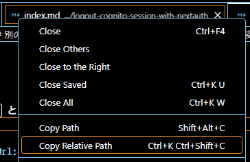
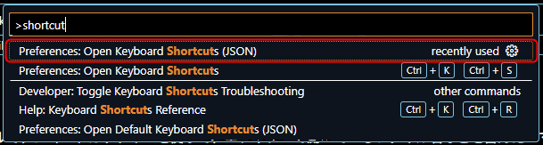

こんにちは、 kenzauros です。

今回は VS Code に**開いているファイルの相対パスを統合ターミナルに入力**できるショートカットキーを追加する Tips を紹介します。


## ユースケース

VS Code の統合ターミナルは、とても便利ですね。私は主に WSL 上の Ubuntu で開発しているので、統合ターミナルでは bash が動いています。

当然ながら様々なコマンドを入力することが多いわけですが、*今まさに編集しているファイルに対するコマンド*を叩くときに、その**ファイルのパス**が必要になります。

VS Code ではエクスプローラーやタブの右クリックメニューから相対パスや絶対パスが取得できますが、コピーして貼り付け、というのも面倒です。



今回はこの「**相対パスを統合ターミナルに入力する**」という動作をショートカットキーに割り当てて省力化してみます。


## ショートカットキー設定

ショートカットキーで統合ターミナルにコマンドを入力するには、 **`keybindings.json`** で設定します。このファイルはユーザーごとに保持される設定ファイルです。

### `keybindings.json` を開く

`Ctrl+Shift+P` でコマンドパレットを開き、 `Preferences: Open Keyboard Shortcuts (JSON)` （※ `(JSON)` のほうです）を選択して、 `keybindings.json` を開きます。



### キーバインディング設定を追加

`keybindings.json` に下記の設定を追加し、保存します。 VS Code の再起動は不要です。

```json:title=keybindings.jsonに追加する設定
  {
    "key": "ctrl+shift+r",
    "command": "workbench.action.terminal.sendSequence",
    "args": { "text": "${relativeFile}" },
    "when": "terminalFocus"
  }
```

これで統合ターミナルにフォーカスがある状態で `Ctrl+Shift+R` を押すとエディターで開いているファイルの相対パスが入力されます。

簡単ですね👏

なお、**画面分割している場合は最後にフォーカスのあったファイルのパスが得られる**ようです。

### 簡単な説明

あまり難しいところもないですが、設定の内容は下記のようになっています。

キー | 説明
-- | --
`key` | キーの組み合わせ
`command` | 実行する VS Code のコマンド
`args` | コマンドの引数
`when` | ショートカットの実行条件

`workbench.action.terminal.sendSequence` は統合ターミナルに「なにか」を送るコマンドです。

「なにか」は `args` で指定された `{ "text": "${relativeFile}" }` です。 `${relativeFile}` は VS Code の変数で、「ファイルの相対パス」を表します。

`"when": "terminalFocus"` で「統合ターミナルがフォーカスされているときだけ」という制限をつけています。


## カスタマイズについて

`keybindings.json` の細かな説明は VS Code の公式ページに情報があります。

- [Visual Studio Code Key Bindings](https://code.visualstudio.com/docs/getstarted/keybindings#_when-clause-contexts)

また `args` で使える変数は下記のリファレンスで確認できます。

- [Visual Studio Code Variables Reference](https://code.visualstudio.com/docs/editor/variables-reference)

ショートカットキーで使いそうな変数を抜粋しておきます。たとえば先の `${relativeFile}` を `${file}` に置き換えれば「ファイルの絶対パス」がターミナルに入力できるようになります。

変数 | 対象 | 内容
-- | -- | --
`${userHome}` | ユーザーのホームディレクトリー | 絶対パス
`${workspaceFolder}` | ワークスペースのディレクトリー | 絶対パス
`${workspaceFolderBasename}` | ワークスペースのディレクトリー | ディレクトリー名のみ
`${file}` | 開いているファイル | 絶対パス
`${relativeFile}` | 開いているファイル | 相対パス
`${fileBasename}` | 開いているファイル | ファイル名のみ
`${fileBasenameNoExtension}` | 開いているファイル | ファイル名のみ (拡張子なし)
`${fileExtname}` | 開いているファイル | 拡張子
`${fileDirname}` | 開いているファイルのディレクトリー | 絶対パス
`${relativeFileDirname}` | 開いているファイルのディレクトリー | 相対パス

どなたかのお役に立てれば幸いです。
