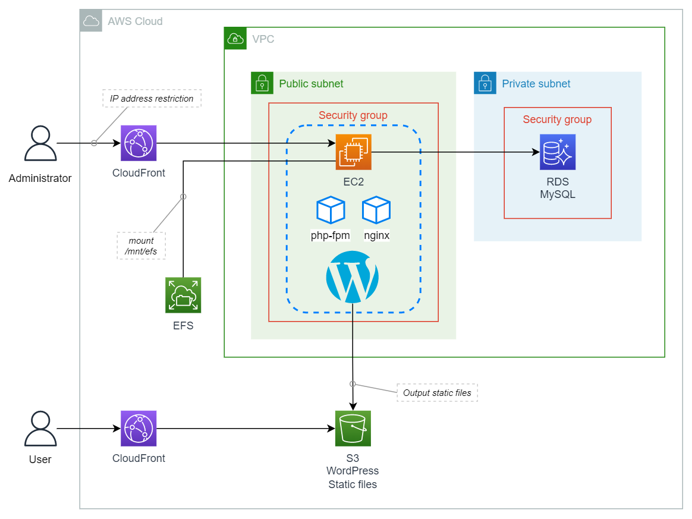
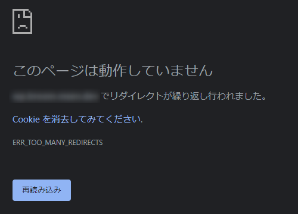
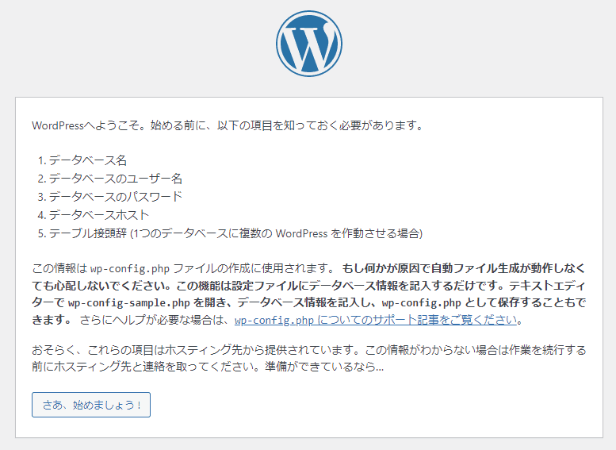
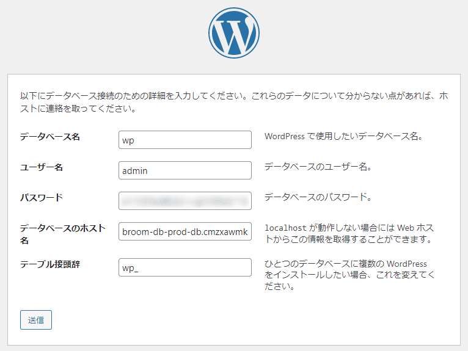
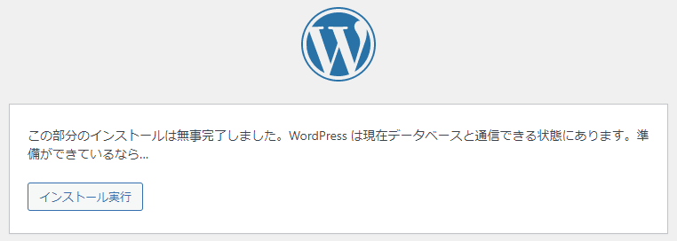
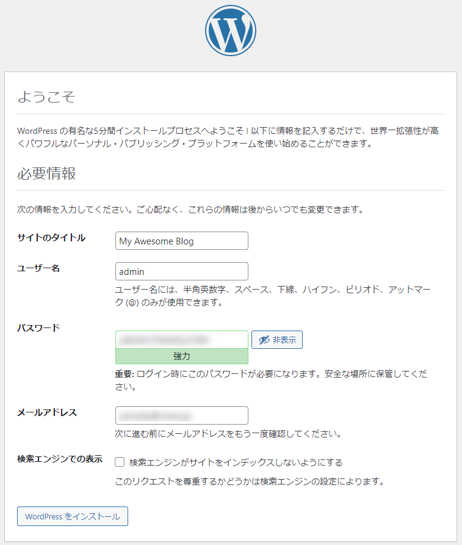
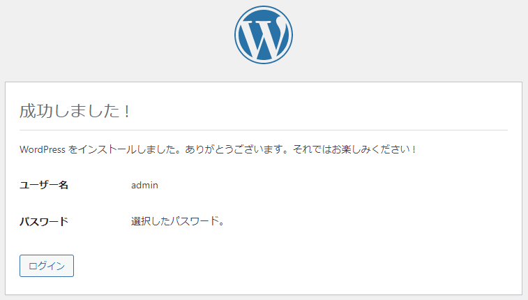
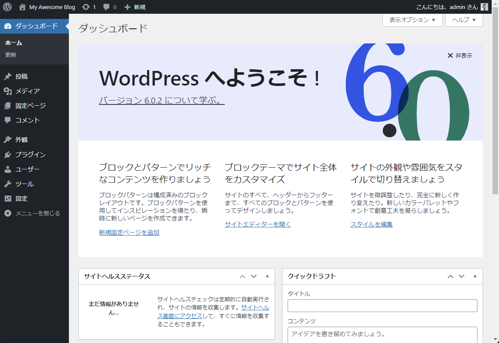

こんにちは、 kenzauros です。

今回は **EC2 インスタンス上の Docker で PHP 8 と nginx のコンテナーを起動して WordPress をホスト**します。

目標は **WordPress 6 と PHP 8 という比較的新しい組み合わせを、運用環境で安価に利用**できるようにすることです。

コンテナーなら ECS でホストするのがベターですが、運用費の都合上、 EC2 しか選択できないこともあります。また、可用性がそこまで必要でない場合も、 1 つの選択肢になると思います。

いくつかハマりポイントもあったので、途中に解説を入れています。

## 構成

今回の全体の構成は下記のような感じです。この記事では青い点線で囲った部分を扱います。それ以外の部分については別の記事で執筆予定です。



*WordPress 自体は EC2 インスタンスの Amazon Linux 上 (実際は後述の通り EFS でマウントした領域) に直接展開*します。

WordPress にも公式 Docker イメージは存在しますが、アップデートなどでファイルが更新されることを考えると、 WordPress のファイル自体はホストに存在するほうがよいと考えました。

ということで PHP 8 と nginx のコンテナーをそれぞれ WordPress のホスト環境として使用します。

WordPress のファイル群は *EFS (Elastic File System)* に配置します。マウントポイントは `/mnt/efs` です。このあたりは CloudFormation によるインフラ構築側の記事を参照してください。

なお、今回は *EC2 を HTTP でホストし、 HTTPS は CloudFront で配信*します。また*データベースは RDS の MySQL で別途構築済み*とします。

各種バージョンなどは下記の通りです。

- EC2 (t3.micro)
    - Amazon Linux 2
    - Docker version 20.10.17, build 100c701
    - Docker Compose version v2.4.1
- 🐳 Docker
    - PHP 8.1 (php:8.1-fpm)
    - nginx 1.23.1 (nginx:latest)
- WordPress 6.0.2


### Amazon Linux 2 への Docker インストール

ここでは EC2 インスタンスは起動後、下記のコマンドを順に実行して、 Docker と Compose がインストールされた状態とします。

```bash:title=bash
$ sudo yum update -y
$ echo '---------- install docker ----------'
$ sudo amazon-linux-extras install -y docker
$ amazon-linux-extras | grep docker
$ sudo systemctl start docker && systemctl status docker
$ sudo systemctl enable docker
$ systemctl is-enabled docker
$ sudo usermod -a -G docker ec2-user
$ docker --version
$ echo '---------- install docker compose ----------'
$ DOCKER_PLUGINS=/usr/local/lib/docker/cli-plugins
$ sudo mkdir -p $DOCKER_PLUGINS
$ sudo curl -L https://github.com/docker/compose/releases/download/v${DockerComposeVersion}/docker-compose-$(uname -s)-$(uname -m) $ -o $DOCKER_PLUGINS/docker-compose
$ sudo chmod +x $DOCKER_PLUGINS/docker-compose
$ sudo ln -s $DOCKER_PLUGINS/docker-compose /usr/bin/docker-compose
$ docker-compose --version
```


## 構成ファイル群

### ディレクトリ構成

今回の EC2 上のファイル構成は下記の 4 ファイルだけです。とてもシンプルです。

ファイルを配置する場所はどこでも問題ありませんが、とりあえず `ec2-user` のホームディレクトリにしました。

```:title=ディレクトリ構成
/home/ec2-user/docker
├── nginx
│   ├── conf.d
│        └── default.conf
├── php
│   ├── Dockerfile
│   └── php.ini
└── docker-compose.yml
```

### docker-compose.yml

定義がわかりやすいので Docker Compose を利用します。 php と nginx はそれぞれ公式イメージをベースにしました。

- [php - Official Image | Docker Hub](https://hub.docker.com/_/php)
- [nginx - Official Image | Docker Hub](https://hub.docker.com/_/nginx)

必要なファイルを `volumes` でマウントしています。

それ以外、特に難しいことはありませんが、 `php` コンテナーの `user: 1000:1000` のみ重要なため後述します。

```yml{18}{numberLines:1}:title=docker-compose.yml
version: "3"

services:

  nginx:
    image: nginx:latest
    volumes:
      - ./nginx/conf.d/default.conf:/etc/nginx/conf.d/default.conf
      - /mnt/efs/wordpress:/usr/share/nginx/html
    restart: always
    ports:
      - 80:80
    depends_on:
      - php

  php:
    build: ./php
    user: 1000:1000
    volumes:
      - /mnt/efs/wordpress:/usr/share/nginx/html
      - ./php/php.ini:/usr/local/etc/php/conf.d/php.ini
```

#### php コンテナーの実行ユーザー指定

php-fpm のコンテナーをデフォルト状態で起動すると *PHP からホスト側のファイルに書き込み権限がない*ようで、以下のような不具合に見舞われました。

- WordPress がデフォルトの英語版になってしまい言語切り替えができない
- プラグインの追加などができない

言語切り替えができないだけだと、原因が究明しづらかったのですが、結局は権限問題でした。同じ症状に遭遇した方はパーミッションや owner を調べてみてください。

EC2 上で WordPress のコンテンツを展開すると、ファイル群は `ec2-user:ec2-user` で `755` になっています。
php コンテナーの実行ユーザーはデフォルトで root なので問題なく書き込めそうですが、なぜか書き込めません。

そこで実行ユーザーを合わせるため、 **`user: 1000:1000` で Docker コンテナーの実行ユーザーの uid と gid を `1000` に設定**します。

この *`1000` はホスト側 (Amazon Linux 側) の `ec2-user` ユーザーの uid と gid* です。

コンテナー側にユーザーを作らないといけないかとも思いましたが、下記の公式情報にも直接ユーザー指定が可能とあったので、試してみたところ成功しました。

> **For running the FPM variants as an arbitrary user, the `--user` flag to docker run should be used** (which can accept both a username/group in the container's `/etc/passwd` file like `--user daemon` or **a specific UID/GID like `--user 1000:1000`**).
> 
> <cite>Running as an arbitrary user ([php - Official Image | Docker Hub](https://hub.docker.com/_/php))</cite>


### nginx/conf.d/default.conf

nginx の設定です。途中の https に関する部分以外は、普通の http (80 番ポート) のホスティング設定です。

```conf:title=nginx/conf.d/default.conf
server {
    listen 80;
    server_name localhost;
    root /usr/share/nginx/html;
    index index.php index.html;

    # set HTTPS on if X-CLOUDFRONT-FORWARDED-PROTO or X-FORWARDED-PROTO header set
    set $proxy_https '';
    if ( $http_cloudfront_forwarded_proto = 'https' ) {
        set $proxy_https 'on';
    }
    if ( $http_x_forwarded_proto = 'https' ) {
        set $proxy_https 'on';
    }
    if ( $scheme = 'https' ) {
        set $proxy_https 'on';
    }

    location / {
        try_files $uri $uri/ /index.php$is_args$args;
    }

    location ~ [^/]\.php(/|$) {
        fastcgi_pass php:9000;
        fastcgi_index index.php;
        fastcgi_param SCRIPT_FILENAME $document_root$fastcgi_script_name;
        fastcgi_param HTTPS $proxy_https if_not_empty;
        include fastcgi_params;
    }
}
```

#### CDN 用の HTTPS 設定

今回は最終的に CloudFront (CDN) でホストします。ただし **EC2 で受けるアクセスが常に http になるため、管理ページなどへアクセスするときにリダイレクトループが発生**します。

Chrome だと下記のようなエラーになります。

> このページは動作していません。  
> *** でリダイレクトが繰り返し行われました。  
> ERR_TOO_MANY_REDIRECTS



そこで **CDN からのアクセスの場合は HTTPS を強制的に ON にしてやることでリダイレクトループを回避**します。

CDN からのアクセスかどうかは HTTP ヘッダーで確認します。ただし、 *CloudFront の場合 `X-FORWARDED-PROTO` ヘッダーは削除されるため、 `X-CLOUDFRONT-FORWARDED-PROTO` ヘッダーを利用*します。

CloudFront でもともと用意されているオリジンリクエストポリシーでは `X-CLOUDFRONT-FORWARDED-PROTO` も送信されないため、別途設定が必要です。このあたりは後続の記事をご参照ください。


### php/Dockerfile

PHP には php-fpm のコンテナーを使います。バージョンは執筆時点で最新の 8.1 です。

コンテナーに **MySQL 接続用の mysqli 拡張**をインストールします。

ちなみに以前の PHP バージョンでは *pdo-mysql* パッケージでしたが、 *PHP 8.1 の環境では mysql_connect() が定義されていない*というエラーになります。

> Fatal error: Uncaught Error: *Call to undefined fucntion mysql_connect()*

```dockerfile:title=php/Dockerfile
FROM php:8.1-fpm

RUN apt-get update

RUN docker-php-ext-install mysqli && docker-php-ext-enable mysqli
```

### php/php.ini

php.ini で最低限の設定をしておきます。ここは用途に応じて設定を追加・変更してください。

```ini:title=php/php.ini
[Date]
date.timezone = "Asia/Tokyo"
[mbstring]
mbstring.internal_encoding = "UTF-8"
mbstring.language = "Japanese"
```


## WordPress 構築

### データベースに接続できるかの確認

先にホスト (EC2 インスタンス) から MySQL に接続できるかどうかを確認しておきます。

`curl -v telnet://データベースのURL:3306` で接続してみるといいでしょう。 `Connected to ***` と表示されれば OK です。

```:title=bash
$ curl -v telnet://データベースのURL:3306
*   Trying データベースのIPアドレス:3306...
* Connected to データベースのURL (データベースのIPアドレス) port 3306 (#0)
Warning: Binary output can mess up your terminal. Use "--output -" to tell
Warning: curl to output it to your terminal anyway, or consider "--output
Warning: <FILE>" to save to a file.
* Failure writing output to destination
* Closing connection 0
```

接続できない場合は DB 側のセキュリティ設定 (RDS ならセキュリティグループ) や DNS 周りを見直しましょう。

### WordPress ファイルの展開

WordPress ファイルの入手のため、公式ページで最新の WordPress のダウンロード URL を確認します。

- [ダウンロード | WordPress.org 日本語](https://ja.wordpress.org/download/)

執筆時点では 6.0.2 でした。 URL にはバージョン情報がなかったので、変更なければ下記の URL で最新バージョンが取得できると思います。

https://ja.wordpress.org/latest-ja.tar.gz

EC2 インスタンスに `ec2-user` でログインし、 WordPress のパッケージをダウンロードして展開します。

```:title=bash
$ cd /mnt/efs
$ wget https://ja.wordpress.org/latest-ja.tar.gz
$ tar -xzvf latest-ja.tar.gz
```

## Docker 起動

ファイルを配置したら、起動してみます。

```:title=bash
$ docker-compose up -d
```

エラーなく起動したら、 WordPress にアクセスしてみます。

設定がまだなので `/wp-admin/setup-config.php` にリダイレクトされ、設定を促されるはずです。



この画面が表示できなかったり、後の画面で `wp-config.php` の書き込みに失敗する場合は、 WordPress のディレクトリに対して **パーミッションが不足している可能性が高い** です。 php コンテナーの実行ユーザーでホスト側の WordPress ディレクトリのファイルに書き込みできることを確認してください。

「さぁ、始めましょう。」をクリックし、データベースの設定画面に移ります。



データベースの接続情報は、環境に合わせて設定してください。ちなみに *「データベース名」で指定する MySQL のデータベースは WordPress が自動で作成してくれません*ので、先に存在している必要があります。

「送信」をクリックします。正常に設定が完了すると、下記のようにデータベース情報と salt が設定された `wp-config.php` が生成されているはずです。

```php:title=wp-config.php(抜粋)
// ** データベース設定 - この情報はホスティング先から入手してください。 ** //
/** WordPress のためのデータベース名 */
define( 'DB_NAME', 'wp' );

/** データベースのユーザー名 */
define( 'DB_USER', 'admin' );

/** データベースのパスワード */
define( 'DB_PASSWORD', 'dbPassword' );

/** データベースのホスト名 */
define( 'DB_HOST', 'dbhost.example.com' );

/** データベースのテーブルを作成する際のデータベースの文字セット */
define( 'DB_CHARSET', 'utf8mb4' );

/** データベースの照合順序 (ほとんどの場合変更する必要はありません) */
define( 'DB_COLLATE', '' );

/**#@+
 * 認証用ユニークキー
 *
 * それぞれを異なるユニーク (一意) な文字列に変更してください。
 * {@link https://api.wordpress.org/secret-key/1.1/salt/ WordPress.org の秘密鍵サービス} で自動生成することもできます。
 * 後でいつでも変更して、既存のすべての cookie を無効にできます。これにより、すべてのユーザーを強制的に再ログインさせることになります。
 *
 * @since 2.6.0
 */
define( 'AUTH_KEY',         '1d7AOmBD+[HUv]IEQXYO6i3=@]C_sXmpd1L7H+0EYgDSYf[E.KeCQj >G%@xB _Y' );
define( 'SECURE_AUTH_KEY',  '^8Zk+z}n 69W]$%4EOiyhuuQQcHz(n$^w`lMdQOr*~[`T>R^Ra;9li#VpHy H ],' );
define( 'LOGGED_IN_KEY',    'wfo[g2~6?WWZhC(q#M*n{H4;0:Pr_j/!z:|$<>FC;s[$(ZdO,=?]3d{8uiX4oxa_' );
define( 'NONCE_KEY',        '1mTGN#H0-Btk.-+UD=zs_HQ_te!^];(~I]<{zWC{w~ZB.*TF7zfX*Ea:oYD?Yl r' );
define( 'AUTH_SALT',        'Z$zq~x]@%ce*Y.OIb?`z?,#~+R@~yW/PY!Xm=)%/u0_&r%Z4*=Ub78[b6wJ+Y;>6' );
define( 'SECURE_AUTH_SALT', 'I3+-w= Fc.4yjE*V%d^#4I8-/=Q>93F5M6QEcGN<=H@@,;g,=;7uP=#.`M;OE,PZ' );
define( 'LOGGED_IN_SALT',   'KI+n2hZy1F2T[pg$7MBJr3=?/9/n(q~.ci$5Jl!tg$.E+`hD,$Po#LPL$dLXB;U.' );
define( 'NONCE_SALT',       '^vH0>USQ?JZ<u/rEiXK0j%>^ Xet oYi(O<[MD_>ywSYSR/<BwRiv}4=[X}]iO<w' );
```

下記の画面では「インストール実行」をクリックします。



サイトの情報設定画面になりますので、必要情報を入力して、「WordPress をインストール」をクリックします。



インストールが完了しました。「ログイン」を押してさきほどのユーザー名とパスワードでログインします。



無事ログインできれば、完了です。



おつかれさまでした。


## まとめ

今回は **EC2 インスタンス上の Docker で PHP 8 と nginx のコンテナーを起動して WordPress をホスト**する方法を紹介しました。

下記の3点で少しハマりましたが、なんとか解消しました。

- パーミッション問題で WordPress がうまく動作しないときは `php` コンテナーの実行ユーザーを見直す
- CDN を使ったときのリダイレクトループには CDN 側と nginx 側で両方対策が必要
- php の MySQL 接続パッケージは mysqli 拡張を使う

また、インフラ (CloudFormation) 側の記事も併せてご参照ください。

どなたかのお役に立てれば幸いです。
