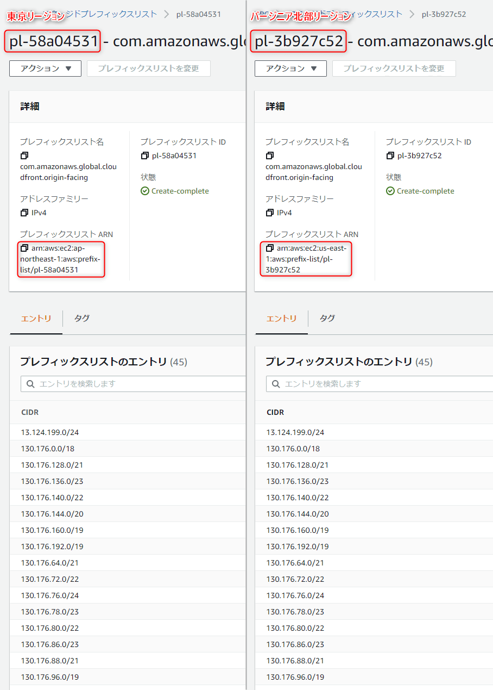

今回は EC2 でホストしている WordPress を CloudFront で配信するため、 CloudFormation を使って構築できるようにします。


## 前提

ホストする WordPress は下記の記事で構築したものです。

- [EC2 で PHP 8 と nginx の Docker コンテナーを使って WordPress を動かす](https://mseeeen.msen.jp/wordpress-6-with-docker-php-8-on-aws-ec2-instance/)

図の青枠で囲った*以外*の部分を扱います。

デプロイが簡単なのとパラメーターの管理が楽なので **Serverless Framework v3** を使っていますが、実質的にはほとんど CloudFormation だけです。

スタック外で下記の設定が必要です。

- **Route 53** : でドメインを指定済みであること（この記事では `wp.example.com` として進めます）
- **ACM (Certificate Manager)** : `*.wp.example.com` に対する SSL 証明書を発行済みであること

## スタック構成

今回は下記の 4 つの CloudFormation スタックに分けてデプロイします。独立していたほうがデプロイや削除が容易なのでこの分け方にしています。

分けなくても問題ありませんが、あまり一つのスタックに入れすぎると、更新やロールバックにも時間がかかるため、試行錯誤するときはスタックを分けておくほうがおすすめです。

1. `infra` : 共通リソース (シークレット, VPC, サブネット, EFS, EIP 等)
2. `db` : データベース (RDS インスタンス, DB サブネットグループ)
3. `server` : サーバー (EC2 インスタンス)
4. `cdn` : CloudFront (ログバケット, ポリシー, ディストリビューション)

デプロイも上記の順番で行いますが、 3 と 4 は依存していないので入れ替わっても問題ありません (後述)。

1 は 2, 3 に必要なリソースを準備します。 1 はほとんど作り直す必要がないと思います。

2 は RDS でデータベースを準備します。初期化が必要になった場合のみ作り直せばよいでしょう。

3 はいろいろ試行錯誤するためにも簡単に作り直しができるように、 EC2 インスタンスのみのスタックにしています。

4 は EC2 インスタンスの WordPress を配信するための CloudFront スタックです。


## スタック

### 共通リソース

#### デプロイ

他のスタックで使用する **VPC などのインフラ周りや、 EC2 インスタンスにマウントする EFS、 Elastic IP** などが含まれます。

Serveless Framework を使ったデプロイコマンドは下記のようになります。

```bash:title=共通リソースのデプロイ
sls deploy --param="domain=<Route 53 でホストしているドメイン名>" --param="sshAllowedCidr=<SSH 接続を許可する CIDR>"
```

パラメーターを 2 つ指定する必要があります。 1 つは `domain` で Route 53 でホストしているドメイン名、ここでは `wp.example.com` です。

もう 1 つは `sshAllowedCidr` で EC2 インスタンスへの SSH 接続を許可する IP アドレスの CIDR を指定します。 CIDR は `123.123.123.123/32` のような形式です。

#### 含まれるリソース

- ネットワーク
    - VPC
    - サブネット (パブリックサブネット×2, プライベートサブネット×2)
    - インターネットゲートウェイ
    - ルートテーブル
- ストレージ
    - EFS (ファイルシステム, マウントターゲット)
- セキュリティ
    - セキュリティグループ (EC2 用, EFS 用, RDS 用)
- シークレット
    - EC2 インスタンス用キーペア
    - RDS 認証情報 Secret
- EC2 インスタンス用
    - Elastic IP
    - Route 53 DNS レコード

ネットワークは標準な VPC の構成だと思います。今後の拡張 (サーバーや RDS の冗長化など) を考慮してパブリック、プライベートともに 2 つずつ用意しています。

20 を超えるので少しリソースは多いですが、 1 つ 1 つ見ていけば難しくはないと思います。

特徴的な部分のみ解説します。

#### CloudFront → EC2 のセキュリティグループ

EC2 をオリジンとする CloudFront の構成では、これまで EC2 へのアクセスを CloudFront のみに制限するのが困難でした。しかし、 2022 年から **CloudFront のマネージドプレフィックスリスト** を使ったアクセス制限を利用できるようになりました。

- [Amazon CloudFront用のAWS マネージドプレフィックスリストを使用したオリジンへのアクセス制限 | Amazon Web Services ブログ](https://aws.amazon.com/jp/blogs/news/limit-access-to-your-origins-using-the-aws-managed-prefix-list-for-amazon-cloudfront/)

これにより、下記のようにセキュリティグループで設定すれば、オリジン (EC2) へのアクセスを CloudFront からに制限できます。

```
# Security Groups for EC2 instance (HTTP)
MySecurityGroupHTTP:
  Type: AWS::EC2::SecurityGroup
  Properties:
    GroupDescription: Allow HTTP
    VpcId: !Ref MyVPC
    SecurityGroupIngress:
      - IpProtocol: tcp
        FromPort: 80
        ToPort: 80
        SourcePrefixListId: pl-3b927c52 # 👈 us-east-1 の CloudFront の マネージドプレフィックスリスト ID
```

ちなみに CloudFront がグローバルサービスなのにもかかわらず、**マネージドプレフィックスリストの ID は リージョンごとに異なります**。

念のために確認しましたが、どのリージョンも内容は同じです。



ということで少し（かなり？）面倒ではありますが、 VPC のリージョンごとに別の ID を指定する必要があります。

今回のテンプレートでは冒頭に `Mappings` で リージョンごとのプレフィックスリスト ID を定義しておき、 `!FindInMap ['RegionMap', !Ref 'AWS::Region', 'PrefixListCloudFront']` のようにして、デプロイリージョンに応じたプレフィックスリストを指定しています。

### データベース

続いてデータベース周辺です。 RDS (MySQL) を使います。

```bash:title=データベースのデプロイ
sls deploy
```

*MySQL の t3.micro であれば AWS の初期無料枠で利用できる*ので、検証環境で気軽に試せます。

今回はシングル構成のため、使うリソースは `AWS::RDS::DBSubnetGroup` と `AWS::RDS::DBInstance` のみです。

初期無料枠の範囲となるように既定でストレージは 20GB 、インスタンスクラスは t3.micro にしています。

```yml:db/resources.yml(抜粋)
  MyDBSubnetGroup:
    Type: AWS::RDS::DBSubnetGroup
    Properties:
      DBSubnetGroupName: !Sub '${AWS::StackName}-subnet-group'
      DBSubnetGroupDescription: !Ref "AWS::StackName"
      SubnetIds:
        Fn::Split:
          - ','
          - !ImportValue '${param:commonResourceStackName}:PrivateSubnetIds' # 👈 ① 共通リソースのプライベートサブネット (①)

  MyDBInstance:
    Type: AWS::RDS::DBInstance
    Properties:
      AllocatedStorage: !Ref DBAllocatedStorage
      DBInstanceClass: !Ref DBInstanceClass
      DBInstanceIdentifier: !Sub '${AWS::StackName}-db'
      Engine: mysql
      DBSubnetGroupName: !Ref MyDBSubnetGroup # 👈 DB サブネットグループを紐付け
      MasterUsername:
        !Sub
          - '{{resolve:secretsmanager:${DbAdminSecret}::username}}'
          - DbAdminSecret: !ImportValue '${param:commonResourceStackName}:DbAdminSecretId' # 👈 SecretsManager の値からユーザー名を割り当て
      MasterUserPassword:
        !Sub
          - '{{resolve:secretsmanager:${DbAdminSecret}::password}}'
          - DbAdminSecret: !ImportValue '${param:commonResourceStackName}:DbAdminSecretId' # 👈 同様にパスワードを割り当て
      BackupRetentionPeriod: 0
      VPCSecurityGroups:
        - !ImportValue '${param:commonResourceStackName}:DbSecurityGroup' # 👈 DB のセキュリティグループを割り当て (②)
```

① DB サブネットグループは共通リソースとして作成したプライベートサブネットを割り当てることで、外部からのアクセスができないようにしておきます。

② 共通リソースで作成したセキュリティグループ (3306 ポート) を割り当てます。これにより EC2 インスタンス (の VPC) ➡ RDS へのアクセスが可能になります。

### SecretsManager の値からユーザー名とパスワードを割り当て

DB のユーザー名とパスワードは、共通リソースで作成した Secrets Manager の Secret (`AWS::SecretsManager::Secret`) から、それぞれ読み取って設定します。

```yml:title=ImportValueとSubと動的パラメーターを使ったSecretの参照
!Sub
    - '{{resolve:secretsmanager:${DbAdminSecret}::username}}'
    - DbAdminSecret: !ImportValue '共通リソーススタックで出力した Secret の ID'
```

ここで `Fn::Sub` に 2 つのパラメーターを指定しています。 **`Fn::Sub` は 2 番目のパラメーターに「変数マップ」 (キーと値のリスト) を指定すると、置換文字列の中でそのキーを指定した値で置き換えることができます。**使いこなすと非常に便利な機能です。

- [Fn::Sub - AWS CloudFormation](https://docs.aws.amazon.com/ja_jp/AWSCloudFormation/latest/UserGuide/intrinsic-function-reference-sub.html)

これを利用して、共通リソースで作成した Secret の ID を `Fn::ImportValue` で読み込み、動的パラメーター (resolve) に与えています。

*CloudFormation の動的パラメーター*は下記のような記述で Secrets Manager の値を取得できます。

- ユーザー名: `{{resolve:secretsmanager:SECRET_ID:username}}`
- パスワード: `{{resolve:secretsmanager:SECRET_ID:password}}`

この `SECRET_ID` を先の方法で置き換えています。CloudFormation の動的パラメーターに関しては公式情報もわかりやすいです。

- [動的な参照を使用してテンプレート値を指定する - AWS CloudFormation](https://docs.aws.amazon.com/ja_jp/AWSCloudFormation/latest/UserGuide/dynamic-references.html#dynamic-references-secretsmanager)


### CDN (CloudFront)


```bash
sls deploy --param="domain=wp.example.com" --param="sslCertificateArn=arn:aws:acm:us-east-1:ACCOUNT_ID:certificate/GUID"
```


このスタックの特徴として、**リソース的には EC2 インスタンスとは依存関係がない**ことが挙げられます。このため、ドメインと証明書、オリジン (EC2 インスタンス) のドメイン名さえあれば、 EC2 側が準備できなくともデプロイできます。逆にこの CloudFront スタックを維持したまま EC2 インスタンスを削除したり、再構成したりもできます。

[index.html を追加してファイル名を含まない URL をリクエストする - Amazon CloudFront](https://docs.aws.amazon.com/ja_jp/AmazonCloudFront/latest/DeveloperGuide/example-function-add-index.html)


