いよいよ **Flutter 3** が発表され、 Windows や Linux のアプリも作成できるようになりました。

今回はさっそく **Windows (WSL 2) で Ubuntu 22.04 を利用した開発環境を構築**してみます。

## 前提

### 環境

この記事は下記の環境を想定しています。

- Windows 10 Pro
- Flutter 3.0.0
- Ubuntu 22.04 on WSL 2
- Android 11 (Pixel 5)

今回は WSL 2 上に **Ubuntu 22.04** を新たに用意します。既存環境がある場合はそちらにインストールしてもかまいませんが、 Java や Android SDK などが入るのと、いろいろ環境の試行錯誤も必要だと思うので、クリーンな環境のほうが気楽だと思います。

WSL や Visual Studio Code 等もインストール済みで、すでに利用されている前提として進めます。

### 全体の流れ

大まかには下記の流れで進めます。

1. WSL 2 での Ubuntu 環境の準備
2. Java SDK と Android SDK のインストール
3. Flutter 開発環境の構築
4. Visual Studio Code と Chrome 等の設定
5. デモプロジェクトの作成と実行
6. Android 実機でのリモートデバッグ

なお、この記事は下記の参考記事を元にしており、 Flutter 3 で変わったと思われる部分と Ubuntu 22.04、 Pixel 5 を利用している点を除けばほぼ同様の内容です。
とても丁寧にまとめられており、助かりました。著者に感謝申し上げます。

- [WSL2でFlutter環境をできるだけクリーンに構築する(えみ) - Qiita](https://qiita.com/suruseas/items/42d5d9c5beffa6ebdd78#3-2-android%E9%96%8B%E7%99%BA%E7%92%B0%E5%A2%83)


## WSL 2 での Ubuntu 環境の準備

### Ubuntu 22.04 のダウンロードとインポート

先に Ubuntu をインストールするパスと名前を決めておきます。

ここでは環境名は `flutter-env` 、インストール先はユーザーフォルダー直下の `wsl` フォルダーの下にしますので、フォルダーを作成しておきます。

```
C:\Users\<ユーザー名>\wsl
```

Ubuntu のリリースページから **22.04 のイメージをダウンロード**します。

- [Ubuntu 22.04 (Jammy Jellyfish) \[20220506\]](https://cloud-images.ubuntu.com/releases/22.04/release/)

通常の Windows 環境での WSL 向けイメージは **`*-amd64-wsl.rootfs.tar.gz`** で終わっているものです。これを適当なフォルダーにダウンロードします。ここではユーザーの「ダウンロード」フォルダー (`%HOMEPATH%\Downloads\`) にダウンロードしたものとして進めます。

コマンドプロンプト (`cmd.exe`) を開き、下記のように **`wsl --import` コマンド**を実行します。パス部分は適宜変更してください。

```:title=コマンドプロンプト
> wsl --import flutter-env %HOMEPATH%\wsl\flutter-env %HOMEPATH%\Downloads\ubuntu-22.04-server-cloudimg-amd64-wsl.rootfs.tar.gz --version 2
```

エラーがなければ Ubuntu 22.04 が `flutter-env` として展開されているはずです。

```:title=コマンドプロンプト
> wsl -l -v
  NAME                   STATE           VERSION
* Ubuntu-20.04           Running         2
  flutter-env            Stopped         2
```

インストールフォルダーには vhdx ファイルができています。

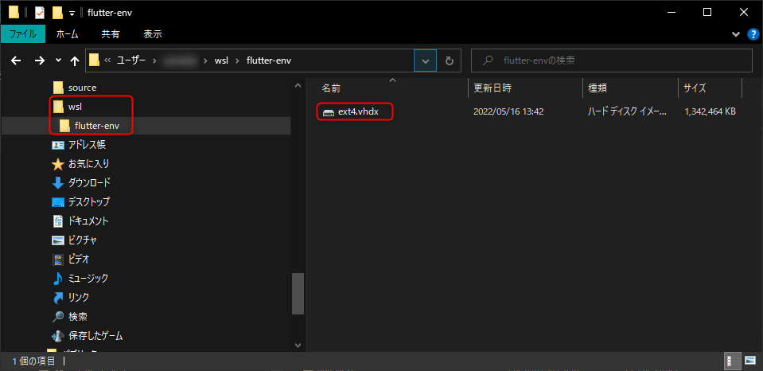

### Ubuntu の初期設定

さっそく新しい Ubuntu にログインします。

```:title=コマンドプロンプト
> wsl -d flutter-env
Welcome to Ubuntu 22.04 LTS (GNU/Linux 5.10.102.1-microsoft-standard-WSL2 x86_64)
～略～
root@msen-dev-001:/mnt/c/Users/yamada#
```

この時点ではログインユーザーが root になっているため、一般ユーザーを追加してログインしなおします。ここではユーザー名を `wsl-user` にしていますが、なんでもかまいません。

```:title=WSL(bash)
# useradd -m -s $(which bash) wsl-user
# passwd wsl-user
# usermod -G sudo wsl-user
# exit
```

一度ログアウトしたら、再度コマンドプロンプトからユーザーを指定して Ubuntu にログインしなおします。

```:title=コマンドプロンプト
> wsl -d flutter-env -u wsl-user
```

WSL のログインユーザーと Windows の PATH 設定を引き継がないように設定するため、 `sudo` で `/etc/wsl.conf` を編集します。

```:title=WSL(bash)
sudo vi /etc/wsl.conf
```

下記のように設定して保存します。

```ini:title=/etc/wsl.conf
[user]
default=wsl-user
[interop]
appendWindowsPath = false
```

ついでに Windows 関連の exe や VS Code に対して PATH を通しておきます。

```:title=WSL(bash)
$ echo export PATH=\$PATH:/mnt/c/WINDOWS/ >> ~/.bashrc
$ echo export PATH=\$PATH:\"/mnt/c/Users/ユーザー名/AppData/Local/Programs/Microsoft VS Code/bin\" >> ~/.bashrc
```

※ VS Code のパスは既存の Ubuntu などで確認するといいでしょう。

```:title=WSL(別のUbuntuのbashなど)
$ which code
/mnt/c/Users/yamada/AppData/Local/Programs/Microsoft VS Code/bin/code
```

設定したらパッケージのアップデートと unzip コマンドをインストールしておきます。
アップデート・インストールが完了したら、ログアウトします。

```:title=WSL(bash)
$ sudo apt update -q; sudo apt upgrade -yq
$ sudo apt install -y unzip
$ exit
```

いったん環境を停止したあと、再度起動します。

```:title=コマンドプロンプト
> wsl -t flutter-env
> wsl -d flutter-env
```

今度は `wsl-user` として接続できていれば OK です。

```:title=WSL(bash)
wsl-user@msen-dev-001:~$
```

ここまで確認できたら一度イメージを export しておきます。パスは好きな場所に変更してください。

```:title=コマンドプロンプト
> wsl -t flutter-env
> wsl -l -v
> wsl --export flutter-env %HOMEPATH%\wsl\flutter-env.tar
```

## Java SDK と Android SDK のインストール

### Java SDK のインストール

下記の要領で Java SDK をインストールします。特に悩むところはないと思います。


```:title=WSL(bash)
$ sudo apt update && sudo apt install default-jdk -y
$ export JAVA_HOME=/usr/lib/jvm/java-11-openjdk-amd64
$ ll $JAVA_HOME
$ echo export JAVA_HOME=/usr/lib/jvm/java-11-openjdk-amd64 >> ~/.bashrc
$ echo export PATH=$PATH:$JAVA_HOME/bin >> ~/.bashrc
$ exec $SHELL -l
$ echo $JAVA_HOME
$ echo $PATH
```

### Android SDK のインストール

続いて Android SDK をインストールします。
まず、下記のページから *"Command line tools only" の Linux 版のリンクをクリックし、 SDK の zip URL を取得*します。

- [Download Android Studio and SDK tools  |  Android Developers](https://developer.android.com/studio/index.html#downloads)

Terms に同意するチェックを入れるとダウンロードボタンが活性化するので、右クリックから「リンクのアドレスをコピー」とするのがよいと思います。

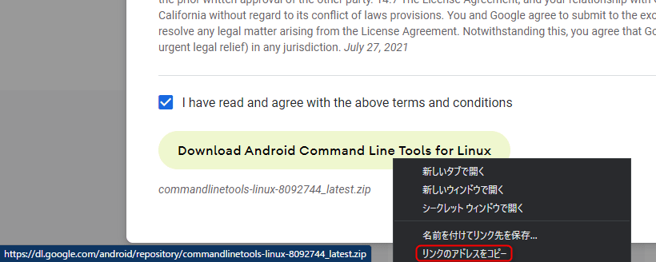

URL は `https://dl.google.com/android/repository/commandlinetools-linux-8092744_latest.zip` のような感じです。

リンクが取得できたら、下記のようにコマンドを実行して Android SDK を展開します。 `<SDK の zip URL>` の部分を置き換えて実行してください。

```:title=WSL(bash)
$ mkdir -p ~/Android/SDK/cmdline-tools
$ wget <SDK の zip URL> -O latest.zip
$ unzip latest.zip
$ mv cmdline-tools ~/Android/SDK/cmdline-tools/latest
$ rm -rf latest.zip
$ echo export ANDROID_HOME=$HOME/Android/SDK >> ~/.bashrc
$ echo export PATH=$PATH:$ANDROID_HOME/cmdline-tools/latest/bin >> ~/.bashrc
$ exec $SHELL -l
$ sdkmanager
[=======================================] 100% Computing updates...
```

**`sdkmanager` が実行できれば OK** です👌

続けて Platform Tools をインストールします。

```:title=WSL(bash)
$ sdkmanager --install "platform-tools"
$ echo export PATH=$PATH:$ANDROID_HOME/platform-tools >> ~/.bashrc
$ exec $SHELL -l
$ adb
Android Debug Bridge version 1.0.41
Version 33.0.1-8253317
Installed as /home/wsl-user/Android/SDK/platform-tools/adb
～略～
```

**`adb` (Android Debug Bridge) が実行できれば OK** です👌

下記のコマンドで Android SDK のライセンスを確認し、同意しておきます。（インストールしたパッケージ分、ライセンスが表示されます）

```:title=WSL(bash)
$ sdkmanager --licenses
```


## Flutter 開発環境の構築

### Flutter のインストール

いよいよ **Flutter 3** をインストールします。

下記の Linux 向け公式の手動インストール手順をベースに進めます。

- [Install Flutter manually - Linux install | Flutter](https://docs.flutter.dev/get-started/install/linux#install-flutter-manually)

Android SDK のときと同様に、**インストールページからパッケージの URL を取得**します。 `https://storage.googleapis.com/******/flutter_linux_*.*.*-stable.tar.xz` のような URL です。（下記は Version 3.0.0 の例）

```:title=WSL(bash)
$ wget https://storage.googleapis.com/flutter_infra_release/releases/stable/linux/flutter_linux_3.0.0-stable.tar.xz
$ tar xf flutter_linux_3.0.0-stable.tar.xz
$ echo export FLUTTER_ROOT=$HOME/flutter >> ~/.bashrc
$ echo export PATH=$PATH:$FLUTTER_ROOT/bin >> ~/.bashrc
$ exec $SHELL -l
```

**`flutter --version`** でバージョン情報とウェルカムメッセージが表示されれば OK です👌

```:title=WSL(bash)
$ flutter --version
Flutter 3.0.0 • channel stable • https://github.com/flutter/flutter.git
Framework • revision ee4e09cce0 (6 days ago) • 2022-05-09 16:45:18 -0700
Engine • revision d1b9a6938a
Tools • Dart 2.17.0 • DevTools 2.12.2

  ╔════════════════════════════════════════════════════════════════════════════╗
  ║                 Welcome to Flutter! - https://flutter.dev                  ║
  ║                                                                            ║
  ║ The Flutter tool uses Google Analytics to anonymously report feature usage ║
  ║ statistics and basic crash reports. This data is used to help improve      ║
  ║ Flutter tools over time.                                                   ║
  ║                                                                            ║
  ║ Flutter tool analytics are not sent on the very first run. To disable      ║
  ║ reporting, type 'flutter config --no-analytics'. To display the current    ║
  ║ setting, type 'flutter config'. If you opt out of analytics, an opt-out    ║
  ║ event will be sent, and then no further information will be sent by the    ║
  ║ Flutter tool.                                                              ║
  ║                                                                            ║
  ║ By downloading the Flutter SDK, you agree to the Google Terms of Service.  ║
  ║ Note: The Google Privacy Policy describes how data is handled in this      ║
  ║ service.                                                                   ║
  ║                                                                            ║
  ║ Moreover, Flutter includes the Dart SDK, which may send usage metrics and  ║
  ║ crash reports to Google.                                                   ║
  ║                                                                            ║
  ║ Read about data we send with crash reports:                                ║
  ║ https://flutter.dev/docs/reference/crash-reporting                         ║
  ║                                                                            ║
  ║ See Google's privacy policy:                                               ║
  ║ https://policies.google.com/privacy                                        ║
  ╚════════════════════════════════════════════════════════════════════════════╝
```

### Linux アプリ用ツールのインストール

ここでインストール状況を確認するために **`flutter doctor`** を実行します。

```:title=WSL(bash)
$ flutter doctor -v
[✓] Flutter (Channel stable, 3.0.0, on Ubuntu 22.04 LTS 5.10.102.1-microsoft-standard-WSL2, locale C.UTF-8)
    • Flutter version 3.0.0 at /home/wsl-user/flutter
    • Upstream repository https://github.com/flutter/flutter.git
    • Framework revision ee4e09cce0 (6 days ago), 2022-05-09 16:45:18 -0700
    • Engine revision d1b9a6938a
    • Dart version 2.17.0
    • DevTools version 2.12.2

[!] Android toolchain - develop for Android devices
    • Android SDK at /home/wsl-user/Android/SDK
    ✗ Unable to locate Android SDK.
      Install Android Studio from: https://developer.android.com/studio/index.html
      On first launch it will assist you in installing the Android SDK components.
      (or visit https://flutter.dev/docs/get-started/install/linux#android-setup for detailed instructions).
      If the Android SDK has been installed to a custom location, please use
      `flutter config --android-sdk` to update to that location.

    • ANDROID_HOME = /home/wsl-user/Android/SDK
    ✗ No valid Android SDK platforms found in /home/wsl-user/Android/SDK/platforms. Directory was empty.
    • Try re-installing or updating your Android SDK,
      visit https://flutter.dev/docs/get-started/install/linux#android-setup for detailed instructions.

[✗] Chrome - develop for the web (Cannot find Chrome executable at google-chrome)
    ! Cannot find Chrome. Try setting CHROME_EXECUTABLE to a Chrome executable.

[☠] Linux toolchain - develop for Linux desktop (the doctor check crashed)
    ✗ Due to an error, the doctor check did not complete. If the error message below is not helpful, please let us know about this issue at
      https://github.com/flutter/flutter/issues.
    ✗ ProcessException: Failed to find "pkg-config" in the search path.
        Command: pkg-config
    • #0      LocalProcessManager.run (package:process/src/interface/local_process_manager.dart:87:7)
      #1      ErrorHandlingProcessManager.run.<anonymous closure> (package:flutter_tools/src/base/error_handling_io.dart:669:24)
      #2      _run (package:flutter_tools/src/base/error_handling_io.dart:567:20)
      #3      ErrorHandlingProcessManager.run (package:flutter_tools/src/base/error_handling_io.dart:668:12)
      #4      LinuxDoctorValidator._libraryIsPresent (package:flutter_tools/src/linux/linux_doctor.dart:186:38)
      #5      LinuxDoctorValidator.validate (package:flutter_tools/src/linux/linux_doctor.dart:145:20)
      <asynchronous suspension>
      #6      Future.any.onValue (dart:async/future.dart:611:5)
      <asynchronous suspension>


[!] Android Studio (not installed)
    • Android Studio not found; download from https://developer.android.com/studio/index.html
      (or visit https://flutter.dev/docs/get-started/install/linux#android-setup for detailed instructions).

[✓] Connected device (1 available)
    • Linux (desktop) • linux • linux-x64 • Ubuntu 22.04 LTS 5.10.102.1-microsoft-standard-WSL2

[✓] HTTP Host Availability
    • All required HTTP hosts are available

! Doctor found issues in 3 categories.
```

いくつかエラーになっていて、 **Linux toolchain は ☠ (ドクロマーク)** でした(笑)

Linux のデスクトップアプリをビルドするためのコンパイル用のツール群が不足しています。 Linux のデスクトップアプリを作らないのであれば不要だと思いますが、ここでは公式手順に従い、インストールしておきます。

- [Additional Linux requirements - Linux install | Flutter](https://docs.flutter.dev/get-started/install/linux#additional-linux-requirements)

```:title=WSL(bash)
$ sudo apt install -y clang cmake ninja-build pkg-config libgtk-3-dev liblzma-dev
```

再度 `flutter doctor` を実行します。

```:title=WSL(bash)
$ flutter doctor -v
[✓] Flutter (Channel stable, 3.0.0, on Ubuntu 22.04 LTS 5.10.102.1-microsoft-standard-WSL2, locale C.UTF-8)
    • Flutter version 3.0.0 at /home/wsl-user/flutter
    • Upstream repository https://github.com/flutter/flutter.git
    • Framework revision ee4e09cce0 (6 days ago), 2022-05-09 16:45:18 -0700
    • Engine revision d1b9a6938a
    • Dart version 2.17.0
    • DevTools version 2.12.2

[!] Android toolchain - develop for Android devices
    • Android SDK at /home/wsl-user/Android/SDK
    ✗ Unable to locate Android SDK.
      Install Android Studio from: https://developer.android.com/studio/index.html
      On first launch it will assist you in installing the Android SDK components.
      (or visit https://flutter.dev/docs/get-started/install/linux#android-setup for detailed instructions).
      If the Android SDK has been installed to a custom location, please use
      `flutter config --android-sdk` to update to that location.

    • ANDROID_HOME = /home/wsl-user/Android/SDK
    ✗ No valid Android SDK platforms found in /home/wsl-user/Android/SDK/platforms. Directory was empty.
    • Try re-installing or updating your Android SDK,
      visit https://flutter.dev/docs/get-started/install/linux#android-setup for detailed instructions.

[✗] Chrome - develop for the web (Cannot find Chrome executable at google-chrome)
    ! Cannot find Chrome. Try setting CHROME_EXECUTABLE to a Chrome executable.

[✓] Linux toolchain - develop for Linux desktop
    • Ubuntu clang version 14.0.0-1ubuntu1
    • cmake version 3.22.1
    • ninja version 1.10.1
    • pkg-config version 0.29.2

[!] Android Studio (not installed)
    • Android Studio not found; download from https://developer.android.com/studio/index.html
      (or visit https://flutter.dev/docs/get-started/install/linux#android-setup for detailed instructions).

[✓] Connected device (1 available)
    • Linux (desktop) • linux • linux-x64 • Ubuntu 22.04 LTS 5.10.102.1-microsoft-standard-WSL2

[✓] HTTP Host Availability
    • All required HTTP hosts are available

! Doctor found issues in 3 categories.
```

Linux toolchain は 👌 になりました。あと下記のようなエラーと警告が出ていますが、いずれも無視して進めます。

- Android toolchain: VS Code の実行時に自動的にインストールしてくれます
- Chrome: Windows 上の Chrome 連携は VS Code の拡張機能と Chrome の拡張機能で連携してくれるようです
- Android Studio: 今回はコマンドライン SDK で進めていますので不要です

インストールはこれで完了です👏

## Visual Studio Code と Chrome 等の設定

### VS Code の起動

とりあえず**ホームディレクトリで VS Code を起動**します。連携用パッケージがインストールされて VS Code が起動するはずです。

```:title=WSL(bash)
$ code .
```

ステータスバーで `WSL: flutter-env` のようになっていれば OK です。


### VS Code の Flutter 拡張機能インストール

VS Code の拡張機能 (Extensions) ペインから **Flutter 拡張機能**を検索してインストールします。


### Google Chrome の拡張機能インストール

Windows の Google Chrome に下記のリンクから **Dart Debug Extension** をインストールします。

- [Dart Debug Extension - Chrome ウェブストア](https://chrome.google.com/webstore/detail/dart-debug-extension/eljbmlghnomdjgdjmbdekegdkbabckhm/related?hl=ja)

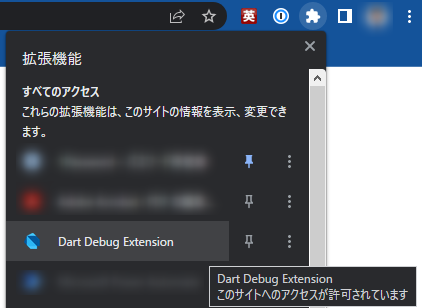

図のように、 Chrome の拡張機能メニューに Dart Debug Extension が表示されていれば OK です👌

これで環境整備は終了です。お疲れさまでした👏

## デモプロジェクトの作成と実行

VS Code に戻り、 <kbd>`Ctrl + Shift + P`</kbd> でコマンドパレットを開き、 `flutter` を入力し、 `Flutter: New Project` を選択します。

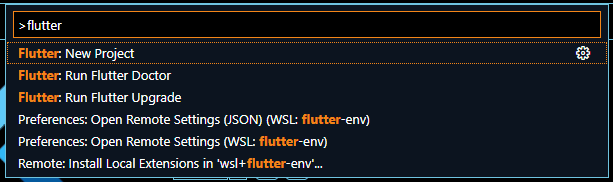

`Application` を選択します。

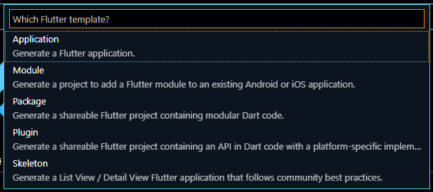

プロジェクトを作成する「親」ディレクトリーを選択します。

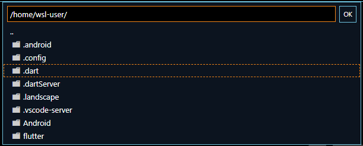

プロジェクト名を入力します。

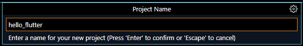

これで新しいプロジェクトがルートになった状態で VS Code が再起動します。

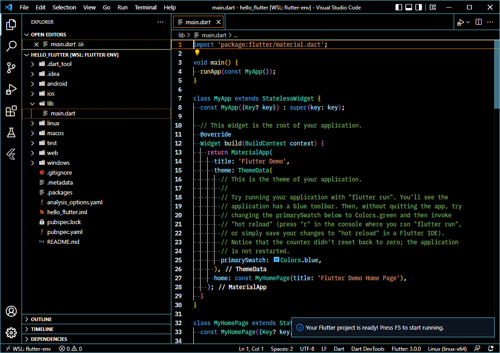

### Web Server で起動

いったん、わかりやすい *Web Server* で起動してみます。

おそらくデフォルトでは実行するデバイスが Linux (desktop) になっているので、ステータスバーのデバイス選択から **Web Server** に切り替えます。

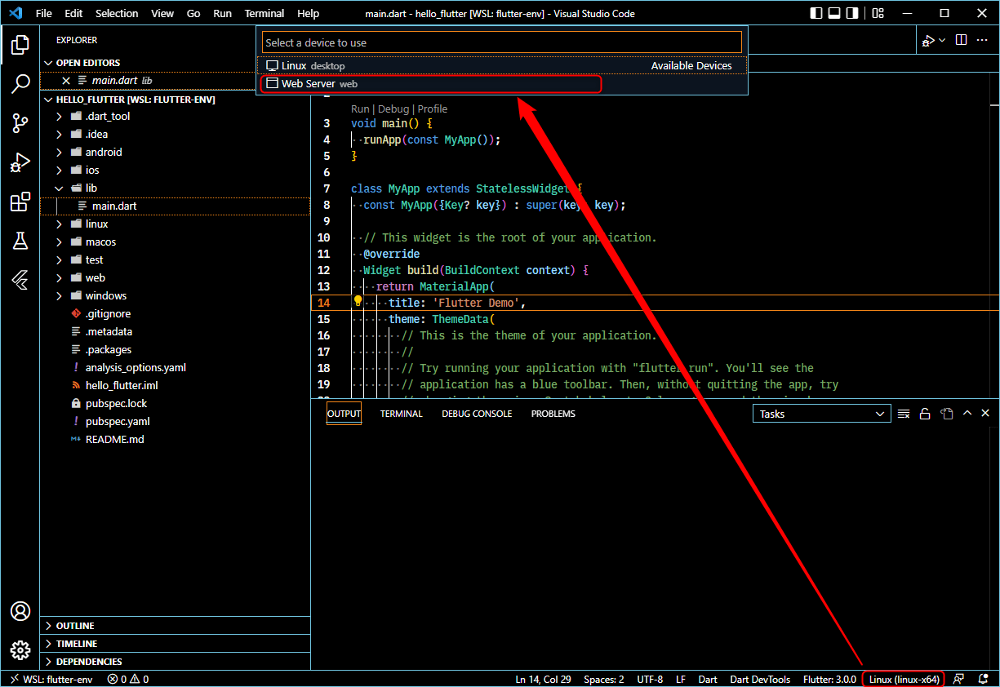

<kbd>`F5`</kbd> キー (デバッグ実行) を押して、実行を開始します。特にエラーがでなければ Chrome が起動します。

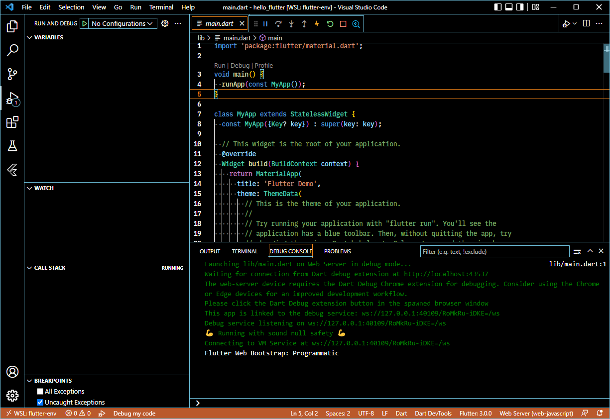

**Chrome 側で Dart Debug Extension をクリックしてデバッグを開始**します。

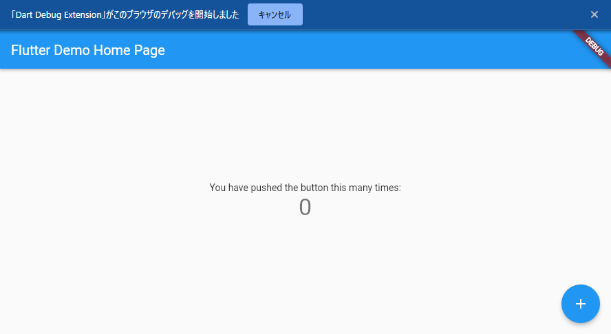

上記のようにデモアプリが動けば OK です👍

## Android 実機でのリモートデバッグ

せっかくなので **Android でリモートデバッグ**をするところまで進めてみます。 *Android と PC が同じネットワークに存在する必要があります*。

### 開発者モードの有効化

まず Android 側で開発者モードを有効にします。すでに有効になっている場合はスキップしてください。

- [Android Debug Bridge（adb）  |  Android デベロッパー  |  Android Developers](https://developer.android.com/studio/command-line/adb#connect-to-a-device-over-wi-fi-android-11+)

Google Pixel の場合は **[設定] > [デバイス情報] > [ビルド番号]** の**「ビルド番号」を 7 回タップ**します。

これで開発者向けオプションが表示されます。次に **[設定] > [システム] > [開発者向けオプション]** を開きます。

**「ワイヤレスデバッグ」** を有効にします。


**「ペア設定コードによるデバイスのペア設定」** をタップし、 IP アドレス・ポートとペアリングコードを表示します。

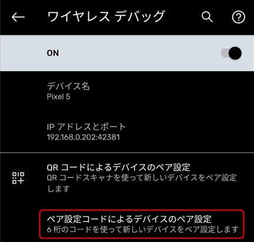

### Android と Ubuntu のペアリングと接続

Ubuntu に戻り、 Android で表示された IP アドレス・ポートを `adb pair` コマンドに指定して、ペアリングコードを入力します。
※ワイヤレスデバッグの "IP アドレスとポート" に表示されているものではなく、ペアリングコードと一緒に表示されるアドレスとポートです。

```:title=WSL(bash)
$ adb pair 192.168.0.202:41747
Enter pairing code: 079658
Successfully paired to 192.168.0.202:41747 [guid=adb-06241FDD4000SY-jX5V3m]
```

Successfully paired と表示されれば成功です。

続けて `adb connet` コマンドで接続します。今度はワイヤレスデバッグの "IP アドレスとポート" に表示されているものを指定します。

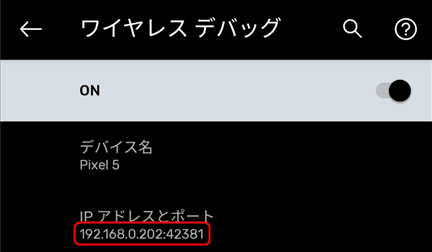

```:title=WSL(bash)
$ adb connect 192.168.0.202:42381
connected to 192.168.0.202:42381
```

connected と表示されれば成功です👍

`flutter devices` コマンドでデバイスを確認します。無事 Pixel 5 が表示されています。

```{4}:title=WSL(bash)
$ flutter devices
2 connected devices:

Pixel 5 (mobile) • 192.168.0.202:42381 • android-arm64 • Android 11 (API 30)
Linux (desktop)  • linux               • linux-x64     • Ubuntu 22.04 LTS 5.10.102.1-microsoft-standard-WSL2
```

接続中は Android 側に下記のような通知が表示されます。


### VS Code から Pixel でデバッグ実行

接続が完了すると、 *VS Code 上でも Android が選択できるようになっている*ため、ステータスバーから切り替えます。

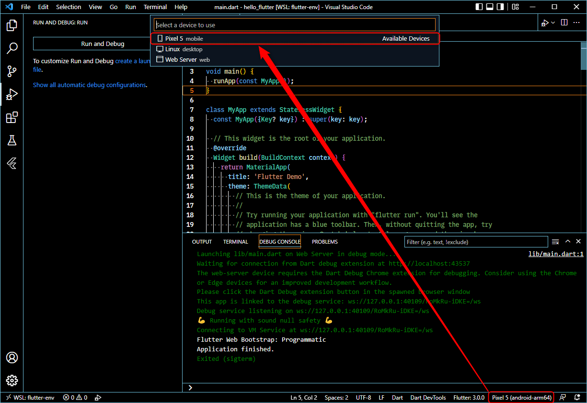

その状態で <kbd>`F5`</kbd> キーを押して実行すると必要なパッケージが自動的にインストールされていきます。

最初は結構時間がかかりますので、辛抱強く待ちます。

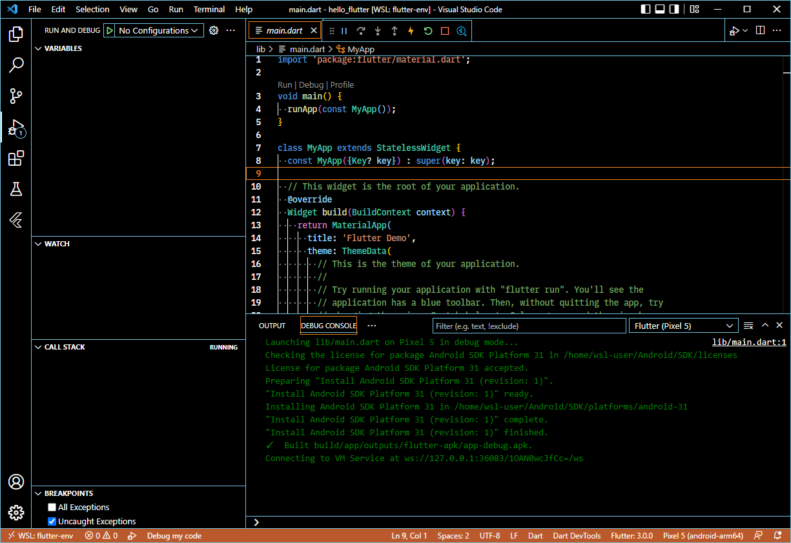

### Android で起動した Flutter アプリ

成功すると Android 画面にアプリが表示されます。

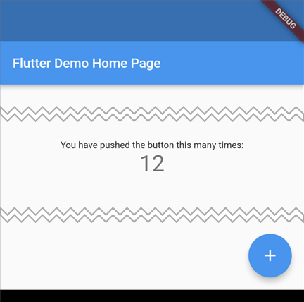

この画像ではわかりづらいですが、画面上のステータスバーにまで DEBUG のリボンがかかっていて、アプリデバッグ中であることがわかりやすくなっています。

試しに `main.dart` をちょっと書き換えてみると...無事、ホットリロードされて Android の表示も更新されました。

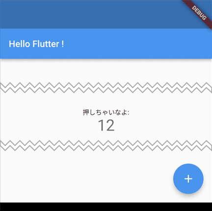

今回は以上です。お疲れさまでした。

## まとめ

Flutter 3 が発表されたため、最近発表された Ubuntu 22.04 も取り入れて WSL 2 での開発環境を構築してみました。

割と長いのですが、内容がつかめれば、今後も役に立つかなと思いました。

肝心の Flutter 3 はまだそんなに触れていないんですが、ホットリロードされただけで非常に満足でした(笑)

### 参考サイト

- [WSL2でFlutter環境をできるだけクリーンに構築する(えみ) - Qiita](https://qiita.com/suruseas/items/42d5d9c5beffa6ebdd78#3-2-android%E9%96%8B%E7%99%BA%E7%92%B0%E5%A2%83)
- [Linux install | Flutter](https://docs.flutter.dev/get-started/install/linux#install-flutter-manually)
- [Android Debug Bridge（adb）  |  Android デベロッパー  |  Android Developers](https://developer.android.com/studio/command-line/adb#connect-to-a-device-over-wi-fi-android-11+)
