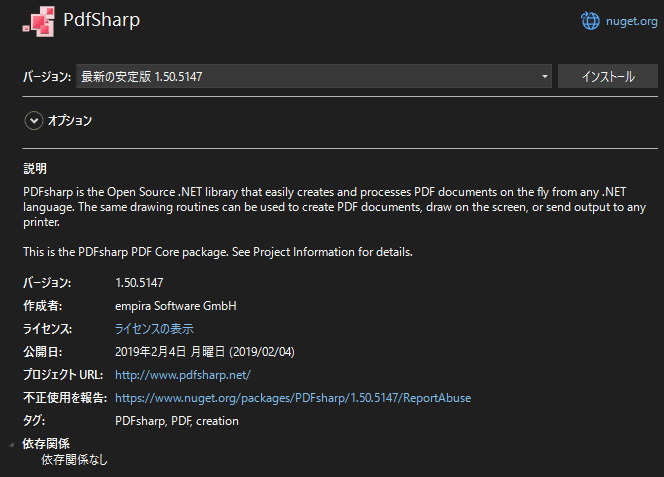

今回はオープンソースの PDF ライブラリーである **[PdfSharp](http://www.pdfsharp.net/)** を使って、複数の PDF ファイルを 1 つに結合する方法を紹介します。

- [Home of PDFsharp and MigraDoc Foundation - PDFsharp & MigraDoc](http://www.pdfsharp.net/)

## 環境

- Windows 11
- Visual Studio 2022
- .NET Framework 4.7.2

## PdfSharp 採用の背景

オープンソースの PDF ライブラリーでは [iTextSharp](https://itextpdf.com/products/itextsharp) が有名なのですが、こちらはオープンソース版のライセンスが AGPL です。

AGPL は GPL がベースですので、コピーレフトであり、その著作物を利用するソフトウェアも必然的に同ライセンスにする必要があります（複数の見解あり）。商用のソフトウェアの場合、ソースコードを公開するわけにはいかないため、これは大きな障害になります。

その点、 **PdfSharp は MIT ライセンス**です。 MIT ライセンスは再頒布時に著作権とライセンスの表示さえすれば、ほぼ自由に扱え、派生物についてはソースコードの公開義務もありません。

よってここでは PdfSharp を使用しました。

## PdfSharp のインストール

NuGet パッケージが用意されていますので、 Visual Studio で「NuGet パッケージの管理」を開き、使用するプロジェクトに **PdfSharp** をインストールするだけです。



## PdfSharp で PDF を結合する

インタフェースは非常に簡単です。使うクラスは PDF 文書を扱う `PdfDocument`、 PDF を読み取る `PdfReader`、 ページを表す `PdfPage` のみです。

下記の例では、入力として「複数の PDF ファイルのパス」と「保存先のファイルパス」を渡して、順番に PDF を結合しています。

```cs:title=PdfSharpによるPDFファイルの結合
/// <summary>
/// 複数の PDF ファイルを結合して、指定したファイルパスに保存します。
/// </summary>
/// <param name="sourceFilenames">PDF ファイルのパスのリスト</param>
/// <param name="destinationFilename">保存先のファイルパス</param>
public void MergePdfFiles(IEnumerable<string> sourceFilenames, string destinationFilename)
{
    using PdfDocument document = new();
    foreach (string filename in sourceFilenames)
    {
        using PdfDocument inputDocument = PdfReader.Open(filename, PdfDocumentOpenMode.Import);
        foreach (PdfPage page in inputDocument.Pages)
        {
            document.AddPage(page);
        }
    }
    document.Save(destinationFilename);
}
```

ざっくりとした流れは下記の通りです。

1. 結合した PDF を格納する `PdfDocument` (`document`) を生成
2. 各 PDF ファイルを開く
3. 各ページを `document` に追加
4. `document` をファイルとして保存

※ `using` 変数宣言は C# 8.0 以降で対応したため、それより前の環境では `using` ステートメント (`using (X x = new()) { }`) を使用してください。

※ C# 8.0 までは `new` 演算子のあとに型名が必要です。

実際のアプリケーションで使うときは、進捗表示のためにページや文書ごとにコールバックを呼び出す必要があるかもしれません。

ちなみに日本語の PDF でも問題なく結合できました。

## .NET Core, .NET 5 以降の場合

PdfSharp は 2019 年から更新が止まっており、 .NET Framework 以外には対応していないようです。プロジェクトが .NET Framework でない場合は PdfSharpCore をお試しください。

- [ststeiger/PdfSharpCore: Port of the PdfSharp library to .NET Core - largely removed GDI+ (only missing GetFontData - which can be replaced with freetype2)](https://github.com/ststeiger/PdfSharpCore)
- [PdfSharpCore の紹介](https://zenn.dev/masmgr/articles/f8557ade054b71)

## 参考

- [Home of PDFsharp and MigraDoc Foundation - PDFsharp & MigraDoc](http://www.pdfsharp.net/)
- [PdfSharpでPDFを結合する | HA Works](https://hagiayato.github.io/my-site/jekyll/update/2020/11/27/PdfSharp-merge.html)
