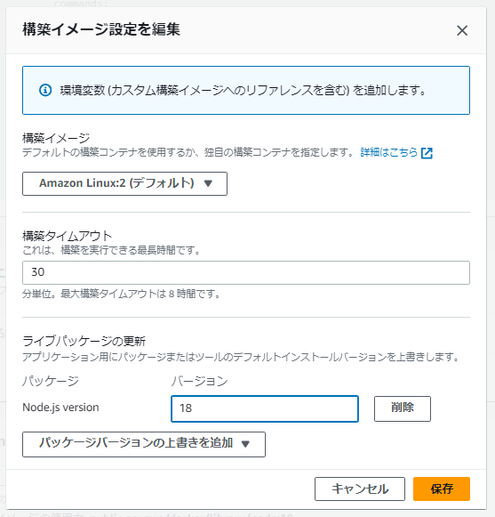
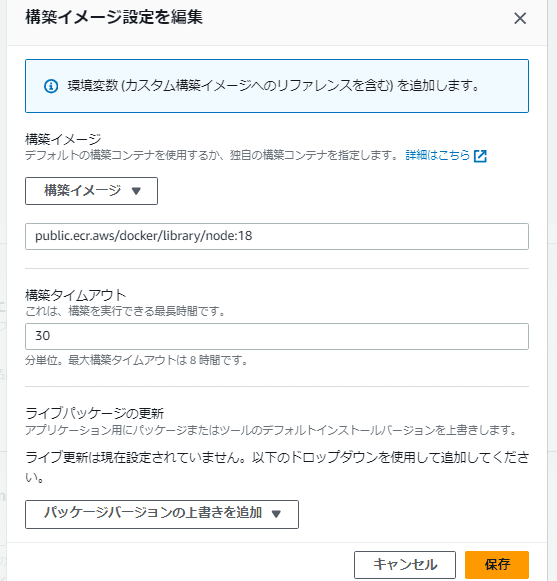

こんにちは、 kenzauros です。

Next.js 14 のリリースでは、Node.js のバージョン要件が 18.17 に更新されました。この変更は、AWS Amplify Hosting を使用して Next.js アプリケーションをホストする際に重要な影響があります。

本記事では、この課題を解決し、**Next.js 14 の SSR (Server-Side Rendering)** を Amplify Hosting でホストする方法について詳しく解説します。

## Next.js 14 と Node.js のバージョン要件

Next.js 14 は、開発者にとって多くの改善点をもたらしましたが、 **Node.js のバージョン要件が 18.17 に上がった** ことが大きな変化です。

- [Next.js 14 のリリースノート](https://nextjs.org/blog/next-14)

この要件変更は、 Node.js の安定版との整合性を高めるための措置ですが、AWS Amplify Hosting の既定の環境には影響を与えます。

## AWS Amplify Hosting の Node.js バージョン問題

AWS Amplify Hosting は、Amazon Linux 2 ベースの構築イメージを使用していますが、この構築イメージは Node.js 17 までしかサポートしていません。

構築イメージの設定（パッケージバージョンの上書き）で、Node.js のバージョンを指定できますが、 Node.js 18 を指定しても、 nvm でバージョンを切り替えることができません。



試しにデプロイしてみると、下記のように `GLIBC` が見つからないというエラーになり、フロントエンドのビルド（構築）フェーズで失敗します。

```
                                 # Starting phase: preBuild
2023-11-13T07:07:38.429Z [INFO]: # Executing command: npm ci
2023-11-13T07:07:38.430Z [WARNING]: node: /lib64/libm.so.6: version `GLIBC_2.27' not found (required by node)
                                    node: /lib64/libc.so.6: version `GLIBC_2.28' not found (required by node)
2023-11-13T07:07:38.430Z [ERROR]: !!! Build failed
2023-11-13T07:07:38.431Z [INFO]: Please check the supported SSR features to find if your build failure is related to an unsupported feature: https://docs.aws.amazon.com/amplify/latest/userguide/ssr-Amplify-support.html#supported-unsupported-features. You may also find this troubleshooting guide useful: https://docs.aws.amazon.com/amplify/latest/userguide/troubleshooting-ssr-deployment.html
2023-11-13T07:07:38.431Z [ERROR]: !!! Non-Zero Exit Code detected
2023-11-13T07:07:38.431Z [INFO]: # Starting environment caching...
2023-11-13T07:07:38.431Z [INFO]: # Environment caching completed
Terminating logging...
```

## 解決策： Node.js 18 カスタム構築イメージの使用

この問題の解決策として、カスタム構築イメージ **`public.ecr.aws/docker/library/node:18`** を使用します。

このイメージは Node.js 18.17 以上をサポートしており、Next.js 14 のビルドが可能です。

### 注意：Node.js 20 はまだ利用できない

なお、ECR で Amazon がホストしている Node.js のイメージは下記のページで確認できます。

- [Amazon ECR Public Gallery - Docker/library/node](https://gallery.ecr.aws/docker/library/node)

Node.js 20 以降のイメージも公開されていますが、現時点では AWS Amplify Hosting で利用できません。

正確には、ビルドはできるのですが、下記のようにデプロイで失敗します。

```
2023-11-13T07:48:46 [INFO]: Beginning deployment for application d2bh3gn63b****, branch:hogehoge, buildId 0000000005
2023-11-13T07:48:47 [INFO]: Got archive: 455078 bytes
2023-11-13T07:48:47 [ERROR]: {"message":"Unsupported Node.js version: v20.9.0. Try re-building the App with a supported Node.js version.","code":"UnsupportedRuntime"}
```

## Amplify コンソールでの設定方法

Amplify コンソールでカスタム構築イメージを設定する手順は以下の通りです。

1. **Amplify プロジェクトの設定**: Amplify コンソールにログインし、対象のプロジェクトを開きます。
2. **ビルド設定の編集**: プロジェクトの設定ページで、「ビルド設定」セクションを開きます。
3. **カスタムイメージの指定**: `Build image settings` の中で、`構築イメージ` オプションを選び、`public.ecr.aws/docker/library/node:18` を指定します。
4. **保存してビルド**: 設定を保存し、ビルドを再開します。



この設定により、Next.js 14 のビルドが Node.js 18.17 以上の環境で行われ、SSR 機能も正常に動作しました。

### 注意：Server Component の動作には未対応

Next.js 14 の App Router では Server Components を利用してサーバー側で API リクエストなどの処理が行えます。ただし、この機能は AWS Amplify Hosting ではまだサポートされていないようです。実際にデプロイしてアクセスすると、下記のようなエラーが発生します。

```
Application error: a server-side exception has occurred (see the server logs for more information).
Digest: 193452068
```

ログを見ろとありますが、ログは生成されていませんでした。

## まとめ

Next.js 14 を AWS Amplify Hosting でホストする場合は、Node.js のバージョン要件に注意が必要です。カスタム構築イメージを使用することで、Node.js のバージョン問題を解決できました。ただし、 Next.js の全機能を利用するには、まだまだ課題が残っています。

フルに Next.js を活用するには、AWS Amplify Hosting ではなく、素直に Vercel を利用するのが良いでしょう😂

この記事が、Next.js 14 を AWS Amplify Hosting でスムーズにデプロイするための一助となれば幸いです。

- [Next.js 14 のリリースノート](https://nextjs.org/blog/next-14)
- [AWS Amplify Hosting の Node.js バージョンに関する議論 - github.com/aws-amplify](https://github.com/aws-amplify/amplify-hosting/issues/3779)
