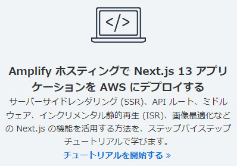
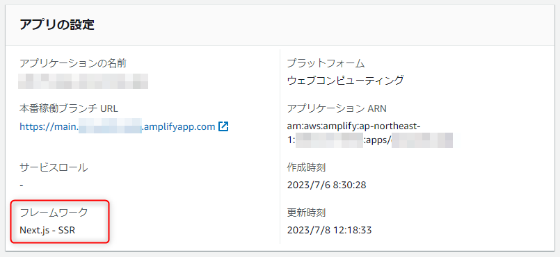
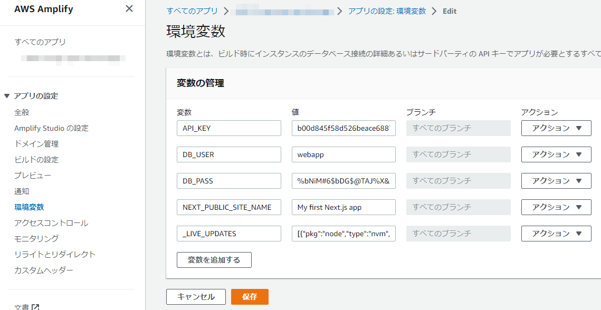

AWS が提供するホスティングサービスである **[Amplify Hosting](https://aws.amazon.com/jp/amplify/hosting/) では Next.js の SSR モードに対応**しており、とても簡単にアプリケーションをホストできます。



さて、今回は **Amplify Hosting で設定した環境変数を Next.js アプリの環境変数に流し込む**方法を紹介します。

## 前提

まず、 Next.js アプリの中で下記のような環境変数を使用しているとします。たとえば API キーやデータベースのアカウント情報、サイト名などです。

```js:title=環境変数をNext.jsのスクリプト内で使っている場合
// サーバー側のみで使う環境変数
const API_KEY = process.env.API_KEY || "";
const DB_USER = process.env.DB_USER || "";
const DB_PASS = process.env.DB_PASS || "";
// ブラウザー側でも使う環境変数
const SITE_NAME = process.env.NEXT_PUBLIC_SITE_NAME || "";
```

ローカル環境であれば、 `.env.local` などを配置して下記のように書いておけば OK ですね。

```:title=.env.local
API_KEY=63ffbb5cb2d9b756c19cdd1830f87c37
DB_USER=webapp_local
DB_PASS=dsuEKvA5Agzx87c3kO0052q0Pqw2JV
NEXT_PUBLIC_SITE_NAME=My first Next.js app (local)
```

以後は Amplify で Next.js アプリが SSR モードで設定済みであることを前提とします。




## Amplify Hosting で環境変数を設定する

まず、 Amplify の管理コンソールから環境変数を設定します。



これで👌、と思いきや、これだけでは Next.js アプリから環境変数を参照できません。

Amplify の環境変数には、アプリでは不要なシークレットなどが含まれる場合もあるため、直接は参照できない仕様になっています😲

> However, a Next.js server component doesn't have access to those environment variables by default.
> 
> 既定では Next.js サーバーコンポーネントはこれらの環境変数にアクセスできません。
> <cite>[Making environment variables accessible to server-side runtimes - AWS Amplify Hosting](https://docs.aws.amazon.com/amplify/latest/userguide/ssr-environment-variables.html)</cite>

ということで別のアプローチをとる必要があります。


## Amplify の環境変数を .env.production に書き出す

実は同じ公式ガイドに解決法も書いてあります。

> you can modify the Amplify build specification file to set them in the environment files that Next.js recognizes.
> 
> Next.js が認識できる環境ファイルにこれらの環境変数をセットするように Amplify のビルド設定を変更しましょう。
> <cite>[Making environment variables accessible to server-side runtimes - AWS Amplify Hosting](https://docs.aws.amazon.com/amplify/latest/userguide/ssr-environment-variables.html)</cite>

というわけで、Amplify console の「ビルドの設定」からビルド設定の管理ファイルである `amplify.yml` を変更します。

`applications[0].frontend.phases.build.commands` に **`env | grep -e 環境変数 >> .env.production` のような形式でコマンドを追加**します。

```yaml:title=amplify.yml
version: 1
applications:
  - frontend:
      phases:
        preBuild:
          commands:
            - npm ci
        build:
          commands:
            - env | grep -e API_KEY >> .env.production 👈ここ
            - env | grep -e DB_ >> .env.production 👈ここ
            - env | grep -e NEXT_PUBLIC_ >> .env.production 👈ここ
            - npm run build
      artifacts:
        baseDirectory: .next
        files:
          - '**/*'
      cache:
        paths:
          - node_modules/**/*
    appRoot: app
```


**`env` コマンドで環境変数を表示させ、 `grep` で必要なキーを含む行のみに絞って `.env.production` に書き出す**わけです。

実際はすべての環境変数を入れてしまってもあまり問題はないのですが、先述の通りセキュリティ上の問題もありますので、キーを指定するのが無難です👌

この設定でビルド時には下記のような `.env.production` が生成されます。

```:title=.env.production
API_KEY=b00d845f58d526beace6887b84359d9e
DB_USER=webapp
DB_PASS=%bNiM#6$bDG$@TAJ%X&w@6PTL9FrDP
NEXT_PUBLIC_SITE_NAME=My first Next.js app
```

これで Next.js アプリから環境変数が参照できるようになりました👏

ブラウザー側でも `NEXT_PUBLIC_` のついた環境変数にはアクセスできるようになります。


## 環境変数を直接 .env.production に書き出す

Amplify の環境変数を介さなくとも、たとえば `echo DB_USER=webapp >> .env.production` のように直接コマンドに書く手もあります。

この場合は、本番やステージングなど環境に応じて切り替えることができなくなりますので、環境によって切り替える可能性がある変数は Amplify の環境変数を利用したほうが便利でしょう。

