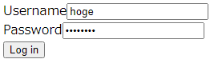
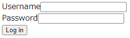
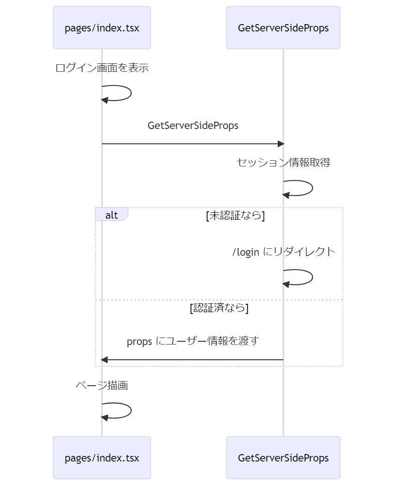
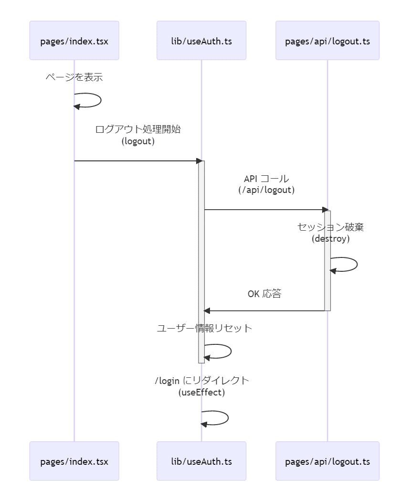

こんにちは、 kenzauros です。

**Next.js でユーザー認証**といえば、 [NextAuth.js](https://next-auth.js.org/) がメジャーどころで、私もいくつか記事を書いています。

- [タグ NextAuth.js の記事一覧 | MSeeeeN](https://mseeeen.msen.jp/tags/next-auth-js/)

外部の認証プロバイダーを使う場合などは特に便利ですし、 [CredentialsProvider](https://next-auth.js.org/configuration/providers/credentials) を実装すれば独自の認証を組み込むこともできます。

ただ「独自の認証」だけでいい場合は少し充実しすぎな感もあります。そこで今回は公式の "Authentication" で紹介されている **[iron-session を用いた方法](https://github.com/vercel/next.js/tree/canary/examples/with-iron-session)** を試してみました。

- [Authentication | Next.js](https://nextjs.org/docs/authentication)
- [next.js/examples/with-iron-session at canary · vercel/next.js](https://github.com/vercel/next.js/tree/canary/examples/with-iron-session)

ちなみに公式でも下記のような使い分けがおすすめされています。

> If you want a low-level, encrypted, and stateless session utility use iron-session.
> 
> 低レベルで暗号化されていてステートレスなセッションなら iron-session
> 
> If you want a full-featured authentication system with built-in providers (Google, Facebook, GitHub…), JWT, JWE, email/password, magic links and more… use next-auth.
> 
> マッチョな機能が全部入りな認証システムをお求めなら next-auth
> 
> <cite>[Authentication | Next.js](https://nextjs.org/docs/authentication#bring-your-own-database)</cite>

## iron-session について

[iron-session](https://github.com/vvo/iron-session) はセッションベースのセッション管理ユーティリティーです。

- [vvo/iron-session: 🛠 Next.js stateless session utility using signed and encrypted cookies to store data. Also works with Express, and Node.js HTTP servers](https://github.com/vvo/iron-session)

下記のような特徴があります。

- **Cookie をセキュアに保つことができる**
    - HttpOnly, HTTPS のみにできる
    - 暗号化され、サーバー側でのみデコード可能
- **ステートレス**
    - セッション ID なし
    - サーバー側でセッション情報管理の必要なし

ステートレスな認可という意味では JWT を用いる方法も一般的ですが、 SPA でない Next.js の場合はセッションを使った認可のほうがわかりやすいかもしれません。

*デメリットとしてはクライアント側の Cookie にセッション情報が記録されているため、サーバー側からセッションを無効化する方法がない*ことでしょうか。

## 環境

- Ubuntu 20.02 (Windows 11 Pro WSL2)
- Node.js 18.12.1
- React.js 18.0.27
- Next.js 13.1.2

※ 現時点で Next.js の [app Directory](https://nextjs.org/blog/next-13#new-app-directory-beta) は beta のため使用していません。

## 概要

今回のデモアプリは下記のリポジトリにありますので、参照してください。

- [kenzauros/nextjs-13-custom-auth-with-iron-session: Next.js Custom Auth with iron-session](https://github.com/kenzauros/nextjs-13-custom-auth-with-iron-session)

ベースは冒頭に紹介した公式サンプルです。

- [next.js/examples/with-iron-session at canary · vercel/next.js](https://github.com/vercel/next.js/tree/canary/examples/with-iron-session)

いくらか使いにくい部分があったり、不足している部分があったので、追加・修正しています。

なお、今回はボイラープレートとして使えるよう、認証ロジックをダミーにしています。認証のカスタムロジックは [`lib/database.ts`](https://github.com/kenzauros/nextjs-13-custom-auth-with-iron-session/blob/main/lib/database.ts) の `tryLogin` を用途に応じて実装することでカスタムできますが、もちろんまったく別の方法で実装しても問題ありません。

## ファイル構成

リポジトリのファイル構成は下記のように最小限の構成になっています。

```:title=ファイル構成
.
├── lib
│   ├── database.ts
│   ├── fetchJson.ts
│   ├── session.ts
│   └── useAuth.ts
├── pages
│   ├── api
│   │   ├── login.ts
│   │   ├── logout.ts
│   │   └── user.ts
│   ├── _app.tsx
│   ├── _document.tsx
│   ├── index.tsx
│   └── login.tsx
├── next.config.js
├── package-lock.json
├── package.json
└── tsconfig.json
```

簡単に各ファイルを説明します。

- `lib`
    - `database.ts`<br>認証のためのダミー関数 `tryLogin` を含んでいます。本来は認証のカスタムロジックを実装しますが、関数はダミーでユーザー名 `hoge`、パスワード `hogehoge` の場合のみログインできるようになっています。
    - `fetchJson.ts`<br>`fetch` のラッパーです。サンプルのものをベースに、ヘッダー指定などを内部で行うよう改良しています。
    - `session.ts`<br>iron-session の設定とセッションの型定義、 Next.js の `getServerSideProps` を生成するための関数を含んでいます。
    - `useAuth.ts`<br>ページで使用する React Hooks です。ログイン中のユーザー情報などのほか、フロントエンドから呼び出すログイン・ログアウト関数を提供します。
- `pages`
  - `api`: API はいずれも `lib/useAuth.ts` から呼び出します。
    - `login.ts`: ログイン API です。
    - `logout.ts`: ログアウト API です。
    - `user.ts`: セッション情報からユーザー情報を返す API です。
  - `_app.tsx`<br>ユーザー情報の管理に [SWR](https://swr.vercel.app/ja) を利用しているため、基本設定をここの `SWRConfig` で行っています。
  - `index.tsx`<br>ログイン後に表示されるトップページです。
  - `login.tsx`<br>ログイン画面です。

## 実行

`npm run dev` で実行すると http://localhost:3000/login でログイン画面が表示されます。

ユーザー名 `hoge`、パスワード `hogehoge` でログインできます。



ユーザー名かパスワードを間違うとログインに失敗し、 Authentication failed が表示されます。


ログインすると `/` にリダイレクトされます。ログイン中のユーザー名とログアウトボタンが表示されます。


ログアウトボタンをクリックするとログアウトしてログイン画面にリダイレクトされます。



## 大まかな処理の流れ

### ログイン処理

ログインは下記のような流れになります。


<!--
sequenceDiagram
    participant pages as pages/login.tsx
    participant useAuth as lib/useAuth.ts
    participant api as pages/api/login.ts
    participant db as lib/database.ts
    
    pages->>pages: ログイン画面を表示
    pages->>+useAuth: ログイン処理開始<br>(login)
    useAuth->>+api: API コール<br>(/api/login)
    api->>+db: 認証処理<br>(tryLogin)
    db->>-api: ユーザー情報
    api->>api: セッションにユーザー情報を保存<br>(save)
    api->>-useAuth: ユーザー情報
    useAuth->>-useAuth: ユーザー情報を保持
    useAuth->>useAuth: / にリダイレクト<br>(useEffect)
-->

### ページ表示

ページ表示時の**サーバーサイド (SSR) の処理**は下記のようになります。



<!--
sequenceDiagram
    participant pages as pages/index.tsx
    participant GetServerSideProps
    
    pages->>pages: ログイン画面を表示
    pages->>GetServerSideProps: GetServerSideProps
    GetServerSideProps->>GetServerSideProps: セッション情報取得
    alt 未認証なら
        GetServerSideProps->>GetServerSideProps: /login にリダイレクト
    else 認証済なら
        GetServerSideProps->>pages: props にユーザー情報を渡す
    end
    pages->>pages: ページ描画
-->

SG (Static Generation) でフロントエンド側からユーザー情報が必要な場合は **API Route の `/api/user` から SWR で取得したユーザー情報**を利用します。 [`useAuth` の `user`](https://github.com/kenzauros/nextjs-13-custom-auth-with-iron-session/blob/main/lib/useAuth.ts#L11) を参照します。


<!--
sequenceDiagram
    participant pages as pages/index.tsx
    participant useAuth as lib/useAuth.ts
    participant api as pages/api/user.ts

    pages->>useAuth: Hooks
    useAuth->>+api: ユーザー情報取得<br>(/api/user) by SWR
    api->>-useAuth: ユーザー情報
    useAuth->>pages: ユーザー情報
-->

### ログアウト処理

**ログアウト**はデータベースリクエストがないだけで、ログインとほぼ同様の流れです。 API 内でセッションを破棄すれば完了です。



<!--
sequenceDiagram
    participant pages as pages/index.tsx
    participant useAuth as lib/useAuth.ts
    participant api as pages/api/logout.ts
    
    pages->>pages: ページを表示
    pages->>+useAuth: ログアウト処理開始<br>(logout)
    useAuth->>+api: API コール<br>(/api/logout)
    api->>api: セッション破棄<br>(destroy)
    api->>-useAuth: OK 応答
    useAuth->>-useAuth: ユーザー情報リセット
    useAuth->>useAuth: /login にリダイレクト<br>(useEffect)
-->

## その他のページの実装

### API

API Route の場合、通常通り `pages/api` 以下にハンドラー設定した ApiRoute を配置します。

iron-session がもつ **`withIronSessionApiRoute`** でラップすれば、 `req.session` でユーザー情報を含むセッション情報を参照できます。

[/api/user](https://github.com/kenzauros/nextjs-13-custom-auth-with-iron-session/blob/main/pages/api/user.ts) を参考にするとよいでしょう。

### ページ

こちらも Next.js のお作法通り、 `pages` 以下に `tsx` ファイルを配置すれば OK です。

こちらは **`lib/session` で定義している `withUserSessionSsr`** を使うことで未認証時のリダイレクトを書かなくてよくなります。

```ts:title=getServerSidePropsの生成
export const getServerSideProps = withUserSessionSsr("/login");
```

SSR でサーバーサイドの処理が必要な場合は第2引数にハンドラー関数を設定します。セッション情報は `req.session` から参照できます。

```ts:title=追加のハンドラーを指定してgetServerSidePropsを生成
export const getServerSideProps = withUserSessionSsr("/login", (({ req, res }) => {
  const user = req.session.user;
  // なんらかの処理
  return {
    props: {
      user,
    },
  };
}));
```

## まとめ

今回は Next.js で NextAuth.js を使わず、 API Routes と iron-session を使ってカスタムの認証を実装する方法を紹介しました。

認証部分は用途に応じて実装が必要ですが、ボイラープレートとして使えると思います。

どなたかのお役に立てば幸いです。
