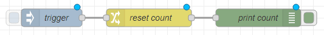
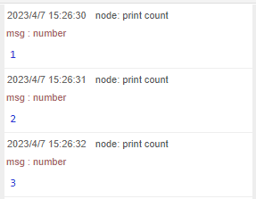

こんにちは、 kenzauros です。

**Node-RED** では基本的にフローが分散して実行されるため、カウンターのようなプログラムチックなことを考える必要はありません。

ただ、バッチ処理のようにデータを順次ループして処理したいこともあります。

そういう場合は**フローコンテキストかグローバルコンテキストに値を保持させる**のがいいでしょう。今回は `change` ノードを使ってループ変数のような値を簡単にインクリメントする方法を紹介します。


## フローコンテキストとグローバルコンテキスト

Node-RED にはメッセージやノードを横断して使える変数の器として、**フローコンテキスト (Flow context)** と **グローバルコンテキスト (Global context)** があります。

フローコンテキストの変数は**同じフロー内**で参照でき、グローバルコンテキストの変数は **Node-RED 全体**で参照できます。

- [Working with context : Node-RED](https://nodered.org/docs/user-guide/context)

フローを流れるメッセージ `msg` だけでなく、こういったコンテキストの変数を使うことで複雑な処理を行えます。

また、巨大なデータを `msg` に格納したままフローを流すと動作が重くなってしまうことがあるので、フローコンテキストに逃しておく、というような使い方もあります。

以下、フローコンテキストの変数を「フロー変数」、グローバルコンテキストの変数を「グローバル変数」と呼ぶことにします。


### フロー変数を使ってみる

とりあえず `inject` ノード、 `change` ノード、 `debug` ノードを下記のように配置・接続します。



`inject` ノードは特に設定不要です。

フロー変数を初期化するため、 `change` ノードの **`msg.` を `flow.`** に変更して変数名を入力します。ここでは変数名に `count`、値には数値の 0 を設定します。


次に `debug` ノードでこのフロー変数を表示するようにしましょう。「対象」のドロップダウンで **JSONata 式**を選び **`$flowContext('count')`** と入力します。


Node-RED の JSONata 機能には **`$flowContext` 関数**が用意されており、ここに変数名を渡すことで、フローコンテキストから変数値を取得できます。JSONata 式の詳細は割愛しますので、公式ページ等を参照してください。

- [JSONata](https://jsonata.org/)
- [メッセージを利用する : Node-RED日本ユーザ会](https://nodered.jp/docs/user-guide/messages#%E3%83%A1%E3%83%83%E3%82%BB%E3%83%BC%E3%82%B8%E3%83%97%E3%83%AD%E3%83%91%E3%83%86%E3%82%A3%E3%82%92%E5%A4%89%E6%9B%B4%E3%81%99%E3%82%8B)

この状態でデプロイして、 `inject` ノードをクリックするとデバッグウィンドウに `0` が表示されるはずです。


### フロー変数をインクリメントする

さて、これだけではあまり意味がないので、この `count` フロー変数を操作してみましょう。

実際の処理で使いそうなループを模擬したフローにしてみます。フローに `delay` ノードと `change` ノードを追加します。


`delay` ノードが実際の処理を模擬したノードだと思ってください。遅延時間は適当に設定します（ここでは 1 秒にしました）。

次に、追加した `change` ノードで `count` フロー変数をインクリメントするようにしてみます。

初期化時と同じく `flow.count` を指定します。「対象の値」は **`$flowContext('count') + 1`** とします。


これでフロー変数の `count` に `+ 1` したものをフロー変数の `count` に代入するので、要するに `flow.count` をインクリメントすることになります。

プログラム言語で言えば `flow.count = flow.count + 1` と書いて **`flow.count++`** をしているイメージですね。

この状態でデプロイして、 `inject` ノードをクリックしてみましょう。1秒に1回、カウントアップされた `count` が表示されていけば成功です。




### グローバル変数を使う

グローバル変数の場合は `change` ノードなどで `flow.` でなく、 **`global.`** を選択します。

また、 JSONata 式で使用する場合は `$globalContext('count')` のように書きます。

ただ、グローバルコンテキストだと、影響範囲が広いので、極力フローコンテキストにとどめておくのがよいと思います。


### function ノードでフロー/グローバル変数にアクセスする

もちろん凝ったことをするときは `function` ノードでもフロー/グローバルコンテキストにアクセスできます。

こちらは下記のようにシンプルです。

```js:title=フロー変数を取得
const count = flow.get("count");
```

```js:title=フロー変数を設定
flow.set("count", 123)
```

## まとめ

今回の例（簡単なカウンター変数）であれば、 `msg` に格納してままインクリメントしていっても問題ないと思います。

ただ、処理対象のデータセットが大きい場合などは、データセットとカウンターを合わせてフローコンテキストに置いておくことで、処理を軽くできることがあります。

すぐ忘れてしまうので、最後にフローコンテキストとグローバルコンテキストの使い方をまとめておきます。

　 | フロー | グローバル
-- | -- | --
`change` ノードなど | `flow.変数名` | `global.変数名`
JSONata 式 | `$flowContext('変数名')` | `$globalContext('変数名')`
function ノード | `flow.get("変数名")`<br>`flow.set("変数名", 値)` | `global.get("変数名")`<br>`global.set("変数名", 値)`


どなたかのお役に立てば幸いです。

### 参考

- [Working with context : Node-RED](https://nodered.org/docs/user-guide/context)
- [Storing data | Writing Functions : Node-RED](https://nodered.org/docs/user-guide/writing-functions#storing-data)
