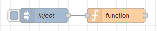
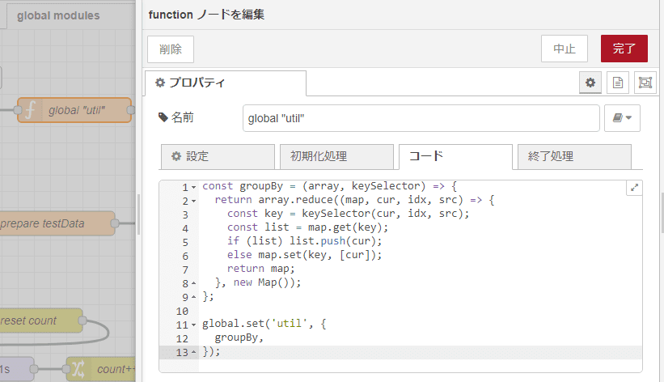
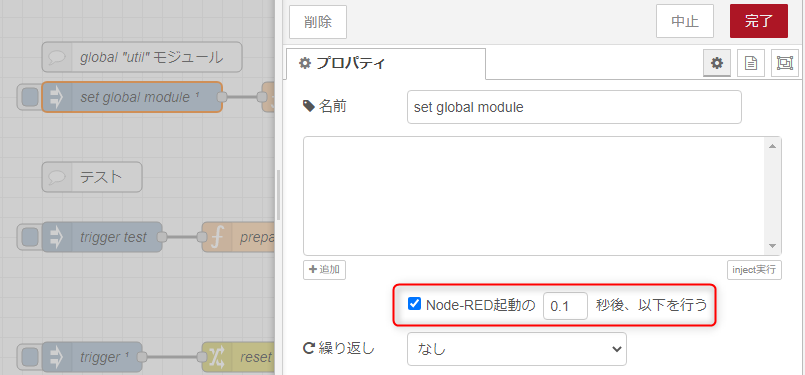

こんにちは、 kenzauros です。

**Node-RED** は、フローベースのプログラミングツールであり、ノードをつなげることでフローを作成できます。

Node-RED では、基本的にはいろんな機能をもった「ノード」を組み合わせて処理を定義しますが、少し凝った処理をするときは `function` ノードを使います。

この記事では、**Node-RED で共通関数を定義して、 `function` ノードで使用する方法**について説明します。


## function ノードでの共通関数

**`function` ノードは JavaScript を使って処理を記述できる**ため、「なんでもあり」になります。Node-RED ではソースコード管理がしづらく、デバッグも容易ではありませんので、多用は避けるべきですが、使わざるを得ないときもあります。

フローが増えてくると、複数の `function` ノードで同じ処理を何度も記述している場合がでてきます。この場合、1つを修正したときに他のノードの修正が漏れてしまう懸念があります。

というわけで、一般的なプログラミングと同じく、共通した処理は共通関数にくくりだすのがよいと思います。

今回は**グローバルコンテキストを利用して共通関数をグローバル関数として利用**することにします。

### 補足：npm パッケージの利用

なお、 Node-RED は Node.js で動いているため、外部の npm パッケージも利用できます。たいていの機能は車輪の再発明をするより、既存のパッケージを利用するほうがいいでしょう。

Node-RED v1.3.0 以降は、設定で有効化されていれば、 `function` ノードの「設定」に指定するだけで、デプロイ時に npm パッケージがインストールされ、利用できるようになります。こちらについては公式ページを参照してください。

- [functionExternalModules オプションを使う - Functionノードの書き方 : Node-RED日本ユーザ会](https://nodered.jp/docs/user-guide/writing-functions#functionexternalmodules-%E3%82%AA%E3%83%97%E3%82%B7%E3%83%A7%E3%83%B3%E3%82%92%E4%BD%BF%E3%81%86)


### 補足：グローバルコンテキストとは

**グローバルコンテキスト**は、 Node-RED 内のどこからでもアクセスできる器のようなものです。

グローバルコンテキストを使用することで、複数のフローにまたがって使用するような、いわゆるグローバル変数を管理できます。
ただし、通常のプログラムと同様に*グローバル変数の使いすぎは、保守性の低下、バグの増加を招きます*ので、必要最低限にしましょう。

このグローバルコンテキストに「関数」を入れておけば、いわゆる「グローバル関数」として利用できるというわけです。汎用性の高い処理がある場合や同じ処理を複数の場所で実行する必要がある場合などに便利です。


## お手軽グローバル関数の定義方法

グローバル関数を定義するには、基本的には `inject` ノードと `function` ノードの2つを使用します。




### `function` ノードの設定

まず、グローバル関数を定義するために、 `function` ノードをフローに追加します。

`function` ノードをダブルクリックして、JavaScript でグローバル関数にしたいコードを記述します。

```js:title=グローバル関数を設定するfunctionノード
const groupBy = (array, keySelector) => {
  return array.reduce((map, cur, idx, src) => {
    const key = keySelector(cur, idx, src);
    const list = map.get(key);
    if (list) list.push(cur);
    else map.set(key, [cur]);
    return map;
  }, new Map());
};

// グローバルコンテキストに util を設定
global.set('util', {
  groupBy,
});
```



ここではグローバルコンテキストの `util` というオブジェクトを定義し、配列をグルーピングする `groupBy` 関数を追加してみました。このようにグローバルコンテキストに直接関数を追加するのではなく、モジュール的なオブジェクトを1つ用意するとよいでしょう。

これで**他のノードから `global.util.groupBy` で呼び出せる**ようになるはずです。


### `inject` ノードの設定

次に、この `function` ノードを実行する **`inject` ノード**を追加し、 `function` ノードと接続します。



このとき、「**Node-RED起動の 0.1 秒後、以下を行う**」にチェックを入れ、起動直後、もしくはデプロイ直後にこの `inject` ノードが実行されるようにします。

### デプロイ

ここまできたら後はデプロイするだけです。


`inject` ノードが実行され、 `function` ノードによって `global.util` が設定されるはずです。


### グローバル関数を使ってみる

他の `function` ノードからは下記のように `global.util.groupBy` を直接参照して呼び出せます。

```js:title=グローバル関数を直接呼び出す例
const grouped = global.util.groupBy(array);
```

何度か使用する場合は、下記のように分割代入 (Destructuring assignment) で関数を取り出して使うとよいでしょう。

```js:title=グローバル関数を分割代入して関数を呼び出す例
const { groupBy } = global.util;

const grouped = groupBy(array);
```


## まとめ

この記事では、**Node-RED で共通関数を定義して、 `function` ノードで使用する方法**について説明しました。

前述の通り、利用できる npm パッケージがある場合は、そちらを利用するほうがよいでしょう。

独自の共通処理などを手軽に定義するときは今回の方法が役にたつと思います。

どなたかのお役に立てば幸いです。
