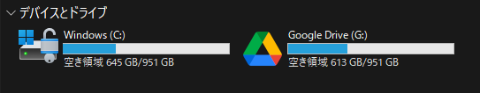
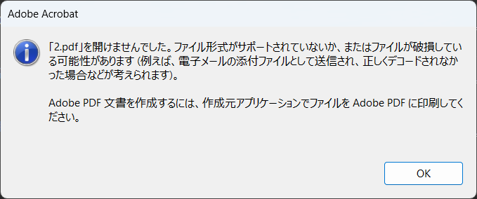

こんにちは、 kenzauros です。

**Cloudflare Zero Trust** で Windows の Google Drive や Git を使う際に発生する証明書の問題を解決する方法を紹介します。基本的には各ツールが参照する証明書に Cloudflare の証明書を追加することで解決します。

なお、説明が不要な方は [一括設定用 PowerShell スクリプト](#一括設定用-powershell-スクリプト) をご利用いただくと便利です。

## はじめに

**Cloudflare Zero Trust** は、クラウドサービスで Zero Trust セキュリティの恩恵を享受しながら、伝統的な VPN のような使い方もできるソリューションです。 50 ユーザーまでなら無料という、この規模の運営会社だからこそできる太っ腹なフリープランも提供しています。

ログの保存期間が極めて短い（24時間）という制限はあるもの、その他に大きな制約はなく、小規模なチームにとっては大変ありがたいソリューションです。

- [Cloudflare ゼロトラスト製品 | ハイブリッドワークを保護 | Cloudflare](https://www.cloudflare.com/ja-jp/zero-trust/)

ただ、高レイヤーなプロキシとして介在する都合上、どうしても接続先や使用ツールによっては、不具合や制限が発生することがあります。

エラーに `issuer certificate` みたいな表現がでてきたら、ほぼ間違いなくこの記事で扱っている問題だと思われます。

今回はクライアント端末が *Windows* の場合で、以下のサービス・アプリケーションについて、 Cloudflare Zero Trust による証明書の問題を解決する方法を紹介します。

* Google Drive (File Stream)
* Git for Windows
* Node.js
* winget (Windows パッケージマネージャー)

なお、本記事は *Cloudflare Zero Trust を使用している方にのみ関係*する内容です。WARP クライアントを WARP モードで使用している場合には、関係ありません。

## エラーの原因

Cloudflare Zero Trust は、証明書の検証を厳密に行うため、証明書の発行元（issuer）が信頼されていない場合、接続エラーが発生します。

Windows では、証明書の信頼性を確認するために、*信頼されたルート証明書ストア（Trusted Root Certification Authorities）* に登録されている証明書を使用します。

ただ、一部のアプリケーションは、Windows の証明書ストアの証明書を使用せず、独自の証明書ストアを使用しているため、Cloudflare の証明書が信頼されていないとエラーになります。

### Windows (OS) への証明書のインストール

本記事では Windows 自身の証明書ストアに証明書を追加する方法は紹介しません。
*Zero Trust の設定で WARP からのインストールが有効になっている場合、自動的にインストールされているはずです。*

手動で Windows の証明書ストアに証明書を追加する方法は、以下の公式ドキュメントの [Add the certificate to operating systems] - [Windows] の項を参照してください。

- [Windows​​ - Install certificate manually · Cloudflare Zero Trust docs](https://developers.cloudflare.com/cloudflare-one/connections/connect-devices/warp/user-side-certificates/install-cloudflare-cert/#windows)


## 解決方法

### PowerShell を管理者モードで開く

各ツールへの証明書追加の操作には管理者権限が必要なため、**PowerShell を管理者モードで開きます**。

以下、変数を使い回すため、 PowerShell を閉じず、同じセッションで操作してください。

### 事前確認

OS に証明書がインストールされている場合は、`C:\ProgramData\Cloudflare\installed_cert.pem` が存在しているはずです。


このファイルが存在するか確認します。

```powershell:title=PowerShell
$cf_cert = "C:\ProgramData\Cloudflare\installed_cert.pem"
Test-Path "$cf_cert"
```

`True` が返ってきたら、証明書がインストールされているため、次の手順に進みます。

インストールされていない場合は「Windows (OS) への証明書のインストール」の項を参照してください。

### Google Drive (File Stream)

Windows 版 Google Drive (File Stream) は、Google Drive のファイルをローカルに Windows のドライブとしてマウントするためのアプリケーションです。



Zero Trust に接続した状態だと、 Google Drive のファイルを開く際に、ファイルがダウンロードできず、以下のようなエラーが表示される場合があります。



Google Drive File Stream の証明書設定の大まかな流れは以下の通りです。

1. Google Drive File Stream が使用する証明書位置の特定
2. Google Drive File Stream の証明書をコピー
3. Cloudflare の証明書をコピーした証明書に追加
4. Google Drive File Stream でコピーした証明書を使用するようレジストリを設定
5. Google Drive File Stream を再起動

概要は Cloudflare Zero Trust のドキュメントにも掲載されています。

- [​​Google Drive for desktop - Install certificate manually · Cloudflare Zero Trust docs](https://developers.cloudflare.com/cloudflare-one/connections/connect-devices/warp/user-side-certificates/install-cloudflare-cert/#google-drive-for-desktop)

#### Google Drive File Stream が使用する証明書位置の特定

*Google Drive File Stream が使用する証明書は、インストールディレクトリに配置*されています。

ただし、**Google Drive File Stream のインストールディレクトリは、バージョンによって異なる**ため、最新バージョンの証明書を特定する必要があります。

以下の PowerShell スクリプトを使用して、Google Drive File Stream の証明書の位置を特定します。

```powershell:title=PowerShell
$gdfs_app_root = "C:\Program Files\Google\Drive File Stream"
$gdfs_cert = Get-ChildItem -Directory -Path "${gdfs_app_root}" | Where-Object { $_.Name -match '^\d+(\.\d+)*$' } | Sort-Object { [version]$_.Name } -Descending | Select-Object -First 1 | ForEach-Object { $_.FullName + "\config\roots.pem" }
Write-Host "Google Drive File Stream のルート証明書: ${gdfs_cert}"
```

#### Google Drive File Stream の証明書をコピー

まず、Google Drive File Stream の証明書をコピーします。

コピー先はどこでもかまいませんが、どのユーザーでも利用できるように、ここではパブリックフォルダにコピーします。

```powershell:title=PowerShell
$cert_path = "C:\Users\Public\GoogleDriveRootCerts.pem"
Copy-Item "$gdfs_cert" "$cert_path"
```

#### Cloudflare の証明書をコピーした証明書に追加

次に、Cloudflare の証明書をコピーした証明書に追加します。

```powershell:title=PowerShell
Get-Content "$cf_cert" | Add-Content "$cert_path"
```

※ `$cf_cert` は事前確認で使用した変数です。

#### Google Drive File Stream でコピーした証明書を使用するようレジストリを設定

Google Drive File Stream が使用する証明書を変更するために、レジストリを設定します。

```powershell:title=PowerShell
reg ADD "HKEY_LOCAL_MACHINE\Software\Google\DriveFS" /f /v TrustedRootCertsFile /t REG_SZ /d "$cert_path"
```

このレジストリキーの詳細については以下の公式ドキュメントの `TrustedRootCertsFile` の部分を参照してください。

- [パソコン版ドライブの高度な設定 - Google Workspace 管理者 ヘルプ](https://support.google.com/a/answer/7644837)

#### Google Drive File Stream を再起動

Google Drive File Stream を再起動します。

```powershell:title=PowerShell
Stop-Process -Name "GoogleDriveFS"
$gdfs_exe = Join-Path $gdfs_app_root "GoogleDriveFS.exe"
Start-Process -FilePath $gdfs_exe
```

これで Google Drive for Desktop が Cloudflare の証明書を追加した証明書ファイルを参照するようになったはずです。

再起動されたら、Google Drive File Stream でファイルが開けることを確認します。


### Git for Windows

Git for Windows の場合は、Git が参照している証明書ファイルに Cloudflare の証明書を追加します。

大まかな流れは以下の通りです。

1. Git for Windows が使用する証明書位置の特定
2. Cloudflare の証明書を Git for Windows の証明書に追加

#### Git for Windows が使用する証明書位置の特定

Git for Windows が使用する証明書ファイルの位置は `git config --get http.sslcainfo` コマンドで確認できます。

```powershell:title=PowerShell
$git_cert = git config --get http.sslcainfo
Write-Host "Git for Windows のルート証明書: $git_cert"
```

#### Cloudflare の証明書を Git for Windows の証明書に追加

Git for Windows が使用する証明書ファイルに Cloudflare の証明書を追加します。

```powershell:title=PowerShell
Get-Content "$cf_cert" | Add-Content "$git_cert"
```

※ `$cf_cert` は事前確認で使用した変数です。

これで Git for Windows が Cloudflare の証明書を参照できるようになります。


### Node.js

Node.js で追加の証明書を設定するには、環境変数 `NODE_EXTRA_CA_CERTS` に証明書ファイルのパスを指定します。

Windows で Node.js で使う追加の証明書を指定する環境変数 `NODE_EXTRA_CA_CERTS` を設定する場合は PowerShell で以下のようにします。

```powershell:title=PowerShell
$cf_cert = "C:\ProgramData\Cloudflare\installed_cert.pem"
[Environment]::SetEnvironmentVariable("NODE_EXTRA_CA_CERTS", $cf_cert, 'Machine')
```

環境変数は Node.js の起動時にのみ読み込まれるため、設定後はソフト (VS Code など) の再起動が必要です。


### winget (Windows パッケージマネージャー)

Windows パッケージマネージャー **winget** では、 Microsoft Store からアプリケーションをインストールする際に、「証明書のピン留め」と呼ばれる措置が適用され、Microsoft Store 証明書の有効性が検証されます。

公式の情報でも SSL 検査を通している場合、接続エラーが発生することは明言されており、対処法として **`BypassCertificatePinningForMicrosoftStore` というポリシー設定の有効化**が紹介されています。

> 企業組織が適用したグループ ポリシーでは、WinGet クライアントと Microsoft Store ソースの間にあるファイアウォールを介した SSL 検査を使っている可能性があります。この場合、WinGet クライアントで接続エラーが発生します。
>
> このため、Windows パッケージ マネージャーのデスクトップ インストーラーは "BypassCertificatePinningForMicrosoftStore" というポリシー設定をサポートしています。 このポリシーは、Microsoft Store ソースへの接続を開始するときに、Windows パッケージ マネージャーが Microsoft Store 証明書のハッシュが既知の Microsoft Store 証明書と一致することを検証するかどうかを制御します。
> <cite>- [エンタープライズ セキュリティ用 Windows パッケージ マネージャー - Windows パッケージ マネージャー | Microsoft Learn](https://learn.microsoft.com/ja-jp/windows/package-manager/#windows-package-manager-for-enterprise-security)</cite>

このポリシー設定は、その表記のとおり、**「Microsoft Store 証明書のピン留め」をバイパス（検証しない）するように構成する**ものです。

```powershell:title=PowerShell
winget settings --enable BypassCertificatePinningForMicrosoftStore
```

`管理者設定 'BypassCertificatePinningForMicrosoftStore' を有効にしました。` のように表示されれば OK です。

当然ながら Microsoft によって提供されるセキュリティ向上策をバイパスしてしまうため、ポリシーを有効化するかどうかは慎重に検討してください。

## 一括設定用 PowerShell スクリプト

ここまで1つずつ設定しましたが、マシンごとに設定するのは面倒です。

一括設定用の PowerShell スクリプトを GitHub で公開していますので、よろしければご利用ください。

- [cloudflare-zero-trust-integration/install-certs.ps1](https://github.com/mseninc/cloudflare-zero-trust-integration/blob/main/install-certs.ps1)

使い方は PowerShell を管理者モードで開いて、以下のコマンドを実行するだけです。

```powershell:title=PowerShell
cd ~
git clone https://github.com/mseninc/cloudflare-zero-trust-integration.git
cd cloudflare-zero-trust-integration
.\install-certs.ps1
```

※ Zero Trust ネットワークに接続していない状態（WARP Off の状態）で行ってください。

証明書の追加が完了したら、各ツールを再起動して、証明書の追加が正常に行われたか確認してください。

## まとめ

Windows の Google Drive や Git を使う際に発生する証明書の問題を解決する方法を紹介しました。

基本的には各ツールが参照する証明書に Cloudflare の証明書を追加することで解決します。

証明書の追加は、手動で行うこともできますが、一括設定用の PowerShell スクリプトを使用すると、簡単に証明書を追加できます。

どなたかのお役に立てれば幸いです。
