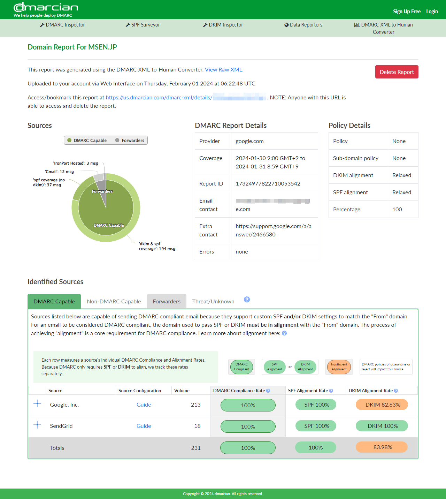

こんにちは、 kenzauros です。

今回は、DMARC のレポートを表示するアプリ **DMARCy** を作ってみたので、開発の経緯やこだわった点についてお話しします。

このアプリは https://dmarcy.msen.jp/ で公開していますので、ぜひアクセスしてみてください😝

- [DMARCy - DMARC report viewer](https://dmarcy.msen.jp/)
- [GitHub - mseninc/dmarcy: Simple DMARC Report viewer](https://github.com/mseninc/dmarcy)

## 概要

**DMARC（Domain-based Message Authentication, Reporting, and Conformance）** は、電子メールの送信者認証技術の1つです。

SPF（Sender Policy Framework）や DKIM（DomainKeys Identified Mail）と併用することで送信認証をより強固にし、なりすましなどを防ぐしくみです。
DMARC では、基本的には SPF や DKIM と組み合わせて、認証が失敗したときの振る舞いを設定します。

大きな特徴として、「*認証結果を受信者のメールプロバイダーから報告してもらうことができる*」ことが挙げられます。

設定すると、 Google や Microsoft などのメールプロバイダーから、自身のドメインから送信されたメールの認証結果（＝ **DMARC レポート**）を添付したメールが送られてきます。

しかし、この DMARC レポートは XML 形式で、人間が読むことを想定していないため、フツーの人にはワケワカメです😂

オンラインで分析してくれるサービスはいくらかあるのですが、ファイルをアップロードしないといけなかったり、とりあえず有料だったり、で気軽に試せませんでした。

そこで、DMARC レポートをちょっとわかりやすく表示するビュアーの開発を思い立ちました。

開発期間は子どもの寝かしつけ時間帯にポチポチやって1週間程度なので、トータルでは 1.5 日ぐらいでしょう😪

## 画面

DMARCy を開いたときの画面はこんな感じです。

レポートファイルを読み込ませるとこんな感じになります。親切なグラフ表示なんかはありませんが、最低限の内容はなるべくわかりやすく表示するようにしています。

日本語ローカライズはまだできていませんが、したいと思っています。

## こだわった点

### ファイルをアップロードしない

MxToolbox というサイトが公開している Dmarc Report Analyzer というツールがあるのですが、こちらはファイルをこのサービスにアップロードする必要があります。

- [DMARC Report Analyzer - DMARC Email XML Parser - MxToolbox](https://mxtoolbox.com/DmarcReportAnalyzer.aspx)

後述の dmarcian のツールも同様です。

DMARC レポートは機微な情報が含まれている可能性があるため、私自身、見ず知らずのサーバーにアップロードするのは抵抗がありました。

そのため、ブラウザー上のみでファイルを開くことにこだわりました。

### zip や gzip のまま開ける

DMARC レポートは、**zip または gzip 形式で圧縮してで送られてきます**。経験上、 Google は zip ですが、ほとんどのメールサービスは gzip (*.xml.gz) です。

いちいちファイルを展開して XML を取り出す作業も面倒なので、このアプリでは *.xml.zip や *.xml.gz をそのまま開けるようにしました。

### 無料

有料のサービスはいろいろありますが、無料のサービスは少ないです。

dmarcian が DMARC の XML を読みやすく整形してくれるサービスを無償で提供してくれています。

- [DMARC XML to Human Converter - dmarcian](https://us.dmarcian.com/xml-to-human-converter/)

こちらは概要を見やすく表示してくれるのですが、レポートの詳細を見ることはできないようです。

というわけで、今回は無料でどなたでも使えるように公開しました。

ただし、結果表示については責任は持てませんので、ご利用は自己責任でお願いします🙏

## 技術スタックなど

今回は自分が手っ取り早く開発できる **[Next.js](https://nextjs.org/)** と **[Material UI](https://mui.com/material-ui/getting-started/)** を使っています。

Next.js は最新の 14.1 で、 **App router** を使用しています。やりたいことがほぼ SPA なので、あまり Server Components は使っていませんが、 AWS Amplify の SSR モードでホストしています。

Material UI は、以前も使ったことはありますが、 Version 5 は初めてでした。

同等の UI フレームワークとしては、個人的には **Chakra UI** のほうが好きです。機能的には過不足はないのですが、コンポーネントのインターフェースがあまり好みでないのと、カラーパレットが「いかにも Material Design」なのが少し気になるところです。

ファイルの展開には下記のライブラリーを使用しています。

- Zip: [imaya/zlib.js: compact zlib, deflate, inflate, zip library in JavaScript](https://github.com/imaya/zlib.js/)
- gzip: [nodeca/pako: high speed zlib port to javascript, works in browser & node.js](https://github.com/nodeca/pako)

## まとめ

今回は DMARC レポートをわかりやすく表示するアプリを作ってみた話でした。

Google や Yahoo! が送信者要件に追加したことで一気に注目された DMARC ですが、まだまだ普及しているとは言えませんし、わかりやすい情報も少ない状況です。

このアプリが DMARC の普及とセキュアなメール運用に少しでも役立てば幸いです👍

バグや機能追加のご要望があれば [GitHub](https://github.com/mseninc/dmarcy) から Issue をお願いします。
