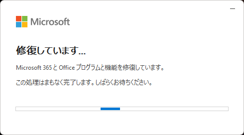
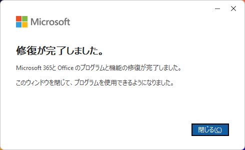
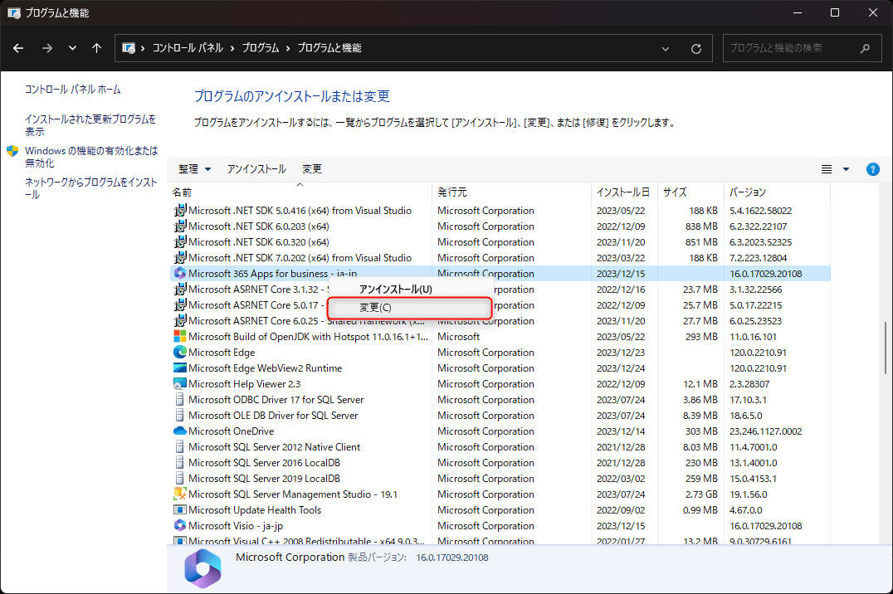

こんにちは、 kenzauros です。

Visual Basic .NET で Excel を操作するときに、タイトルにあるような面倒なエラーが発生したので、備忘録を兼ねて解決策を書いておきます。

令和にもなって `'Microsoft.Office.Interop.Excel` なんて使うなよ、なんていう野暮なツッコミはご容赦ください。

## 現象

```vb:title=VBからExcel呼び出しでエラー
Dim excelApplication As New Application
Try
    Dim workbooks As Workbooks = excelApplication.Workbooks 👈
    ' Excel 操作
    Finally
        Marshal.ReleaseComObject(workbooks)
    End Try

Finally
    excelApplication?.Quit()
    Marshal.ReleaseComObject(excelApplication)
End Try
```

`Workbooks` を `Workbooks` に代入しているところで、下記のような `InvalidCastException` が発生します。

`型 'Microsoft.Office.Interop.Excel.ApplicationClass' の COM オブジェクトをインターフェイス型 'Microsoft.Office.Interop.Excel._Application' にキャストできません。IID '{000208D5-0000-0000-C000-000000000046}' が指定されたインターフェイスの COM コンポーネント上での QueryInterface 呼び出しのときに次のエラーが発生したため、この操作に失敗しました: タイプ ライブラリ/DLL の読み込みエラーです。(HRESULT からの例外: 0x80029C4A (TYPE_E_CANTLOADLIBRARY))`

## 原因

オンライン情報によれば、複数の Office がインストールされているときに発生することが多いようです。

- [Microsoft Office アプリケーションの COM 呼び出しでエラー - Microsoft コミュニティ](https://answers.microsoft.com/ja-jp/msoffice/forum/all/microsoft-office/a7cc100b-920b-43b5-8d28-d6246a7314bf)
- [Excelに関わる操作時に「型’Microsoft.Office.Interop.～」と表示され、正常に動作しない](https://faq.kentem.jp/app/answers/detail/a_id/151/~/excel%E3%81%AB%E9%96%A2%E3%82%8F%E3%82%8B%E6%93%8D%E4%BD%9C%E6%99%82%E3%81%AB%E3%80%8C%E5%9E%8B%E2%80%99microsoft.office.interop.%EF%BD%9E%E3%80%8D%E3%81%A8%E8%A1%A8%E7%A4%BA%E3%81%95%E3%82%8C%E3%80%81%E6%AD%A3%E5%B8%B8%E3%81%AB%E5%8B%95%E4%BD%9C%E3%81%97%E3%81%AA%E3%81%84)
- [Excel出力すると「出力に失敗しました」と表示されます。 | らくらく青色申告農業版　よくあるご質問](https://aoshin.jp/faq/a000158/)

たしかに私ももともと入っていた Office 2016 を（保険のために）残したまま Office 365 をインストールしていたので、これが悪さしていたようです。

ということで、さっそく Office 2016 をアンインストールしたのですが、それでも改善しませんでした。

## 解決策

先の3つ目の記事によれば、「**Office の修復**」を行うことで解決したとのことでしたので、やってみたところ、私の場合も解決しました。

どうやらレジストリに不要な情報が残っているのが原因のようです。


### Windows の設定から Microsoft 365 Apps をクイック修復する

**[Win] + [I]** で「設定」を開き、 `アプリ` を選択します。

検索欄に **`365`** と入力します。 Microsoft 365 でインストールしている場合、ここで `Office` と入力しても出てこないので、注意してください。

Microsoft 365 Apps の右側の `･･･` をクリックし、 `変更` を選択します。


UAC（ユーザーアカウント制御）が表示されたら、 `はい` をクリックします。 `クイック修復` を選択し、 `修復` をクリックします。


クイック修復が開始されます。数分かかります。



修復が完了すると、 `修復が完了しました` と表示されます。 `閉じる` をクリックします。




### コントロールパネルから Microsoft 365 Apps をクイック修復する

コントロールパネルからも同様の操作が可能です。まず、昔ながらの「プログラムと機能」を開きます。

**[Win] + [R]** で「ファイル名を指定して実行」を開き、 `appwiz.cpl` を入力して起動するのが手っ取り早いです。


`Microsoft 365 Apps` を選択し、 `変更` をクリックします。



あとは「設定」の場合と同じです。


## まとめ

今回は VB.NET で Excel を操作するときに発生した `InvalidCastException` について、その解決策を紹介しました。

幸い **Office の修復**で解決したのでよかったですが、できればインストールされている Excel に左右されない人生を送りたいと思っています😂
