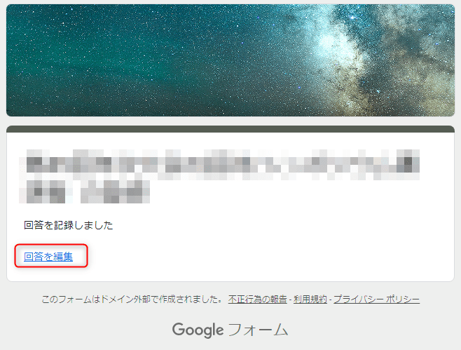
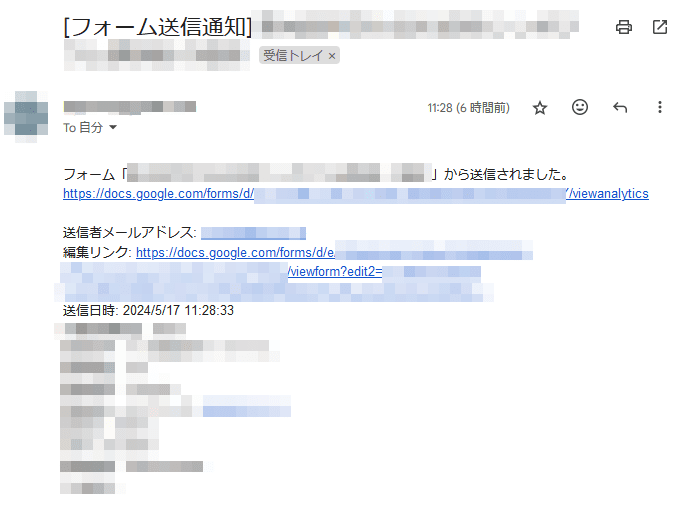

こんにちは、 kenzauros です。

今回は Google Forms で**フォーム送信時に「回答を編集」リンクを含んだ通知メールを管理者へ送信**できるようにします。

## はじめに：「回答を編集」とは

「回答を編集」を有効にしているフォームで回答を送信すると、最後のページに **「回答を編集」** リンクがあり、これをクリックすると回答を編集できます。



また、確認メールの送信を有効にしていれば、回答者へ送信された確認メールにも **「回答を編集」** リンクが表示されます。


ただ、この画面を閉じてしまったり、確認メールを削除してしまうと、**回答者は回答を編集できなくなります**。
そもそも Google Forms では、*管理者ですら回答を修正できません*ので、この「回答を編集」リンクはとても大事です。

ユーザーから「どうやって編集すればいいですか？」という質問が山ほど管理者へ飛んでくることにもなりかねません。

よって、「回答を編集」するための URL を管理者に送信しておき、ユーザーから問い合わせがあった場合にはその URL を教えることで対応できるようにしましょう、というのが目的です。

本稿では回答を編集できるように設定する方法や、トリガーの設定方法などについては触れません。
そのあたりは他に情報がたくさんあるので、 AI に聞くか適宜調べてください。

## 実装

**フォームのスクリプトエディタから設定できる「フォーム送信時」のトリガー**を利用します。


- [使用可能なトリガーのタイプ - シンプルなトリガー  |  Apps Script  |  Google for Developers](https://developers.google.com/apps-script/guides/triggers?hl=ja)

なお「フォーム送信時」のトリガーは、フォームに紐付いたスプレッドシート側でも設定できますが、イベント引数が異なり、 `Form` オブジェクトが取得しづらいため、特に理由がなければフォーム側で設定します。


### フォーム送信時のイベント引数

フォーム送信時のトリガーを設定すると、以下のようなイベント引数が渡されます。

```ts:title=フォーム送信時のトリガーのイベント引数
{
  authMode: AuthMode, // ScriptApp.AuthMode 列挙型の値
  response: FormResponse, // フォームに対するユーザーの回答が格納されたオブジェクト
  source: Form, // Form オブジェクト
  triggerUid: string, // このイベントを生成したトリガーの ID
}
```

以後、この `Form` オブジェクトや `FormResponse` オブジェクトを使用します。リファレンスは以下の URL を参照してください。

- [Class Form  |  Apps Script  |  Google for Developers](https://developers.google.com/apps-script/reference/forms/form?hl=ja)
- [Class FormResponse  |  Apps Script  |  Google for Developers](https://developers.google.com/apps-script/reference/forms/form-response?hl=ja)

ざっくり言って、 `Form` オブジェクトはフォーム全体の情報を取得するのに使い、 `FormResponse` オブジェクトはフォームの回答内容を取得するのに使います。


### スクリプトの実装

スクリプトエディタに以下のようなコードを記述します。

```js:title=フォーム送信時の通知メール送信スクリプト
/**
 * フォームが送信されたときに通知メールを送信します。
 * @param {{ source: FormApp.Form, response: FormApp.FormResponse }} e
 */
function onFormSubmit(e) {
  const form = e.source;
  const formTitle = form.getTitle();
  const response = e.response;
  const entries = getEntriesFromResponse(response);

  const to = "mail@example.com";
  const subject = `[フォーム送信通知] ${formTitle}`;
  const body = `
フォーム「${formTitle}」から送信されました。
${form.getSummaryUrl()}

${entries.map(x => x.join(': ')).join('\n')}
`;

  GmailApp.sendEmail(to, subject, body);
}

/**
 * フォーム送信時の回答オブジェクトから、メタデータ（メールアドレス、編集リンク、送信日時）を付加した回答内容のエントリーのリストを返します。
 * @param {FormApp.FormResponse} response
 * @returns {string[][]}
 */
function getEntriesFromResponse(response) {
  if (!response || !response.getRespondentEmail) {
    throw new Error(`response is not a valid FormResponse object`);
  }
  const items = response.getItemResponses().map(item =>
    [item.getItem().getTitle(), item.getResponse()]
  );
  return [
    ['送信者メールアドレス', response.getRespondentEmail()],
    ['編集リンク', response.getEditResponseUrl()],
    ['送信日時', response.getTimestamp().toLocaleString('ja-JP', { timeZone: 'Asia/Tokyo' })],
    ...items,
  ];
}
```

`getEntriesFromResponse` が主に回答内容をまとめるための関数です。
`FormResponse` オブジェクトから取得できるデータ（回答内容とメタデータ）をここで整理しています。

`onFormSubmit` がフォーム送信時のトリガーで呼び出される関数です。
フォームのタイトルと URL などと回答内容からメールを作成して送信します。
メールアドレス (`to`) は管理者のメールアドレスに変更してください。

### `getEntriesFromResponse` の詳解

そんなに複雑な関数ではないですが、ここで重要なのは `response.getEditResponseUrl()` です。これが、今回の主題の「回答を編集」リンクの URL です。

`https://docs.google.com/forms/d/e/フォームIDのランダム文字列/viewform?edit2=回答のランダム文字列` のような URL が得られます。

また、回答者のメールアドレスを収集するように設定しているフォームでは、 `response.getRespondentEmail()` でメールアドレスを取得できます。メールアドレスは回答アイテムの配列には含まれていないので、注意しましょう。

その他、送信日時は `response.getTimestamp()` を呼べば `Date` 型で取得できるので、好きなフォーマットに変換すれば OK です。

#### 注意： item.getResponse() について

なお、この `getEntriesFromResponse` 関数は、テキスト形式の回答内容だけしか考慮していません。

フォームに複数選択可能な質問（チェックボックスやグリッドなど）がある場合、`item.getResponse()` は配列または配列の配列を返すことがありますので、必要に応じて値の処理を追加してください。

- [getResponse() - Class ItemResponse  |  Apps Script  |  Google for Developers](https://developers.google.com/apps-script/reference/forms/item-response#getResponse())

### トリガーの設定

スクリプトエディタで保存したら、トリガーを設定します。

- 実行する関数： `onFormSubmit`
- デプロイ： `Head`
- イベントのソース： `フォームから`
- イベントの種類： `フォーム送信時`


設定時に認証を求められますので、適宜許可してください。

### テスト

あとはフォームから送信すれば管理者に以下のようなメールが届くはずです📩




## まとめ

今回は Google Forms でフォーム送信時に「回答を編集」リンクを含んだ通知メールを管理者に送信する方法を紹介しました。

「回答を編集」の URL を取得して、「編集できないんだけど？」という問い合わせに対応しましょう👍

## 参考

- [イベント オブジェクト  |  Apps Script  |  Google for Developers](https://developers.google.com/apps-script/guides/triggers/events?hl=ja)
- [Forms Service  |  Apps Script  |  Google for Developers](https://developers.google.com/apps-script/reference/forms?hl=ja)
- [Class Form  |  Apps Script  |  Google for Developers](https://developers.google.com/apps-script/reference/forms/form?hl=ja)
- [Class FormResponse  |  Apps Script  |  Google for Developers](https://developers.google.com/apps-script/reference/forms/form-response?hl=ja)

余談ですが、Google Apps Script の日本語リファレンスは機械翻訳のため、 `FormApp` や `Form` などのクラス名まで日本語になっていて、とても参照しづらいです。
画面上部の "Switch to English" をクリックして、英語版で見るのが吉です👌


### 補足：Spreadsheet 側のスクリプトで処理する場合

ちなみに Spreadsheet 側の「フォーム送信時トリガー」の場合は以下のようなイベント引数になります。

```ts:title=フォーム送信時トリガーのイベント引数
{
  authMode: AuthMode, // ScriptApp.AuthMode 列挙型の値
  namedValues: Object, // フォーム送信時に取得した質問の名前と値を含むオブジェクト
  range: Range, // 編集されたセルまたはセルの範囲を表す Range オブジェクト
  triggerUid: string, // このイベントを生成したトリガーの ID
  values: string[], // スプレッドシートに表示されている値と同じ順序の値を持つ配列
}
```

Spreadsheet 側の「フォーム送信時トリガー」から Form オブジェクトを取得する方法は以下のようになります。

```js:title=SpreadsheetのGASでフォームオブジェクトを取得
const formUrl = SpreadsheetApp.getActiveSheet().getFormUrl();
const form = FormApp.openByUrl(formUrl);
```

回答の値は `namedValues` や `values` から取得できますが、 `FormResponse` オブジェクトを取得する方法はありません。

以下のように `Form.getResponses()` ですべての回答を取得して、最終要素を取得することで最後の回答を使うのがよいでしょう。

```js:title=SpreadsheetのGASで回答オブジェクトを取得
const responses = form.getResponses();
const lastResponse = responses[responses.length - 1];
if (lastResponse) {
  const items = lastResponse.getItemResponses();
  // ...
}
```
