## はじめに

みなさんは、モニター環境に満足しているだろうか。筆者はモニターのサイズや解像度が作業効率や生産性に大きな影響を与える重要な要素であると考えている。マルチモニターや高解像度のモニターを使用することで、ウィンドウの切り替え回数が減り、作業の流れが途切れにくくなり、作業効率が向上する。

しかし、マルチモニター環境にはデスクスペースの制約やケーブルの煩雑さ、モニター間のベゼル（フレーム）が視界を分断するなどの課題も存在する。そこで注目すべきなのが、ウルトラワイドモニターである。ウルトラワイドモニターは 1 枚で広大な作業領域を提供し、作業効率の向上とデスク環境のシンプル化を同時に実現できる。

筆者は 20 年以上の経験を持つソフトウェアエンジニアであり、主に業務システムの開発に従事してきた。その中で、以前からウルトラワイドモニターを利用しており、最新の 5K ウルトラワイドモニター U4025QW を導入したことで、作業効率がさらに向上したことを実感している。

本稿では、その経験をもとに、ウルトラワイドモニターを「シングルデュアルモニター」として活用する方法と、そのメリットについていくつかの利用スタイルを交えて紹介する。

ウルトラワイドモニターの導入を検討中の方は、ぜひ本稿を参考にして効果的な活用方法を見つけていただければ幸いである。

## 対象読者

本記事は以下のような読者を想定している。

- Windows のウィンドウスナップ機能を使っている方
- これからウルトラワイドモニターの導入を考えている方
- すでにウルトラワイドモニターを使っている方
- プログラマーやデザイナーでモニター環境を快適にしたい方

## DELL U4025QW の紹介

さて、商品の仕様の説明は公式サイトに委ねるとして、本稿で焦点となる特徴について、いくつか紹介する。

### 解像度

まず、一番の特徴である解像度は 5120 ピクセル×2160 ピクセルだ。「5K2K」とも呼ばれたりする。アスペクト比は約 21:9 である。これは 4K モニター（3840 ピクセル×2160 ピクセル）に比べて、横幅が 33% 広く、フル HD と比較すればその面積比は 5.3 倍にも上る。

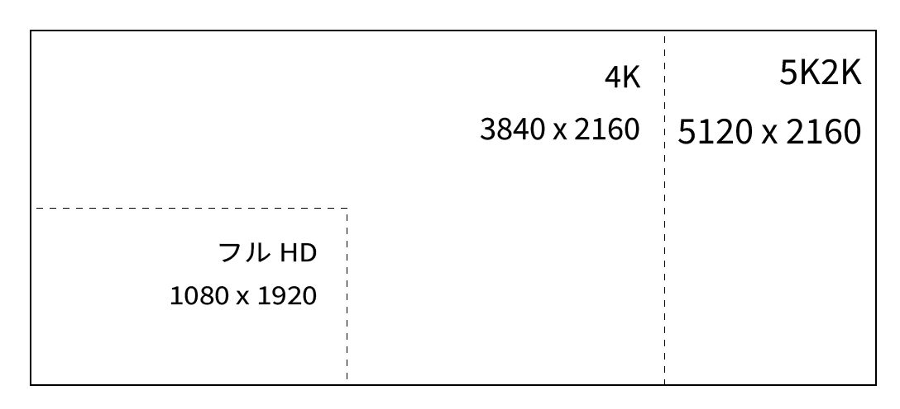

なお、本モニターは 5K 解像度でゲームモニター並の 120Hz のフレームレートが出せる性能も大きな特徴だが、今回の内容ではあまり恩恵を受けないため、本稿では割愛する。ちなみに、 120Hz のフレームは最大解像度で使用するときのみ有効で、本稿で取り上げるピクチャーバイピクチャーを使う場合は 60Hz が上限になるようだ。

### 曲面ディスプレイ

40 インチを超えるモニターサイズになると、画面の中央と端では目からの距離にかなり差が出てくる。実際に筆者が 43 インチ 4K モニターを初めて使用したときは、画面の端が遠ざかっていくような感覚を覚えたほどだ。画面端までの距離はかなり遠くなるため、視力によっては首を振るだけでは見づらく、上半身ごと振ってやる必要がある。

これを解決するのが曲面モニターだ。曲面にすることで幅広であっても大きな違和感なく、端まで見渡すことができる。以下は一般的な平面モニターと曲面モニターの視線比較だ。

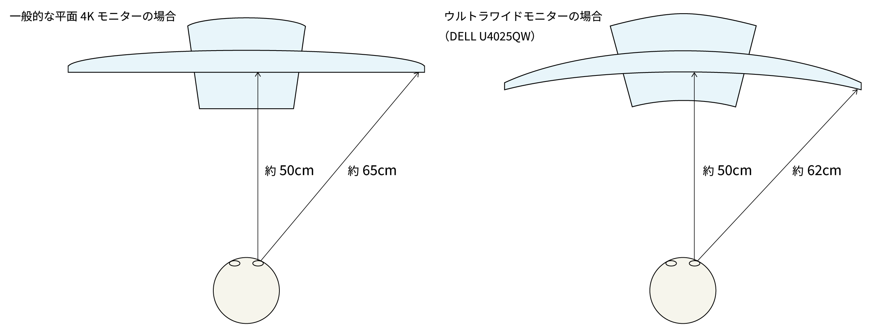

図ではわずか数 cm の違いでしかないが、実際に使ってみるとこの違いはもっと大きく感じられる。ただし、人によって曲面モニターが合わない場合もあるようなので、できれば購入前に実機を見てみることをお勧めする。

### ピクチャーバイピクチャー (PBP) 機能

本稿のキモとなるのが、ピクチャーバイピクチャー機能だ。ピクチャーバイピクチャーとは、1枚のモニターに、2つの映像ソースを左右に並べて表示させる機能のことだ。筆者はこの機能を使ってこそウルトラワイドモニターの真価が発揮できると考えている。

U4025QW では 50%:50% だけでなく、 80%:20% や 75%:25% のような分割比率も設定可能だ。具体的な解像度は以下のようになる。なお、それぞれ左右の比率は逆にすることもできる。

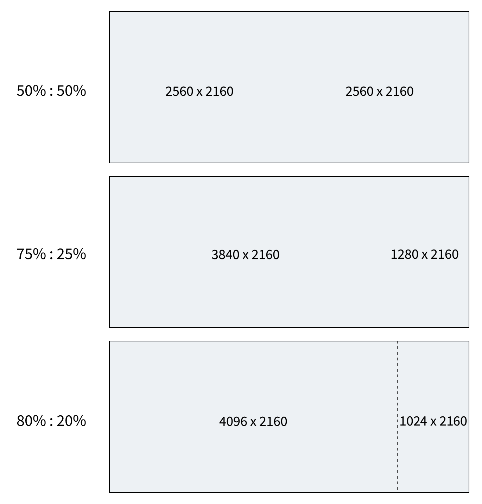

80%:20% や 75%:25% では、右側の解像度がずいぶん縦長に感じられるかもしれない。しかし、これはフルHD (1920x1080) のモニターを縦向きに使う感覚に近く、Web ページや縦長の Excel ファイルを閲覧するのに適している。

ただし幅 1024 ピクセルでは Web ページの表示には少し狭すぎるので、筆者は幅 1280 ピクセルが確保できる 75%:25% が気に入っている。この場合、左側の領域はちょうど 4K モニターと同じ解像度になる。

なお、ピクチャーバイピクチャーで画面を分割した場合、左側がメイン入力、右側がサブ入力になる。U4025QW では、メイン入力・サブ入力ともに、HDMI 2.0、DisplayPort 1.4、USB-C (Thunderbolt 4) を排他的に設定することができる。

## ウルトラワイドモニターを最大限に活用する方法

### Windows 標準のウィンドウスナップ機能の課題

ウルトラワイドモニターでは、横幅が広いため、そのままウィンドウを最大化して使うと、ウィンドウが横長になりすぎて使いにくくなってしまう。幅 5120 ピクセルで快適に使えるように設計されたアプリケーションはほとんどないだろう。

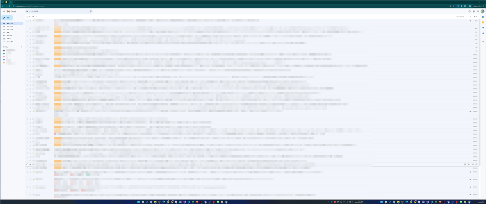

必然的にウィンドウを横方向に何枚か並べて作業することが多くなる。ウィンドウを横に並べることで、ウィンドウの切り替え回数が減り、作業効率が向上する。

昔「デスクトップ」を机の上に例えて（そのままなのだが）初心者に伝えることがあったが、まさにその通りで、広い机に同時に書類を並べ、俯瞰しながら仕事ができるというのはいかにも効率がよさそうだ。

バージョン 10 以降の Windows には「ウィンドウスナップ機能」がある。これはウィンドウを画面の端にドラッグすると、画面の半分にウィンドウが配置される機能だ。 Windows 11 からはさらに3分割や4分割の機能も追加され、配置の選択肢も大幅に増えた。スナップの選択肢は、ウィンドウの最大化ボタンをポイントするか [Windows] ＋ [Z] キーで呼び出すことができる。

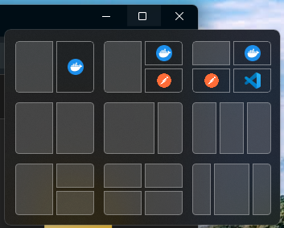

OS 提供の機能としては優れた機能なのだが、ウィンドウを画面端までドラッグしたり、配置するウィンドウを逐一選択する手間がある。Web ブラウザーなど、常に位置を固定しておきたいウィンドウがある場合、他のウィンドウのスナップ操作によって、位置が変わってしまうため、それを元に戻す手間も発生する。ささいなことだが、これが繰り返しになると、かなりのストレスになる。

### ピクチャーバイピクチャーを使った「シングルデュアルモニター」の提案

さて、前述のピクチャーバイピクチャー機能を利用することで、ウィンドウスナップ機能の課題を解消してみよう。

ピクチャーバイピクチャーでは、通常は左側と右側で別の PC を接続させるのが一般的だが、 PC から映像出力を複数取り出せる場合は、以下のような構成が可能だ。本稿では以下、この使い方を「シングルデュアルモニター」と呼ぶことにする。

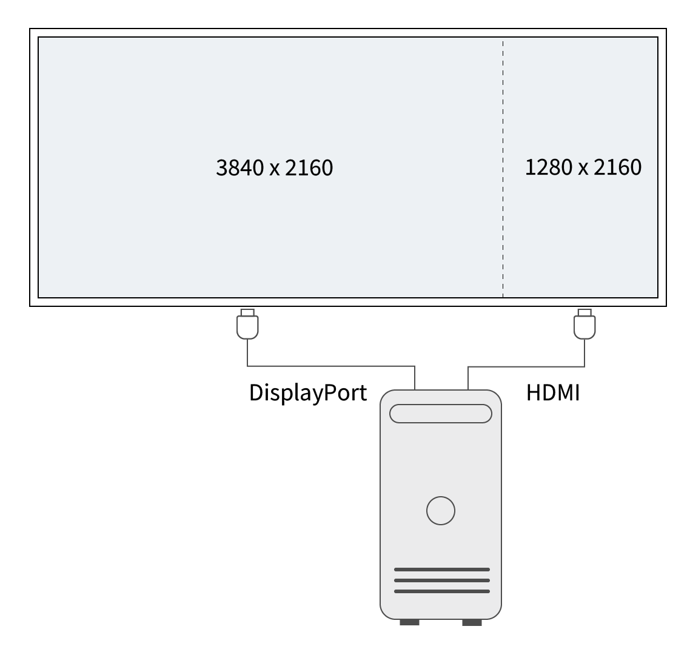

この場合、 PC 側からすればあたかもモニターが 2 台つながっているように認識されるが、通常のマルチモニターとは異なり、物理的には境界がないため、見た目上はつながった 1 枚に見える。言ってみれば、ベゼル（フレーム）が「ゼロ」のモニターをつなげたイメージだ。

以下は「シングルデュアルモニター」構成にした状態の Windows のディスプレイ設定画面だ。2 つのモニターが認識された状態であることがわかる。

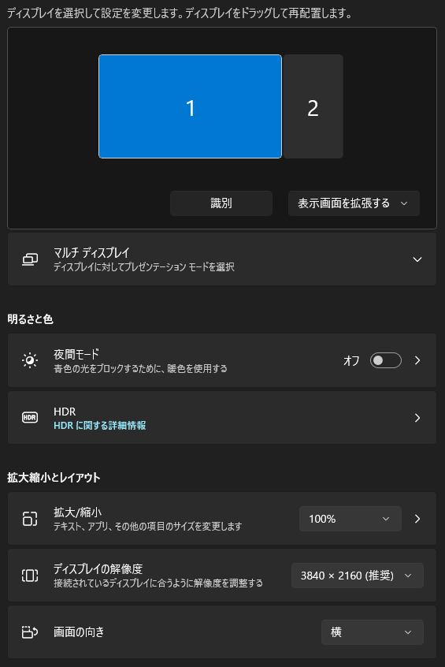

この構成のいいところは、PC の認識上は別個のモニター（デスクトップ）であるので、各モニター内でウィンドウを「最大化」するとそのモニター領域のみで最大化されることだ。 Web ブラウザーや Slack などのように常に表示しておきたいアプリケーションを最大化しておけば、専用のモニター領域が確保できる。

これにより、ウィンドウスナップ機能を使わずとも、ウィンドウの位置を固定することができる。筆者の場合は右側のエリアに Web ブラウザーを固定して、左側のエリアで作業をすることが多い。

さらにこの使い方の場合、仮想デスクトップとしては 2 枚がつながった状態であるため、5120 ピクセルの最大幅の恩恵を受けることもできる。例えば、列数がとても多い Excel ファイルなどを見るときに、2 画面分を使って表示することができる。

下図は白紙の状態で開いた Excel をモニターの端から端まで表示した例だ。

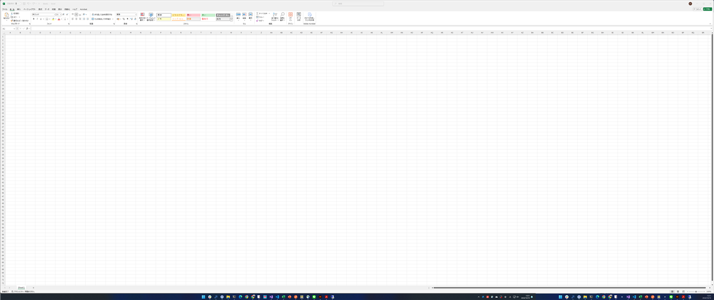

筆者の環境では、列方向は A 列～ BR 列（70列目）まで、行方向は72行目まで表示できた。フォント設定等によって異なるが、100％ 表示でも 5000 セルほどが一度に表示できることになる。

### ノート PC でデイジーチェーンを使った「シングルデュアルモニター」

ここまでの説明はデスクトップ PC を前提にしたが、ノート PC でも同様に「シングルデュアルモニター」を構築できる。

本モニターは Thunderbolt (USB-C) でノート PC を接続する場合、複数のモニターを数珠つなぎにする「デイジーチェーン」機能が使える。一般的な Thunderbolt のデイジーチェーン接続は以下のようなイメージだ。デイジーチェーンに対応するモニターには、次のモニターに接続する用の「ダウンストリーム」ポートが用意されている。

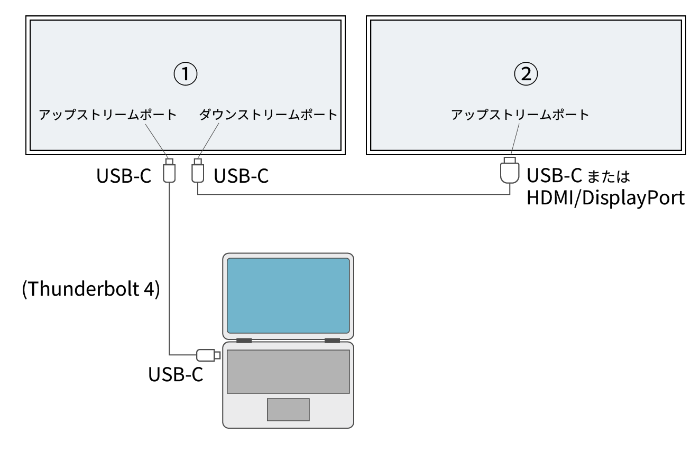

ノート PC は 1 台目のモニターのみと接続し、 2 台目のモニターは 1 台目のモニターとデイジーチェーン接続する。これでノートPC からは 2 台のモニターが認識される。

このデイジーチェーンとピクチャーバイピクチャー機能を使えば、メインの画面を 1 台目のモニター、サブの画面を 2 台目のモニターとして認識させることで、ノートPC でも「シングルデュアルモニター」を構築できる。

具体的には以下のように接続する。

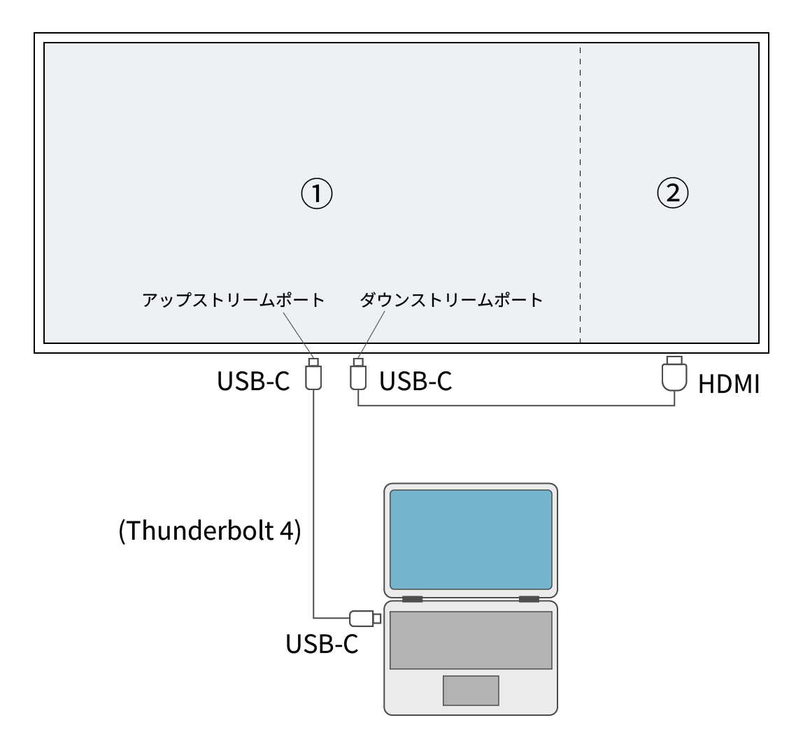

ノート PC との接続は Thunderbolt のケーブル 1 本というシンプルさを維持したまま、これまで見てきたようなピクチャーバイピクチャーを活かした使い方ができる。図中にある USB-C と HDMI の変換ケーブルは別途必要になるが、これは Amazon などで 2000 円程度で入手できる。

以下の写真は実際に Thunderbolt ケーブル1本でノートPCと U4025QW を接続し、さらに USB-C と HDMI の変換ケーブルによるデイジーチェーン接続を利用して、「シングルデュアルモニター」構成にしているところだ。

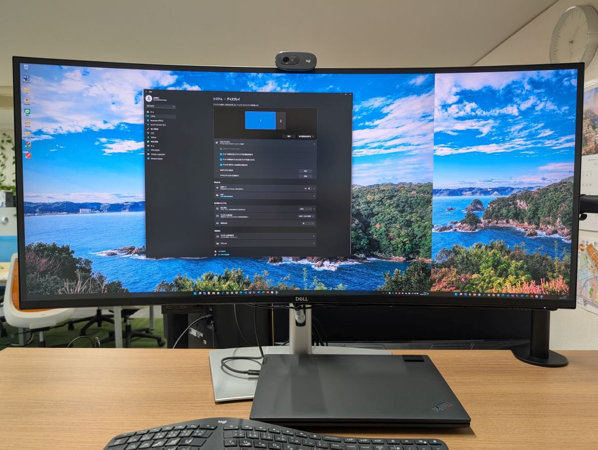

## 利用スタイルに応じた活用例

### プログラミングでの効率化事例

プログラミングでは、複数のウィンドウを並べて表示することが多い。例えば、ソースコードエディターの他にも、Git やサーバー操作用のターミナル、Web ブラウザー、データベースクライアントなどだ。

下図は実際に VS Code、ブラウザー（Google Chrome）に加えて、Excel、API 開発の支援ツール Postman を同時に表示した例だ。

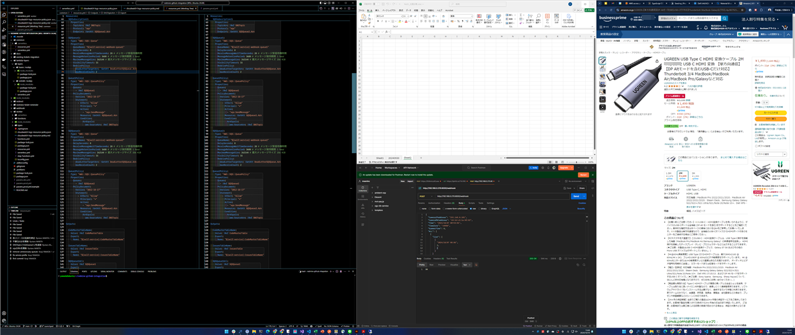

ブラウザーはピクチャーバイピクチャーで分けた右側の画面に表示し、残りのアプリケーションは Windows のウィンドウスナップ機能を使って配置している。この場合、ブラウザーは常に右側に固定されているため、ウィンドウスナップ機能を使って配置したアプリケーションによって、むやみに位置が変わることはない。いずれのアプリケーションにも十分な作業領域が確保されており、ウィンドウを切り替えることなく作業ができる。

次に複数の IDE（統合開発環境）を同時に開いてプログラミングする場合を考える。筆者の場合、 Visual Studio でプログラミングしながら、 VS Code でドキュメントを書きたいことがよくある。以下は Visual Studio と VS Code を並べて表示した例だ。

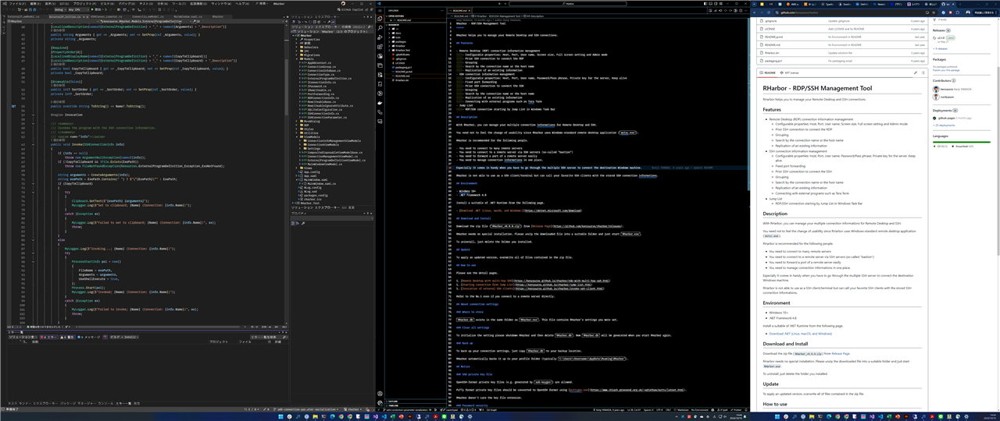

いずれの IDE も十分な領域が確保されているため、コードの俯瞰や複数ファイルの同時編集もしやすい。

さらに VS Code の ZEN Mode を併用するのもおすすめだ。 ZEN Mode は、エディターの余計な部分を非表示にして最大化することで、エディターに集中できるモードだ。（VS Code のデフォルトでは [Ctrl] + [K] → [Z] のショートカットキーで  ZEN Mode が有効になる）

ZEN Mode に入ると、余計な情報が少なくていいのだが、参考にしたい Web ページなどがある場合、切り替えが面倒だと感じることがある。その場合、ピクチャーバイピクチャーで Web ブラウザーを表示しておくとよい。

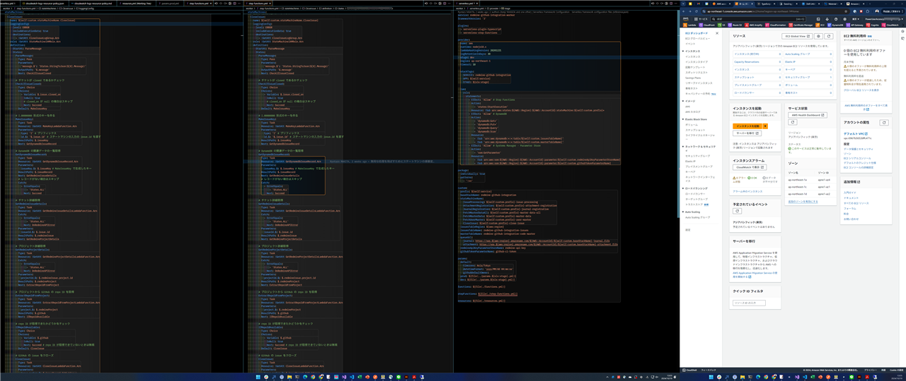

ZEN Mode だとサイドバーなどは非表示になるため、コードエディター自体は 3 列表示でも狭さを感じない。Web ブラウザーを表示するというのは厳密には ZEN Mode のコンセプトから外れている気もするが、そこはご容赦いただきたい。

### Web デザインでの画面活用法

Illustrator や Photoshop などのデザインツールを使う場合、ツールパネルやレイヤーパネルなどが多くなると、作業領域が狭くなってしまう。これは解像度の高いモニターで解決できるが、ウルトラワイドモニターではさらに Web ブラウザーや資料などを並べて表示することで、作業効率を向上させることができるだろう。

下図は Illustrator と Web ブラウザーを並べて表示した例だ。

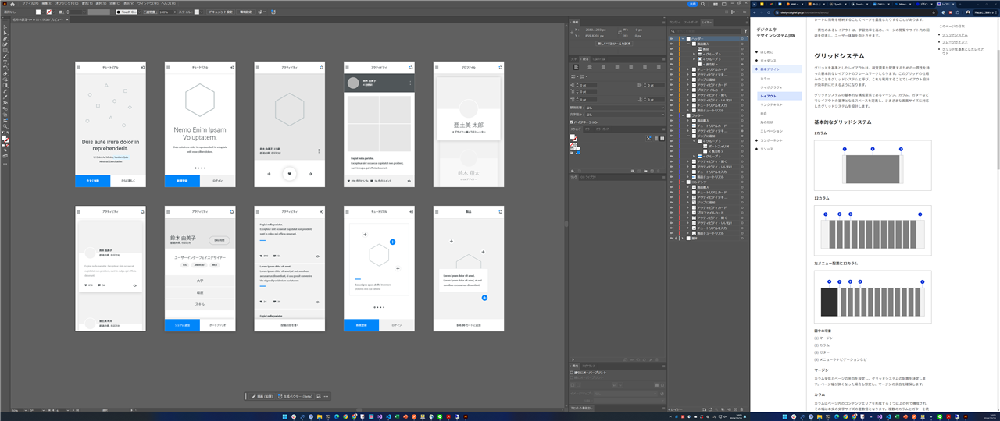

しっかり作業領域を確保しつつ、ツールパネルやWebブラウザーも同時に表示できている。もっと大量のツールパネルを開いたり、 Illustrator と Photoshop をウィンドウスナップで並べても快適に作業できる。

## ウルトラワイドモニター導入時の注意点

ここまでウルトラワイドモニターの利点について述べてきたが、導入にあたり注意しておく点もある。以下にいくつか挙げておく。

### デスクスペースの確保

本稿で紹介した U4025QW は 40 インチの大型モニターで、幅は 1 メートル近くになる。快適に作業するには最低でも 1.2 メートルのデスク幅は必要だろう。事前に設置場所を確認してほしい。

ただし、ウルトラワイドモニターであるため、 43 インチの 4K モニターと比較すれば、高さはコンパクトである。そのため、大きさの割りに圧迫感はでにくい。

なお、冒頭で述べたように筆者は昇降デスク上で使用しているが、標準のスタンドの安定度は高く、昇降中にも画面が揺れることはない。

### モニターとの距離と姿勢への配慮

まず、一般的に PC モニターの最適な目との距離は腕をピンと伸ばしたぐらいの距離以上、約 50cm～70cm ぐらいが最適だと言われている。日常的にその程度の距離がとれている場合はおそらくウルトラワイドモニターに移行しても問題ないだろうが、普段からもっと近い距離で作業している場合は、ウルトラワイドモニターに移行することで首の負担が増える可能性がある。これはウルトラワイドモニターに限った話ではないが、 PC 作業は長時間にわたることが多いため、姿勢や環境には十分注意したい。

### PC 側の対応

本モニターは冒頭に述べたように 5K2K というかなり大きな解像度になるが、自分の使用する PC がこの解像度に対応できるか、事前に確認しておくことが重要だ。Windows では対応解像度が調べにくいため、デスクトップ PC であればグラフィックボードの仕様を、ノート PC であればメーカーの仕様を確認するのが確実だろう。

またノート PC でデイジーチェーンを利用する場合はモニターと PC 双方の対応が必要であり、ノート PC 側は Thunderbolt 3 以降に対応する必要がある。このあたりも事前に仕様書を確認しておくほうがよいだろう。

## まとめ

本稿ではウルトラワイドモニター U4025QW の機能を活用した「シングルデュアルモニター」構成を紹介した。ウィンドウスナップ機能の煩雑さを解消し、広大な作業領域をより効果的に活用できれば、プログラミングやデザインなど、さまざまな利用スタイルにおいて生産性の向上がはかれるだろう。

紹介したモニターは執筆時の価格で20万円を超えるため、ハイエンドモニターに分類される。気軽に購入して試せるものではないが、高い解像度、曲面ディスプレイ、柔軟なピクチャーバイピクチャー機能、KVM スイッチ機能など、その価値は高いと言える。モニター環境の改善を検討している方は、ぜひ一度ウルトラワイドモニターの導入を検討してみてほしい。

本稿がモニター環境改善の参考になれば幸いである。
