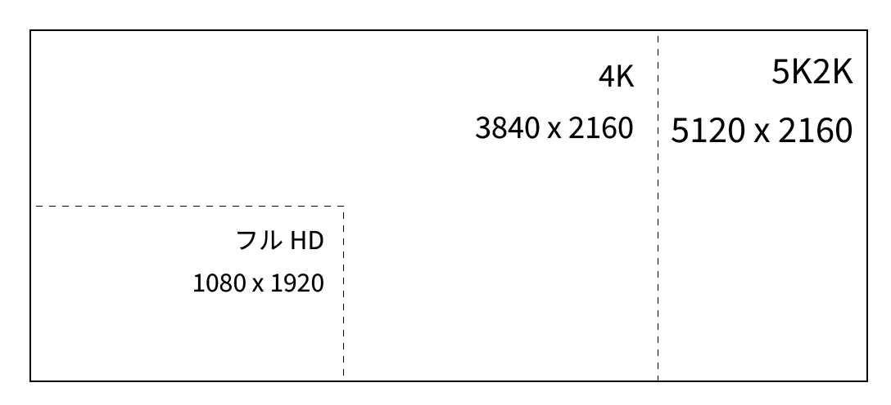
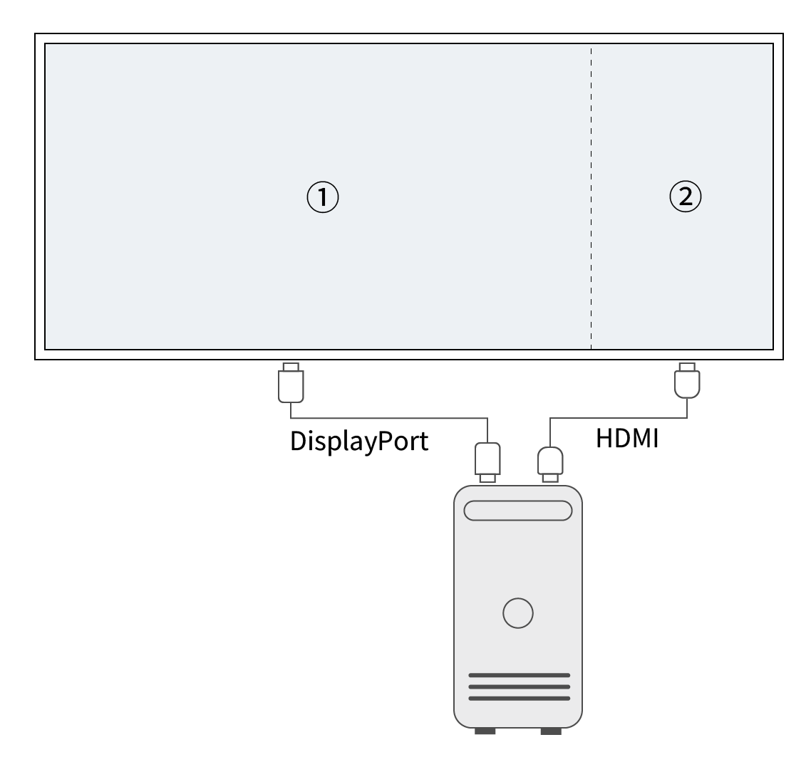

## はじめに

本稿では、 DELL 製 5K ワイドモニター U4025QW を例に、このウルトラワイドモニターをどのように使えば、業務効率を向上できるか、いくつかの利用スタイルを紹介する。またモニターを複数並べる場合とではどうスタイルが変わるのかも交えて見ていきたい。

## 対象読者

- プログラマーやデザイナーでモニター環境を快適にしたい方
- Windows のウィンドウスナップ機能に疲れた方
- すでにウルトラワイドモニターを使っている方
- これからウルトラワイドモニターの導入を考えている方

## 著者の紹介

まず、参考までに筆者の紹介をしておきたい。筆者は、プログラマー兼デザイナーで、週に 40～60 時間程度 PC を利用することが多い。

PC の主な用途は Visual Studio, Visual Studio Code (VS Code), Illustrator, Photoshop などである。Webブラウザーでは、Gmail や Google Spreadsheet のほか、 CodeZine や Qiita などの技術情報サイト、AWSのコンソールなどの利用が多い。
メインPC は自作タワー型デスクトップ PC で、サブPC は Lenovo ThinkPad P14s Gen3 を使っている。いずれも OS は Windows 11 だ。

また、デスク環境としては、昇降デスク（FlexiSpot E7H + 天板 140cm x 70cm）を使っている。

筆者は元々 EIZO のモニターをよく使っていたが、3 年ほど前に DELL の 38 型曲面ワイドモニター U3821DW を購入し、3 年半ほど愛用した。このモニターはとても気に入っていたのだが、少し解像度が足りないと感じることがあり、今年に入って 5K の新型 U4025QW が発売されたため、思い切って買い換えてみた。

以上が筆者の簡単な自己紹介である。

## DELL U4025QW の紹介

さて、商品の仕様の説明は公式サイトに委ねるとして、本稿で焦点となる機能について、いくつか紹介する。

### 解像度

まず、一番の特徴である解像度は 5120 ピクセル×2160 ピクセルだ。5K2K とも呼ばれたりする。アスペクト比は約 21:9 である。これは今日では一般的になった 4K モニター（3840 ピクセル×2160 ピクセル）に比べて、横幅が 33% 広い。フル HD と比較すればその面積比は 5.3 倍にも上る

なお、このモニターは 5K 解像度でゲームモニター並の 120Hz のフレームレートが出せる性能も大きな特徴だが、今回の内容ではあまり恩恵を受けないため、本稿では割愛する。

### 豊富な入出力とカスタム機能

このモニターは内部にドッキングハブと KVM スイッチの機能があり、 PC 入力は主に2系統ある。一つはデスクトップPCなど、ディスプレイ出力を個別に接続する系統、もう一つはノートPCなど、USB-C 1本で接続を済ませられる系統だ。後者は 140W の PD （Power Delivery）に対応するため、対応ノートPC接続時はケーブル1本でディスプレイ出力と周辺機器接続、本体の充電が可能となる。

また両方の系統を使っている場合でも、ディスプレイの入出力の切り替えやモニターに内蔵された USB ポートをどちらにアサインするかなどを細かく設定できる。

### 仕様

### 解像度

先に述べたとおり、 U4025QW の解像度は約 21:9 であり、一般的なモニターの 16:9 に比べてかなり横長である。人間の目は横についているため、横長のほうが理にかなっているのだが、当然ながら広ければいいというものではなく、広すぎると今度は首を動かすことが多くなってしまう。どの程度の横長さが最適ななのかを調べた論文があるかどうかは知らないが、筆者はこの 21:9 という比率がちょうどいいと感じている。

また 40 インチを超えるサイズになると、画面の中央と端では目からの距離にかなり差が出てくる。実際に著者が最初に43インチ4Kモニターを使用したときは、画面の端が離れていくような感覚を覚えたほどだ。画面端までの距離はかなり遠くなるため、視力によっては首を振るだけでは見づらく、上半身ごと振ってやる必要がある。

これを解決するのが曲面モニターだ。曲面にすることで幅広の端であっても大きな違和感なく、見渡すことができる。

上の図ではわずか数 cm の違いだが、実際に使ってみるとこの違いはもっと大きく感じられる。ただし、人によって曲面モニターが合わない場合もあるようなので、できれば購入前に実機を見てみることをお勧めする。

### 広い横幅を活用するには

ウルトラワイドモニターでは、横幅が広いため、そのままウィンドウを最大化して使うと、ウィンドウが横長になりすぎて非常に使いにくくなってしまう。幅 5120 ピクセルで快適に使えるアプリケーションはほとんどないだろう。

写真

必然的にウィンドウを横方向に何枚か並べて作業することが多くなる。
ウィンドウを横に並べることで、ウィンドウを切り替えるという操作が減る分、作業効率は向上する。昔「デスクトップ」を机の広さに例えることがあったが、まさにその通りで広い机に同時に書類を並べて俯瞰しながら仕事ができるのは効率がいい場合が多い。

バージョン 10 以降の Windows にはウィンドウスナップ機能がある。これはウィンドウを画面の端にドラッグすると、画面の半分にウィンドウが配置される機能だ。 Windows 11 からはさらに3分割や4分割の機能も追加され、配置の選択肢も大幅に増えた。スナップの選択肢は、ウィンドウの最大化ボタンをポイントするか [Windows] ＋ [Z] キーで呼び出すことができる。

これはこれで優れた機能なのだが、ウィンドウを端までドラッグしたり、配置するウィンドウを逐一選択する手間がある。Webブラウザーなど、常に位置を固定しておきたいウィンドウがある場合、他のウィンドウのスナップ操作によって、位置が変わってしまうため、それを元に戻す手間も発生する。
ささいなことだが、これが繰り返しになると、結構ストレスになったりもする。

### ピクチャーバイピクチャー (PBP)

ピクチャーバイピクチャーとは、1枚のモニターに、2つの映像ソースを左右に並べて表示させる機能のことだ。筆者はこの機能を使ってこそウルトラワイドモニターの真価が発揮できると考えている。

U4025QW はこのピクチャーバイピクチャーの設定が豊富で、 50%:50% だけでなく、 80%:20% や 75%:25% のような設定が可能だ。

具体的な解像度は以下のようになる。なお、それぞれ左右の比率は逆にすることもできる。

80%:20% や 75%:25% では、右側の解像度がずいぶん縦長に感じられるかもしれない。しかし、これはフルHD (1980x1080) のモニターを縦向きに使う感覚に近く、Webページや縦長のExcelファイルを閲覧するのに適している。
ただし幅 1024 ピクセルではWebページの表示には少し狭すぎるので、筆者は幅 1280 ピクセルが確保できる 75%:25% で使用している。

通常は左側と右側で別の PC を接続させるのが一般的だが、デスクトップ PC のように映像出力を複数取り出せる PC の場合は、以下のような構成が可能だ。

この場合、 PC 側からすればあたかもモニターが2台つながっているように認識されるが、マルチモニターとは異なり、物理的には境界がないため、見た目上はつながった 1 枚に見える。言ってみれば、額縁が「ゼロ」のモニターをつなげたイメージだ。

この使い方のいいところは、PC からの認識では別のモニター（デスクトップ）であるので、各モニター内でウィンドウを「最大化」するとそのモニター領域のみで最大化されることだ。
Webブラウザーや Slack などのように常に表示しておきたいアプリケーションを最大化しておけば、専用のモニター領域が確保できる。

これにより、ウィンドウスナップ機能を使わずとも、ウィンドウの位置を固定することができる。筆者の場合は右側のエリアにブラウザーを固定して、左側のエリアで作業をすることが多い。

さらにこの使い方の場合、仮想デスクトップとしては 2 枚がつながった状態であるため、5120 ピクセルの最大幅の恩恵を受けることもできる。例えば、下図のように列数がとても多い Excel ファイルなどを見るときに、2 画面分を使って表示することもできる。

<写真>

## 利用スタイルに応じた活用例

### プログラミング

プログラミングでは、複数のウィンドウを並べて表示することが多い。例えば、ソースコードエディター、ターミナル、ブラウザー、データベースクライアントなどを同時に表示しておくことが多い。

下図は実際に VS Code、Windows Terminal、Google Chrome、Firefox、Excelを同時に表示した例だ。

<写真>

ブラウザーはピクチャーバイピクチャーで分けた右側の画面に表示し、残りのアプリケーションはウィンドウスナップ機能を使って配置している。この場合、ブラウザーは常に右側に固定されているため、ウィンドウスナップ機能を使って配置したアプリケーションがブラウザーによって位置が変わることはない。

次に複数のコードエディターを同時に開いてプログラミングする場合を考える。筆者の場合、 Visual Studio でプログラミングしながら、 VS Code でドキュメントを書きたいことがよくある。下図は Visual Studio と VS Code を並べて表示した例だ。

<写真>

VS Code の ZEN Mode を併用するのもおすすめだ。 ZEN Mode は、エディターの余計な部分を非表示にして最大化することで、エディターに集中できるモードだ。ただ、余計な情報はなくていいのだが、参考にしたい Web ページなどがある場合、切り替えが面倒だと感じることがある。その場合、ピクチャーバイピクチャーで Web ブラウザーを表示しておくとよい。厳密には ZEN Mode のコンセプトから外れている気もするが、そこはご容赦いただきたい。

<写真>

### Web デザイン

Illustrator や Photoshop などのデザインツールを使う場合、ツールパネルやレイヤーパネルなどが多くなると、作業領域が狭くなってしまう。これは解像度の高いモニターで解決できるが、ウルトラワイドモニターではさらに Web ブラウザーや資料などを並べて表示することで、作業効率を向上させることができるだろう。

下図は Illustrator と Web ブラウザーを並べて表示した例だ。

<写真>

### Excel 作業

### ノート PC の場合

最後に本モニターは Thunderbold 4 に対応したハブを内蔵しているため、これを使った場合の応用例も紹介したい。

### デイジーチェーンを使ったマルチモニター利用

少し裏技的な方法にはなるが、本モニターが対応するデイジーチェーン機能を使って、本モニター内でマルチモニターとして使う方法もある。これを使えば、ノート PC との接続は Thunderbold のケーブル 1 本というシンプルさを維持したまま、これまで見てきたようなデスクトップ PC のような使い方ができる。

## まとめ

