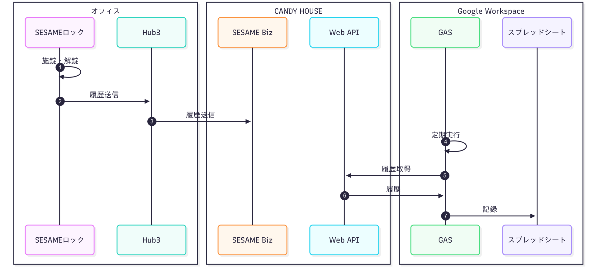
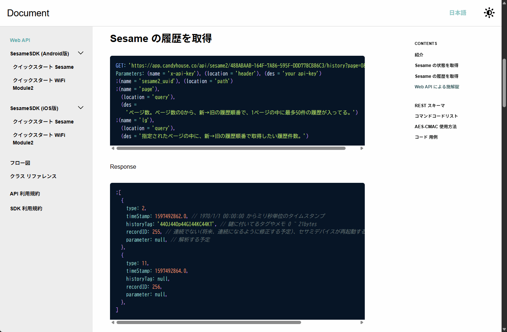
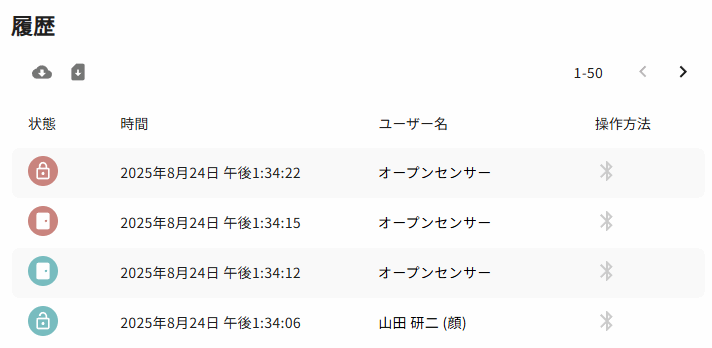
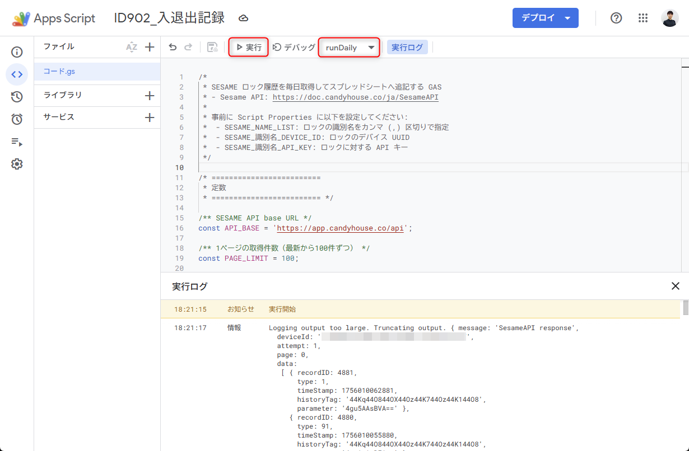
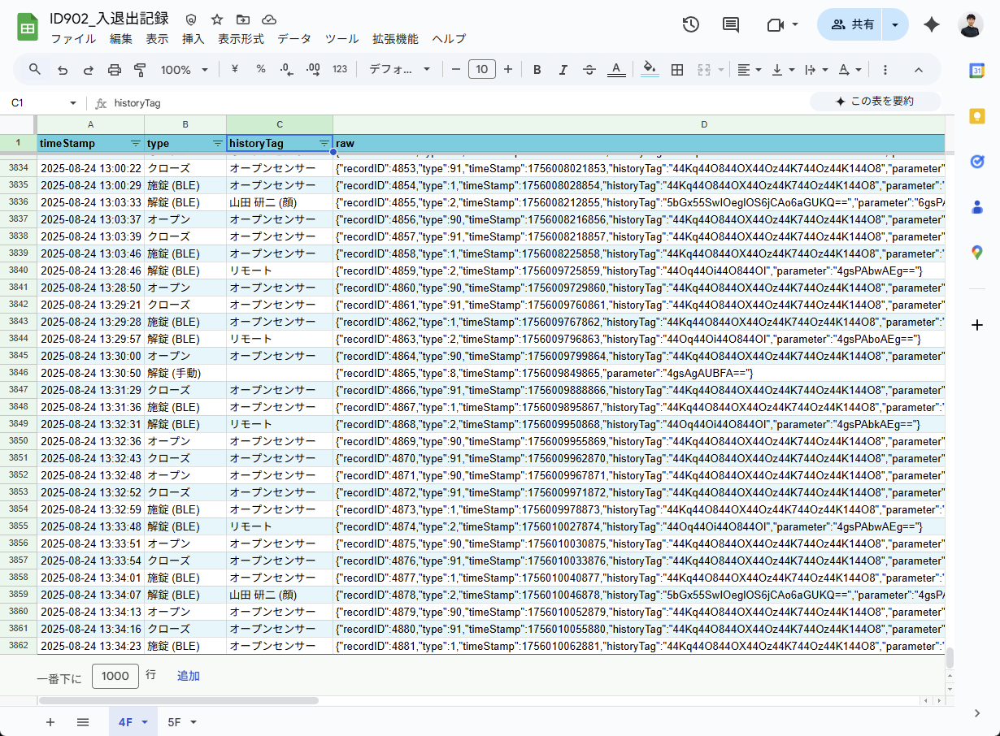
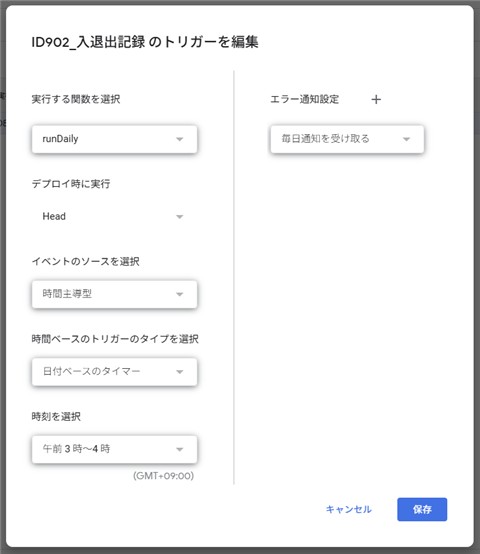

こんにちは、 kenzauros です。

今回はオフィスの入退出を記録するために導入しているスマートロック「セサミ」の履歴を Google Apps Script (GAS) を使って Google スプレッドシートに記録する方法を紹介します。

## 背景

弊社では ISMS（情報セキュリティマネジメントシステム; ISO 27001）の内規で、オフィスの入退出記録を残すことが求められています。

弊社の小規模なオフィスでは、専用のカードリーダーや生体認証デバイスを導入するのは難しいため、オフィスの鍵部分につけるスマートロック「セサミ」を導入し、入退出の履歴を残すようにしています。セサミの導入の話は以下の記事を参照してください。

- [\[セサミロック\] オフィスの入退出履歴を顔認証で記録する](https://mseeeen.msen.jp/sesame-lock)

セサミではロック本体と [Hub3](https://jp.candyhouse.co/products/hub3) と呼ばれる Wi-Fi ゲートウェイを導入すると、施錠・解錠の履歴をクラウドにアップロードし、アプリや公式の Web サービス [SESAME Biz](https://jp.candyhouse.co/pages/sesamebiz) で確認できるようになります。

アップロードされた履歴は SESAME Biz の Free プラン（無償）でも、 CSV や Excel 形式でエクスポートできますので、ダウンロードしておけば、記録のバックアップになります。

エクスポートした履歴をファイルのまま保管しておくだけでもいいのですが、閲覧性が悪いのと、そもそも定期的にダウンロードするのも面倒です。

そこでメーカーが公式に提供している [Web API (Sesame API)](https://doc.candyhouse.co/ja/SesameAPI) を使って、定期的に履歴を取得し、Google スプレッドシートへ記録するようにしました。

## 概要

セサミの履歴管理と Web API による履歴取得→ Google スプレッドシートへの記録のイメージは下図の通りです。



セサミロック（①）で施錠・解錠が行われると、その履歴は Hub3（②）を経由して SESAME Biz（③）に送信されます。

Google スプレッドシートに紐づいた GAS スクリプトが定期的に（④） SESAME API から履歴を取得（⑤⑥）し、スプレッドシートへ記録（⑦）するようにします。

<!--
sequenceDiagram
    autonumber

    box オフィス
      participant lock as SESAMEロック
      participant hub as Hub3
    end
    box CANDY HOUSE
      participant biz as SESAME Biz
      participant api as Web API
    end
    box Google Workspace
      participant gas as GAS
      participant sp as スプレッドシート
    end

    lock ->> lock: 施錠・解錠
    lock ->> hub: 履歴送信
    hub ->> biz: 履歴送信
    gas ->> gas: 定期実行
    gas ->> api: 履歴取得
    api ->> gas: 履歴
    gas ->> sp: 記録
-->

## Web API の仕様確認

今回は履歴を取得するだけなので、[SESAME API ドキュメント](https://doc.candyhouse.co/ja/SesameAPI)のうち、「Sesame の履歴を取得」の部分を確認します。



### リクエスト URL とパラメーター

リクエスト URL は `https://app.candyhouse.co/api/sesame2/＜デバイスのUUID＞/history?page=＜ページ番号＞&lg=＜１ページあたりの件数＞` のようになります。

- `＜デバイスのUUID＞`: SESAMEロックのUUID  
アプリのデバイス情報や SESAME Biz 上で確認可能な `488ABAAB-164F-7A86-595F-DDD778CB86C3` のような文字列です。
- `＜ページ番号＞`: 取得するページ番号
- `＜１ページあたりの件数＞`: 取得する件数

この他、 HTTP ヘッダーの `x-api-key` に API キーを指定する必要があります。API キーは SESAME Biz の管理画面から取得できます。

### レスポンスについて

レスポンスは JSON 形式で、以下のような内容が返ってくるとドキュメントに記載があります。

```json
[
  {
    type: 2,
    timeStamp: 1597492862.0, // 1970/1/1 00:00:00 からミリ秒単位のタイムスタンプ
    historyTag: '44OJ44Op44GI44KC44KT', // 鍵に付いてるタグやメモ 0 ~ 21bytes
    recordID: 255, // 連続でない(将来、連続になるように修正する予定)、セサミデバイスが再起動するまで当履歴の唯1つのID、 小→大
    parameter: null, // 解析する予定
  },
  {
    type: 11,
    timeStamp: 1597492864.0,
    historyTag: null,
    recordID: 256,
    parameter: null,
  },
]
```

### recordID について

次に `recordID` ですが、これは履歴の一意な識別子を表す数値です。セサミデバイスが再起動されるまで、各履歴にはユニークな `recordID` が付与されるようです。

ドキュメントには連続でないと書かれていましたが、実際の手元のデバイスで確認したところ、連続しているように見えました。

### type について

ここで、 `type` は履歴の種類を表す数値で、ドキュメントには以下のように記載があります。

```
type :
0 none.
1 bleLock.                セサミデバイスが 施錠のBLEコマンド を受付ました。
2 bleUnLock.              セサミデバイスが 解錠のBLEコマンド を受付ました。
3 timeChanged.            セサミデバイスの内部時計が校正された。
4 autoLockUpdated.        オートロックの設定が変更されました。
5 mechSettingUpdated.     施解錠角度の設定が変更されました。
6 autoLock.               セサミデバイスがオートロックしました。
7 manualLocked.           手動で施錠 (下記  ケース2またケース3 から ケース1 になった場合 )
8 manualUnlocked.         手動で解錠 (下記  ケース1またケース3 から ケース2 になった場合 )
9 manualElse.             解錠の範囲または施錠の範囲から、サムターンに動きがあった場合（下記 　ケース１からケース３になった場合、またはケース２からケース３になった場合）
10 driveLocked.            モーターが確実に施錠しました。
11 driveUnlocked.          モーターが確実に解錠しました。
12 driveFailed.            モーターが施解錠の途中に失敗しました。
13 bleAdvParameterUpdated. セサミデバイスが発信しているBLEアドバタイシング の Interval と TXPower の設定が変更されました。
14 wm2Lock.                Wifiモジュールを経由してセサミデバイスを施錠しました。
15 wm2Unlock.              Wifiモジュールを経由してセサミデバイスを解錠しました。
16 webLock.                Web APIを経由してセサミデバイスを施錠しました。
17 webUnlock.              Web APIを経由してセサミデバイスを解錠しました。
```

ただし、実際に取得した履歴には、公式ドキュメントには記載のない 90 や 91 のような `type` のデータが含まれていました。いろいろオンライン情報を調べてもこれらが何を表すのかはわかりませんでした。

ただ、後述の `historyTag` を見ると、この2つは「オープンセンサー」の履歴だとわかりました。さらに、アプリの履歴と照らし合わせたところ、90 が「オープン」、91 が「クローズ」と推測できました。

よってこれらを補完した `type` の対応表は以下のようになります。

|`type` 値|ドキュメント上の識別子|内容|
|--:|-------|-----------|
|0|none|なし|
|1|bleLock|施錠 (BLE)|
|2|bleUnLock|解錠 (BLE)|
|3|timeChanged|内部時計校正|
|4|autoLockUpdated|オートロック設定変更|
|5|mechSettingUpdated|施解錠角度設定変更|
|6|autoLock|オートロック|
|7|manualLocked|施錠 (手動)|
|8|manualUnlocked|解錠 (手動)|
|9|manualElse|手動操作|
|10|driveLocked|モーターが確実に施錠|
|11|driveUnlocked|モーターが確実に解錠|
|12|driveFailed|モーターが施解錠の途中に失敗|
|13|bleAdvParameterUpdated|BLEアドバタイズ設定変更|
|14|wm2Lock|施錠 (WiFi Module2)|
|15|wm2Unlock|解錠 (WiFi Module2)|
|16|webLock|施錠 (Web API)|
|17|webUnlock|解錠 (Web API)|
|90|なし|オープンセンサー オープン|
|91|なし|オープンセンサー クローズ|

### historyTag について

次に `historyTag` は、履歴に付与されたタグやメモを表す文字列です。 **BASE64 エンコード**された文字列が入っています。

先の実例の `44Kq44O844OX44Oz44K744Oz44K144O8` を BASE64 デコードすると `オープンセンサー`、 `5bGx55SwIOeglOS6jCAo6aGUKQ==` をデコードすると `山田 研二 (顔)` になります。

これはアプリで設定したそれぞれの**鍵**の名前（顔認証ならその登録名）が表示されています。アプリ上で見る履歴とも一致します。

たとえば顔認証で解錠したときの記録は以下のようになります（図やJSONでは時系列が逆になっています）。

1. 顔認証（SESAME フェイス）から解錠 (`type` = 2)
2. （ドアを開ける）オープンセンサーでオープン検知 (`type` = 90)
3. （ドアが閉める）オープンセンサーでクローズ検知 (`type` = 91)
4. オープンセンサーから施錠 (`type` = 1)



```json
[
  {
    "recordID": 3873,
    "type": 1, // 施錠
    "timeStamp": 1756010062873,
    "historyTag": "44Kq44O844OX44Oz44K744Oz44K144O8", // オープンセンサー
    "parameter": "xAu5ABEBVA=="
  },
  {
    "recordID": 3872,
    "type": 91, // クローズ
    "timeStamp": 1756010055872,
    "historyTag": "44Kq44O844OX44Oz44K744Oz44K144O8", // オープンセンサー
    "parameter": "xAsAgBEBFA=="
  },
  {
    "recordID": 3871,
    "type": 90, // オープン
    "timeStamp": 1756010052871,
    "historyTag": "44Kq44O844OX44Oz44K744Oz44K144O8", // オープンセンサー
    "parameter": "xAsAgBEBFA=="
  },
  {
    "recordID": 3870,
    "type": 2, // 解錠
    "timeStamp": 1756010046870,
    "historyTag": "5bGx55SwIOeglOS6jCAo6aGUKQ==", // 山田 研二 (顔)
    "parameter": "xAsPAbwAEg=="
  }
]
```

### parameter について

`parameter` はドキュメントで「解析予定」となっており、詳細は不明です。 `historyTag` と同様に BASE64 エンコードされた文字列が入っていますが、デコードすると `c4 0b b9 00 11 01 54` のようなバイナリデータになっていました。

なんとなくデバイスと相関がありそうなのと複数メッセージ間で共通部分もあるので、多くのデータから推測することはできそうですが、今回は利用しないので、無視しました。

## スプレッドシートの準備と GAS スクリプトの作成

さて、ここまでで API のレスポンスに含まれる `type`, `recordID`, `timeStamp`, `historyTag` があれば、入退出の履歴として足りそうなことがわかりました。

これらを Google スプレッドシートへ記録するために、スプレッドシートを作成し、 GAS を設定します。

### スプレッドシートの作成

Google スプレッドシートを新規作成し、適当な名前をつけます。弊社の例では社内の管理文書なので「ID902_入退出記録」としました。後からでも変更できるのでなんでもかまいません。

また、シートも GAS で作成するようにしますので、デフォルトのままでかまいません。

### GAS プロジェクトの追加

スプレッドシートのメニューから「拡張機能」→「Apps Script」を選択し、GAS プロジェクトを作成します。

`コード.gs` というファイルができるので、以下の GitHub にあるコードを貼り付けて保存します。

- [code.gs - mseninc/sesame-lock-history-to-google-spreadsheet](https://github.com/mseninc/sesame-lock-history-to-google-spreadsheet/blob/main/code.gs)

定期実行するだけなので、デプロイは不要です。

### スクリプト プロパティの設定

「プロジェクトの設定」→「スクリプト プロパティ」から以下のプロパティを設定します。

プロパティ名 | プロパティ値
-- | --
`SESAME_NAME_LIST` | ロックの識別名をカンマ (`,`) 区切りで指定
`SESAME_識別名_DEVICE_ID` | ロックのデバイス UUID
`SESAME_識別名_API_KEY` | ロックに対する API キー

ちょっとややこしいのですが、複数のロックを管理する場合に、それぞれ別の API キーやデバイス UUID を設定できるようにしています。

たとえば、 `SESAME_NAME_LIST` に `4F,5F` と2つのロック名を指定した場合は、以下の4つのプロパティを設定する必要があります。

- `SESAME_4F_DEVICE_ID`
- `SESAME_4F_API_KEY`
- `SESAME_5F_DEVICE_ID`
- `SESAME_5F_API_KEY`

逆に一台だけでいい場合は、 `SESAME_NAME_LIST` に1つで名前（例: `OFFICE`）を指定し、以下のように2つのプロパティを設定すれば OK です。

- `SESAME_OFFICE_DEVICE_ID`
- `SESAME_OFFICE_API_KEY`

### 動作確認

ここまで設定できたら、エディタ画面に戻り、関数 `runDaily` を選択し、実行してみてください。初回実行時は権限設定が求められるはずですので、指示に従って許可してください。



うまくいけば「実行ログ」に API で取得したデータが表示され、スプレッドシートに履歴が記録されます。既存のデータが多い場合は、最初にすべて履歴を取得するため、初回は特に時間がかかる場合があります。気長に待ちましょう。



なお SESAME Biz の Free プランでは月に 3000 回の API アクセスが可能です。このスクリプトでは 1 リクエストあたりの取得数を 50 件にしているので、データ件数によってはリクエスト数が増えてしまうかもしれません。データの増分を見て、スクリプト中の `PAGE_LIMIT` を調整してみてください。

### トリガー設定

日次で自動実行するために、トリガーを設定します。トリガー設定用の関数を用意していますので、エディタの関数で `createDailyTrigger` を選択し、実行します。

毎日夜中の3時～4時の間で実行されるようになります。



## まとめ

今回は SESAME スマートロックの履歴を Google スプレッドシートに自動的に記録する方法を紹介しました。

- SESAME の API を利用して、施錠・解錠の履歴を取得
- Google Apps Script (GAS) を使って、定期的に履歴を取得し、スプレッドシートに記録
- スクリプトプロパティの設定で、複数のロックの履歴を記録可能

この仕組みにより、手動でのエクスポート作業が不要になり、常に最新の入退出記録をスプレッドシート上で確認できるようになりました。オフィスのセキュリティ管理や ISMS 対応のための入退室管理として役立てることができます。

なお、このスクリプトは [GitHub リポジトリ](https://github.com/mseninc/sesame-lock-history-to-google-spreadsheet) で公開していますので、必要に応じてカスタマイズしてご利用ください。
