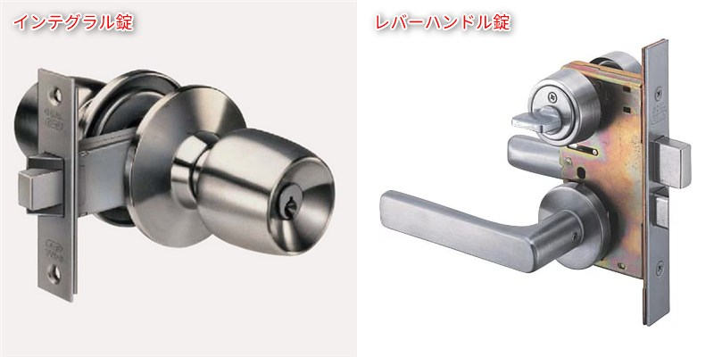
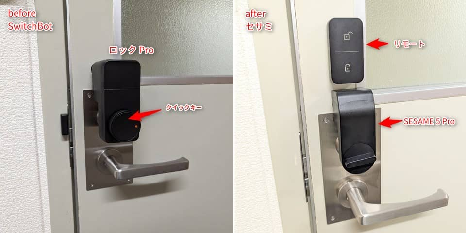
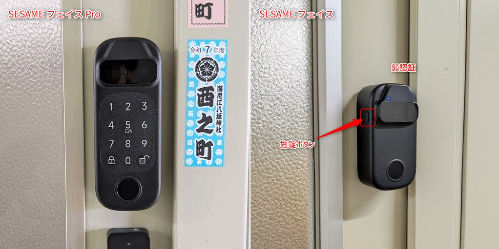
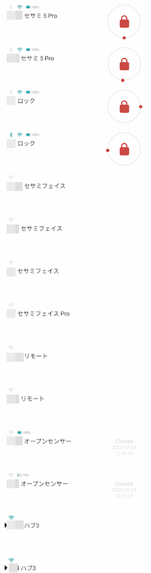
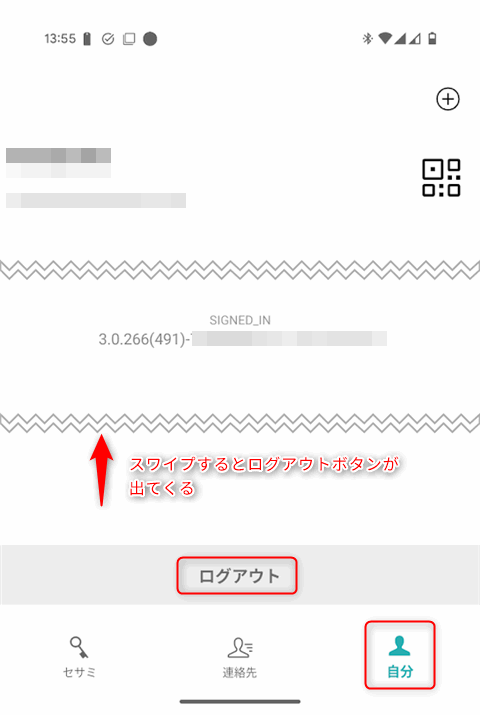
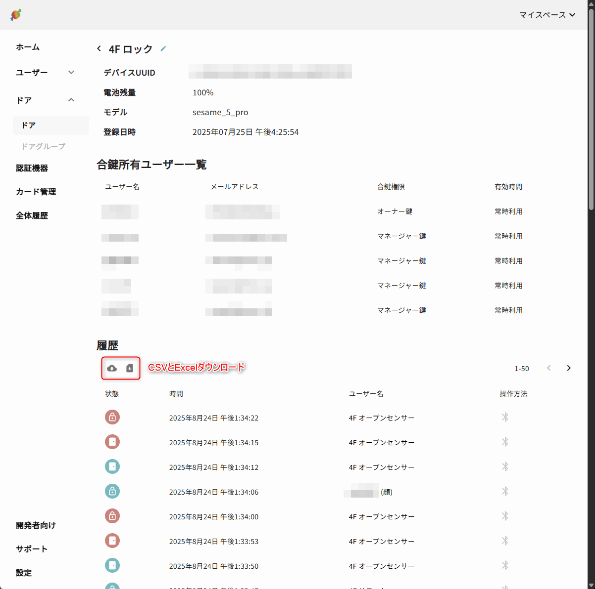

こんにちは、 kenzauros です。

今回はオフィスのスマートロックとして CANDY HOUSE のセサミを導入し、オフィスの入退出履歴を顔認証で記録する取り組みについて紹介します。

## 背景

弊社では ISMS（情報セキュリティマネジメントシステム; ISO 27001）の内規で、**オフィスの入退出記録**を残すことが求められています。

大手企業などでは、入退出記録を残すために専用のカードリーダーや生体認証デバイスを導入していることが多いと思いますが、弊社のオフィスではそこまで大がかりなものは導入しづらいため、オフィスの鍵部分につけるリモートロックを導入し、入退出の履歴を残すようにしています。

これまで SwitchBot 社のスマートロックと指紋認証パッドを使い、指紋で個人を識別していましたが、アプリから施錠・解錠履歴の確認が不安定なこと、データのダウンロードやエクスポートができないこと、カスタマーサポートの対応品質が低下してきたことなどから、乗り換えを検討していました。

## 代替ソリューションの検討

乗り換えを検討する中で、以下のような制約や条件を考慮しました。

- 【必須】解錠時に生体認証で個人を識別できること
- 【必須】施錠・解錠履歴を記録できること
- 【必須】施錠・解錠履歴データのダウンロードやエクスポートができること
- 【できれば】顔認証が可能であること
- 【できれば】施錠・解錠履歴を取得できる API が提供されていること
- 【できれば】カスタマーサポートの対応品質が高いこと
- 【できれば】ドアクローズ後に自動施錠ができること
- 【できれば】解錠速度が速いこと

この中で「生体認証で個人を識別」という条件を満たす製品は限られており、以下のようなメーカー・機器はオプションでも生体認証を提供していませんでしたので、対象外となりました。

- Qrio | Qrio Lock
- ミネベアミツミ | SADIOT LOCK（サディオロック）
- ビットキー | bitlock MINI

結局のところ、手軽に導入できる製品は以下の2つ（SwitchBot のロックと CANDY HOUSE のセサミ）に絞られました。

| メーカー | 商品名 | 価格（セット一式） | 生体認証 | 履歴の記録 | 履歴のエクスポート | 履歴取得 API | 自動施錠 |
| --- | --- | --- | --- | --- | --- | --- | --- |
| SwitchBot | ドアロックUltra 顔認証セット | 約45,000円 | 指紋認証 **顔認証** | あり | なし | なし | あり |
| CANDY HOUSE | SESAME 5 Pro | 約15,000円 | 指紋認証 **顔認証** | あり | **あり** | **あり** | あり |

このうち、 SwitchBot は先述のとおり現状利用していて不満があることと、最新の機器（ドアロックUltraや顔認証パッド）はかなり高価になってきていることから採用しないことにしました。

よって、代替として **CANDY HOUSE のセサミ**を検討することにしました。

## セサミとは

セサミは、CANDY HOUSE JAPAN 株式会社が販売しているスマートロックと関連製品群で、名前は「開けゴマ（＝英語でセサミ）」が由来のようです。

もともと台湾出身の古 哲明 (Jerming Gu、ジャーミン グー) 氏が、スタンフォード大学留学中に、学生寮で3Dプリンターを使ってスマートロックの開発をはじめたことがきっかけで、2015年にクラウドファンディングの Kickstarter で資金を獲得し、CANDY HOUSE を創業しました。

東京に本社をかまえ、アメリカ、中国、台湾に拠点をもつグローバル企業です。にも関わらず、製品レビューにはCEOであるグー氏が直接返信するなどがホームページでも確認でき、購入前からカスタマーサポートの対応品質がよさそうだと感じました。

ロックの性能（精度や速度）や生体認証の精度などは実際に使ってみないとわからないため、まずは試しに購入してみることにしました。

以下、商品群を指すときは「セサミ」、個々の商品名は公式ホームページの表現を優先します。

### 今回導入したセサミの構成

弊社では以下のセットを使っています。

- [SESAME 5 Pro](https://jp.candyhouse.co/products/sesame5-pro) 4,980円 【必須】
    - ロック本体です。
- [SESAMEフェイス Pro](https://jp.candyhouse.co/products/sesame-face-pro) 5,980円 または [SESAMEフェイス](https://jp.candyhouse.co/products/sesame-face) 5,480円 【ほぼ必須】
    - 顔認証を利用するためのデバイスです。手のひら静脈認証や指紋認証も可能ですが、弊社では顔認証をメインにしています。
- [Hub3](https://jp.candyhouse.co/products/hub3) 1,980円 【ほぼ必須】
    - Wi-Fi に接続し、ロックのデータをクラウドに送信するのに必要なハブです。これがないとロックの操作履歴をクラウドに送信するためにいちいとスマホアプリを開かないといけません。
- [オープンセンサー](https://jp.candyhouse.co/products/sesame-opensensor) 980円 【ほぼ必須】
    - ドアの開閉状態の検出に必要です。これがあるとドアが閉じられたときに自動施錠できるようになります。
- [リモート](https://jp.candyhouse.co/products/candyhouse_remote) 980円 【オプション】
    - ロックのノブを回せば解錠できますが、ボタンで解錠できると便利です。

ちなみに上の金額を足してもらえばわかりますが、上記一式そろえた場合で1万5000円程度です。他社のスマートロックと比べるとかなり安価で試しやすいでしょう。

### API が提供されている

セサミでは公式に [Web API (Sesame API)](https://doc.candyhouse.co/ja/SesameAPI) が提供されており、ロックの状態や利用履歴、解錠などをリモートで行えることも特長です。

製品自体が安価なのにもかかわらず、API まで無償で提供されていて、とても良心的な会社だと感じました。

## 設置

弊社のオフィスのドア鍵は、もともとドアノブが丸型のインテグラルタイプでしたが、このタイプは後付けのスマートロックが取り付けられないため、 SwitchBot のロック導入時に、一般的なサムターンのレバーハンドル錠に交換していました。

実際に SESAME 5 Pro を購入して取り付けてみたところ、追加のパーツも高さ調整も不要で、そのまま取り付けられました。下の写真は従来の SwitchBot ロックと SESAME 5 Pro の取り付けイメージです。

見た目でいうと、以前の SwitchBot ロックより少し高級感は劣りますが、サイズはかなりコンパクトになったので、すっきりした印象です。

SwitchBot のロック Pro は本体に押しボタン（クイックキー）がついており、それで解錠できたのですが、 SESAME 5 Pro にはそれがありません。ボタンでの解錠になれていたため、別途「リモート」を取り付けています。

サムターンの高さ方向だけなら標準のプレートをねじで取り付けるだけで調整可能です。もしサムターン部分が合わない場合も、[特殊アダプター](https://jp.candyhouse.co/products/adapter_normal)が売られているほか、メーカーにお願いすればわずか600円でカスタムのアダプターを作ってもらえるそうです。これはすごいサービスですね。

> 99%の鍵に対応可能： 基本的に、セサミ5が設置できるなら、セサミ5Proも設置可能です。セサミ5Proはセサミ5よりも使用範囲が広いです。別途特殊アダプターが必要な鍵の場合、有料600円/個(送料込・税込)にて３Dプリンターで作成しており、セサミ５Proと同時注文の場合も別途発送になります。
> <cite>出典: [SESAME 5 Pro](https://jp.candyhouse.co/products/sesame5-pro)</cite>

顔認証用の SESAME フェイスは、ドアに付属の両面テープで貼り付けました（このオフィスは賃貸なので、一応両面テープの下にマスキングテープを貼って保護しています）。

## アプリ

スマホアプリは Android 版しか利用していませんが、可もなく不可もなくといったところです。いったん設定してしまえば、普段はそんなに開くことがないので、今のところ大きな問題はありません。

- [セサミ、ひらけゴマ - Google Play のアプリ](https://play.google.com/store/apps/details?id=co.candyhouse.sesame2&hl=ja)

### アプリのいい点

ロックの設定や指紋認証・顔認証の登録などは SwitchBot や Qrio と比べても複雑なステップがなく、簡単に設定が可能だと思います。

反面、確認メッセージなどが少ないので、機械ものに不慣れな方には難しく感じられるかもしれないのと、慣れないと誤操作も起こりやすそうな印象はあります。

### アプリの不満点

デバイス一覧でデバイスを非表示にできないので、多くのデバイスを登録したときに見づらいです。なお、長押しドラッグで並べ替えはできました。

なお、**Hub3 を設置していても、デバイスの設定変更や電池残量の確認・アップデートなどは Bluetooth の範囲内でないとできません**。特に電池切れが致命的な事態になるデバイスなので、正しい電池残量がリモートで確認できるようになることを期待しています。

また、アプリに複数のアカウントを登録しておいて切り替えることができません。私は自宅でもセサミを利用しているので、個人アカウントと会社アカウントを切り替えたいのですが、いちいちログアウトしてログインし直す必要があり、面倒です。なお、ログアウト方法はちょっとわかりづらいのですが、アプリの「自分」タブの画面を上にスワイプすると「ログアウト」ボタンが表れます。

### 履歴のアップロードと Hub3 について

施錠や解錠の履歴は、クラウドにアップロードされ、アプリのほか、メーカーが提供している **SESAME Biz** というサービスで確認できます。個人レベルの利用では無料の Free プランでも十分でしょう。

- [入退室管理システム SESAME Biz【セサミビズ】| 簡単取付けでオフィスのセキュリティ化](https://jp.candyhouse.co/pages/sesamebiz)

ただし、Hub3 がない場合、履歴はスマホアプリを開いたときにしか取得・アップロードされません。定期的に履歴をアップロードしたい場合は、Hub3 を設置することを強くお勧めします。

ちなみにこの Hub3 、SwitchBot 社のハブと比べると驚くほど小さく、届いたときは何が入っている箱かわかりませんでした。 USB-C から給電するタイプですが、AC アダプターや USB-C ケーブルは付属していないため、別途用意する必要があります。小さくていいのですが、逆に AC アダプターやケーブルのほうがかさばってしまい、設置場所に悩みました。そんな悩みを見透かしてか（？）、[Hub3 コネクタ](https://jp.candyhouse.co/products/hub3_connector)という様々な形状の USB アダプターも売られていたります。

## 使用感

導入して約1か月での使用感をお伝えします。

### ロック本体について

まずロック（SESAME 5 Pro）自体の動作は、**解錠・施錠ともに高速**で、音もさほど大きくなく、正確に計測はしていませんが、 SwitchBot ロックと同程度の印象です。この点に関して、不満やストレスは今のところありません。

あと施錠・解錠は SwitchBot ロックにあった、引っ掛かるような動きになるときがなく、よりスムースな動作に感じます。 SwitchBot や Qrio よりサムターン部分の遊びを大きくして、逆に引っ掛かりを減らした設計に見えます。

### フェイス Pro とフェイスの顔認証について

弊社では SESAME フェイス Pro と SESAME フェイスの両方を利用していますが、違いはテンキーや NFC での解錠があるかどうかのみで、顔認証や手のひら静脈認証の仕様は同じのようです。**顔認証の精度は高く、認識速度も速い**です。また認証されてから実際に解錠されるまでもほとんどタイムラグがなく、ストレスは感じません。

ただ、人によっては、顔認証が始まるまでに時間がかかったり、顔の距離を何度か調整しないと通りづらい場合があるようです。顔を登録しなおしたり、複数登録すると改善される場合もあります。私も眼鏡の有無で、通らなかったので、両方の顔を登録しています。

### 施錠や解錠の履歴について

当初の目的である施錠・解錠の履歴については、うまく SESAME Biz で確認でき、 CSV や Excel でのダウンロードや API での取得もできています。このあたりについてはまた別の記事で紹介します。

SESAME Biz 上で履歴を見た時のイメージです。

オープンセンサーの開閉記録まできっちり残るのはいいのですが、個人による解錠履歴だけを見たいときはノイズになるので、履歴の種類によってフィルターできるとうれしいですね。

### 電池について

この手の製品を運用していく上で結構やっかいなのが電池です。セサミの各製品の電池の種類と本数は以下のとおりです。

商品 | 電池の種類・本数
--- | ---
SESAME 5 Pro | リチウム電池 **CR123A** × 2個
SESAMEフェイス Pro | リチウム電池 **CR123A** × 6個 (最低2個で動作)
SESAMEフェイス | リチウム電池 **CR123A** × 4個 (最低2個で動作)
オープンセンサー | コイン電池 **CR1632** × 1個
リモート | コイン電池 **CR2450** × 1個
Hub3 | USB-C給電（バッテリーなし）

SwitchBot ロックの初期の製品や Qrio Lock もそうでしたが、セサミの製品にも **CR123A** というリチウム電池が主に使われています。これはハイパワー・高容量であったり、温度特性や放電特性がよかったりという特長があるので、スマートロックによく用いられるのですが、入手性やコストの面ではアルカリ乾電池を比べてかなり不利です。

SwitchBot ロックの場合は、アルカリ乾電池（単3形）に対応させたり、専用のリチウムイオン充電池を発売したりして、電池問題の改善を図っていました。

セサミの場合は、**自社ブランドの CR123A を自社で安価に販売する**、というアプローチをとっています。通常 CR123A の小売り価格は 300円以上が多いのですが、 CANDY HOUSE の公式通販サイトでは 1本 163円という安価で販売しています。電池の容量も記載されているので、品質面でも安心感があります。

- [CR123A (4本セット) – SwitchBot (スイッチボット)](https://www.switchbot.jp/products/cr123a-4p?variant=42342873661615) 1本 **345円**
- [CR123A (1本) - CANDY HOUSE](https://jp.candyhouse.co/products/new_%E5%88%9D%E4%BB%A3%E3%82%BB%E3%82%B5%E3%83%9F-%E3%82%BB%E3%82%B5%E3%83%9Fmini-3-4-%E3%82%B5%E3%82%A4%E3%82%AF%E3%83%AB%E5%85%B1%E9%80%9A-%E9%AB%98%E5%AE%B9%E9%87%8F1800mah%E3%81%AEcr123a-%E9%9B%BB%E6%B1%A0-%E3%83%90%E3%83%83%E3%83%86%E3%83%AA%E3%83%BC) 1本 **163円**

エコの観点からどちらのアプローチがよいかはわかりませんが、「スマートロックをなるべくコストをかけずに広く使ってもらいたい」という CANDY HOUSE の思いは感じました。ちなみに SwitchBot も指紋認証パッドは CR123A でしか動作しません。

なお、CANDY HOUSE の公式通販 CR123A と同様に CR1632 や CR2450 といった電池も同様に安価で販売されています。送料が 210 円かかるので、場合によってはヨドバシ・ドット・コムのほうが安いかもしれませんが、まとめ買いする場合は CANDY HOUSE のほうがお得になる場合があるでしょう。

### 電池の持ちとステータスについて

一点気になるのが、この一か月の間に **SESAME フェイス Pro の電池残量が減ってしまい、顔認証ができなくなってしまった**ことです。電池は付属品の2本のみ入れていた状態でした。電池残量が少なくなると紫色のランプが点滅し、顔認証や手のひら静脈認証が使えなくなります（アプリからの解錠や、指紋認証やテンキー、NFC での解錠は可能です）。

SESAME フェイスは、しばらく認証が行われないとスリープ状態にはいり、また人が近づくと起動して認証を行うようになります。この起動のたびに大きな電力を消費することが原因のようです。

問題の設置場所はオフィスビルの往来の多い廊下に面しているため、頻繁に不要な起動が起こってしまい、電池の消耗を速めたと考えられます。一軒家やマンションなど個人の住宅であれば、そこまで往来が多くないため、公称値（1年間）は達成できるのかもしれません。

なお、アプリで「**レーダーの探知距離**」という設定項目があり、この距離を短くすることで、ある程度不要な起動を抑えることができます。現在この探知距離を 40cm ぐらいに設定して、運用してみています。ただこの距離が短すぎる場合、認証のために近づいても起動しないことがあり、プチストレスにはなります。ちょうどいい距離を見つけるまで仕方ないのかもしれません。ちなみにこのドアは出入りも多く、電池切れはかなり困るので、6本すべての電池を入れることにしました。

余談ですが、自宅で運用している「オープンセンサー」は、運用から一か月未満で電池残量が 19% という表示になりました。公式サイトには「電池寿命：10年」とあり、さすがに減りが早すぎるので、初期不良の可能性もあるかもしれません。ひとまず新しい電池に交換して様子をみています。

## まとめ

最初に挙げた条件に対するセサミの評価は以下のとおりで、すべての条件を満たしました。本文では触れませんでしたが、製品に関する問い合わせにも翌日に返信があり、カスタマーサポートの品質も今のところ満足しています。

- 【必須】解錠時に生体認証で個人を識別できること → クリア👍
- 【必須】施錠・解錠履歴を記録できること → クリア👍
- 【必須】施錠・解錠履歴データのダウンロードやエクスポートができること → クリア👍
- 【できれば】顔認証が可能であること → クリア👍
- 【できれば】施錠・解錠履歴を取得できる API が提供されていること → クリア👍
- 【できれば】カスタマーサポートの対応品質が高いこと → クリア👍
- 【できれば】ドアクローズ後に自動施錠ができること → クリア👍
- 【できれば】解錠速度が速いこと → クリア👍

いくつかのスマートロック製品を使ってきた経験から、以下の点で**セサミは小規模オフィスの入退出管理に適している**と言えます。

- 生体認証（顔・指紋）による個人識別が可能
- 施錠・解錠履歴の記録・エクスポート・API での取得が可能
- 良心的な価格設定で導入がしやすく、コストパフォーマンスの高さ
- カスタマーサポートが迅速かつ丁寧

一方で、電池の持ちやアプリの使い勝手など、改善の余地もあります。今後のアップデートに期待しつつ、現状でも十分に実用的なソリューションだと思います。

別の記事では SESAME API を使って、施錠・解錠履歴を Google スプレッドシートに記録する方法を紹介する予定ですので、興味のある方はそちらもぜひご覧ください。
