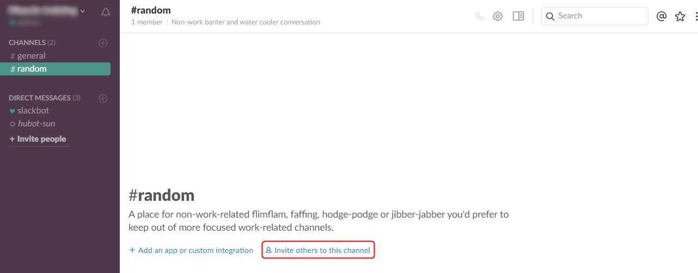

HubotさんはBot界では有名なBotでGitHub社が開発しNode.jsで作り動かすためのフレームワークです。

HubotさんをSlackなどのチャットサービスやwebサービスに追加し、事前にやって欲しいことをCoffee ScriptやJavaScriptでスクリプトを書いて伝えておき、「今日は何月何日？」や、「今日の天気は？」や「猫の画像が欲しい」というような事をチャットで発言すると、それに反応して日付を教えてくれたり、天気を教えてくれたり、猫の画像のURLを張り付けてくれたりします。

HubotはコミュニケーションチャットのSlackのアダプターが元からあるので、node.jsを使い簡単に導入できます。また、Coffee ScriptやJavaScriptなどの多言語と比べて扱いやすい言語でスクリプトを書いて拡張できるので、使い勝手も良いですよ。

そんな有能で有名なHubotさんを会社のSlackチームのメンバーにInvite(招待）してみました。

## 事前準備
SlackにHubotを追加する前に、Slackの登録が必要です。登録されていない方は以下のリンクと記事を参考に登録を済ませてください。

Slackの登録
[card url="https://slack.com/"]

Slackのチーム登録方法
[card url="https://mseeeen.msen.jp/slack-registration/"]

## SlackにHubotを追加する方法
Slack | App Directory
[https://slack.com/apps](https://slack.com/apps)

上記のSlack | App Directoryのリンクをクリックしてください。クリックすると以下の画像のようなページが表示されます。

入力フォームに「hubot」と入力しエンターをクリックしてください。

オレンジ色のロボットのHubotさんがページに表示されたと思います。Hubotの下にあるInstallをクリックしてください。

以下の画像のようにHubotの名前を入力するフォーム画面が表示されます。

(1)Username : Hubotにつける名前を入力してください。

(2)Add Hubot Integration : Hubotを追加する。

Add Hubot Integrationをクリックすると、以下の画像のようなHubotの設定画面が表示されます。

(1)API Token:外部サービスと繋げる際に必要となる、英数字が羅列されているTokenです。Hubotを連携できるサービスがある場合は、これを使い簡単に連携できます。

(2)Upload an image : Hubotのイメージを、パソコンからアップロードして適用します。

(3)Choose an emoji : Slack内に登録されている絵文字ライブラリから画像を選択してHubotのイメージに適用します。

(4)First & Last Name : Hubotに実際の名前のように名前を付けることができます。

(5)What this bot does : このボットは何をするものなのかしているものなのかの説明欄です。

入力が完了したらSlackの画面左側部分を見てください。Direct Messageの部分にHubotが追加されています。

これでSlackにHubotを追加できました。

### チャンネルにHubotを追加する場合
チャンネルにHubotを追加する場合は、左側の追加したいチャンネルをクリックし以下画像の赤枠部分をクリックします。

以下の画面が表示されたと思います。①の部分には他にメンバーがいる場合は、Hubot以外にも表示されていますので、メンバー一覧からHubotをクリック、または入力フォームにhubotと入力します。

Hubotが入力フォーム部分に画像の通り追加されたら、②の部分のInviteをクリックして追加完了です。

### メンバーがチャット内に追加されているか確認する場合
追加したチャンネル内に入り、下図の①の部分のMembersの部分をクリックすると右側の②の部分にメンバー一覧が表示されます。

これでHubotが追加されていれば完了です。