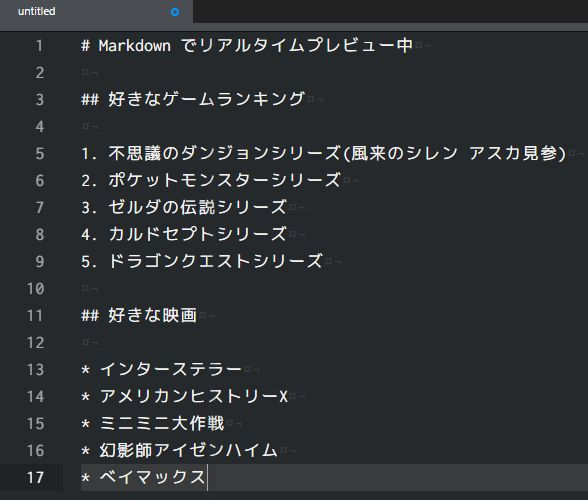
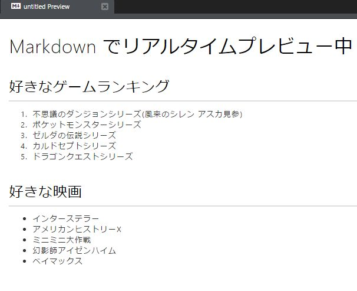
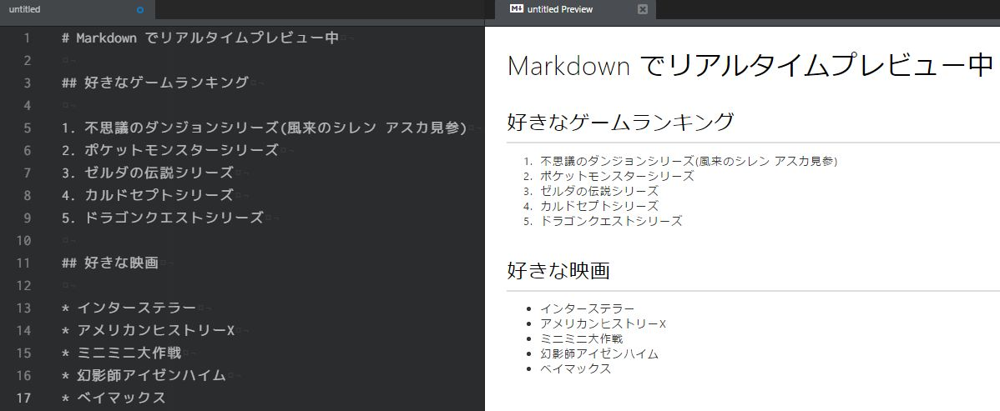
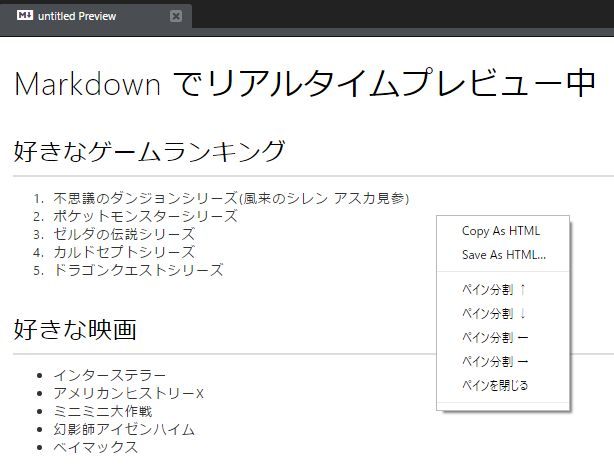

前回の記事で Markdown を紹介しました。

ブログの下書きにはMarkdown(マークダウン記法)がオススメ!
[/markdown-basic-rules/](/markdown-basic-rules/)

今回は、その Markdown を Atom で書いたり見たりする方法を記載します。

## Atom とは

> Atom（アトム）は、GitHubが開発したオープンソースのテキストエディタである。

[Wikipedia](https://goo.gl/MkyiWB) から引用

Atom
[https://atom.io/](https://atom.io/)

Atom は、非常に高性能なテキストエディタ(メモ帳)です。(若干重いけど)

パッケージと呼ばれるソフトを Atom にインストールしていくと、欲しい機能をどんどん追加していくことができます。

このインストール作業は Atom の中で、パッケージを検索してインストールで完了するので、簡単に自分好みにカスタマイズしていけます。

[Sublime Text](https://www.sublimetext.com/) を知っている方は、同じ様な機能を持ったテキストエディタだと思ってください。

私も現在メインで使用しています。

## なぜ Markdown を見たり書いたりするのに Atom が良いの？

Atom にはインストールした時から、Markdown に対応しています。

さらに、Markdown をリアルタイムでプレビューしてくれる機能もあります。

## Atom で Markdown をプレビューする方法

まずは Markdown で何か文章を書きましょう。Markdown の書き方は以下の記事を参考にしてください。

ブログの下書きにはMarkdown(マークダウン記法)がオススメ!
[/markdown-basic-rules/](/markdown-basic-rules/)

例として Markdown で適当に書いてみました。

Markdown で文章が書けたら Atom で開いて、キーボードの **Ctrl + Shift + M** を同時に押してみてください。

右側にプレビューが!

なお、**リアルタイムでプレビューしてくれる**ので、Markdown を書きながらでも大丈夫です。

Atom すごいね！

## Atom で書いた Markdown を HTML で出力する方法

なんと！このプレビューは出力もできちゃいます。

Markdown の**プレビュー画面を右クリックする**とメニューが出てきます。

**Copy As HTML** を選ぶと、クリップボードに HTMLタグがコピーされます。後はテキストエディタ等に貼り付けして使用してください。

**Save As HTML** を選ぶと、保存先を選択できます。保存すると、プレビュー画面のままのスタイル(CSS)を含んだ HTMLファイルが出力されます。

HTMLタグを確認したり、そのままHTMLファイルで見てもらったり、本当に便利ですね。

## まとめ

さすが Atom

さすが GitHub

ぜひ Markdown を書くときは Atom を使ってみてください。

ブログ執筆がはかどります！

## あゆとの雑談部屋

最近、[ドラゴンクエストヒーローズII 双子の王と予言の終わり](http://www.dragonquest.jp/heroes2/) のPS4版を買いました。

しかし、プレイしているとディスクが勝手に飛び出してしまい、ゲームがリセットされてしまうという現象に見舞われて、PS4を修理に出さないといけなくなってしまいました…

実は、ドラゴンクエストビルダーズをプレイしていても、たまに飛び出してきていました。

「いつか修理に出さないといけないなー」と思ってはいたのですが、PS4でトルネを使用しているので、タイミングが…

さすがに今回は飛び出しすぎて、ゲームにならないので観念して修理に出しました。

修理代は約7500円…

なかなかしよる！

一週間ほどで無事にPS4が帰ってきて、満足にプレイできています。

ドラクエヒーローズは1も2もやってますけど、安定して面白いですね～。

9月15日には、[ペルソナ5](http://persona5.jp/) の発売も控えているので、今のうちに修理できて良かったです。

E3 2016 が終わったら、大量のゲームが発表されると思うので、同じ現象に見舞われている方は、今の内に修理しておく事をオススメします…
