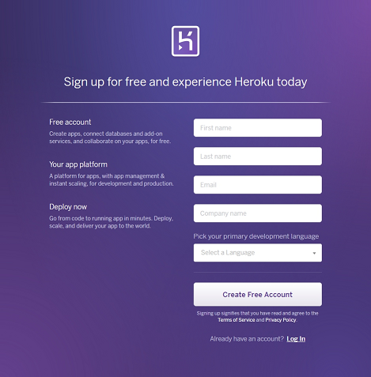
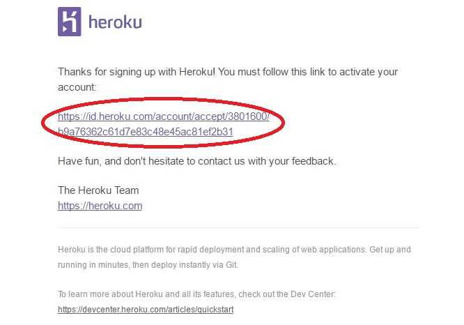
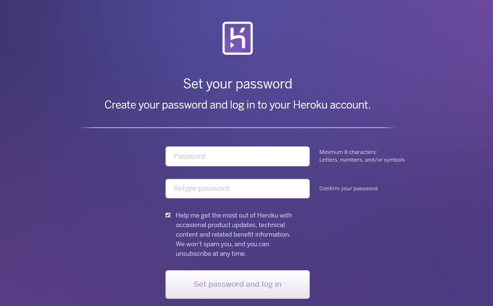
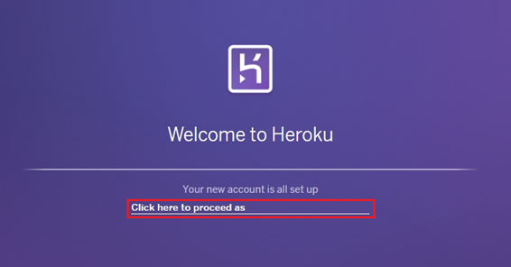
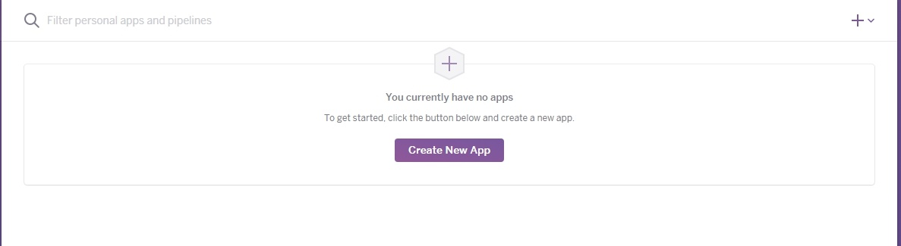

## Heroku（ヘロク）とは
通常、作成したアプリをアップロードする場合、以下の様な準備をしないといけません。

* サーバー用PCやルータなどのハードウェアを購入
* 各種インターネットなどの設定
* データベースの構築
* Rubyなどのアプリケーションの実行環境をセットアップ

この様に用意するだけで時間と費用がかかります。

Herokuはそれらを用意しなくても、簡単にアプリをアップロードする事ができます。Herokuが登場した段階では対応言語はRubyのみでしたが、現在では徐々に対応言語を増やしRuby、Java、Python、Scala、PHP、Go、Node.js、Clojureに対応しています。

またHerokuには、利用しているアプリ（プラットフォーム）に機能を付けられる「アドオン」機能がありサービスを利用・購入する事もできます。

## Herokuアカウントの登録
[Herokuへのアカウント登録](https://signup.heroku.com/login) はこちらから

以下を入力する画面が出てくるので、入力します。

* First name(名前) : 下の名前
* Last name(苗字) : 上の名前
* Email(メールアドレス) : 受信できるメールアドレス
* select a language(使用言語):使いたい言語を選択してください。（slack×hubotで利用される方は node.jsを指定）

入力完了後、Create Free Account(無料のアカウントを作成）をクリックすると、入力したメールアドレスに、Herokuから以下の画像の様な、メールが届くので本文にあるアルファベットや数字の羅列が書かれたURL（赤枠部分）をクリックします。

Herokuのパスワードを設定する画面が出てくるので、同じパスワードを２回入力します。

パスワードを入力すると、設定完了になります。  
下の画像の赤い部分をクリックして、Heroku内ページに移動します。

下記画面が表示されたら、これでHerokuのアカウント作成登録は完了しました。

