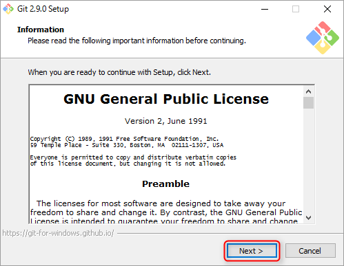
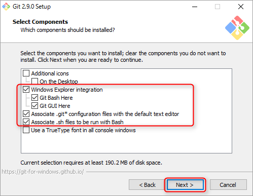
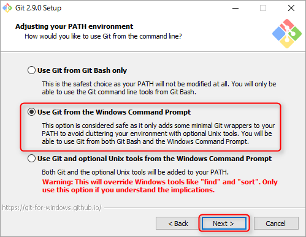
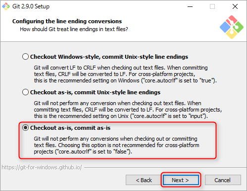
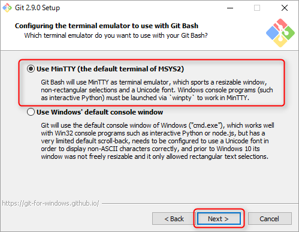
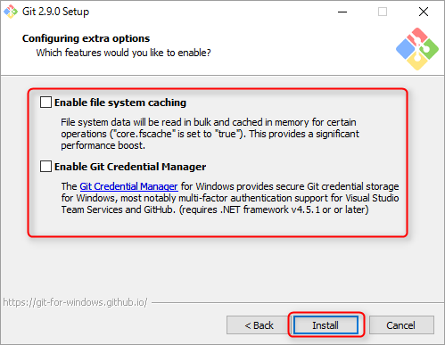
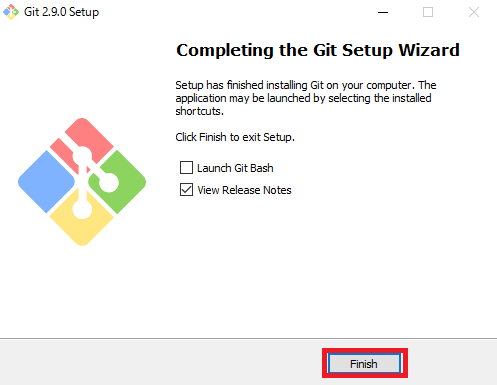

## Gitとは
>Gitとは、オープンソースの分散バージョン管理システムの一つ。複数の開発者が共同で一つのソフトウェアを開発する際などに、ソースコードやドキュメントなどの編集履歴を管理するのによく用いられる。
>
>バージョン管理システムの基本的な機能として、個々のファイルにいつ誰がどのような変更を行ったかを記録しており、必要に応じて特定の日時の版を参照したり、その状態に戻したりすることができる。また、プロジェクトの時系列を分岐（ブランチ）して派生プロジェクトを作成したり、それを再び元の系列に融合（マージ）したりすることができる。
>
<a href="http://e-words.jp/w/Git.html">[出典元:IT用語辞典]</a>

## Gitのインストール
[Git(https://git-for-windows.github.io/)](https://git-for-windows.github.io/)
以下の画像を参考にし、上記のリンクをクリックし、ツールをダウンロードして下さい。

ダウンロードしたファイルをクリックして下さい。クリックすると以下の画像のようなウインドウが立ち上がってくると思います。NEXTをクリックして下さい。

### Gitアイコン・コンテキストメニューの追加、エディタ設定

* Additional Icons :「On the Desktop」にチェックを入れると、Gitのアイコンをデスクトップに追加する。
* Windows Explorer Integration : チェックを入れた項目をコンテキストメニュー（右クリックすると出てくるメニュー）に表示する。
  * Git Bash:Bash機能や、UNIX系のコマンドの基本的なコマンドが使えるコマンドラインツールです。
  * Git GUI:Gitを視覚的に利用できる管理ツールです。
* Associate .git* configuration files with the default text editor : *.gitで始まるファイルをデフォルトのテキストエディタで開くように設定する。
* Associate .sh files to be run with Bash : *.shで終わるファイルをBashで実行するように設定する。
* Use a TrueType font in all console windows : 全てのコンソールウインドウにTrueTypeフォントを使用する設定をする。これにはチェックを入れない方がいいです。（日本語が文字化けする可能性があります。）

赤枠で囲った部分にチェックを入れ、Nextをクリックします。

### Gitコマンドの適用範囲の設定

* Use Git from Git Bash only : BashからのみGitコマンドを利用する。
* Use Git from the Windows Command Prompt: GitのコマンドをWindowsのコマンドプロンプトから使えるようになります。これをおすすめします。
* Use Git and included Unix tools from the Windows Command Prompt : GitコマンドとUnix系コマンドもWindowsのコマンドプロンプトから使用できるようになります。 Windows標準コマンドと同名の実行ファイルがインストールされるため、既存のものに影響を与えます。

赤枠で囲っているものを選択し、NEXTをクリックして下さい。

### チェックアウト時のコードの変換設定

* Checkout Windows-style, commit Unix-style line endings: チェックアウト時に改行コードを[LF]から[CRLF]に変換し、コミットするときに[CRLF]を[LF]に変換します。これはWindows推奨設定です。
* Checkout as-is, commit Unix-style endings : チェックアウト時に、そのままチェックアウトし、コミット時にCRLFをLFに変換します。これは、Unix上での推奨設定です。
* Checkout as-is, commit as-is : リポジトリ内のテキストをそのままチェックアウトし、そのままコミットします。

1番上の選択肢の設定の説明部分にはWindows推奨設定と書いてありますが、Windowsにインストールする場合、赤枠で囲っている部分の設定を推奨します。改行コードの変換はプログラムが正常に認識しないことや、仮想サーバー上で動かないこと、コードが1行で表示されることがあるためです。

赤枠で囲った部分を選択したら、NEXTをクリックして下さい。

### Git Bashを使うときのエミュレーターの選択

* Use MinTTY : MinTTYのコンソールを使用します。GitBashは、端末エミュレータとしてMinTTYを使用します。対話式のPythonのようなWindowsコンソールプログラムをMinTTYで動作させるにはwinptyを介して起動する必要があります。
* Use Window's defoult console window : ウインドウズの通常のコンソールウインドウを使用します。PythonやNode.jsでもWin32コンソールプログラムでうまく動作しますが、ウインドウ幅が変更できない、フォントを選べないといった非常に制限されたデフォルトのコンソールウインドウを使用することになります。

UseMinTTy（the default terminal of MSys2)を選択し、Nextを押して下さい。

### 設定のオプション
基本的にはチェックがある場合はチェックを外し、Installをクリックして下さい。

* Enable file system caching : メモリリソースを使い、gitの処理向上をします。メモリに余裕がある場合は、チェックを入れても構いません。
* Enable Git Credential Manager : Gitのリモートリポジトリにアクセスする際の認証情報をWindowsの資格情報マネージャに保存する。一度入力して保存すると、次からはパスワードを入力せずに利用できます。

インストールが完了したら以下の画面が表示されます。

Finishをクリックして完了してください。これでインストールは完了です。