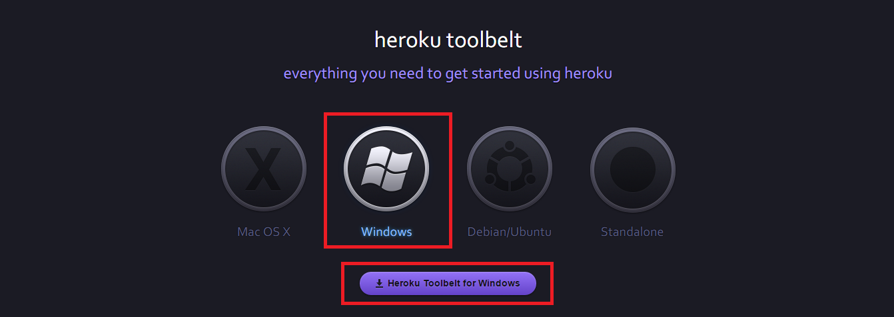
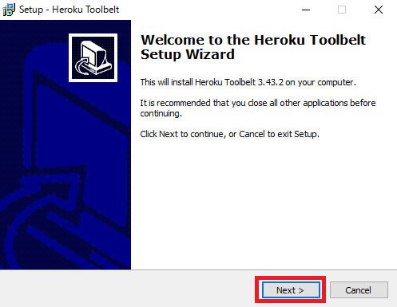
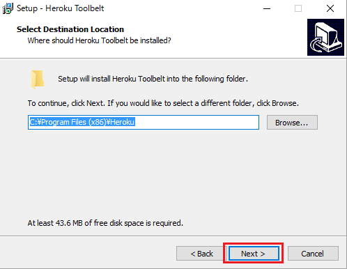
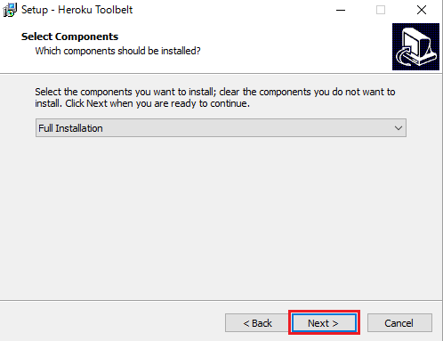
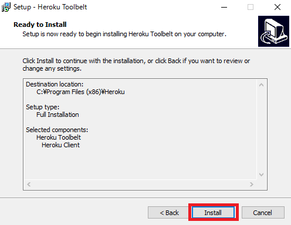
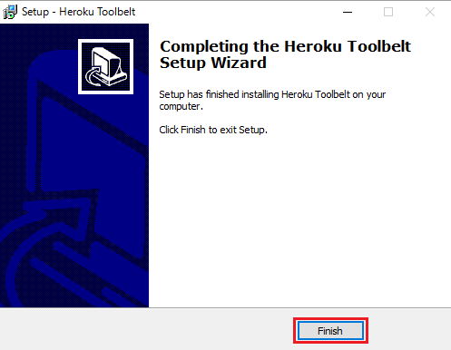

## Heroku Toolbelt（ヘロク ツールベルト）とは
コマンドラインツール(コマンドプロンプト等）でHerokuを操作・管理できるツールです。Herokuでは、主にコマンドラインツールを使用するので、Herokuをコマンドで操作・管理できると、より便利になります。
## Heroku Toolbelt
Heroku Toolbeltのページはこちら
[https://toolbelt.heroku.com/](https://toolbelt.heroku.com/)
 
今回はHeroku ToolbeltのWindows用のツールをダウンロードします。赤枠の部分を選択しクリックしてください。



ツールがダウンロードされたら、そのファイルをクリックして起動してください。  
次に下記の様なウインドウが開くので、開いたら[Next]をクリックします。







次に、[Install]をクリックしてください。



最後に[Finish]を押すと、インストール完了です。



これでHeroku Toolbeltはインストール完了しているので、Herokuを利用されている方は、試しにコマンドを使ってみましょう。

```heroku login```: Herokuにログインします。
```heroku logout```: Herokuをログアウトします。
```heroku create```: Herokuにappを作成する。
```heroku apps```: Herokuに上がっているdyno(アプリ)一覧を表示する。
```heroku run```: Herokuに実行させたいコマンドをrunの後ろに続けて打つ。
```heroku config```: Herokuの環境変数を確認できる。
```heroku open```: Herokuにアップしたアプリをブラウザで開いてくれる。
```git push heroku master```: Herokuにdeployする。

これ以外にも、Herokuコマンドはあるので、使えると便利になると思います。
コマンドについては以下のコマンドラインページを参考にしてみてください。

Heroku Toolbelt command line page 
[https://devcenter.heroku.com/categories/command-line](https://devcenter.heroku.com/categories/command-line)