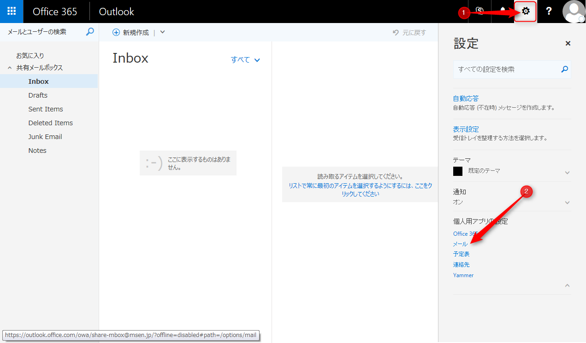

Office365の便利なメール機能に**共有メールボックス**というものがあるのですが、今回はこの共有メールボックスをフル活用するために**自動応答**や**振り分け設定**をするための**メールのオプション**を表示する方法についてご紹介します。

共有メールボックスの作成方法についてはこちらを参考にしてください。

[Office 365 で共有メールボックスを作成する - Office 365](https://support.office.com/ja-jp/article/Office-365-%E3%81%A7%E5%85%B1%E6%9C%89%E3%83%A1%E3%83%BC%E3%83%AB%E3%83%9C%E3%83%83%E3%82%AF%E3%82%B9%E3%82%92%E4%BD%9C%E6%88%90%E3%81%99%E3%82%8B-871a246d-3acd-4bba-948e-5de8be0544c9)

## 共有メールボックスにアクセス

１．ページ右上にある**ユーザーアイコン**をクリックし、ユーザーメニューの**「他のメールボックスを開く」**をクリックします。

２．表示されたダイアログのテキストボックスに、アクセスしたい共有メールアドレスを入力し**「ディレクトリの検索」**をクリックします。

３．対象の共有メールボックスの内容が表示されるので、下部の**「開く」**をクリックします。

アクセスしたい共有メールボックスが、新しいタブで開かれます。

## メールのオプションを表示

１．アクセスした共有メールボックスのページ右上にある**歯車のアイコン**をクリックすると設定メニューがひらくので、メニュー下部にある**メール**をクリックします。

共有メールボックスのメールのオプションが左側に表示されます。

後は、通常のメールアカウントと同様に**自動応答**や**振り分け設定**を行うことが可能となりますので、用途に応じて設定をカスタマイズしてください。

共有メールボックスは、記憶域のクォータが**50GB**を超えるまでは、ライセンス不要で使用できます。複数人で1つのメールアドレスを共有するだけでなく、1人で複数のメールアドレスを使い分けるといった用途にも使用できますので、どんどん活用していきましょう。