## IFTTT（イフト)とは
IFTTT(イフト)とは、「レシピ」と呼ばれるWebサービス同士を連携させて作ったトリガープログラムを簡単に実装できるサービスです。このサービスの特徴である「if this then that」の頭文字ををとってIFTTTです。

例えば

* (if) もし
* (this) Office365 outlookにメールが来た
* (then) 時、場合
* (that）指定したSlackのチャンネルにタイトルと本文を通知する

という事ができます。
## IFTTTのアカウント登録
IFTTT 公式
[https://ifttt.com/](https://ifttt.com/)

公式サイトにアクセスし、下記の画像の赤枠部分(Sign Up)をクリックしてください。

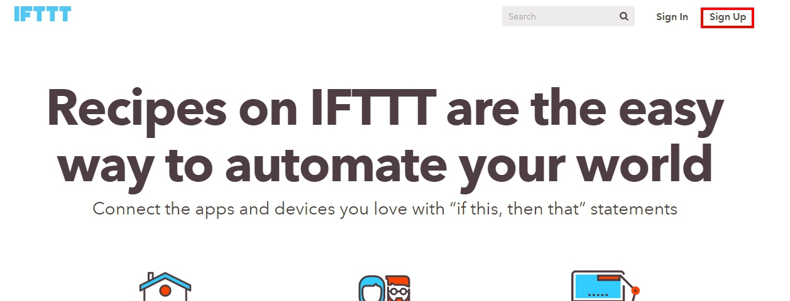

メールアドレスと、パスワードの登録画面が出てきたら入力し、Create accountをクリックします。

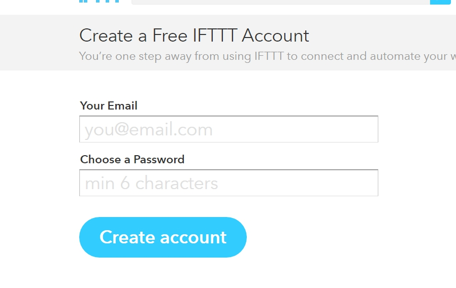

次に、大きい英文字が書かれた画面が出てきたらthisの部分をクリックします。

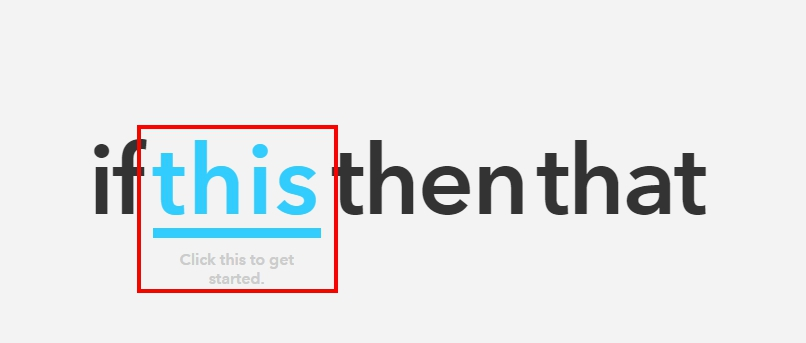

そして、赤枠の中にあるthatをクリックします。

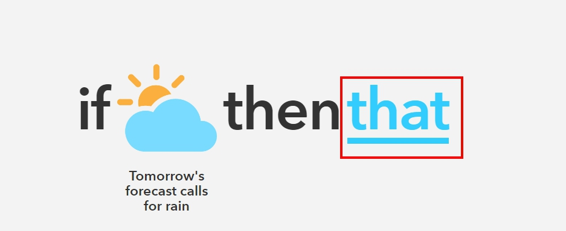

以下の画面が表示されたらContinueをクリックします。

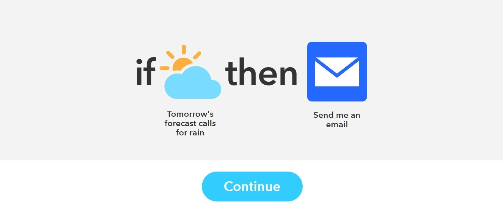

Continueを押した後、次のような画面が表示されると思います。この画面では「興味のあるサービス」や「使ってるサービス」を選択して下さい。**3つ以上選ばないと先に進めない仕様**です。

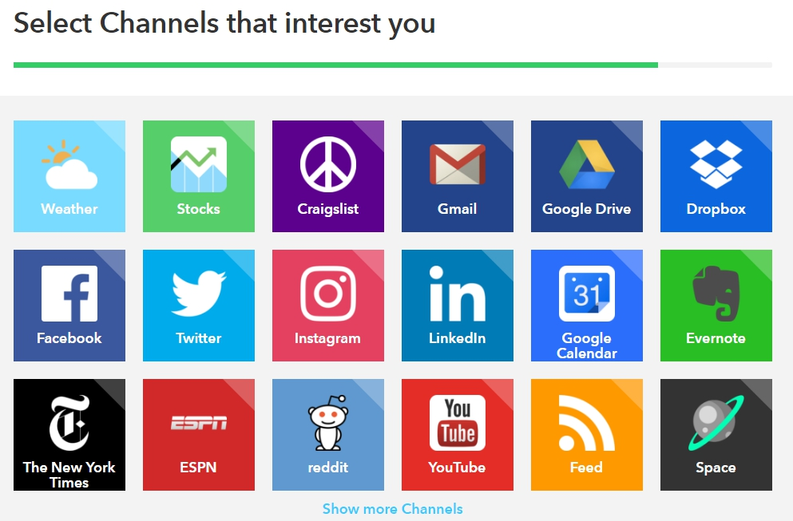

選択すると、画面が切り替わり、Recipe for you と表示された後、先ほど選択したサービスを元に色々な組み合わせのレシピを自動で作ってくれます。

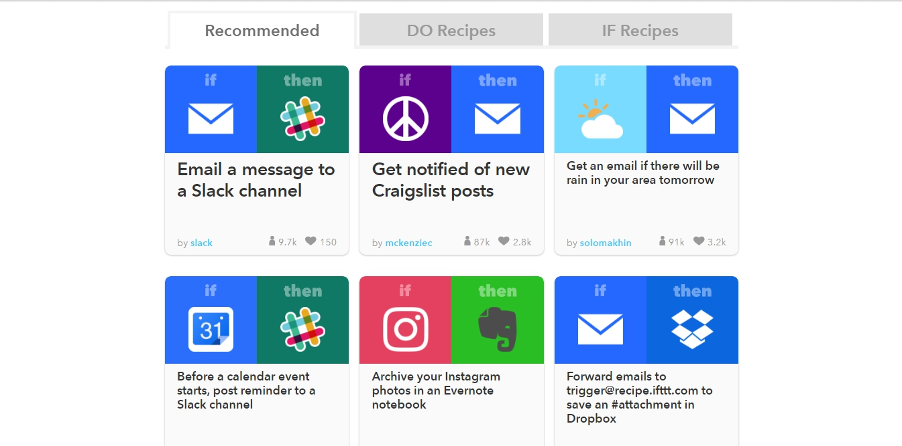

これで、アカウントの登録は完了しました。  
## IFTTTでサービスを連携させる
オリジナルの連携パターン（recipe：レシピ）を作ります。以下の赤枠で囲まれた位置にあるMy Recipesと書かれた部分をクリックします。

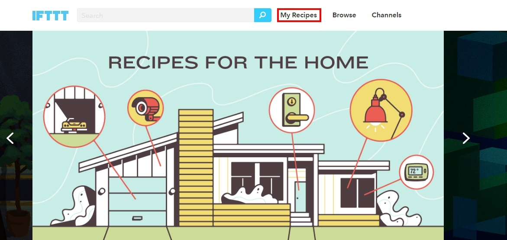

赤枠で囲まれたCreateRecipeをクリックします。

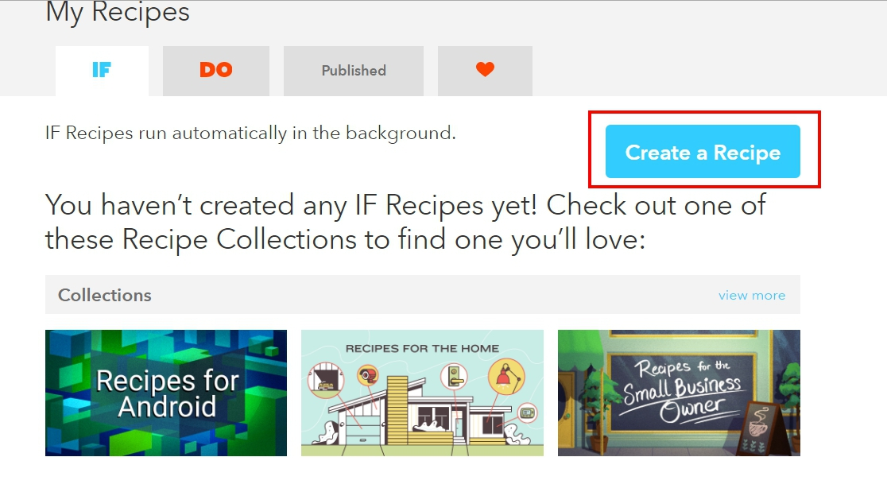

### Recipeのthisの設定
クリックすると、様々なサービスのアイコンが出てきますので、自分が起点とさせたいサービスを選択します。

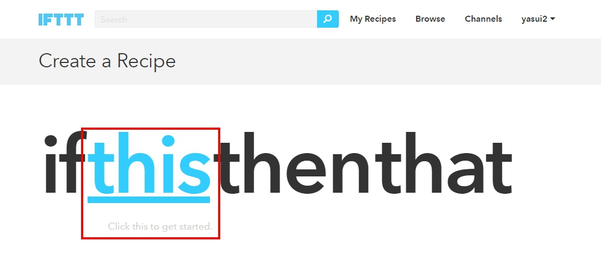

今回はOutlookメールで行いたいと思います。Outlookの場合は、Office 365 Mailを選択します。

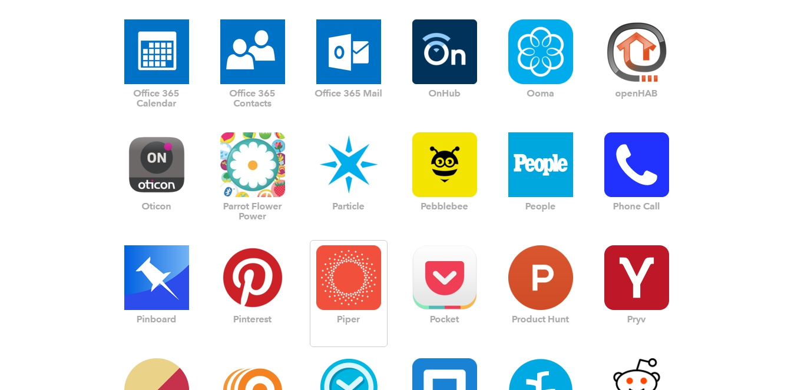

Office 365をクリックすると以下の画面が表示されます。そのままConnectをクリックしてください。

クリックすると、OutlookのIDとパスワードを求められると思います。入力して完了してください。完了すると下記の画面が表示されるので赤枠部分をクリックしてください。

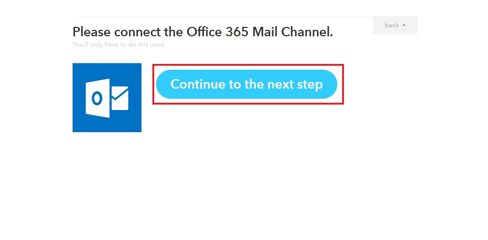

次にthisの部分を、どの条件にするかを選択します。以下の画像の通り3つのパターンを選択できます。

* 受信ボックスにメールが来た時（画像左）
* 設定した人からメールを受信した時(画像中央）
* 優先度の高いメールを受信した時(画像右）

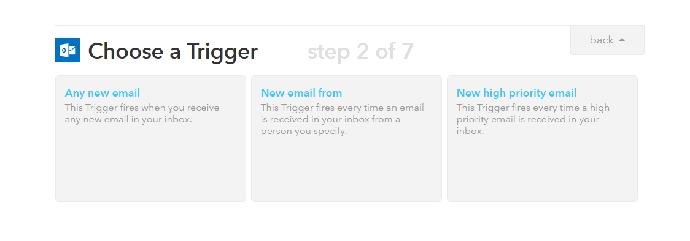

#### Any New Emailを選択した場合
以下の画像の様な画面が表示されます。Create Triggerをクリックしてください。

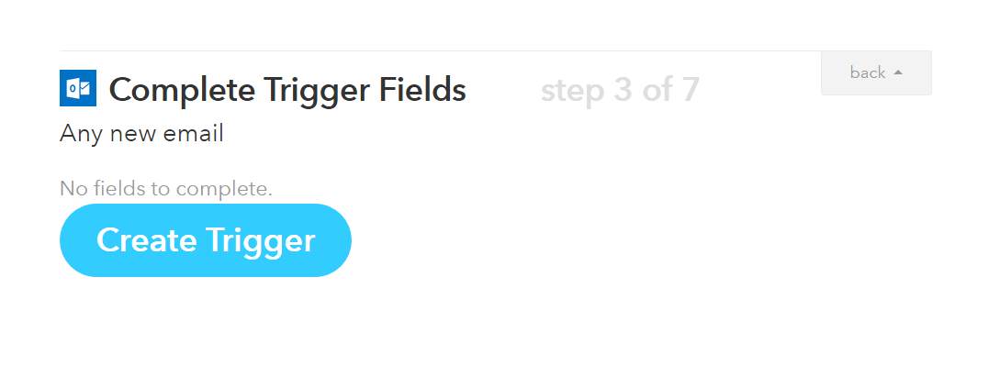

#### New email fromを選択した場合
Sender's addressの部分に、メールが来た時に通知して欲しいメールアドレスを入力します。入力したらCreate Triggerをクリックしてください。

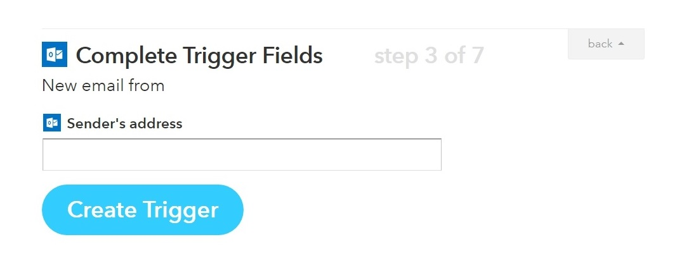

#### New high priority emailを選択した場合
以下の画像の様な画面が表示されます。Create Triggerをクリックしてください。

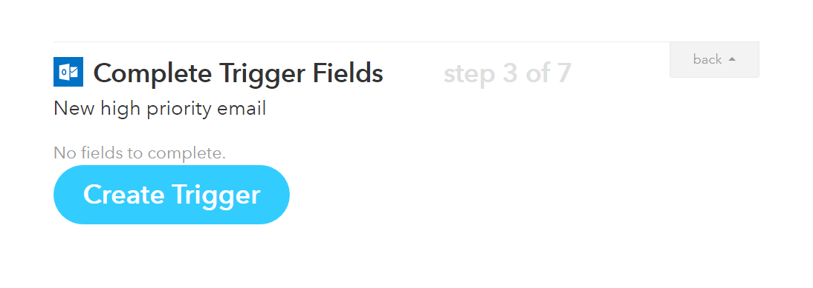

### Recipeのthatの設定
thatは、thisで設定した条件が満たされた時に何をさせるのかを設定します。

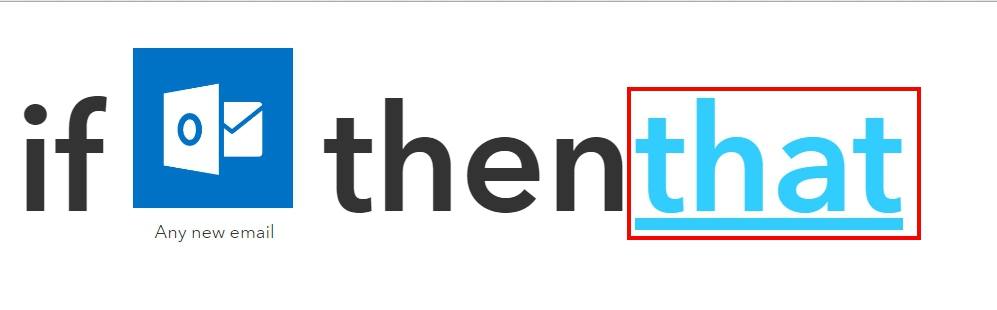

今回はSlackに通知をさせるので、Slackを選択します。

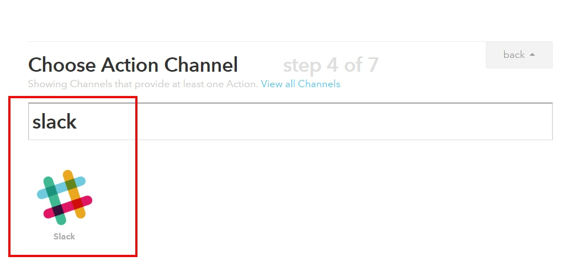

SlackはPost to channelの選択肢のみですので、Post to channelをクリックしてください。

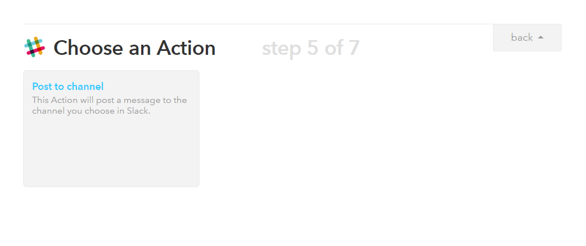

以下の画面が表示されたら、設定をしてください。フォームにカーソルを合わせると画像のようにフラスコマークが表示され、クリックすると追加したい要素のタグを追加できます。

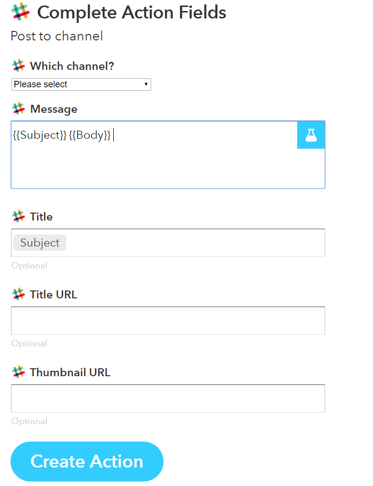

* Which channel? :通知投稿したい、Slackのchannnelを選択します。
* Messege : Slackの本文に表示したいものを選択します。
* Title : Slackに通知される時のタイトルに何を表記するかを設定します。
* Title URL : タイトルにURLを追加します。
* Thumbnail URL : 追加したURLのサムネイルをスラック上で表示します。

入力出来たら、Create Actionをクリックします。

以下の画面が表示され、間違いがなければ、Create a Recipeをクリックします。

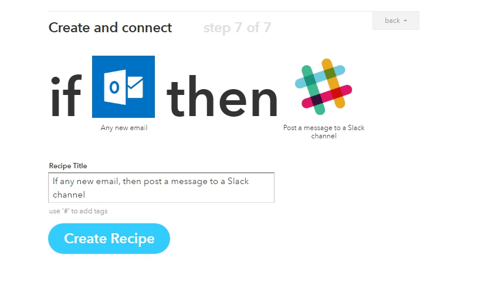

以下の画面が表示されたら、Recipeの作成は完了です。実際にメールを送信し、Slackに通知されるか確認してみましょう。**IFTTTは15分くらいラグがある時があります**。設定は間違っていないけれど、通知が来ない場合は赤枠部分の更新マークを押してみてください。

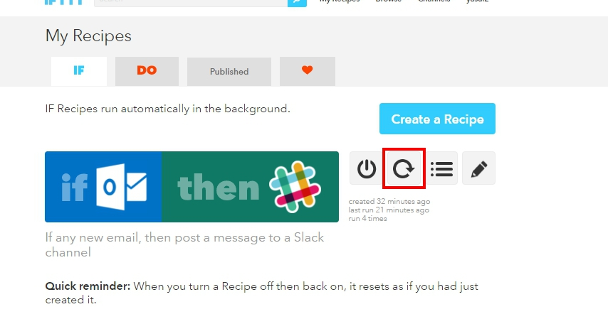

IFTTTは、一つだけの設定だけでなくいくつかを連携させて、使えるので組み合わせ方次第で相当効率化されると思います。
