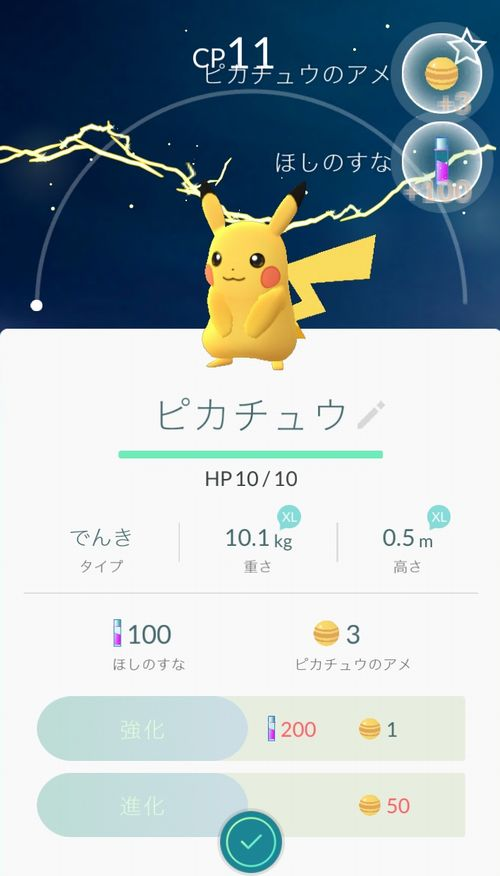
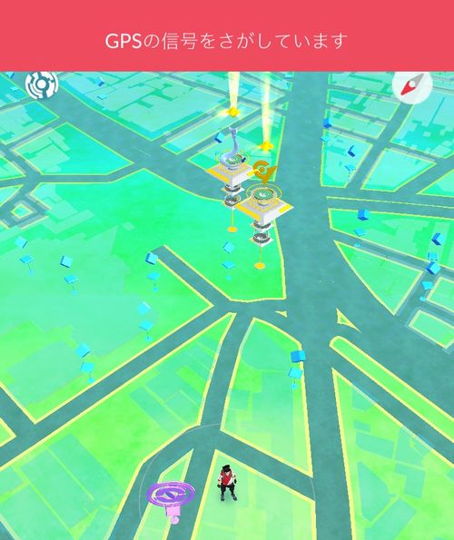

いよいよ配信が始まりましたね！

**ポケモンGO**

私も昼休憩にインストールして、さっそくスターターポケモンにピカチュウをゲットしてきました。

意外とモンスターボール当てるの難しいですね～。
5個くらい無駄にしちゃいました。

そこから会社近くのポケストップを周りながら会社に帰る時、急に iPhone の画面に**「GPSの信号をさがしています」**という表示が出て操作不能になりました…

## GPSの信号をさがしていますの解決方法

この画面になってしまうと、GPS情報が取得できずにポケモンGO がプレイできなくなります。

この状態を解決する方法をいくつか発見したので記載しておきます。

どの方法で解決できるかは、それぞれの方の環境によると思うので、いくつか試してみてください。

### 位置情報がオンになっているか確認する

そもそも位置情報がオンになっているか確認しましょう。

位置情報がオンになっているかの確認手順は

1. iPhone の設定アプリを開く
2. プライバシーをタップする
3. 位置情報サービスをタップする
4. 位置情報サービスがオンになっているか確認する
5. 同じ画面の下の方にある、Pokemon GO をタップする
6. この App の使用中のみ許可にチェックが入っているか確認する

これで、全体の位置情報の確認とポケモンGOアプリの位置情報の確認ができました。

### アプリを開き直す

iPhone のホームボタンを押して、ポケモンGO を開き直すだけです。

### アプリを再起動させる

iPhone のホームボタンを素早く2回押して、ポケモンGOの画面を上にスワイプ（弾く）してアプリを終了させます。

その後に、再度ポケモンGO を起動します。

### 電波やGPSが届いているか確認する

地下鉄等の電波や GPS が入りにくい場所でも表示される事がありますので移動してみましょう。

### ネットワーク設定をリセットする

**上記の方法を全て試してもダメな場合のみお試しください。**

どうしてもダメな場合は、iPhone のネットワーク設定をリセットします。

ネットワーク設定をリセットすると

* Wi-Fiのパスワード
* Bluetoothの登録記録
* VPN設定
* APN設定

がリセットされます。

リセットを行うと、**Wi-Fiの再設定**が必要となる事は覚えておいてください。

ネットワーク設定のリセットの手順は

1. iPhone の設定アプリを開く
2. 一般をタップする
3. 一番下のリセットをタップする
4. ネットワーク設定のリセットをタップ
5. パスコードを入力
6. 自動再起動

これでネットワーク設定のリセットができました。
再度、ポケモンGO のアプリを開いてプレイしてみてください。

## 上記の方法で解決できない場合

もしこれらの方法で解決できない場合は、ポケモンGO の動作環境に合っていない場合があります。

対応端末：iPhone 5・5c・5s・6・6s・6 Plus・6s Plus・SE

対応OSバージョン：iOS 8以上

## あとがき

ポケモンGO をプレイしていると結構頻繁になる状態なので、上記の方法を試してみてください。

さぁ、街に繰り出してポケモンゲットですよ～！