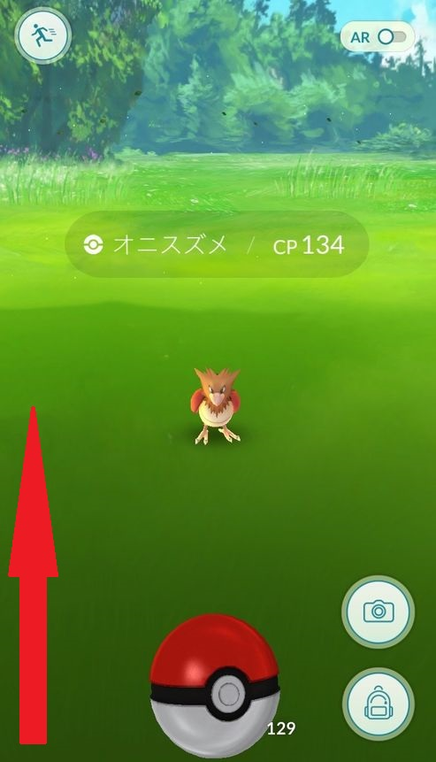

昨日ポケモンGOが配信されてから、ひたすら街中のポケモンをゲットしていっています。

何度も何度もモンスターボールを投げる内に、ポケモンにモンスターボールを当てる事に慣れてきて、ほぼ一発で当てられるようになりました。

皆様がポケモンにうまくモンスターボールが当てられるようにコツを書いておこうと思います。

## ARモードをオフにする

ポケモンGOは現実世界とのリンクを重要にしているので、ARモードと呼ばれる現実世界の風景の中で、ポケモンをゲットする事ができます。

しかし、この機能はポケモンにモンスターボールを当てる事への難易度をかなり上げてしまいます。

理由としては

* ポケモンが風景に溶け込む場合がある
* 端末を向ける方向や傾きによってポケモンとの距離感が変わる
* 端末を動かすと画面外にポケモンが出てしまう

なので、少し味気なくなりますが、ARモードをオフにします。

画面右上のARボタンをタップするとオフにできます。

するとこんな感じの仮想空間になります。

ARモードオフの最大の利点は、**ポケモンを画面中央に固定できる**ということです。

簡単に言うと、的（ポケモン）が常に一定の場所にいるということなので、モンスターボールを容易に当てられるようになります。

## 画面端モンスターボール投法をマスターする

上記のARモードオフだけでもかなりの効果が得られますが、これから説明する**画面端モンスターボール投法**も合わせて使う事により、ほぼ一発でモンスターボールを当てられるようになります。

操作は簡単で、モンスターボールを投げる時に、**左画面端にそって少し勢いをつけて真上に投げる**というものです。

こうする事によって、左端から真上に投げているのに、**自動的にポケモンに向かってカーブがかかり**、当たります。

なぜ自動的にカーブがかかるのかは謎ですが、とにかくポケモンに向かってモンスターボールが飛んでいきます。

また、少し勢いをつけて投げないと、なぜか画面外にモンスターボールが飛んでいってしまうので、少し慣れが必要かもしれません。

実際にやってみると「スゲー！」となるので、お試しあれ。

## あとがき

この2つの方法を使うと、モンスターボールをかなり当てやすくなるので、貴重なモンスターボールを温存する事が可能です。

ただ、モンスターボールを当てやすくはなりますが、その後ゲットできるかは運次第ですね～。

プレイヤーレベルが12になると、急激にポケモンがゲットしにくくなるので、そこまでは今回の方法でモンスターボールを温存しておきたいですね。