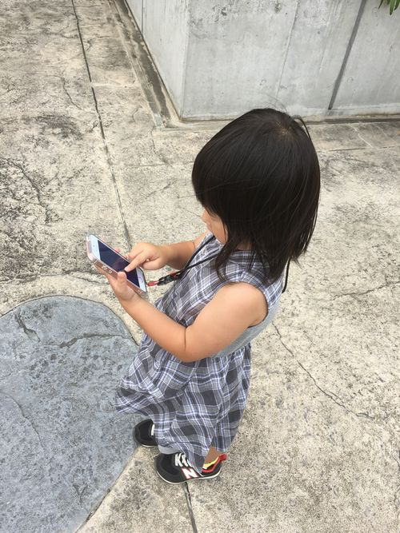

今日はお休みなので、子供と一緒にポケモンGOを一日プレイしてきました。

私は自分のスマホで、娘は嫁のスマホでプレイ中です。

公園とかポケモンGOプレイしてる人だらけですね～。

公園等では結構ルアーモジュール（課金アイテム。ポケモンの出現率が上がる。周囲の人も効果がある。）を使ってくれている人も多くて、そういう場所には人だかりができていました。

さて、今日一日子供と行動して、色々と必要な物や注意点が見えたので書いておきます。

## 持ち物（必須）
* 水筒
大きめの水筒が良い。
* 帽子
この季節の日照りはヤバイ。
* タオル
子供は汗っかき。
* ティッシュ
* ウェットティッシュ
* 絆創膏
スマホを操作しながら動く事もあるので、子供はよく転びます。

## 持ち物（あればよい）
* 子供用のスマホネックストラップ
首からスマホをぶら下げられるやつです。これが無いとスマホを落とされまくります。
* モバイルバッテリー
しっかり充電されたスマホがあれば不必要ですが、休憩時に充電できる環境じゃなければ必要になります。

## 注意点
* 目的地まではスマホを操作させないようにする
ポケストップやジム等は事前に目的地の画像を見せておき、実際に子供に探させるようにしましょう。目的地の画像はゲーム内の画面でポケストップ等をタップすれば確認できます。
* 公園等、比較的安全な場所でのみ歩きスマホを許す
もちろん公園でも子供ひとりにしないようにしましょう。
* できる限り、子供にポケモンをゲットさせる
大人が代わりにゲットしてはダメ。モンスターボールを無駄にしても、子供にゲットさせる事が大事です。ただし、レアなポケモンはゲットできないと、泣いちゃう事もあるので手伝ってあげましょう。
* ARモードはオンにする
ゲットの効率は下がりますが、子供は自分が見ている景色の中にポケモンがいるという感じが嬉しいので、ゲットした時の感動が大きいものになります。
* 一緒に喜んであげる
例えポッポでも、大げさに「ポッポ、ゲットできたね！やった！」と喜んであげましょう。
* できる限り歩いてポケモンGOをプレイする
まだ自転車に乗れない子供とプレイする時は、自転車で行動すると親だけ運動している事になってしまうので、子供と一緒に歩くと健康にも良いと思います。
* 帰る時間を決めておく
帰る時間を決めておかないと、夢中になり子供の体力の限界を忘れてしまいます。
私の娘は4歳ですが、１回の外出で2時間が限界でした。
最悪、この猛暑の中、抱っこして帰らないといけなくなりますｗ

## あとがき
街中には色んな人がポケモンGOをプレイしていますね。

驚いたのが、子供のスマホ所持率。親の物を借りているのかどうかはわかりませんが、小学生くらいなら普通に友達とスマホを持ってプレイしていました。

しかし、ポケモンGOはしっかりルールを守れば良い面が多いですね。

驚くほど歩くので健康にも良いですし、子どもとのコミュニケーションにも役立ちますし、子供を長時間連れていけるので嫁も喜びます。

任天堂って、こうでなくちゃですね。