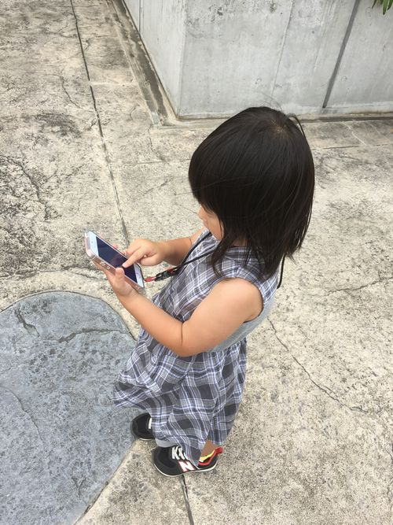
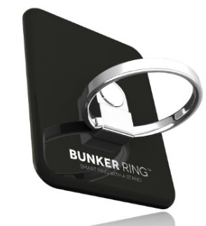
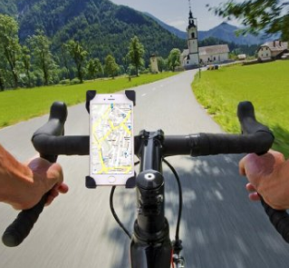
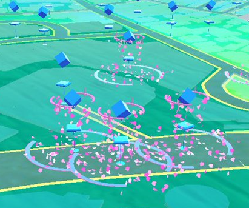

街を歩いていてもポケモンGO のプレイヤーにすれ違わない日はありません。

これだけ社会現象になれば、ポケモンGO をビジネスに活かそうとする企業が続々現れるハズです。

ということで、「ポケモンGO が配信されて儲かるだろうなー」と思う業種と、「ポケモンGO が配信されてヤバくね？」と思う業種をご紹介します。

## 儲かる業種

### 携帯電話（スマホ）

ポケモンGO をプレイするには、そこそこの性能が必要なので、買い替え需要があるハズです。

ガラケーからスマホにする人も、流行に乗りたいという理由での新規加入者も増えるでしょう。

[card url="http://pc.watch.impress.co.jp/docs/news/1012245.html"]

ポケモンGO とタイアップしたサービスで、新規加入者や機種変する人を応援する会社も出てきそうです。

新規加入者にポケモンGO で使える通貨「ポケコインを最大何円分プレゼント！」とかしそうですね。

### スマホアクセサリー

ポケモンGO はゲームの性質上、常にアプリを開いておかないといけません。このせいで電池の消費がマッハです。

この悩みを解決してくれるのが、**モバイルバッテリー**ですね。

今は大容量でも安くなってきているので、めちゃくちゃ売れると思います。

後は、プレイ中のスマホ落下対策の為に、**ホルスター**や**ポーチ**。防水性があるものも多いので雨の日も安心。

子供も大人も使える**ネックストラップ**。

ちょっとオシャレに持ちたい方は**ホールドリング**。

このあたりが売れそうです。

この分野に関しては、ポケモンGO プレイヤーとしては必須なので、キャンペーンをする必要もないかと思いますが、何かやってもらいたいですね。

ただ、これらは類似商品が多すぎるので、目立たせる為に、ポケモンデザインのものが売りだされると良いかもしれません。

### 靴屋

ポケモンGO は位置ゲーなのでとにかく歩きます。

ウォーキングブームとかでもそうでしたが、**ウォーキングシューズ**や**ランニングシューズ**が売れます。

私も new balance のウォーキングシューズを新調しちゃいました。
[card url="http://shop.newbalance.jp/products/newbalancema85br1.html"]

ポケモンGO とタイアップして、専用デザインのシューズとか売り出したら飛ぶように売れそうです。

また、ポケモンGO の画面を見せて、歩いている総距離に応じて割引とかやっても面白そうですよね。

### 自転車屋

ポケモンGO は自転車との相性が良く、歩くよりも効率が良くなります。

「ポケモンGO で自転車使うし、この際にちょっと良い自転車買っちゃうか！」という人が間違いなく現れるハズです。

主に**シティーサイクル**が売れますね。

### 自転車用アクセサリー
ポケモンGO を自転車で走行しながらプレイするとなると、かなり危ない（というか最近だと最悪捕まる）ので**バイクホルダー**が売れます。

ポケモン出現時のバイブが鳴った時にいちいちポケットから出してると、そのうちスマホ落下による画面パリーン事案や故障になりかねないので、自転車でポケモンGO をプレイする人は、何かしらのホルダーを買っておきましょう。

修理するより圧倒的に安いと思いますよ。

### 飲食店
これだけ街に人が出ると儲かるのが飲食関係ですよね。

特にポケモンGO のプレイ中に気軽に立ち寄れる**カフェ**が人気になるでしょう。

ポケモンGO にはルアーモジュールという課金アイテムがあり、これを使うと30分間その周辺にポケモンが大量に出現するようになります。この効果は他のプレイヤー全員に効果があるので、客寄せにはピッタリです。

ルアーモジュールを使うと上の画像の様にマップ上に花が咲くので、宣伝費をかけずとも勝手に人が寄ってきてくれます。

ただ、この方法はポケストップと呼ばれる一定の場所にしか使えませんが、ポケモンGO はこのポケストップの権利を販売する予定です。

[card url="http://www.itmedia.co.jp/news/articles/1607/14/news066.html"]

これは登録店増えるだろうなー。

「うちの店はポケモンGO 登録店です。何時～何時の間はルアーモジュールタイムです。プレイヤーの方にはサービスします。」とかやりそうですね。

ルアーモジュールを使う時間を色々考えたら、普段は暇な時間帯や狙った時間に客を呼べて良さそうですね。

wi-fi完備して、充電もできるようにしたら、ポケモンGO プレイヤーの憩いの場所となるでしょう。

ポケモンラテアートとかやると女の子もいっぱい来そうですね～。

すでに商店街でもポケモンGO を利用しての集客が始まっているみたいです。
[card url="http://www.asahi.com/articles/ASJ7Y6V9ZJ7YPTIL01Z.html"]

### ポケモンGO 関連
個人的にあまり儲かってほしくはありませんが、ヤフオクにポケモンGO 関連（アカウント販売や代行サービス）が大量に出品されています。

[card url="http://goo.gl/2898eI"]

これらの商品を落札してプレイしても、**間違いなくBAN（アカウント停止）される**ので、絶対に手を出さないようにしましょうね。

## 儲からない業種

### ソーシャルゲーム
上にも書かせてもらいましたが、ポケモンGO は常にアプリを開いて遊ぶゲームです。

この事から、自然と他のスマホアプリは起動しなくなるので、**他のソーシャルゲームの売上は落ちる**でしょう。

端末の性能によっては他のアプリを開いてしまうと、ポケモンGO が落とされてタイトル画面からロードのやり直しになってしまうので、非常に面倒になり、最悪他のソシャゲを引退してしまいます。

実際、私も[星のドラゴンクエスト](http://www.dragonquest.jp/hoshidora/)を引退してしまいました。

まだ続けられているのが、依存性の低くプレイ時間が短い、[ポケとる](http://www.poketoru.jp/) と [預言者育成学園](http://yogensha.jp/) だけです。

プレイ時間を長くとられるソシャゲはポケモンGO をプレイしながらだと無理ですね。

ただ、ポケモンGO からスマホデビューした方は、他のソシャゲに触れてみようとするかもしれないので、ワンチャンあるかもしれません。

他のソシャゲからすれば、こういう客層は取り込み辛かったのでありがたいですもんね。

### テレビ
家でテレビ見ている暇があったら街に繰り出してポケモンをゲットします。

私は結構アニメとドラマを見るのですが、今期は若干諦めました。

さんまさんもラジオでポケモンGO について発言していたみたいです。

[card url="http://news.livedoor.com/article/detail/11803286/"]

個人的にはポケモンGO をも取り入れた視聴者の獲得に乗り出して欲しい感じですが、スポンサー（他ソシャゲ会社）の事もあり、こういう発言しているんでしょうね。

## あとがき

もちろん**ビジネスというのは、そう簡単な話でないので、儲かる儲からないというのは一概に言えません。**

まわりまわって儲からないだろうと言われていた業界が儲かったりする場合もあります。

自分でこの記事書いてて色々買いたくなるくらい、ポケモンGO は経済を動かすアプリなのは間違いありません。

個人的にあまり物欲は無いんですが、ポケモンGO に課金するより、他の物を買ってしまいそうです・・・