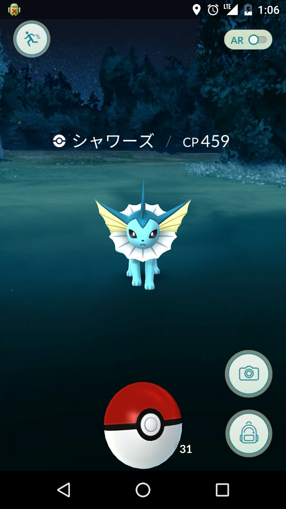

以前、ポケモンの攻略情報サイトでみたことがある**ジムの防衛ボーナスカウントは10個**までというのを見て、ジムを10個以上取れる人なんていないから嘘言ってるんだろうと思ったので検証してみました。

私はガチ勢のレベル帯でなく、ジムは落とせるが長期で防衛できる程ではないレベル26なので運も必要です。

## ボーナス10個をとるにあたって準備したこと
* **きずぐすり系アイテムを沢山準備**
ジム戦をするとポケモン達のHPが少なくなり、そのままでは戦えなくなるため、きずぐすり系のアイテムを200個以上準備しました。
* **CPの高い戦えるポケモンを出来るだけ多く準備**
ボーナスを貰うにはポケモンをジムに配置していかないといけません。弱いポケモンだと、すぐに落とされてしまい時間稼ぎもできないため、多くの戦えるポケモンを用意しておくことで戦闘も楽になり、配置するポケモンも選択肢が増えるため、CPの高い強いポケモンを準備しました。
* **人が多くない場所を調査**
プレイヤーが多いとジムに配置できたとしても、短時間で落とされてしまうため、人が少ない場所をあらかじめ調査しました。
* **強敵が少ない地域を調査**
強いポケモンが陣取っている地域は、こちらの強いポケモンを配置しても簡単に落とせると思うプレイヤーが多くいる確率が高く、一体だけしか置いてないことが分かると狙われて落とされるため、なるべく自分の配置するポケモンが強敵だと思われる地域を調査し選択しました。
* **移動のしやすい地域を選択**
ジムを維持しながらジムを落として配置していくには、移動距離が長く、時間もかかります。移動する時に人が多いと移動もしずらく事故などの可能性も出てくるため、人が多くなく、移動しやすい道の大きな場所、ジムがなるべく密集している場所を選択しました。
* **人が少ない時間帯を選択**
夏は日が落ちてくる夕方から深夜0時までは、ガチ勢から一般のポケモンGOプレイヤーが活動しているので、比較的プレイヤーの少ない深夜帯から朝方を選択しました。
* **人があまり活動しない曜日を選択**
統計によると飲食店の来客数は火曜日、水曜日は人が少ないということなので、あまり人が出歩いていないであろう曜日を選択しました。
* **モバイルバッテリ―の充電**
ジムを制圧中に電池がなくなると、バッテリーを買いに行ってる時間や充電しに行ってる時間にも配置しているジム数は減っていくのでしっかり充電しました。
* **自転車のタイヤをブリジストンのタイヤへ変更**
通常の自転車のタイヤはブリジストンタイヤに比べ柔らかく、私の様に体重が重いとパンクしやすいので、硬めのブリジストンタイヤ選択しました。

以上をして、10ジム以上に配置しても防衛ボーナスはカウントされないのか検証しに行ってきました。

## 経路
経路は桜ノ宮公園 - 中之島 - 大阪駅方面（HEP辺り） - 天神橋筋6丁目付近 - 都島 - 京橋 - 野江

今回ジムを制圧するために回っていて気づいたことは、平日の繁華街は人が少なく、さらにポケモンGOをしている人達は、マクドナルド等のファーストフード店にいる人か、帰宅途中の人くらいでした。夜中の終電後の繁華街のジムをとっている時は連続で増えていったので、**平日の繁華街のジムはねらい目**なのかもしれないということです。

## ジム制圧時系列
以下の地図の通りに行き、桜ノ宮橋の下部分のジムから順に中之島までで3つほどジムを制圧し、中之島のバラ園にあるジムを制覇して、この時点で4つ制圧しました。実は10個もとれると思っていなく最初のスクリーンショットを取っていなかったのが悔やまれます。

中之島バラ園の下の道をぐるっと回って、ここは川に囲まれていて涼しいし蚊もいないし、芝生もあってマッチョなお兄さんが筋トレしていたり、カップルがデートしていたりデートスポットやな～と思いながら中央公会堂の方へ上がりました。ポータルが4つ重なっている部分をぬけ、北浜方面へ向かうと赤枠部分に激弱シャワーズが出てきました。なにか運が向いているのを感じちゃってます。

ここまででポケモンGOを始めてから最高の6ジムを達成します。ここで私はボーナスをゲットしちゃいます。もったいない！※ボーナスボタンは22時間に1度しか押せません。ボーナスはジム配置している数(最大10配置)×10のボーナスに星の砂500とポケコイン10のボーナスが貰えます。

中之島のバラ園を抜けると北浜駅の方にしか行けなかったので、ぐるっと橋を渡り北浜駅の方へ、そこから見えるジムをタッチし、簡単に倒せそうなジムや、配置できそうなジムを探しそこに向かいジムに配置していきました。

自転車を走らせジムにポケモンを配置し、HEPのマクドナルドまでの間は中々ジムへの配置数が増えず、配置してもすぐ取られるという状態が続き、1時間かけて1つ増の7ジムでした。

HEPからは以下の様なルートをとりました。この辺はお寺が多く、ジムも多く、自チームで配置できる枠が空いてたところが多かったため、スムーズに増やせました。移動中に取られた分を上回る数とれたのが大きかったです。

HEP周辺のマクドナルドから約8分ほどで8ジム制圧。

その3分後に、9ジムへ配置しました。これはいけるっ!もうすぐで10ジム!!と思いきや、それは簡単に問屋が卸しません。ここからが長かったです。よし後1つで10ジム制覇と思い、簡単に配置できそうな桜ノ宮駅方面のジムへ向かい着いてみると、**がーん!**配置されてる…**がーん!!**配置ジム数2つも減ってる。あきらめようかと思ったものの、とりあえず周りのジムを見てみると黄色のジム2つおける所がある。いける!!

さっき下った長い坂を上り、自チームの人が落としてくれたジム2つに置き、次のすぐ近くのジムへ向かいました。どうもこの辺で自チームの人が近くのジムを回っていたみたいで、顔は見ていないのですが、いつのまにか一緒にジムに攻撃していました。この辺りは完全に運が良かったです。そこからはジムの減りも少なく、1つとり1つとられ、2つとり1つとられでなんとか10ジム配置達成できました。

10ジム達成後は、実際に11ジム目をとれるのか、あの真偽が確かめるチャンスと思い11ジム12ジムをとりに、京橋から野江の方へ向かいジムにおいていきました。

残念!10ジムまでしかカウントされない!!

上記はジムをとっている間に取られている可能性があるので余分に12ジム取得した時の画像
## あとがき
ジムは10個以上取れたのですが、坂を上り下り、周囲に気を付けながら移動するのは結構しんどかったです。約3時間で100円程度のボーナスって時給換算33円。コンビニのおにぎり1/3個だね。

これだけ苦労するなら、防衛ボーナスの上限はなくてもいいんじゃないかなと思います。

<40分後の配置数>

減りすぎでしょー