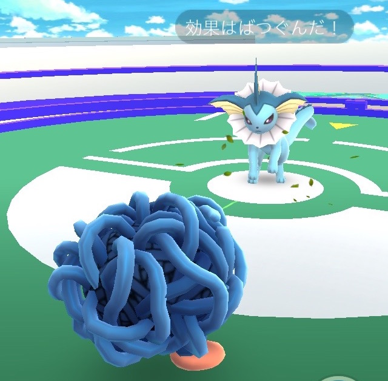
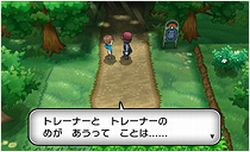
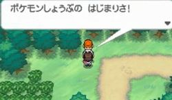

週末はまさにポケモンGOラッシュという感じで、どこの公園にも大量のトレーナーさん達が歩きまわり、ポケモンをゲットしていました。

そしてふと思いました。

**「このポケモンブームはいつまで続くんだろうか?」**

**「ポケモンGO のブームが去った後、この人達はポケモンを好きでいてくれるのだろうか?」**

## 筆者のポケモン歴

私はポケモンファンです。

ゲームボーイの初代（赤）から、最新作のオメガルビー・アルファサファイアまで20年間プレイし続けています。

[ポケモンバンク](http://www.pokemon.co.jp/ex/pokemonbank/)には全721匹のポケモンを預け、アニメも毎週見て、映画も公開初日に行き、娘も巻き込んで日々ポケモンを楽しんでいます。

そんな私が一番力を入れ楽しんでいるコンテンツは、対戦（ポケモンバトル）。

強さ的には PP（対戦の強さを表すポイント）1800 ～ 1900 の間をウロチョロするレベルです。

## そんな私から見たポケモンGOの対戦システム

これまでのロールプレイングゲームとしてのポケモンとポケモンGOは、楽しみ方が違います。

ポケモンを集めて対戦するという部分は同じなのですが、その対戦部分が全く別物となっています。

ポケモンGOでは、現状ジムバトルしかできませんが、そのバトルシステムが**ひたすら連打して技を繰り出す**というよくわからないものです。

厳密に言うと色々とテクニックは色々ありますが、結局連打ゲーです。

[card url="https://gamy.jp/pokemongo/pokemongo-zimkotu"]

どんなに弱いポケモンでも、技の構成と他のポケモンとの組み合わせで活躍させられる従来のポケモンバトルではなく、ポケモンGOはポケモンの強さ（CP）とタイプ相性だけが重要な単純なバトルになっています。

これではポケモンのターン制コマンドバトルの奥深さを味わう事ができません。

## ポケモンGOを飽きてしまう原因

上記の通り、バトルシステムが単純なので、頑張ってポケモンを集めて育てても、結局**課金者や土地的に有利な人のポケモンには勝てません。**

[card url="http://bohemia.hatenablog.com/entry/2016/07/25/004711"]

となると、現実世界を歩いてポケモンを集めるだけのゲームになってしまいます。

やはり**ポケモンを長く楽しんでもらうには、対戦が楽しいという事が非常に重要**です。

## ポケモンGO に期待する事

従来のポケモンのバトルシステムと同じとまではいかなくても、もう少し工夫をすれば善戦できるバトルにしてもらいたいものです。

根本的な事を言ってしまうと、ポケモンGOのバトルってターン制で良くないですかね？

連打ゲーのせいでラグが頻繁に発生して、よくわからないバトルになるし…

## ポケモンファンからの願い

色々不満を言いましたが、ポケモンGO は楽しいアプリです。これは間違いありません。

私自身もポケモンGO のおかげで健康にはなるし、家族との関係も良くなるし、言うことありません。

ただ、このブームがすぐに去るのは非常に悲しいです。

せっかくポケモンに触れてもらえたのだから、そういう人たちとポケモンGO を使ってカジュアルに対戦したい！

バトルバランスの調整と、個人戦実装のアップデートをお願いします！

## あとがき

ポケモンGO のブームで、今年の11月18日に発売される最新作ポケットモンスターサン・ムーンをプレイする人が増える事を切に願っています。

[card url="http://www.pokemon.co.jp/ex/sun_moon/"]

本当のポケモンバトルはここにあります。

「ポケモンバトルしようぜ！」