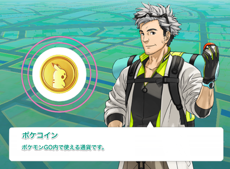
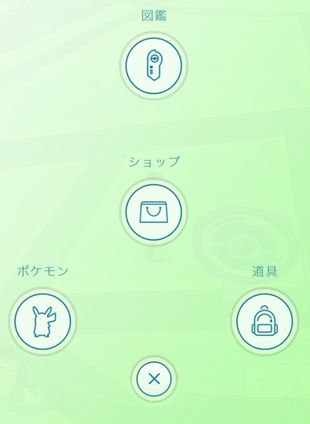
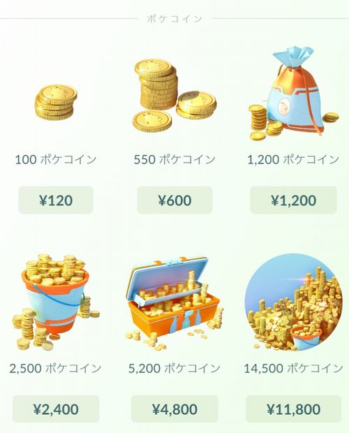

あまりにも世の中がポケモンGO ブームなので、ポケモンGOの記事に、会社からのGOがでたので、思う存分バリバリ書いています。

あ、もちろん仕事もちゃんとしていますよ！

というか、ポケモンGOは移動しないと何もできないゲームなので、勤務中にしようがない・・・

今日の記事は、私の同僚も知らなかった「ポケコイン」の入手方法です。

意外と**ポケコインを無料で手に入れる方法を知らない人が多い**ので、その方法を書いておきます。

## ポケコインとは
ポケモンGO 内で使用できる仮想通貨です。

メニューのショップから購入する事が可能ですが有料です。

結構お高いですよね。

このポケコインを無料で手に入れる方法があります。

## 無課金でポケコインを入手する方法

**ジムに自分のポケモンを置いてから、ショップで防衛ボーナスを貰う。**

この方法しかありません。

手順を詳しく説明すると

1. 自分の陣営（同じチーム）のジムに行き、自分のポケモンを配置する
ジムレベルの数だけポケモンを配置できます。例えばジムレベルが3で、すでに3匹のポケモンが設置されている場合は配置する事ができません。この場合は、トレーニングバトルをしてジムレベルを上げ、新たに配置できるようにするか、他の陣営に落とされるまで待ち、さらに奪い返すかしかありません。配置する場合はジム画面の左下のアイコン、トレーニングバトルをする場合は右下のアイコンをタップしましょう。

2. ショップの防衛ボーナスアイコンをタップする
ショップ画面の右上に盾のアイコンがあります。

これをタップすると**防衛1回に対して10コイン + ほしのすな500**を入手する事ができます。
**ポケモンを配置した後すぐでも1回分は必ず入手する事が可能**です。
ただし、**一度タップすると22時間は押せなくなる**ので、防衛できるだけの戦力がある場合は、アイコンを押すタイミングを考えた方が、多くの報酬を手に入れる事ができます。

## より多くのポケコインを手に入れる方法
現状のジムバトルでは、防衛するのがかなり困難です。
どんなに強いポケモンでも多数のプレイヤーに攻撃されれば落とされてしまいます。

しかし、上記の防衛1回というのは、言い換えると**ジムに配置したポケモンの数**とも言えるので、自分のポケモンが落とされる前に、素早くジムにポケモンを配置してまわり、防衛ボーナスアイコンを押せば、多くのポケコインを入手する事が可能です。

この方法に関しては、

* 自分の戦力と周囲の戦力の把握
* ジムの間隔
* 自転車

が非常に重要になってくるので、やれる方のみどうぞ。

## あとがき
無課金でプレイしている人は防衛回数を稼ぐ事は難しいでしょうから、22時間毎にジムにポケモンを配置してすぐに防衛ボーナスアイコンをタップするという事を繰り返す事が、ポケコインを地道に稼ぐ唯一の方法ですね。

知らなかった人は、今日から毎日少しづつでもポケコインを稼いでいきましょう！