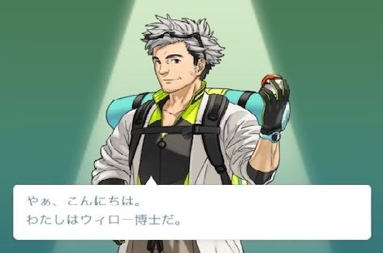
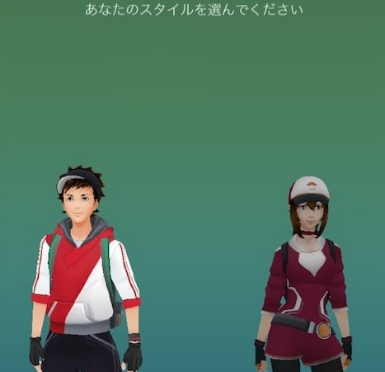
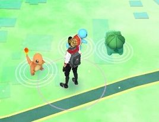
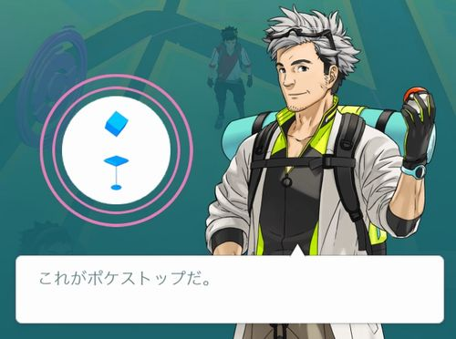
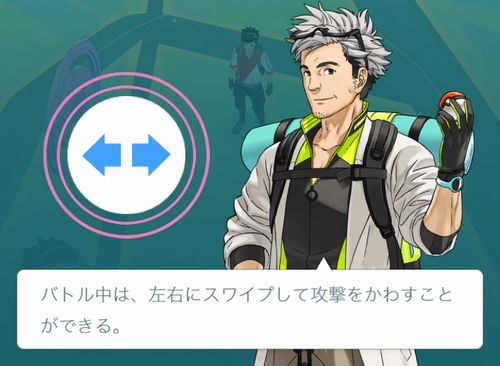

ポケモンGO が配信されて一週間と少し経ちますが、私の周りでも未だに色々なシステムを理解していない（知らない）人が目立ちます。

そう、**ポケモンGO って圧倒的にチュートリアルが少ない**んですよね。

## ポケモンGO のチュートリアル

1. 世界観の説明

めっちゃ短い。というかほとんど説明されていない。

2. アバターの作成

変更可能な箇所は、名前（重複、変更、日本語不可）、性別、肌の色、髪の色、目の色、帽子、上の服、下の服、靴、リュック

3. 最初のポケモンをゲットする

いきなり目の前にヒトカゲ、ゼニガメ、フシギダネの初代御三家が出現します。

ポケモンGO のチュートリアルってこれだけなんですよね。

この時点でジムを選ぶと「レベル5になったら教えてあげるよ」としか言われず、ジムの情報を見る事すらできません。

レベル5になってからジムを調べると、どのチームに所属するか聞かれます。チームについての詳しい説明はありません。

これでジムでバトルができるようになりますが、バトルについての詳しいチュートリアルはありません。

## ポケモンGO のゲーム内マニュアル（遊び方）

ゲーム内でも一応遊び方を確認できるようになっています。
メインメニュー（モンスターボール） → 設定 → 遊び方 で確認できます。

* ポケストップの説明
* ジムの説明
* バトルの説明

一度見てもらえばわかりますが、**全然詳しくありません**。

というか、10タップで終了してしまいます。

バトルの説明なんてこれだけですからね！

恐ろしい事に、私の友人は攻撃をスワイプで避けられるという事さえ知らなかった・・・

ゲーム内で詳しい遊び方の説明をする必要は無いと思いますが、わざわざ詳しい遊び方が知りたいな～と思って開かれるであろう、設定内の遊び方の説明がコレですからね・・・

## ポケモンGO で必要だと思われるチュートリアルや遊び方の説明
繰り返しになりますが、ゲーム内で詳しい遊び方の説明をする必要は無いと思うんですよね。
でも、もう少しチュートリアルや、ゲーム内マニュアルに必要だと思います。

### チュートリアルに追加してほしい項目
#### ポケモンのゲット方法
このゲームのキモなのに、一切の説明が無いのはどうかと。私の嫁なんてモンスターボールの投げ方がわからなくて、モンスターボールをタップしたり長押しして「おもんない～やめる～わからん～」って言ってましたからね。

#### ポケモンを博士に送るメリット
ゲームの仕様上、同じポケモンを何体もゲットする事になるのですが、それがどれだけのメリットになるのかが説明されていません。

必要でないポケモンを博士に送ると、そのポケモンのアメが貰え、アメを使う事によって、強くしたり進化させたりが可能になる。これはゲーム内で教えてもらいたいです。

### ゲーム内マニュアルに追加してほしい項目
#### トレーナーレベルとポケモンの強さ（CP）の説明
それぞれのポケモンに設定されているCP（コンバットポイント）。簡単に言うとポケモンの強さですね。これはトレーナーレベルに比例して高くなっていきます。

トレーナーレベルが低いままだと、どれだけ頑張っても強いポケモンは手に入らない事を知るとプレイスタイルが変わってきます。

私の友人はトレーナーレベルが低いまま、レアなポケモンを探しまわっていました・・・

#### バトルに関する説明
バトルに関しては、本当に知らない人が多すぎます。ここで詳しく説明するとものすごく長くなるので簡単に必要であろう説明を挙げると

* ポケモンには「わざ1」と「わざ2」を最初から覚えている
* 「わざ1」はタップ、**「わざ2」はバトル左上のゲージが溜まってからタップ長押し**で出せる
* 相手の攻撃は左右のスワイプで避ける事ができる
* バトル中でもポケモンの**交代**ができる
* バトル中に**降参**できる
* ポケモンには[タイプ相性](https://game8.jp/pokemon-go/beginner/74336)というものがある
* ポケモンGO のタイプ相性には、従来のポケモンと違い、**無効と4倍は無い**
* HPが0になると瀕死になり、げんきのかけら等を使わないと回復できない。

これくらいはどこかで説明してもらいたいです。

今は、ジムでしかバトルができませんが、その内、個人同士でもバトルができるようになるということなので、覚えておいて損はありません。

#### ジムに関する説明
ジムも結構色々なシステムが盛り込まれていて、ある程度理解していないと全く面白くありません。

必要であろう説明は

* ジムレベルと同じ数だけポケモンを配置できる
* ポケモンを配置できると、その数に応じて**ショップから無料でポケコインが貰える**仕組みがある
* HPが全快のポケモンしか配置できない
* ジムにポケモンを配置できるのは、無所属のジムか、同じチームのジムのみ
* 1つのジムに配置できるポケモンは1人1体
* ジムにポケモンを配置すると名声値（ジムの耐久値）が増える
* 敵チームのジムではバトルができ、味方チームのジムではトレーニングができる
* 名声値は敵チームとの**バトルで負けると大きく下がり**、味方チームがトレーニングすると少し増える
* 名声値が0になると、無所属のジムとなる
* 敵チームでのジム戦では、最大6体のポケモンで挑める
* 敵チームのジム戦で**一匹でも倒せば途中で降参しても、経験値を貰え、名声値を下げることができる**
* 敵チームに**複数人で同時にジム戦を挑めば、戦闘中他の人のポケモンの攻撃も当たる**ので、強いポケモンでも倒すことができる
* 味方チームのジムでのトレーニングは、1体のポケモンのみ
* トレーニングでは瀕死にならない

多いですが、これくらい理解していないとよくわからなくて、強いポケモンが陣取っていて「どうせ勝てないから関係ないや」という場所になってしまいます。

これらを読んでもらうと、現状はどんなに強いポケモンでも守れないということがわかってもらえ、「ちょっとジムバトルしてみるか」となってもらえるかと思います。

こっち6体で、相手1体を倒せば貢献できるし、仲間がいればもっと楽に倒せる。

これだけでもわかってもらえるチュートリアルが必要だと思います。

## あとがき
これだけのアプリを作る会社が、チュートリアルを削りに削った理由としては、SNS でのユーザー同士の情報共有や、直感的に理解してもらえるインターフェースだったりするのでしょうが、個人的には残念です。

海外はわかりませんが、日本に関しては理解できていない人が多すぎる感じがしています。

マニュアルはそもそも読まない人も多いので、仕方ない部分がありますが、チュートリアルはアプリ内でプレイヤーに自然に覚えてもらう為のものなので、もっと頑張って作ってもらいたいなという感じです。

[card url="http://uxmilk.jp/44684"]

日本のアプリは、チュートリアルが丁寧すぎるのかな？

でも私はそんなアプリの方が好きです。

MSEN でも大勢の人が使ってもらえるようなアプリがリリースされると思いますが、その時は読んでもらうマニュアルではなく、自然に覚えてもらえるようなチュートリアル作りを心がけたいと思います。
