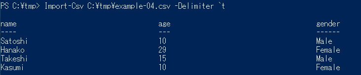

私は、Windows環境でCSVデータの加工処理を行う場合、テキストエディタやExcelを使うことが多いので、今回はPowerShellを使ったCSVファイルの読み込み方法について紹介したいと思います。

## CSVファイルの読み込みを行う

### 使用するコマンドレット

CSVファイルを読み込む方法はいくつかありますが、今回は[Import-Csv](https://technet.microsoft.com/ja-JP/library/dd347665.aspx)を使用します。

### 指定したファイルを読み込む

一番シンプルなパターンです。

```
Import-Csv filepath
```


パラメータに読み込みたいCSVファイルを指定すれば、以下のように読み込んだ内容を出力します。
パラメータにファイルのみを指定した場合、以下の点に注意してください。

* ファイルの文字コードはUnicodeである
* 1行目はヘッダ行である
* 区切り文字はカンマ(,)である

### ファイルの文字コードがSJISの場合

オプションに <code>&minus;Encoding Default</code> を指定してください。

```
Import-Csv filepath -Encoding Default
```


※ <code>&minus;Encoding</code> のオプションは、PowerShell3.0以上でないと使用できません。versionが3.0未満の場合はバージョンアップを行うか、 Import-Csv ではなく、 [Get-Content](https://msdn.microsoft.com/powershell/reference/5.1/microsoft.powershell.management/Get-Content) と [ConvertFrom-Csv](https://technet.microsoft.com/ja-JP/library/dd315368.aspx) を組み合わせて読み込むといった方法もあります。

### 1行目にヘッダ行がない場合

オプションに `-Header <string[]>` を指定してください。

```
Import-Csv filepath -Header "col1", "col2", "col3"
```


※ `<string[]>` はヘッダ行をあらわす文字列配列です。

### 区切り文字がカンマ(,)以外の場合

オプションに `-Delimiter <char>` を指定してください。

```
Import-Csv filepath -Delimiter `t
```

例はタブ区切りのファイルを読み込む場合です。



※ `<char>` は区切り文字をあらわす文字です。

## 読み込んだCSVファイルのデータを処理する

### Import-Csv の戻り値

`Import-Csv` は、読み込んだデータをオブジェクトとして返します。

なので、パイプでつなぎ `Where-Object` を使ったフィルタリングや、変数に格納して集計処理をするといったことができます。

具体的な使い方については、また今度ご紹介します。
