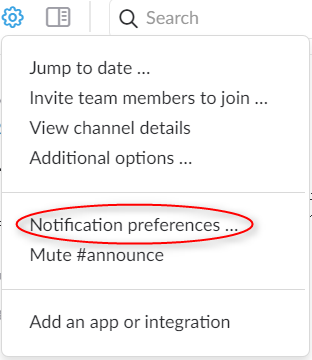
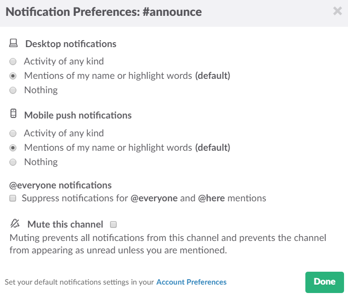

Slack を日常的に使っていて、チャンネルが増えてくると「このチャンネルの通知は毎回必要ないな～」と思う事が増えてきたので、チャンネルごとに通知の設定を変更する方法を記載しておきます。

## 設定画面までの道のり
1. まず、Slack 画面の左端にあるサイドバーメニューの **CHANNELS** から通知設定を変更したいチャンネルをクリックします。

2. クリックするとそのチャンネルの画面になるので、画面上部のメニューから 歯車のアイコン **Channel Settings** を見つけてください。

3. **Channel Settings** をクリックするとメニューが表示されるので、 **Notification Preferences** をクリックしてください。

4. **Notification Preferences** をクリックすると、ウインドウが開き、設定画面になります。

## チャンネル設定画面でできる事

### Desktop notifications
デスクトップアプリの設定です。

* Activity of any kind（全て通知）
誰かが発言する度に通知します。
* Only Direct Messages & Highlight Words（自分宛てのみ通知）
自分宛のダイレクトメッセージ、自分のアカウント宛てのメンション（@suzuki とか）のみ通知します。
* Nothing（通知しない）
通知しません。

### Mobile push notifications
モバイルアプリ（スマホ等）の設定です。

* Activity of any kind（全て通知）
誰かが発言する度に通知します。
* Only Direct Messages & Highlight Words（自分宛てのみ通知）
自分宛のダイレクトメッセージ、自分のアカウント宛てのメンション（@suzuki とか）のみ通知します。
* Nothing（通知しない）
通知しません。

### @everyone notifications
チェックすると、@channel（そのチャンネルのメンバー全員に通知）や@here（そのチャンネルのメンバーでオンライン状態の人全員に通知）の通知がオフになります。

### Mute this channel
チェックすると、このチャンネルからの通知が全てオフになります。

## あとがき
デスクトップとスマホ、それぞれの設定を変えられるのは嬉しいですね。

チャンネル毎の設定をうまく利用して、通知と付き合っていきましょう～。