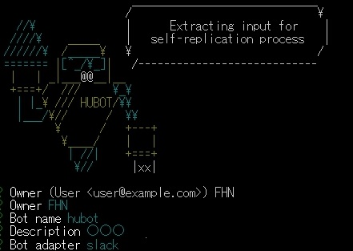
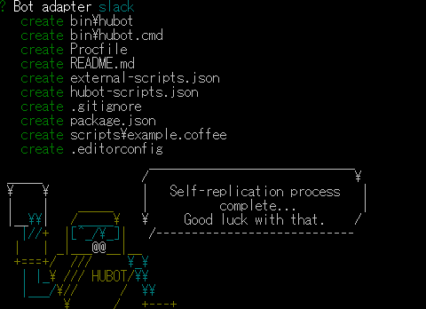
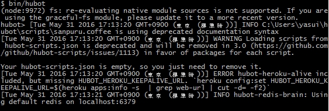
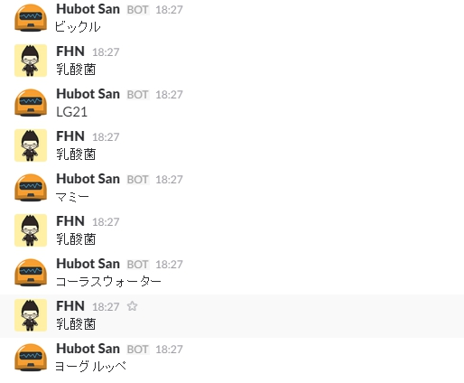
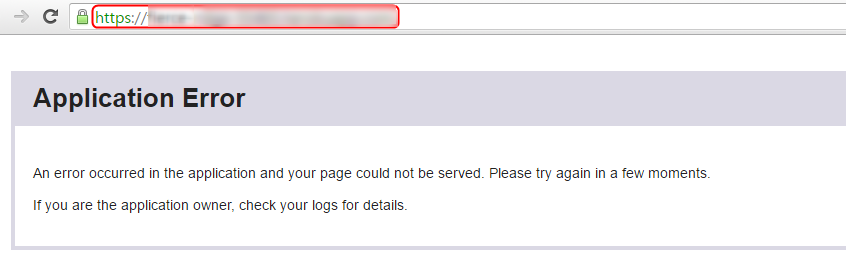
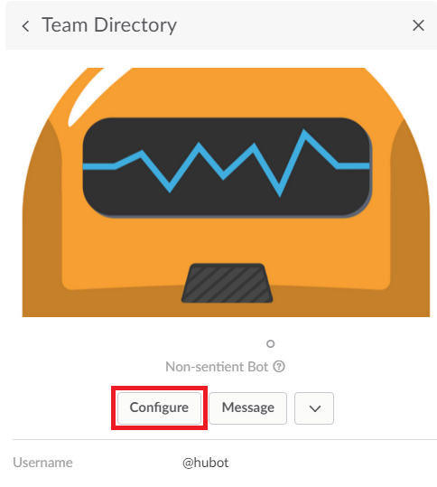
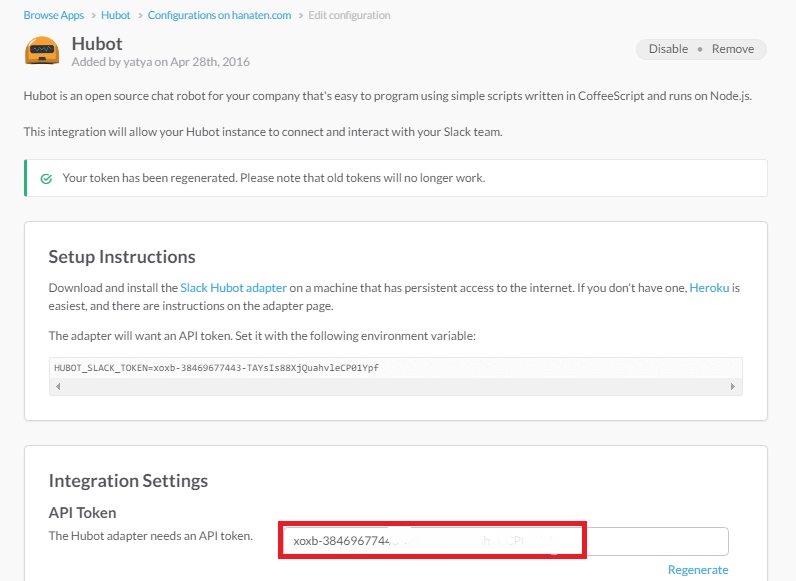
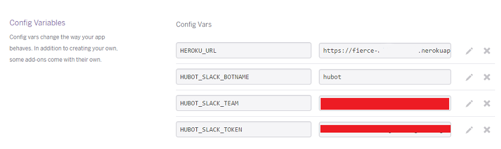

以前からSlackのチームの中にHUBOTさんはいたのですが、ずっと寝ていただけだったので、たまには働いてもらおうかと思いHerokuを使いHUBOTさんに働いてもらいました。「乳酸菌」と打つと、お勧めの「乳酸菌飲料」を言ってくれるHUBOTさんです。

## 事前に準備するもの
node.jsのインストール(長期サポートのある安定版のLTSを推奨します。)
[https://nodejs.org/en/](https://nodejs.org/en/)

Herokuの登録
[card url="/get-heroku-account-for-free/"]

git(Windows)のインストール
[card url="/git-how-to-install/"]

スラックへのチーム登録 
[card url="/slack-registration/"]

SlackチームのメンバーへHUBOTを追加
[card url="/add-slack-to-hubot/"]

## HUBOT(ヒューボット）さんを作成
HUBOTさんがSlackで働けるように、Slack用HUBOTさんのひな型を作ったり、言語を追加したりします。
### コーヒースクリプトのインストール
コマンドプロンプトを開き、下記のコマンドを実行します。

```npm install -g hubot coffee-script```

### yoと generator-hubotのインストール
コマンドプロント下記のコマンド実行します。

```npm install -g yo generator-hubot```

### HUBOTのひな型作成
HUBOTさんの中身を入れる箱を作ります。コマンドプロントで次のコマンドを打つと、hubotというディレクトリが作成されます。

```mkdir hubot```

ディレクトリが作成されているのを確認したら、次のコマンドを実行します。

```cd hubot```

実行すると```C:\Users\○○○(ユーザー名）\hubot```のディレクトリ位置に移動します。

次にSlackで使える、HUBOTさんのひな型を作ってくれるコマンドを実行します。

```yo hubot```

コマンドを実行すると、以下の様なロボットの絵が出てきます。順番に入力を求められるので、以下を参考に入力してください。



Owner：HUBOTの雇い主(主に自分の名前等）
Bot name：HUBOTの名前（フォルダ名が分かりやすいかも）
Description：どんな役割をするBotなのかの説明文（なくても大丈夫）
Bot adapter：使用するツール名(今回は<span style="color:red;">**slack**</span>と入力)



成功すると上記の様な表示が出ます。次にGit Bashを開き下記コマンドを実行してください。

```cd hubot``` （HUBOTディレクトリに移動)

```bin/hubot``` (HUBOTのcmdを叩きます)

しばらくすると、以下の様な表示がされますので、表示が止まったらエンターを押してください。



```hubot>```と表示されたと思います。表示されたら、何回かエンター押すと入力画面になるので```hubot>hubot ping```と打ってエンターを押してください。

そうするとHUBOTさんから<span style="font-size:32px; color:red;">***pong***</span>と返ってきたら成功です。

今はpongと返って来るだけなので、Slack上で自分が登録した言葉に反応して答えを返してくれるようにしてみましょう。

### HUBOTさんにやってもらう仕事内容を作成
HUBOTさんの仕事内容（スクリプト）を作ります。PC内の次の場所（C:\Users\FHN（自分のPCユーザー名）\hubot\scripts\）にexample.coffeeというファイルがあるので、そのファイルに仕事内容を書いていきます。

ここで書くのは、ある特定の文字を入力した場合に、特定の言葉を返すというものを作ります。

使い方としては、事前に見たいマップなどをアップロードし、スクリプトにマップのURLを登録しておくと、見たい時に登録した言葉をSlackに入力すると、HubotさんがそのURLを出すというものが作れます。

example.coffeeを見やすいテキストエディタで開き、中身を編集します。

例
```
module.exports = (robot) ->
  robot.hear /反応させる語句を入れる/i, (res) ->
    res.send "slackに出力する語句を入れる"
```

具体例
```
module.exports = (robot) ->
  robot.hear /乳酸菌/i, (res) ->
    res.send res.random ["ヤクルト","ピルクル","マミー","ジョア","ぐんぐんグルト","ヨーグルッペ","ビックル","Yoo"]
```
res.sendの後にres.randomを入れると、ランダムで[]に入れた単語をHUBOTさんが発言してくれます。乳酸菌飲料が書かれている部分を編集すると発言する内容が変わります。



書き終えたら保存してください。
## Herokuの環境づくり
[Heroku](/get-heroku-account-for-free/)にHUBOTさんがどこで働けばいいのかSlackまでの道のりを設定します。ここではHerokuを登録している必要があるので、まだ登録していない方は以下のリンクから登録してください。

[card url="/get-heroku-account-for-free/"]

登録が完了している方は、次の<span style="red:;">C:\Users\FHN\hubot></span>　のディレクトリ内にいることを確認し以下のコマンドを実行してください。

```
git init
git add .
git commit -m "first hubot" 
```

* git init - リポジトリを作成します。
* git add . - 全てのファイルを更新します。
* git commit -m "コミットメッセージ" - 更新したファイルをコミットメッセージ付きでコミットします。-mをつけ""内にコメント入力することでコミットメッセージを追加できます。（-mを付けずにcommitした場合はメッセージを追加するために、Vi画面に飛ばされ編集画面になりますので、Viでの操作が分からない方は必ず、-mを付けてコメントを付けてください。）

Heroku内にHUBOTさんのスクリプトなどを乗せる場所を作り構築していきます。

```heroku create```

これを実行すると、Heroku内に一つappが作成されます。この作成されたappにHUBOTさんにしてもらう仕事内容や場所などの設定をしていき動かしていくことになります。次に以下のコマンドを実行してください。

```heroku open```

実行すると、ブラウザで以下の様なページが立ち上がったかと思います。



**これによってブラウザでページが開くと思います。そのページのURL（赤枠で囲っている部分)はHerokuとSlackを繋げるために設定するときに必要ですので、URLをメモなどにコピー&ペーストして保存するか開いたページを保管しておいてください。**

次に、HerokuとSlackをつなげる設定をしていきます。コマンドの他にHerokuサイト内でもできるので、好きな方法で設定してください。

設定する項目は以下の4種です。


**KEYと入力する値の参考**：

* HUBOT_SLACK_TEAM= ここにスラックチームの名前 (Slackの左上にある名前)
* HUBOT_SLACK_BOTNAME=Slackに設定したボットネーム
* HEROKU_URL= heroku openで開いたページのURL
* HUBOT_SLACK_TOKEN= HUBOTのtokenを入力（以下画像参照）


### HUBOT_SLACK_TOKENの場所
HUBOT_SLACK_TOKENを取得するにはHUBOTを追加している必要があります。HUBOTをまだ追加していない方は以下のリンクから追加してください。
[card url="/add-slack-to-hubot/"]

※HUBOT_SLACK_TOKENはSlackにHUBOTを追加し、HUBOTのコンフィグを見ると表示されています。※見られない場合は権限がないので管理者等に聞いてみてください。





### コマンドで設定する場合
```
heroku config:add HUBOT_SLACK_TEAM=スラックチームの名前 (Slackの左上にある名前)
heroku config:add HUBOT_SLACK_BOTNAME=Slackに設定したボットネーム
heroku config:add HEROKU_URL=heroku openで開いたページのURL
heroku config:add HUBOT_SLACK_TOKEN=HUBOTのtokenを入力
```
### Herokuのページで登録する場合
Herokuのサイト上で登録する場合、Herokuにログインし、Personal appsを押しSettingsをクリックすると、画面が変わりConfig Variablesが出てきます。クリックすると以下の画像のような項目が出てくるので、画像のように入力してください。



## HUBOTさんをHerokuに連れてきて働いてもらいます
最後に、Herokuにpushして スクリプトを動作させます。

```git push heroku master```

これで、SlackのHUBOTさんがオンラインになっていると思います。

試しにchannelにHUBOTさんをinvite(招待）して、「乳酸菌」と打ってみてください。なにか乳酸菌飲料の名前を返してくれると思います。


うわあああ 倒れるぅぅう
　　　　 ＿_∩
　　 ⊂／　 ノ）
　　　/　土 /
　　　し⌒∪

だけで腹筋ワンダーコア～♪と背筋と乳酸菌～♪

　　( ・ω・`)
　 ／ >- 、-ヽ
　/丶ノ、_。ノ_。)
　＼ Ｙ 土 (ト〉

もし、git push heroku masterの部分でうまくいかない場合は、```C:\Users\FHN\hubot>```のディレクトリ内にいることを確認し以下のコマンドを実行。
```
git add .
git commit -m "first hubot"
git push heroku master
```
を実行して見てください。

それでも繋がらない場合は、tokenなどのHeroku設定が間違ってる可能性があるので、HerokuのConfigを確認してみてください。