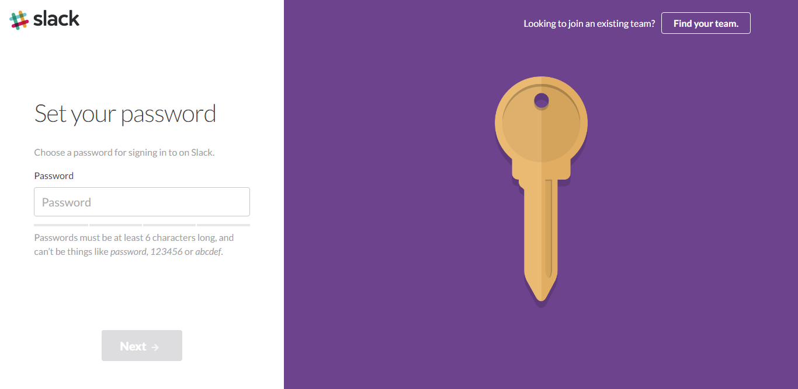

Slackは、招待したメンバーとチャットでコミュニケーションが出来たり、画像やアイコンの追加や、Bot機能を追加できたりと色々な機能を備えることができるコミュニケーションチャットです。多くの場合、仕事での利用が多いようですが、家族で使ったり、趣味の集まり等で使う場合でも、非常に便利なチャットツールです。

## Slackにチームを作成する
Slack
[https://slack.com/](https://slack.com/)

上記のアドレスをクリックすると以下の画像のような画面が表示されますので、フォームにメールアドレスを入力し、Create New Teamをクリックしてください。

## 確認コードの入力
コードを入力する画面が表示されます。先ほど入力したメールアドレスに、この画面で入力する6桁のコードが書かれたメールが届くので、書かれている6桁のコードを入力してください。

## 使用者名とユーザー名の登録
コードを入力すると、自分のフルネームと、ユーザーネームを登録する画面が表示されます。自分の名前と、ユーザー名を入力して下さい。ユーザ名は小文字で入力し、文字や数字以外では、ピリオド、ハイフン、およびアンダースコアのみを含めることができます。

チェックボックスは、Slackからのサービス情報が欲しい場合はチェックを入れてください。

すべての入力ができたら、Nextを押してください。

## パスワード登録
ログインするためのパスワードを登録してください。

## Slackチーム名の登録
Slackのチーム名を設定します。チーム名は登録後も変更可能です。

## チームドメインの登録
Slackチームのドメイン名を登録します。**Slackチームのドメイン名は、一度登録すると変更できません。** 初期値はチーム名の登録時に入力したものが入力されています。使用できる文字は、英数字と-(ハイフン）のみです。

## 確認コードの入力
Slackチームのドメインの登録が完了すると、Slackからメールボックスに新しくコードの書かれたメールが届きます。メールを確認し、コードを入力してください。

## 招待する
招待したい人のメールアドレスを入力して、Send Inviteをクリックすると入力したメールアドレスに招待メールが送られます。招待したくない人は、Skip for nowをクリックして入力を飛ばしてください。

## Slackチャットのチュートリアル
Explore Slackをクリックします。

SlackBotが、「やあ、私はスラックボットだよぉ。 お役に立ちたいと思っています。（でもまだBotなんだよね。ごめんね） 何か入力して始めてください。」と発言するので、何か適当な文字を入れてコメントしてください。

コメントすると、SlackBotが「あなたに会えて光栄です。少しだけSlackについてお教えします。」と言ってチュートリアルが始まります。（チュートリアルを飛ばしたい方は、Done?Click here to skipをクリックすると、Slackのチャットページが表示されて登録完了となります。）

### チュートリアル説明

これらがあなたのチャンネルです。チャンネルは、トピック（音楽というような）や、チーム(営業のような)といったプロジェクトのチャットの集まりです。チャンネルはPublic(公開設定)かPrivate(プライベート設定:招待した人のみ閲覧、書き込み可）かを選択できます。

直接メッセージを（指定したメンバーに）送ります。
ダイレクトメッセージは１体１のプライベートな会話です。招待した人が登録完了すると、招待した人と個別にチャットができるようになります。

あなたのチームに人を招待します。
Invite Peopleのボタンをクリックして同僚をチームに招待します。

これでチュートリアルが終了し、登録完了です。

## あとがき

現在、私は会社の業務のみで使っていますが、今後はプライベートチームを作りポケモンGOでも使おうと思っています。

Slackを使う利点として

### メンバーの追加が簡単
 Slackは新たにメンバーを追加する場合、招待したい相手のメールアドレスを入力し招待ボタンを押します。そうすると、相手に招待メールが届きます。招待された人はメール内のリンクをクリックし招待されたチーム名を入力するだけで簡単にチームチャットに参加することができます。

### 新規メンバーが既存メンバーとすぐ繋がれる
 新たに知り合った人を自分のグループに招待すると、新しく参加した人もチームに参加している既存メンバーと繋がることができます。ポケモンGoのジム戦などのゲーム特性として複数人での方が攻略しやすい為、知らない人同士でも連携を取れるとグループで攻略しやすくなります。

### 用途に応じてチャンネルを複数作れる
 色々な項目のスレッドを作ることが可能です。地域別、グループ別など用途に応じてに分けることが出来る為、一つのチャットに色々な発言が混在して見にくいということがなくなります。また、通知のオンオフ機能が各チャンネル毎に出来るため、利用者も欲しい地域の情報だけを取得可能です。

### 画像に題名とコメントを付けて共有ができる
 Slackでは簡単に画像共有が出来ます。また、画像を共有する際に題名とコメントを付けることができるため、投稿した画像にどういった状況なのかといった説明を付けることができます。

### 検索機能が多彩
 あの日の、あのチャンネルの、あの人の発言を検索、画像だけ検索、ファイルだけ検索、この日以降、この日より前を検索と多彩な絞り込み機能があります。

[card url="/slack-search-feature/"]

### チームメンバーと個人のチャットができる
 チームメンバーと1:1でのチャットができるため、連携がとりやすい。

### 他のWebサービスと連携ができる
 IFTTT等のサービス同士を連携させて、何かを条件に何かをするといったトリガーサービスを使うと、その条件に当てはまった時にSlackに投稿され、すぐにグループメンバーに情報を共有できます。

[card url="/new-mail-notification-from-office365-to-slack-with-ifttt/"]

Slackを上手に使うだけで差が付きますね。

