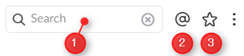
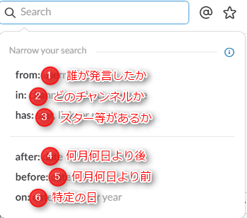
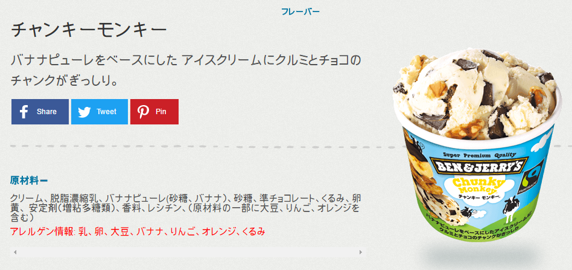

MSEN では、社内コミュニケーションに Slack を導入しています。

Slack
[https://slack.com/](https://slack.com/)

導入して2ヶ月程度経つので、結構なログ（文字のやりとり）が溜まってきていて、**「過去の発言等を検索したいな～」**と思う事が多くなってきました。

ということで、Slack の検索方法を記載しておきます。

## 基本的な機能

Slack の右上に以下の様な機能が備わっています。
*バージョンによって多少デザイン等、違っている場合があります

### (1) 検索バー
ここに検索したい文字を入れてエンターキーを押すと検索できます。

### (2) 自分宛て
クリックすると、自分宛て（メンション）のメッセージだけが表示されます。

### (3) スター
自分がスターを付けたメッセージだけが表示

## 高度な検索の仕方

検索バーをクリックすると以下の様な画面が出ます。

### (1) from: 誰が発言したか で検索
**誰かの発言だけ**を検索したい場合に使用します。

例：`form:@suzuki`

from: まで入力すると、メンバーのリストが出るので、選ぶだけでも検索可能です。

また、自分の発言だけ検索したい場合は from:me で検索可能です。

### (2) in: チャンネル で検索
**あのチャンネルの発言だけ**を検索したい場合に使用します。

例：`in:#news`

in: まで入力すると、チャンネルのリストが出るので、選ぶだけでも検索可能です。

### (3) has: スター、リンク、リアクション で検索
* 自分がスターを付けた（star）
* 外部リンクが貼られた（link）
* リアクションが付いている（reaction）

**上記の発言だけ**検索したい場合に使用します。

例：`has:star`

has: まで入力すると
* star
* link
* reaction

が出るので、選ぶだけでも検索可能です。

### (4) after: 何月何日より後 で検索
**何月何日より後の発言だけ**を検索したい場合に使用します。

例：`after:2016-06-30`

after: まで入力すると、カレンダーが表示されるので、選ぶだけでも検索可能です。

ただし、上記例だと2016年6月30日の発言は含まれません。

### (5) before: 何月何日より前 で検索
**何月何日より前の発言だけ**を検索したい場合に使用します。

例：`before:2016-06-30`

before: まで入力すると、カレンダーが表示されるので、選ぶだけでも検索可能です。

ただし、上記例だと2016年6月30日の発言は含まれません。

### (6) on: 特定の日 で検索
**指定した日の発言だけ**を検索したい場合に使用します。

例：`on:2016-06-30`

on: まで入力すると、カレンダーが表示されるので、選ぶだけでも検索可能です。

この on: はかなり優秀で

* 昨日（Yesterday）
* 何曜日（Monday、Tuesday等）
* 何月（January、February等）
* 今週（week）
* 今月（month）
* 今年（year）

も指定できます。

on: の後に頭文字を打つだけで、リストに出てくるので英語が苦手な方も大丈夫です。

## 高度な検索を組み合わせて使う

上記の検索方法は組み合わせて使う事もできます。

例：2016年6月30日より前に、自分がスターを付けた、newsチャンネルの、鈴木さんの発言を検索したい。

`before:2016-06-30 has:star in:#news from:@suzuki`

## あとがき

「高度な検索難しそう…」と思われるかもしれませんが、**Slack の入力補完がすごい**ので大丈夫です。

上記で紹介した何かしらの頭文字を打てば、色々とリストに表示されるので、このページを参考に検索してみてください。

一度検索すれば「なんだ簡単じゃないか」と思ってもらえます。

Slack 本当に便利ですよねぇ…

最近、若干重くなってきましたが、もう手放せないレベルです。

私用はLINE。仕事はSlack。

## あゆとの雑談部屋
この前、初めて最近人気？のベン&ジェリーズのアイスクリームを食べました。

Ben & Jerry's
[card url="http://www.benjerry.jp/"]

食べたフレーバーは**チャンキーモンキー**

「むむっ…これは…うまい！」

バナナ味のアイスが濃厚で、チョコとクルミが入ってザクザク感がしっかりあります。

サーティーワンのチョコチップ系とナッツトゥユーが一度に味わえる感じなので、美味しくないわけがない。

ただ、値段が300円を越すので、ホイホイ食べられる感じではないですが、サーティーワンや他のアイス屋に行くのを考えたら、ベン&ジェリーズはアリですね。

他にも色々とフレーバーがあるので、全種類制覇目指して、これからちょこちょこ食べていきます。
