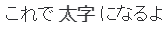
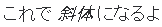
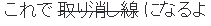
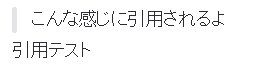
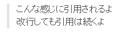
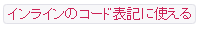
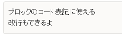

最近ポケモンGO の記事を連発していたので、今日は Slack の記事です。

Slack で、他のスタッフが太字や引用を使用していたので「僕も使ってみたい！」と思い調べてみました。

書き方は Markdown の様な感じなので、普段から Markdown を使っている方は、すぐに覚えられるかと思います。

## 太字
### 書き方
Slackでの入力例： `これで *太字* になるよ`

太字（ボールド）にしたい箇所を *（アスタリスク）で囲みます。

文章中に使用する場合は、*の前後に半角スペースが必要です。

Markdown では ** で囲みます。
### 実際に Slack で表示される形


## 斜体
### 書き方
Slackでの入力例 ： `これで _斜体_ になるよ`

斜体（イタリック）にしたい箇所を _（アンダーバー）で囲みます。

文章中に使用する場合は、*の前後に半角スペースが必要です。

Markdown でも同じですね。
### 実際に Slack で表示される形


## 取り消し線
### 書き方
Slackでの入力例： `これで ~取り消し線~ になるよ`

取り消し線を表示したい箇所を ~（チルダ）で囲みます。

文章中に使用する場合は、*の前後に半角スペースが必要です。

Markdown では、~~ で囲みます。
### 実際に Slack で表示される形


## 引用（一行）
### 書き方
Slackでの入力例： 
```
>こんな感じに引用されるよ
引用テスト
```
引用したい部分の最初に > を書きます。

Markdown でも同じですね。
### 実際に Slack で表示される形


## 引用（複数行）
### 書き方
Slackでの入力例： 
```
>>>こんな感じに引用されるよ
改行しても引用は続くよ
```

引用したい部分の最初に > を3個書きます。

この引用をすると後の文字が全て引用として扱われます。

### 実際に Slack で表示される形


## コード（一行）
### 書き方
Slackでの入力例： `` `インラインのコード表記に使える` ``

コード表記したい部分を `（バッククオート）で囲みます。

文字色が赤になり、背景色が灰色になります。

この記述は、一行（インライン）しか表示されません。

Markdown でも同じですね。
### 実際に Slack で表示される形


## コード（複数行）
### 書き方
Slackでの入力例： 
````
```
ブロックのコード表記に使える
改行もできるよ
```
````

コード表記したい部分を `（バッククオート）3個で囲みます。

背景色が灰色になり、ブロック型で表示されます。

この記述だと、複数行のコード表記が可能です。

Markdown でも同じですね。
### 実際に Slack で表示される形


## あとがき
Markdown っぽい書き方ができますが、少し違うので、よく使うものや使いたいものは、覚えておくと良いと思います。

[card url="https://mseeeen.msen.jp/markdown-basic-rules/"]

おまけで `#ff0000` 等のカラーコード表記にすると、色見本が表示されたりしますが、文字の色がそのカラーコードの色になるわけでもないので、あまり使いドコロがありません…

Slack を使用している人は、文字装飾も使いこなして、見やすい発言になるようにしていきましょ～！
