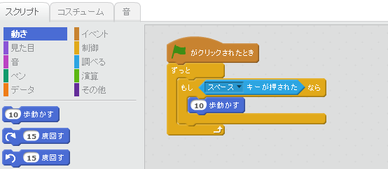

休みの日に子供と TV を見ていると NHK でプログラミングの番組 **Why!?プログラミング** が放送されていてビックリしました。

## Why!?プログラミングとは
教育用プログラミング言語 Scratch（スクラッチ）を使って、お笑いタレントの厚切りジェイソンと2体のパペットが、プログラミングの面白さや本質を伝えていく番組です。

[card url="http://www.nhk.or.jp/gijutsu/programming/"]

[card url="http://www.oricon.co.jp/news/2067309/full/"]

## Scratch（スクラッチ）ってなに？
教育用のプログラミング言語で、子供たちが簡単に学習できるように作成されています。

まるでブロックを組み立てるようにしてプログラミングができます。

スクラッチは、私も以前から知っていて、一時期色々と触っていました。

1時間程度あれば、簡単なシューティングゲームやパズルゲームを作ったりできるので、楽しいですよ。

[card url="https://scratch.mit.edu/"]

上記サイトからすぐに作り出す事ができるので、是非一度軽い気持ちでやってみてください。

また、スクラッチで作ったものは、すぐに公開共有できるので、世界中の人たちからコメントを貰うこともできます。

## 厚切りジェイソンってどんな人？

[card url="https://ja.wikipedia.org/wiki/%E5%8E%9A%E5%88%87%E3%82%8A%E3%82%B8%E3%82%A7%E3%82%A4%E3%82%BD%E3%83%B3"]

よくバラエティ番組に出ているので知っている方も多いと思いますが、日本の色々な文化等をネタにして、**「Why Japanese people!?（なぜなんだ日本人!?)」**と絶叫するツッコミで笑いをとるお笑いタレントさんです。

> 幼少期よりプログラミングに親しみ、イリノイ大学アーバナ・シャンペーン校でコンピューターサイエンスを専攻。旭化成でアメリカ英語対応の音声認識ソフトの開発・研究に従事した経験を持ち、現在はITベンチャー企業「テラスカイ」の役員を務める、ITにかかわりの深い経歴の持ち主。

こういった経歴がある人なので、この番組にはピッタリですね。

また、「Why!?プログラミング」の番組監修は、Scratch の日本語版を担当した阿部和広氏が担当しているとのことです。

## Why!?プログラミングを見て
番組の流れは

1. 完成形（イメージ）がある
2. 実際に動かしてみる
3. なぜか動かない
4. 厚切りジェイソンが「Why!?」とツッコむ
5. 原因をパペット2体が解析
6. 解決方法を実装する
7. ちゃんと動く
8. 厚切りジェイソンが、「じゃあこれでも動くんじゃない？」とハチャメチャなプログラミングをする
9. さぁみんなもやってみよう

という感じ。

開発の流れと一緒ですねｗ

手順5のパペット2体が解析するところで、スクラッチの面白い機能（PCのマイクが拾う音量を数値化する等）が紹介されるので、スクラッチを触りたくなります。

またアルゴリズムのコーナーがあって、コンピューターになった厚切りジェイソンが、10本の長さの違う棒を低い順に並べ替えるというのもやっていました。

10分間の番組なので、集中して見ることができますね。

子供用の番組ですが、なかなか面白く勉強になります。

## あとがき
スクラッチは以前から**いつか子供に触らせてみよう**と思っていたのですが、「うちの子はまだ4歳だから小学生になってから・・・」と自分で決めてしまっていました。

番組の対象年齢は小学5～6、中、高なんですが、この番組を見て娘も少し興味を持ったみたいだったので、少し触らせてみると、なんと！キャラクターを歩かせることができました。（親バカ）

後は興味で好き勝手やって、めちゃくちゃにしてゲラゲラ笑っていましたｗ

スクラッチは大人も楽しめるので、是非一度やってみてくださいね。