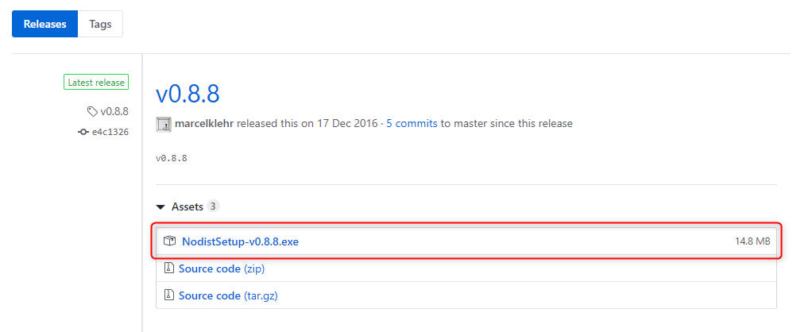

フロントエンド（HTML CSS JS 等）のお仕事で、コンパイル環境が必要になったので、Node.js と Gulp をインストールしてみました。

コマンドを打つ必要があるので、コマンドプロンプトや Git Bash を使用してください。

私は Git Bash を使用して操作しています。

なお、以下の手順は Windows 版の操作となります。

## Node.js インストール

### Nodist のインストール
まず、いきなり Node.js のインストールではなく、**Windows で node のバージョン管理を簡単にするため**に Nodist をインストールしていきましょう。

以下のリリースページからインストーラーをダウンロードしてインストールしてください。

[https://github.com/marcelklehr/nodist/releases](https://github.com/marcelklehr/nodist/releases)



赤枠のファイルをダウンロードしましょう。

では、コマンドを打っていきます。

` nodist -v `
インストールが終わったら Nodist のバージョンを確認します。
バージョンが表示されれば Nodist のインストール完了です。

### Node.js のインストール
` nodist latest `
最新バージョンの Node.js をインストールします。

` node -v `
Node.js のバージョンを確認します。
バージョンが表示されれば Node のインストール完了です。

` npm -v `
npm（ Node.js のパッケージ管理ツール）のバージョンを確認します。
バージョンが表示されれば npm コマンドが使用できます。

これで Node.js のインストールは完了です。

今回は Node.js のバージョン管理ができる Nodist をインストールしたので、Node.js のバージョンを選択してインストールする方法も記載しておきます。

` nodist dist `
インストール可能な Node.js のバージョン一覧が確認できます。

` nodist バージョン名 `
バージョン名には 4.4.2 等のバージョンを記載します。
バージョン一覧から選びましょう。

これで、Node のバージョン指定があっても大丈夫ですね。

## Gulp.js のインストール
Gulp.js をインストールすると**様々な作業を自動化する事が可能**になります。

` npm install -g gulp `
グローバル（ ` gulp ` コマンドが使えるように）に Gulp をインストールします。

` npm install -D gulp `
-D は --save-dev のショートハンド（短くしたコマンド）です。
ローカル（ パソコンの node_modules フォルダ内）に Gulp をインストールします。
このローカルにインストールされた Gulp を実行するために、先ほどグローバルにも Gulp をインストールしました。
このため、**グローバルとローカルの両方に Gulp のインストールが必要です。**

` gulp -v `
Gulp のバージョンを確認します。
バージョンが表示されれば Gulp のインストール完了です。

これで Gulp 本体のインストールが完了しました。

しかし、**Gulp 本体そのものに Sass 等のコンパイル機能があるわけではなく、プラグインをインストールしていく事により自分好みに便利になっていきます。**

今回の記事は各種インストールまでですが、最後に Gulp.js の動作確認はしておきましょう。

## package.json ファイルの作成
package.json は、**Node.js を使用したプロジェクトの様々な情報を書き込めるファイル**です。
プロジェクト名、npmパッケージ、npmパッケージのバージョン等を書き込めます。
package.json があれば、常に他の開発者と同じ環境でプロジェクトを進めていく事ができます。

これから作成される Web サイトのファイル一式が保存されるフォルダ（プロジェクトフォルダ）に作成していきましょう。 

今回は例として、 myproject というフォルダを作成します。

` pwd `
現在の位置（パス）を確認します。
コマンドプロンプトを使用している方は、入力する左側の現在地パスを見てもらうか、` @cd `で確認できます。

特に移動していない場合は C:\Users\ユーザー名 の場所にいると思います。

では、好きな場所に myproject フォルダを作成します。
今回は C:\Users\ユーザー名\myproject の位置に作成します。


` cd C:\Users\ユーザー名 `
C:\Users\ユーザー名 の場所に移動します。

` mkdir myproject `
C:\Users\ユーザー名 の場所に myproject フォルダを作成します。

` cd myproject `
C:\Users\ユーザー名\myproject の場所に移動します。

` npm init `
package.json ファイルを自動的に作成します。

npm init のコマンドを実行すると、対話式でプロジェクト名等を設定できますが、とりあえず全てエンターキーで作成してしまいましょう。

現在の位置は C:\Users\ユーザー名\myproject なので、myproject フォルダ内に package.json が作成されます。

内容は後でも編集できます。

これで package.json ファイルの作成が完了しました。

## gulpfile.js ファイルの作成
gulpfile.js ファイルは、Gulp.js が実行する処理（Gulp ではタスクと呼ぶ）を書いていきます。

今回は簡単に Hello World! を表示させるタスクを書いてみましょう。

まず、テキストエディターで gulpfile.js と名前を付けて、先ほど作成した package.json と同じ場所（今回だとc:\Users\ユーザー名\myproject ）に保存します。

gulpfile.js に以下の記述をしていきます。

```

let gulp = require('gulp'); // gulp コマンドの準備

gulp.task('default', function() { // default に登録
  console.log("Hello World!"); // Hello World! と表示
});

```

記述できたら保存しましょう。

` gulp `
gulp コマンドを実行します。
この時に default に登録されたタスクが実行されます。

Hello World! と表示されれば成功です。

これで、gulpfile.js ファイルの作成が完了し、動作確認もできました。

## あとがき
今回は、Node.js と Gulp.js のインストールまでを紹介しました。

次回からは、実際に Gulp.js に Sass 等、便利な機能を追加していきます。 