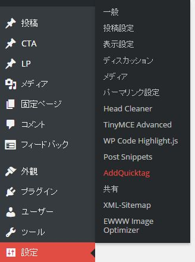
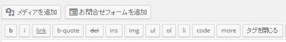
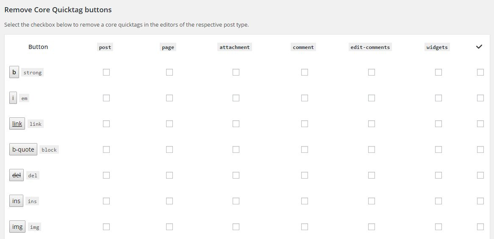
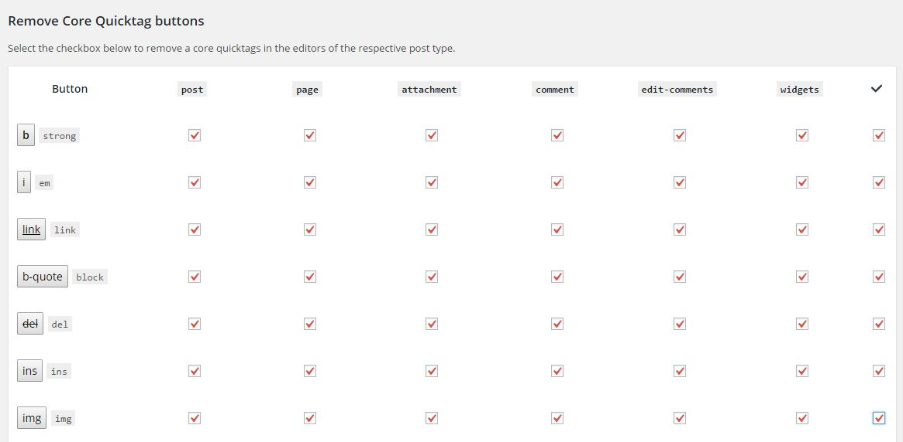
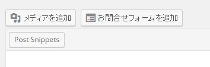
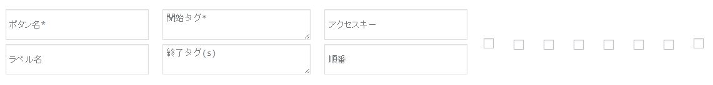
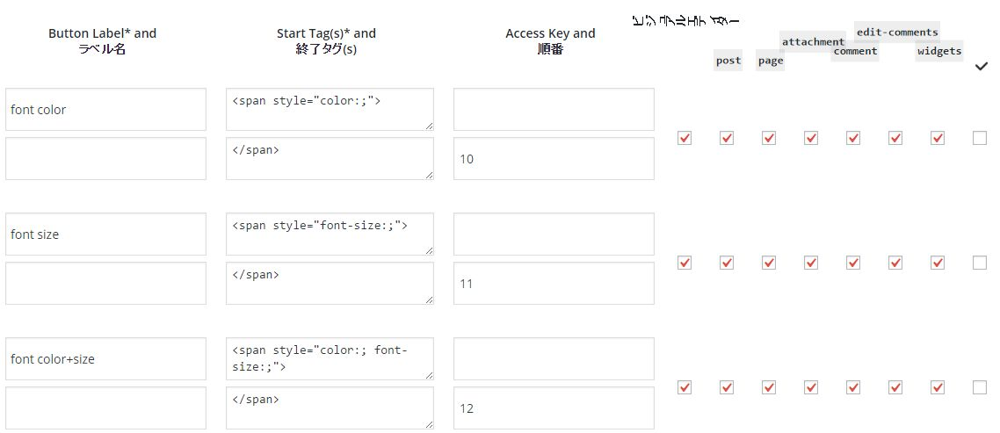
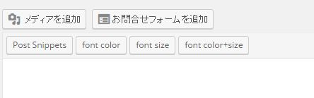
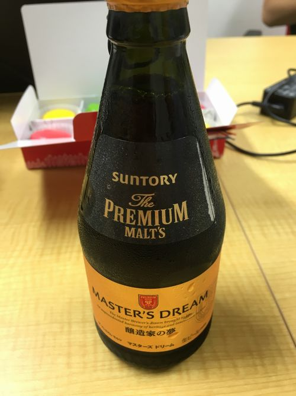
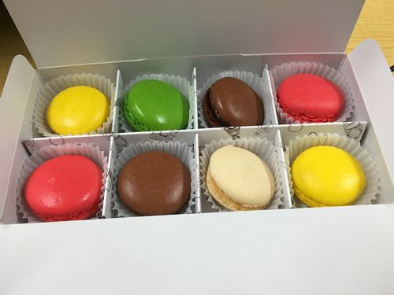

前回、WordPress で定型文を簡単に登録する方法を書きました。

ワードプレスでスニペット(定型文)を簡単に登録して使用する方法
[https://mseeeen.msen.jp/wordpress-post-snippets/](https://mseeeen.msen.jp/wordpress-post-snippets/)

今回は、WordPress の投稿画面でHTMLタグを追加したり非表示にしたりカスタマイズする方法を記載します。

使用するプラグインは AddQuicktag です。

## AddQuicktag のインストール方法
WordPress のプラグイン → 新規追加で

**AddQuicktag**

を検索し、インストールしてください。

## AddQuicktag の使い方

プラグインで AddQuicktag を有効化すると使用できるようになります。

その後、設定の AddQuicktag をクリックするとHTMLタグの登録画面になります。

## 投稿画面に最初から設定されているHTMLタグを非表示にする方法
WordPressの投稿画面には最初からHTMLタグが登録されています。

正直、このHTMLタグはあまり使わないと思うので、まずは非表示にしてしまいましょう。

1. AddQuicktag のHTMLタグ登録画面で、少し下にある **Remove Core Quicktag buttons** の欄を表示させます。

2. チェックボックス全てにチェックします。
*右端のチェックダイアログにチェックを入れると、その項目全てにチェックを入れることができます。

3. 少し上か下にある[変更を保存]ボタンをクリックします。

これで、投稿画面にHTMLタグが表示されなくなりスッキリします。

## HTMLタグを追加する方法

スッキリしたところで、自分が使いたいHTMLタグを追加していきましょう。

1. AddQuicktag のHTMLタグ登録画面で、**クイックタグの追加と削除** の欄に必要な情報を入力します。

  * ボタン名：登録するHTMLタグの名前
  * ラベル名：HTMLタグの説明（入力しなくてもOK）
  * 開始タグ：登録するHTMLタグの開始タグ
  例：	&lt;b&gt;
  * 終了タグ：登録するHTMLタグの終了タグ
  例：&lt;/b&gt;
  * アクセスキー：Internet Explorerのみ対応
  「ALT」+「設定したアクセスキー」でタグを呼び出すことができます。
  * 順番：登録したHTMLタグの投稿画面での表示順

2. 右のチェックボックス全てにチェックします。
*右端のチェックダイアログにチェックを入れると、その項目全てにチェックを入れることができます。

3. 少し下にある[変更を保存]ボタンをクリックします。

これで、投稿画面に追加したHTMLタグが表示されます。

後は、ボタンを押すと開始タグが挿入され、もう一度ボタンを押すと終了タグが挿入されます。

## まとめ

当ブログでは投稿画面に、今回紹介した AddQuicktag と、[前回紹介した Post Snippets](https://mseeeen.msen.jp/wordpress-post-snippets/) がインストールされています。

AddQuicktag はHTMLタグを、Post Snippets はマークダウン記法の入力補助として使用しています。

どちらのプラグインも、登録する内容によって使い勝手が違ってくるので、便利に使っていきたいですね～。

### あゆとの雑談部屋

先週、あるスタッフの誕生日だったので、[社長](https://mseeeen.msen.jp/category/articles-president-wrote/)がビールとマカロンをごちそうしてくれました。

**ザ・プレミアム・モルツ マスターズドリーム 醸造家の夢**

[http://www.suntory.co.jp/beer/mastersdream/](http://www.suntory.co.jp/beer/mastersdream/)

このビールうまい！

「キンキンに冷えてやがるっ・・・！」
「犯罪的だ・・・うますぎる・・・」

と、カイジばりに喜びました。

しかし、ビールとマカロンという組み合わせはどうなんだろう…？

個人的には甘いモノが大好きなので、マカロン大歓迎なんですけどね。