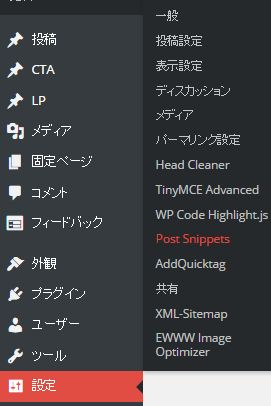
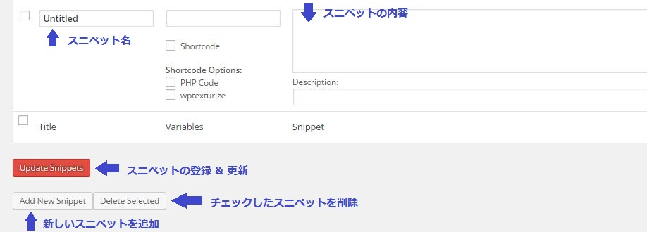
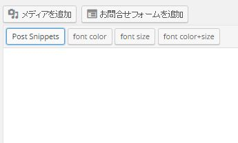
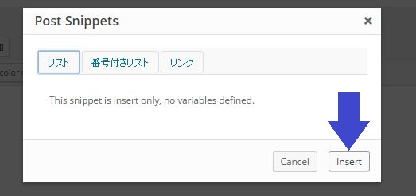

「WordPress で同じコードや文章等の定型文を、簡単に挿入できる方法は無いかな～？」と思い調べていたところ、[Post Snippets](https://ja.wordpress.org/plugins/post-snippets/) というプラグインを発見しました。

## Post Snippets のインストール方法
WordPress のプラグイン→新規追加で

**Post Snippets**

を検索し、インストールしてください。

## Post Snippets の使い方
プラグインで Post Snippets を有効化すると使用できるようになります。  
その後、設定の Post Snippets をクリックするとスニペットの登録画面になります。

## スニペットとは
>スニペットとは、一般的には「切れ端」「断片」という意味の英語である。  
>IT用語としては、プログラミング言語の中で簡単に切り貼りして再利用できる部分のこと、または、検索エンジンによる検索結果の一部として表示される、Webページの要約文のことである。

[IT用語辞典 Weblio辞書](http://www.weblio.jp/content/%E3%82%B9%E3%83%8B%E3%83%9A%E3%83%83%E3%83%88) から引用

スニペットという言葉はプログラマが使用するので、わかりにくいと思います。  
簡単に言うと、**定型文**とか**定型句**という意味です。

## スニペットの登録方法

**スニペット名**と**スニペットの内容**を入力して登録するだけで使うことが可能です。

*スニペット名の右隣の欄は変数名を入れる事ができ、ショートコードで使う時に入力します。

## 登録したスニペットを投稿画面で呼び出してみよう

投稿画面本文入力欄の上部メニューに、新しく **Post Snippets** ができているのでクリックしてください。

すると別ウインドウが開きます。

後は、登録したスニペット名を選び、 Insert ボタンをクリックすれば、本文中に登録したスニペットの内容が挿入されます。

## まとめ

当ブログではとりあえず、マークダウン記法の入力補助として Post Snippets を使用していますが、他にも色々と使い方が見つかりそうです。

文章でもコードでもスニペットの内容として登録しておけるので、署名や個人的に使用したいちょっとした HTML+CSS 等も登録して使いまわしたいですね。

ちなみに、WordPress で HTML のタグ（ &lt;br&gt;等）を登録して投稿画面で使いまわしたい場合は、AddQuicktag という別のプラグインがあるので、また別記事でご紹介します。

### あゆと の雑談部屋

石田スイが描いたヒソカの過去ストーリーのネーム（ラフ絵での漫画）、すごく良かったです。  
石田スイの絵に HUNTERXHUNTER の物語は非常にマッチしますね～。

このネームは、HUNTERXHUNTER の冨樫義博 と トーキョーグールの石田スイの対談ページにて公開中です。

[冨樫義博 × 石田スイ 特別対談](http://www.shonenjump.com/p/sp/1606/hyskoa/index.html)

どっちの漫画も全部読んでるので、こういう企画は嬉しいですね。
