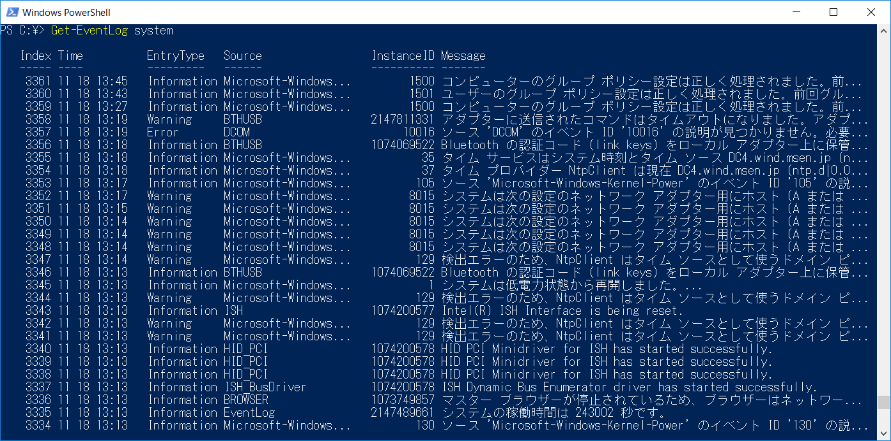

以前、[PowerShellを使用したCSVファイルの読み込み方法](https://mseeeen.msen.jp/powershell-import-csv-commandlet/)について紹介しましたが、今回はCSVファイルを出力する方法について紹介したいと思います。

## CSVファイルを出力する

### 使用するコマンドレット

CSVファイルを出力する方法は読み込む方法と同様にいくつかありますが、前回ご紹介した[Import-Csv](https://technet.microsoft.com/ja-JP/library/dd347665.aspx)と対になる[Export-Csv](https://technet.microsoft.com/ja-jp/library/dd347724.aspx)を使用します。

### システムログをCSVファイルで出力する

[Get-EventLog](https://docs.microsoft.com/en-us/powershell/module/microsoft.powershell.management/get-eventlog?view=powershell-5.1) コマンドレットでシステムログを出力すると以下の通りになります。



上記の出力された内容をCSVファイルに出力してみます。

```
Get-EventLog system | Export-Csv -path syslog.csv
```

```csv
#TYPE System.Diagnostics.EventLogEntry#system/Microsoft-Windows-GroupPolicy/1500
"EventID","MachineName","Data","Index","Category","CategoryNumber","EntryType","Message","Source","ReplacementStrings","InstanceId","TimeGenerated","TimeWritten","UserName","Site","Container"
"1500","Example-PC","System.Byte[]","3365","(0)","0","Information","???????????? ???????????????????????? ??????????????????????????????","Microsoft-Windows-GroupPolicy","System.String[]","1500","2017/11/18 15:35:24","2017/11/18 15:35:24","NT AUTHORITY\SYSTEM",,
"98","Example-PC","System.Byte[]","3364","(0)","0","Information","??? 'Microsoft-Windows-Ntfs' ????? ID '98' ???????????????????????????????????????? DLL ????????? ??????????????????????????????????????????????????????????????????????????????:'Windows', '\Device\HarddiskVolumeShadowCopy4', '0'","Microsoft-Windows-Ntfs","System.String[]","98","2017/11/18 15:35:23","2017/11/18 15:35:23","NT AUTHORITY\SYSTEM",,
"1501","Example-PC","System.Byte[]","3363","(0)","0","Information","????????? ???????????????????????? ??????????????????????????????","Microsoft-Windows-GroupPolicy","System.String[]","1501","2017/11/18 15:35:00","2017/11/18 15:35:00","Example\user",,
"7040","Example-PC","System.Byte[]","3362","(0)","0","Information","Windows Modules Installer ??????????? ??????? ?? ?????? ?????????","Service Control Manager","System.String[]","1073748864","2017/11/18 15:34:42","2017/11/18 15:34:42","NT AUTHORITY\SYSTEM",,
"1500","Example-PC","System.Byte[]","3361","(0)","0","Information","???????????? ???????????????????????? ??????????????????????????????","Microsoft-Windows-GroupPolicy","System.String[]","1500","2017/11/18 13:45:23","2017/11/18 13:45:23","NT AUTHORITY\SYSTEM",,
"1501","Example-PC","System.Byte[]","3360","(0)","0","Information","????????? ???????????????????????? ??????????????????????????????","Microsoft-Windows-GroupPolicy","System.String[]","1501","2017/11/18 13:43:01","2017/11/18 13:43:01","Example\user",,
"1500","Example-PC","System.Byte[]","3359","(0)","0","Information","???????????? ???????????????????????? ??????????????????????????????","Microsoft-Windows-GroupPolicy","System.String[]","1500","2017/11/18 13:27:02","2017/11/18 13:27:02","NT AUTHORITY\SYSTEM",,
```

パラメータに出力先のCSVファイル名を指定すれば、指定のファイルに出力します。
パラメータにファイルのみを指定した場合、以下の点に注意してください。

* ファイルの文字コードはASCIIである
* 1行目はファイルの型の情報である
* 2行目はヘッダ行である
* 区切り文字はカンマ(,)である

### 出力するファイルの文字コードを指定する

オプションに `-Encoding <char>` を指定してください。

文字コードを指定しない場合、ASCIIが設定されるため日本語が文字化けします。文字化けを回避するには **SJIS**, **UTF-8** 等で出力することで解消します。

```
# SJISで出力する場合
Get-EventLog system | Export-Csv -path syslog.csv -Encoding Default

# UTF-8で出力する場合
Get-EventLog system | Export-Csv -path syslog.csv -Encoding UTF8
```

```
#TYPE System.Diagnostics.EventLogEntry#system/Microsoft-Windows-GroupPolicy/1500
"EventID","MachineName","Data","Index","Category","CategoryNumber","EntryType","Message","Source","ReplacementStrings","InstanceId","TimeGenerated","TimeWritten","UserName","Site","Container"
"1500","Example-PC","System.Byte[]","3365","(0)","0","Information","コンピューターのグループ ポリシー設定は正しく処理されました。前回グループ ポリシーが正しく処理されてからの変更は検出されませんでした。","Microsoft-Windows-GroupPolicy","System.String[]","1500","2017/11/18 15:35:24","2017/11/18 15:35:24","NT AUTHORITY\SYSTEM",,
"98","Example-PC","System.Byte[]","3364","(0)","0","Information","ソース 'Microsoft-Windows-Ntfs' のイベント ID '98' の説明が見つかりません。必要なレジストリ情報またはメッセージを表示するメッセージ DLL ファイルがローカル コンピューターに存在しない可能性があります。または、これらのデータへのアクセス許可がユーザーに与えられていない可能性があります。次の情報はイベントの一部です:'Windows', '\Device\HarddiskVolumeShadowCopy4', '0'","Microsoft-Windows-Ntfs","System.String[]","98","2017/11/18 15:35:23","2017/11/18 15:35:23","NT AUTHORITY\SYSTEM",,
"1501","Example-PC","System.Byte[]","3363","(0)","0","Information","ユーザーのグループ ポリシー設定は正しく処理されました。前回グループ ポリシーが正しく処理されてからの変更は検出されませんでした。","Microsoft-Windows-GroupPolicy","System.String[]","1501","2017/11/18 15:35:00","2017/11/18 15:35:00","Example\user",,
"7040","Example-PC","System.Byte[]","3362","(0)","0","Information","Windows Modules Installer サービスの開始の種類は 要求による開始 から 自動的な開始 に変更されました。","Service Control Manager","System.String[]","1073748864","2017/11/18 15:34:42","2017/11/18 15:34:42","NT AUTHORITY\SYSTEM",,
"1500","Example-PC","System.Byte[]","3361","(0)","0","Information","コンピューターのグループ ポリシー設定は正しく処理されました。前回グループ ポリシーが正しく処理されてからの変更は検出されませんでした。","Microsoft-Windows-GroupPolicy","System.String[]","1500","2017/11/18 13:45:23","2017/11/18 13:45:23","NT AUTHORITY\SYSTEM",,
"1501","Example-PC","System.Byte[]","3360","(0)","0","Information","ユーザーのグループ ポリシー設定は正しく処理されました。前回グループ ポリシーが正しく処理されてからの変更は検出されませんでした。","Microsoft-Windows-GroupPolicy","System.String[]","1501","2017/11/18 13:43:01","2017/11/18 13:43:01","Example\user",,
"1500","Example-PC","System.Byte[]","3359","(0)","0","Information","コンピューターのグループ ポリシー設定は正しく処理されました。前回グループ ポリシーが正しく処理されてからの変更は検出されませんでした。","Microsoft-Windows-GroupPolicy","System.String[]","1500","2017/11/18 13:27:02","2017/11/18 13:27:02","NT AUTHORITY\SYSTEM",,
```

### CSVファイルから型の情報を省略する

オプションに <code>&minus;NoTypeInformation</code> を指定してください。

```
Get-EventLog system | Export-Csv -path syslog.csv -Encoding Default -NoTypeInformation
```

```
"EventID","MachineName","Data","Index","Category","CategoryNumber","EntryType","Message","Source","ReplacementStrings","InstanceId","TimeGenerated","TimeWritten","UserName","Site","Container"
"1500","Example-PC","System.Byte[]","3365","(0)","0","Information","コンピューターのグループ ポリシー設定は正しく処理されました。前回グループ ポリシーが正しく処理されてからの変更は検出されませんでした。","Microsoft-Windows-GroupPolicy","System.String[]","1500","2017/11/18 15:35:24","2017/11/18 15:35:24","NT AUTHORITY\SYSTEM",,
"98","Example-PC","System.Byte[]","3364","(0)","0","Information","ソース 'Microsoft-Windows-Ntfs' のイベント ID '98' の説明が見つかりません。必要なレジストリ情報またはメッセージを表示するメッセージ DLL ファイルがローカル コンピューターに存在しない可能性があります。または、これらのデータへのアクセス許可がユーザーに与えられていない可能性があります。次の情報はイベントの一部です:'Windows', '\Device\HarddiskVolumeShadowCopy4', '0'","Microsoft-Windows-Ntfs","System.String[]","98","2017/11/18 15:35:23","2017/11/18 15:35:23","NT AUTHORITY\SYSTEM",,
"1501","Example-PC","System.Byte[]","3363","(0)","0","Information","ユーザーのグループ ポリシー設定は正しく処理されました。前回グループ ポリシーが正しく処理されてからの変更は検出されませんでした。","Microsoft-Windows-GroupPolicy","System.String[]","1501","2017/11/18 15:35:00","2017/11/18 15:35:00","Example\user",,
"7040","Example-PC","System.Byte[]","3362","(0)","0","Information","Windows Modules Installer サービスの開始の種類は 要求による開始 から 自動的な開始 に変更されました。","Service Control Manager","System.String[]","1073748864","2017/11/18 15:34:42","2017/11/18 15:34:42","NT AUTHORITY\SYSTEM",,
"1500","Example-PC","System.Byte[]","3361","(0)","0","Information","コンピューターのグループ ポリシー設定は正しく処理されました。前回グループ ポリシーが正しく処理されてからの変更は検出されませんでした。","Microsoft-Windows-GroupPolicy","System.String[]","1500","2017/11/18 13:45:23","2017/11/18 13:45:23","NT AUTHORITY\SYSTEM",,
"1501","Example-PC","System.Byte[]","3360","(0)","0","Information","ユーザーのグループ ポリシー設定は正しく処理されました。前回グループ ポリシーが正しく処理されてからの変更は検出されませんでした。","Microsoft-Windows-GroupPolicy","System.String[]","1501","2017/11/18 13:43:01","2017/11/18 13:43:01","Example\user",,
"1500","Example-PC","System.Byte[]","3359","(0)","0","Information","コンピューターのグループ ポリシー設定は正しく処理されました。前回グループ ポリシーが正しく処理されてからの変更は検出されませんでした。","Microsoft-Windows-GroupPolicy","System.String[]","1500","2017/11/18 13:27:02","2017/11/18 13:27:02","NT AUTHORITY\SYSTEM",,
```

### 区切り文字を指定する

オプションに `-Delimiter <char>` を指定してください。

```
# タブ区切りで出力する　
Get-EventLog system | Export-Csv -path syslog.tsv -Encoding Default -Delimiter `t
```

※ `t はタブをあらわすエスケープシーケンスです。

```
#TYPE System.Diagnostics.EventLogEntry#system/Microsoft-Windows-GroupPolicy/1500
"EventID"	"MachineName"	"Data"	"Index"	"Category"	"CategoryNumber"	"EntryType"	"Message"	"Source"	"ReplacementStrings"	"InstanceId"	"TimeGenerated"	"TimeWritten"	"UserName"	"Site"	"Container"
"1500"	"Example-PC"	"System.Byte[]"	"3365"	"(0)"	"0"	"Information"	"コンピューターのグループ ポリシー設定は正しく処理されました。前回グループ ポリシーが正しく処理されてからの変更は検出されませんでした。"	"Microsoft-Windows-GroupPolicy"	"System.String[]"	"1500"	"2017/11/18 15:35:24"	"2017/11/18 15:35:24"	"NT AUTHORITY\SYSTEM"		
"98"	"Example-PC"	"System.Byte[]"	"3364"	"(0)"	"0"	"Information"	"ソース 'Microsoft-Windows-Ntfs' のイベント ID '98' の説明が見つかりません。必要なレジストリ情報またはメッセージを表示するメッセージ DLL ファイルがローカル コンピューターに存在しない可能性があります。または、これらのデータへのアクセス許可がユーザーに与えられていない可能性があります。次の情報はイベントの一部です:'Windows', '\Device\HarddiskVolumeShadowCopy4', '0'"	"Microsoft-Windows-Ntfs"	"System.String[]"	"98"	"2017/11/18 15:35:23"	"2017/11/18 15:35:23"	"NT AUTHORITY\SYSTEM"		
"1501"	"Example-PC"	"System.Byte[]"	"3363"	"(0)"	"0"	"Information"	"ユーザーのグループ ポリシー設定は正しく処理されました。前回グループ ポリシーが正しく処理されてからの変更は検出されませんでした。"	"Microsoft-Windows-GroupPolicy"	"System.String[]"	"1501"	"2017/11/18 15:35:00"	"2017/11/18 15:35:00"	"Example\user"		
"7040"	"Example-PC"	"System.Byte[]"	"3362"	"(0)"	"0"	"Information"	"Windows Modules Installer サービスの開始の種類は 要求による開始 から 自動的な開始 に変更されました。"	"Service Control Manager"	"System.String[]"	"1073748864"	"2017/11/18 15:34:42"	"2017/11/18 15:34:42"	"NT AUTHORITY\SYSTEM"		
"1500"	"Example-PC"	"System.Byte[]"	"3361"	"(0)"	"0"	"Information"	"コンピューターのグループ ポリシー設定は正しく処理されました。前回グループ ポリシーが正しく処理されてからの変更は検出されませんでした。"	"Microsoft-Windows-GroupPolicy"	"System.String[]"	"1500"	"2017/11/18 13:45:23"	"2017/11/18 13:45:23"	"NT AUTHORITY\SYSTEM"		
"1501"	"Example-PC"	"System.Byte[]"	"3360"	"(0)"	"0"	"Information"	"ユーザーのグループ ポリシー設定は正しく処理されました。前回グループ ポリシーが正しく処理されてからの変更は検出されませんでした。"	"Microsoft-Windows-GroupPolicy"	"System.String[]"	"1501"	"2017/11/18 13:43:01"	"2017/11/18 13:43:01"	"Example\user"		
"1500"	"Example-PC"	"System.Byte[]"	"3359"	"(0)"	"0"	"Information"	"コンピューターのグループ ポリシー設定は正しく処理されました。前回グループ ポリシーが正しく処理されてからの変更は検出されませんでした。"	"Microsoft-Windows-GroupPolicy"	"System.String[]"	"1500"	"2017/11/18 13:27:02"	"2017/11/18 13:27:02"	"NT AUTHORITY\SYSTEM"		
```