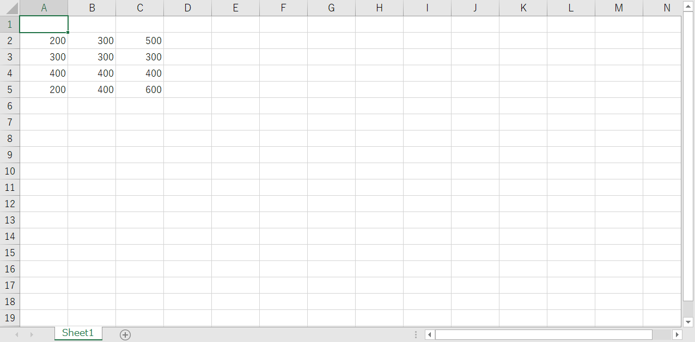

前回[シートの操作方法](/sheets-operation-of-excel-with-powershell/)について紹介しましたが、今回はセルに値を設定する方法を紹介していきたいと思います。

## 使用環境

* Windows 10
* Windows PowerShell 5.1
* Microsoft Excel 2016

## 操作方法

### 新規にワークブックを作成

```ps
# Excelのプロセスを起動
$excel = New-Object -ComObject Excel.Application

# 起動したExcelを表示する
$excel.Visible = $true

# 新規のワークブックを作成
$book = $excel.Workbooks.Add()
```

前回紹介した手順にそって、ワークブックを新規作成します。

### シートの選択

```ps
# 操作対象のシートを取得
$sheet = $book.Sheets("Sheet1")

# 取得したシート名を確認
$sheet.Name
Sheet1
```

上記のコマンドで指定のシートを取得できます。

### セルに値を設定：セル名を指定

```ps
# A2のセルに値を設定
$sheet.Range("A2") = "200"

# A2のセルの値を表示
$sheet.Range("A2").Text
200
```

`$sheet.Range(セル名)` セル名を直接指定します。

### セルに値を設定：セル位置

```ps
# B2のセルに値を設定
$sheet.Cells.Item(2,2) = "300"

# B2のセルの値を表示
$sheet.Cells.Item(2,2).Text
300
```

`$sheet.Cells.Item(縦,横)` シート左上のセルを基準に縦、横の位置を指定します。

### セルに数式を設定

```ps
# C2のセルにA2とB2の合計を求める数式を設定
$sheet.Range("C2") = "=A2+B2"

# C2のセルの値を表示
$sheet.Range("C2").Text
500

# C2のセルの数式を表示
$sheet.Range("C2").Formula
=A2+B2
```

数式を設定する場合は、Excelのセルに入力する場合と同様に `=` を先頭に付与して値を設定します。

### 複数のセルに値を設定

```ps
# A3からC3のセルに値を設定
$sheet.Range("A3:C3") = "300"

# A4からC4のセルに値を設定
$sheet.Range("A4","C4") = "400"

# A5からC5のセルに別々の値を設定
$sheet.Range("A5","C5") = "200","400","600"
```

`$sheet.Cells.Item(縦,横)` をインクリメントさせながら複数のセルに値を設定するといった方法もあります。

今回紹介した操作を順に行うと下記のExcelシートが出来上がるかと思います。


それでは、セルの基本操作 Vol.2 でお会いしましょう。