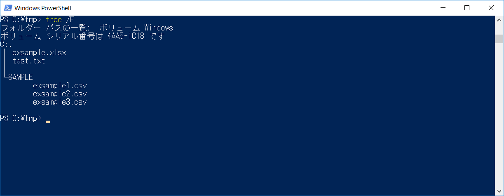
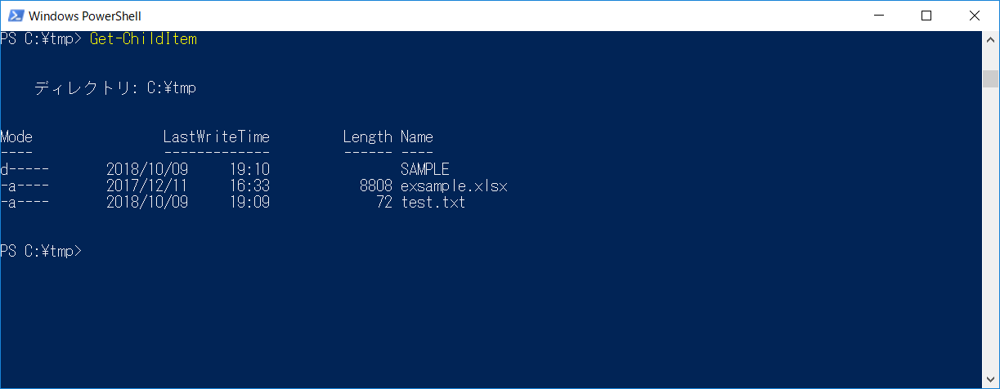
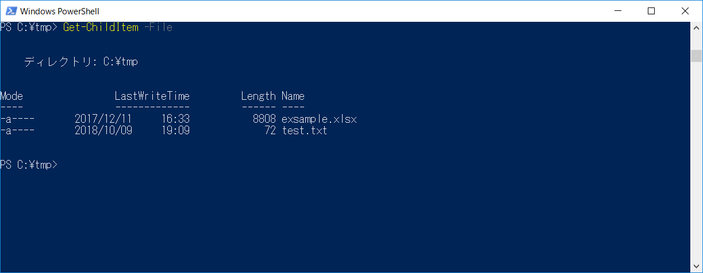
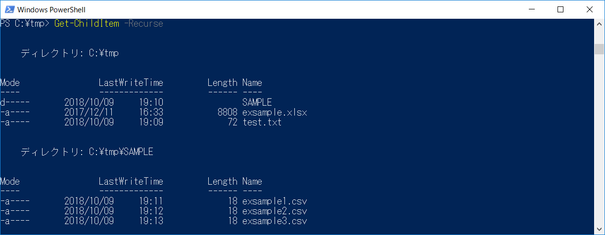
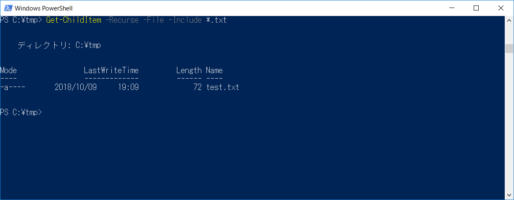

**Windows PowerShell** を使ってフォルダ内のファイル一覧を取得し、一括でファイル操作をする方法について紹介します。

## 使用環境

* Windows 10
* Windows PowerShell 5.1

## サンプルのフォルダ構成



C直下のtmpフォルダに拡張子の異なるファイルとフォルダが格納されており、フォルダ：SAMPLEの中にCSVファイルが3つ格納されているといったフォルダ構成となります。

## フォルダ内のファイル一覧を取得

フォルダ内の情報を取得するには [Get-ChildItem](https://technet.microsoft.com/ja-jp/library/hh847897.aspx) を使用します。使用方法について確認していきましょう。

### カレントフォルダ内のファイルおよびフォルダの一覧を取得

```sh
PS C:\tmp> Get-ChildItem
```



上記のようにカレントフォルダに格納されているファイルおよびフォルダの一覧が表示されます。

### カレントフォルダ内のファイルのみの一覧を取得

```sh
PS C:\tmp> Get-ChildItem -File
```



**-File** オプションを付与することで、ファイルのみを取得するようになります。
また、 **-Directory** オプションを付与した場合は、名のとおりディレクトリ（フォルダ）のみ取得するとなります。

### サブフォルダ配下まで再帰的に取得する

```sh
PS C:\tmp> Get-ChildItem -Recurse
```



**-Recurse** オプションを付与することで、サブフォルダ配下に対して再帰的に処理します。

### 特定の拡張子に一致するファイルのみを取得する

```sh
PS C:\tmp> Get-ChildItem -Recurse -File -Include *.txt
```



**-Include** オプションでファイル名をワイルドカード(*)で指定し、拡張子の指定による絞り込みをします。
**-Include** オプションは `-Include text*` といった記述をすると「**testから始まる**」という条件になりますので、ファイル名検索にも利用できます。
また、上記コマンドの **-Include** オプションを **-Exclude** オプションに変更すると、「**拡張子txtのファイルを除く**」という使い方ができます。

## フォルダ内のファイルを利用し、一括処理を行う

### 複数のファイルを1つのファイルにまとめる

```sh
PS C:\tmp> Get-ChildItem -Recurse -File -Include *.csv | Get-Content | Set-Content merge.csv
```

上記の例はカレントフォルダ配下（サブフォルダも含む）に存在するCSVファイル(拡張子がcsv)を1つのファイルにまとめるという内容になります。

### 複数のファイルを一括で別のフォルダに移動する

```sh
PS C:\tmp> Get-ChildItem -Recurse -File -Include *.xlsx | ForEach-Object { Move-Item $_ C:\tmp\SAMPLE }
```

上記の例はカレントフォルダ配下（サブフォルダも含む）に存在するExcelファイル(拡張子がxlsx)を指定のフォルダ移動するという内容になります。
また、 **Move-Item** の代わりに **Copy-Item** にすることで、ファイルのコピーになります。

**Get-ChildItem** の取得結果をパイプラインで連結することで、さまざまな一括処理が可能となります。

本ブログにも **Get-ChildItem** を利用した一括処理の記事がいくつかあるので、参考にしてください。

- [PowerShellを使ってファイルの文字コードと改行コードを変換する](https://mseeeen.msen.jp/use-powershell-convert-to-encoding-and-line-feed/)
- [\[PowerShell\] Windows のイベントログを7zで圧縮してローテーションする方法](https://mseeeen.msen.jp/how-to-rotate-windows-event-log/)

それでは、また。

## 関連記事

- [FileSystem の Get-ChildItem](https://technet.microsoft.com/ja-jp/library/hh847897.aspx)
- [ファイルとフォルダーの操作 | Microsoft Docs](https://docs.microsoft.com/ja-jp/powershell/scripting/getting-started/cookbooks/working-with-files-and-folders?view=powershell-6)