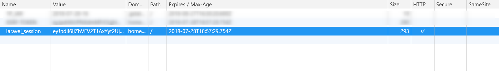
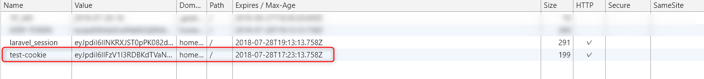
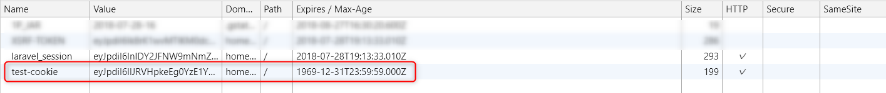
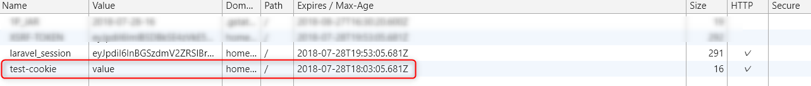
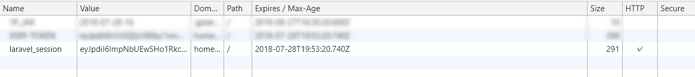
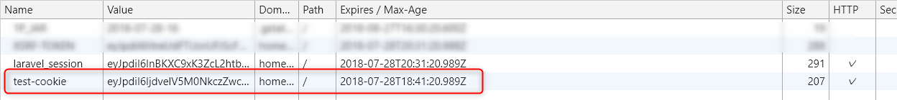
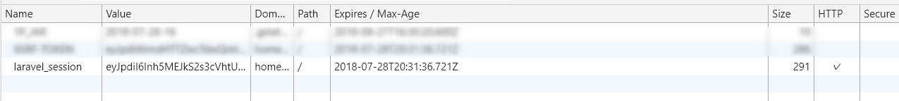

とあるプロジェクトでブラウザに保持している Cookie 自体を削除したいことがあったのですが、 **Laravel を使って Cookie を操作している場合、うまく削除ができず**はまってしまいました。

原因と対処方法をまとめておきます。

## Cookie ファサードを使用した操作について

```php
    public function index()
    {
        if (request()->cookie('test-cookie')) {
            Log::debug('cookie exists.');
            Cookie::queue('test-cookie', null, time() - 3600);
        } else {
            Log::debug('cookie does not exist.');
            Cookie::queue('test-cookie', 'value', 10);
        }

        return response()->view('index');
    }
```

リクエストに指定の Cookie が存在する場合 Cookie 削除、存在しない場合 Cookie を設定という内容ですね。

### ログで確認

```sh
[2018-07-28 17:13:13] local.DEBUG: cookie does not exist.
[2018-07-28 17:13:33] local.DEBUG: cookie exists.
[2018-07-28 17:13:40] local.DEBUG: cookie does not exist.
[2018-07-28 17:13:55] local.DEBUG: cookie exists.
```

想定通りの動作をしているようです。

### ブラウザ側の確認

#### Cookie 設定前


laravel のセッションは存在しますが、指定の Cookie は設定前なので存在していないですね。

#### Cookie 設定後


設定された Cookie が追加されていることが確認できました。

#### Cookie の削除確認


Cookie の有効期限が過去の日時に設定されていますが、 残念ながら Cookie は残ってました。

## 原因について

PHP の **setcookie**メソッドを使用する場合、第二引数に値を `null` や空文字を設定することで Cookie 自体を削除することができたのですが、 laravel の Cookie ファサードを使用した場合は、期待した動作にはならなかったようです。

なぜ削除されなかったかについては、 Cookie の値を暗号化されていることが原因のようでした。

> Laravel により生成されるクッキーは、クライアントにより変更されたり読まれたりされないようにデフォルトで暗号化され、署名されます。

上記の動作により、 `null` についても値を暗号化されてしまっているので、ブラウザ側の Cookie が削除されなかったようです。

## 対処方法について

### Cookie の暗号化を行わない

原因が暗号化にあるのであれば、暗号化を行わないようにすることでいいのではということで、指定の Cookie にのみ暗号化を行わないように設定をしてみました。

> アプリケーションで生成する特定のクッキーで暗号化を無効にしたい場合は、 app/Http/Middleware ディレクトリ中に存在する、 App\Http\Middleware\EncryptCookies ミドルウェアの$exceptプロパティで指定してください。

と公式に記載されておりましたで、さっそく試してみます。

```
    /**
     * The names of the cookies that should not be encrypted.
     *
     * @var array
     */
    protected $except = [
        'test-cookie',
    ];
```

#### Cookie 設定後


暗号化されていない Cookie が追加されてますね。

#### Cookie の削除確認


期待通り、指定の Cookie が削除されました！

しかし、Cookie の暗号化を行わないようにして本当に大丈夫なのか？という疑問がでてきました。

### 最終結果

Cookie の暗号化は有効にしたまま、 Cookie の削除は Cookie ファサードを使用せず暗号化の影響を受けない **setcookie** メソッドを使用するようにしました。

```php
    public function index()
    {
        if (request()->cookie('test-cookie')) {
            Log::debug('cookie exists.');
            setcookie('test-cookie');
        } else {
            Log::debug('cookie does not exist.');
            Cookie::queue('test-cookie', 'value', 10);
        }

        return response()->view('index');
    }
```

上記に併せて、`App\Http\Middleware\EncryptCookies` に設定していた暗号化無効設定も削除しました。

#### ログ

```sh
[2018-07-28 18:31:21] local.DEBUG: cookie does not exist.
[2018-07-28 18:31:36] local.DEBUG: cookie exists.
```

#### Cookie 設定後


#### Cookie の削除確認


無事、暗号化をしたまま Cookie を削除することができました。

laravel の機能のみに頼るのも考えものですね。
