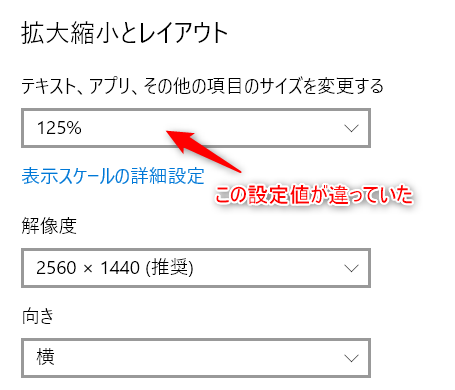

**Excel** で作成された帳票を **Microsoft Print to PDF** で **PDF出力** した際、印刷設定に変更は加えていないのに、私が出力したものと別の方が出力したもので微妙にレイアウトが異なっていることに気づき、原因を調べてみた結果を記載しておきます。

「**パソコンによって Excel の印刷レイアウトがずれる**」という方は、以下の項目を確認してみてください。

## 別端末との比較

* Windows のバージョン
* Excel のバージョン
* Microsoft Print to PDF のプリンタードライバーのバージョン
* 表示スケールの設定（拡大縮小とレイアウトの中の一項目）

上記確認点については、私の出力結果と同じレイアウトとなったPC（端末A）と異なるレイアウトとなったPC（端末B）を対象に私の環境との比較を行いました。

比較結果は下記の通りです。

|確認項目|私の環境|端末A|端末B|
|--|--|--|--|
|Windows 10 のバージョン|Windows 10 Pro(1809)|不一致|不一致|
|Excel のバージョン|Microsoft Office 2016|一致|一致|
|Print to PDF のバージョン|10.0.17763.1|不一致|不一致|
|表示スケールの設定|125%|一致|不一致|

## 比較結果から分かったこと

端末A、端末Bと私の端末との比較結果で差分が生じているのが **表示スケールの設定** だということがわかりました。

確かに私と端末Aの設定は **125%** となっており、 端末Bの設定は **100%** でした。

「テキスト、アプリ、その他の項目のサイズを変更する」の設定値を **100%** に変更すると、端末Bで出力したものと一致しました。

後日、Webで検索してみると、以下の記載を見つけました。

>**現象**
>異なる複数の Microsoft Windows 環境で、Microsoft Office Excel のファイルを共有すると、Excel の印刷範囲、セルの幅、または高さが変更される場合があります。状況によっては、この現象の影響で、改ページ位置が変更され総ページ数が変わってしまう場合があります。これらは Excel 以外の問題による原因も考えられますが、Windows あるいは Excel の仕様によって、正常な状態であっても発生する場合があります。
>**原因**
>この現象は、一台のパソコンで、ディスプレイや使用するプリンタ ドライバの解像度などの環境が、変更されることにより発生します。
>
>[異なる複数の Windows 環境で Excel ファイルを共有すると、印刷範囲、セルの幅、または高さが変更される場合がある](https://support.microsoft.com/ja-jp/help/400271)

## 今回の原因について

表示スケールの設定に差があった訳なのですが、使用しているパソコンのディスプレイサイズと解像度の違いにあったようです。

私の使用しているパソコンと端末Aは「14.0型 WQHD (2,560x1,440)」で、端末Bは「14.0型 FHD (1,920x1,080)」でした。

私はいわゆる高DPI液晶と呼ばれる内の一つのWQHD表示の液晶を搭載したノートパソコンを使用しているのですが、画面サイズはそれほど大きくないため、画面に表示されている文字が少々小さく感じることもあり、設定値を変更していました。

端末Aの使用者も同様の理由により、設定値を変更していたようでした。場合によっては、使用するパソコンの推奨設定として、知らぬ間に125%以上の値が設定されている可能性もあります。

>モニターのサイズや解像度に応じて、テキストやアプリのアイコンのサイズを拡大率で設定します。例えば、下図のように、高解像度かつ高画素密度の27型UHDモニター（解像度: 3840 x 2160、画素密度:163 ppi）をお使いの場合、100％表示ではテキストが小さく、読みにくくなってしまいます。Windows 10 では、モニターの画素密度（ppi）に合った推奨サイズ（拡大率）が自動で設定されますが、必要に応じて「ディスプレイの選択と整理」メニューからモニターを選択後、拡大率を設定して下さい。
>
>[Windows 10 Creators Update後に、モニター設定でお困りの方に - 4. テキストサイズやモニターの解像度を変更したいときは | EIZO株式会社](https://www.eizo.co.jp/eizolibrary/knowledge/win10-creators-update/##4)

## あとがき

念のため、 **Word**, **PowerPoint** についても確認してみましたが、こちらは拡大縮小とレイアウトの設定の影響は受けないようだったので、安心しました。