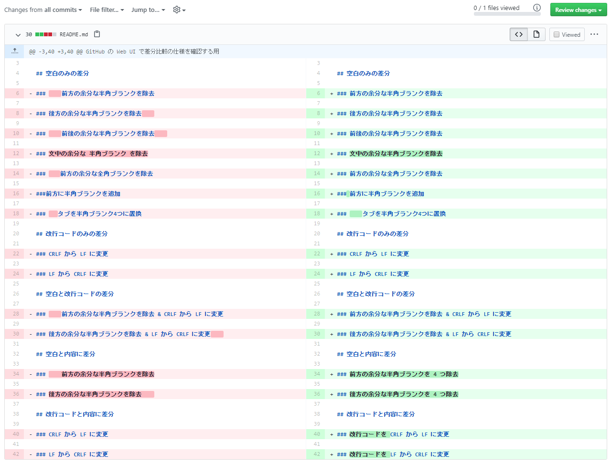
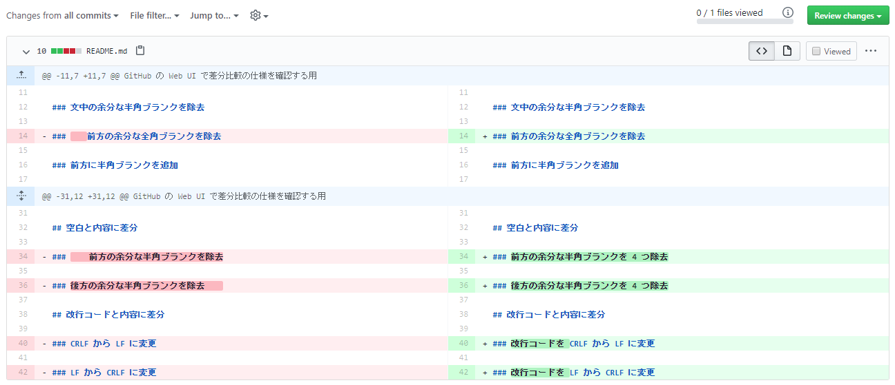
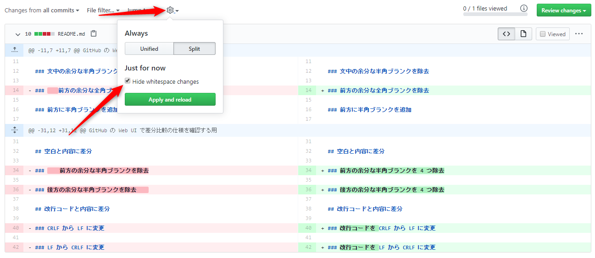
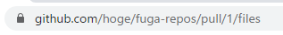
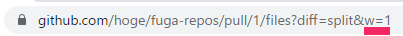

**インデント**や**改行コード**の**修正**が入ると **GitHub** の **WebUI** 上で **commit** や **Pull Request** の**差分確認**がしづらいと感じている方は多いかと思います。

私自身もその一人なのですが、何か対処方法はないものかと調べてみた内容をご紹介します。

## 差分比較

### 何もしない状態の差分

まずは、何もしない状態での差分表示は下記ような感じになるかと思います。

差分内容を文章にしておりますので、大体の差分は理解いただけるかと思います。

## 対処方法

### URL パラメータを追加する

URL に、とあるパラメータを追加すると幸せになるよという内容の記事を見つけたので、試してみました。

[GitHubのcommitのURLの末尾に ?w=1 とつけると差分がわかりやすい（時がある） - 納豆には卵を入れる派です。](https://ken-c-lo.hatenadiary.org/entry/20130410/1365623063)

記事のタイトルに書かれている通り、 URL に `w=1` のパラメータをつけるとよいとのことなので、
`https://github.com/hoge/fuga-repos/pull/1/files`
↓
`https://github.com/hoge/fuga-repos/pull/1/files?w=1`
といった感じで URL の末尾にパラメータをつけてみました。その結果が下記のものです。

非常にスッキリしました！ただし、全角ブランクは無視されないようです。

参考記事にも記載されていましたが、この方法については、 GitHub の公式ブログ ([GitHub Secrets - The GitHub Blog](https://github.blog/2011-10-21-github-secrets/)) にも記載があるようです。ブログ記事のタイトルから察するに、当時は裏技のようなものだったんでしょうか(笑)

### 設定メニューから、空白の変更差分を非表示にする設定を有効にする

毎回、 URL を編集するのもなんだし、どこか設定メニューで ON / OFF できたりしないものかと探してみると、それらしいものがありました！

`Hide whitespace changes` と書かれているではないですか。前述の確認時に URL パラメータを付与していたためか、既にチェックが入っておりました。

試しにチェックを外してみると。。。

最初の差分と同じ内容になりました。 URL パラメータに付与した `w=1` も消えてしまいました。

再び、チェックをつけて再表示すると。。。

スッキリしました！やはり、全角ブランクは無視されないようです。 URL をみると `w=1` のパラメータが付与されてました。ちなみにパラメータに含まれている `diff=split` は横分けに差分を表示するという値のようです。縦分けの差分で表示する場合は、 `diff=unified` になるとのこと。

どうやら、この設定は `Just for now` と書かれており、その場限りの設定のようなので、設定した内容は記録されないみたいです。

## まとめ

空白差分を無視してはいけない場合もあるかと思いますが、気軽に切り替えができるので、必要に応じて切り替えて使っていきたいと思います。
