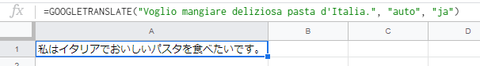

**Microsoft Excel** にはない **Google スプレッドシート** 独自の関数を調べていた中で、セルに入力されている文字列を指定の言語に翻訳してくれる関数を見つけたので、紹介したいと思います。

## 関数名

関数名は **GOOGLETRANSLATE** です。
名前から Google 翻訳を利用したのもなのかなという感じが見受けられますね。
使用してみた感じでは、 Google 翻訳での結果と少し異なる場合があるようなので、同じ翻訳処理ではなさそうです。

## 構文

`GOOGLETRANSLATE(テキスト, [ソース言語, ターゲット言語])`

- テキスト
    - 翻訳対象となるテキストです。テキストは直接入力するか、セルへの参照の二通りがあります。
- ソース言語
    - 翻訳対象のテキストの言語を言語コードで指定します。
    - 省略可能。デフォルトの値は、テキストから自動的に検出する値を示す "auto" です。
- ターゲット言語
    - 翻訳後の言語を言語コードで指定します。
    - 省略可能。デフォルトの値は、Google アカウントの言語設定で設定されている言語です。

[公式ドキュメントはこちら。](https://support.google.com/docs/answer/3093331?hl=ja)

## 使用例

### 入力された文字列を英語から日本語に翻訳する

#### 構文

```
=GOOGLETRANSLATE("Hello World", "en", "ja")
```

`Hello World` を英語（言語コード:en）から日本語（言語コード:ja）に翻訳するという記述になります。

#### 翻訳結果


期待していた感じの翻訳結果になったかと思います。

### 特定のセルの値を日本語から英語に翻訳する

#### 構文

```
=GOOGLETRANSLATE(A1, "ja", "en")
```

セル: A1 の値を日本語（言語コード:ja）から英語（言語コード:en）に翻訳するという記述になります。

#### 翻訳結果


A1 の翻訳前の値と同じ内容に翻訳されているので、いい感じかと思います。

### 入力した値を自動で言語判別させ、日本語に翻訳する

#### 構文

```
=GOOGLETRANSLATE("Voglio mangiare deliziosa pasta d'Italia.", "auto", "ja")
or
=GOOGLETRANSLATE("Voglio mangiare deliziosa pasta d'Italia.")
```

ソース言語とターゲット言語は省略可能なので、省略した記述が2つ目のものになります。
※アカウントの言語設定が日本語の場合に限ります。

`Voglio mangiare deliziosa pasta d'Italia.` を自動判別し、日本語（言語コード:ja）に翻訳するという記述になります。

#### 翻訳結果



Google 翻訳で同じ内容を翻訳にかけると `イタリアの美味しいパスタが食べたいです。` と翻訳されたので、概ね正しい結果が得られたかと思います。

## 言語コード

使用できる言語コードは、[Google Cloud のドキュメント](https://cloud.google.com/translate/docs/languages?hl=ja)を参照してください。

## 実際に色々翻訳してみた

windows のエラーメッセージを英語、日本語それぞれ翻訳してみました。

英語メッセージ | 日本語メッセージ | 英語→日本語　翻訳 | 日本語→英語　翻訳
-- | -- | -- | --
Incorrect function. | ファンクションが間違っています。 | ファンクションが間違っています。 | Incorrect function.
The system cannot find the file specified. | 指定されたファイルが見つかりません。 | システムは、指定されたファイルを見つけることができません。 | The specified file could not be found.
The system cannot open the file. | ファイルを開くことができません。 | システムは、ファイルを開くことができません。 | You can not open the file.
Access is denied. | アクセスが拒否されました。 | アクセスが拒否されました。 | Access denied.
The handle is invalid. | ハンドルが無効です。 | ハンドルが無効です。 | The handle is invalid.
The storage control blocks were destroyed. | 記憶域制御ブロックが壊れています。 | ストレージ制御ブロックが破壊されました。 | Storage control block is broken.
Not enough memory resources are available to process this command. | このコマンドを処理するにはメモリ リソースが足りません。 | 十分なメモリリソースがこのコマンドを処理するために用意されていません。 | Memory Not enough resources are available to process this command.
The storage control block address is invalid. | 記憶域制御ブロックのアドレスが無効です。 | ストレージコントロールブロックアドレスが無効です。 | Address of the storage control block is invalid.
An attempt was made to load a program with an incorrect format. | 間違ったフォーマットのプログラムを読み込もうとしました。 | 試みは間違ったフォーマットのプログラムをロードするために作られました。 | An attempt was made to read the wrong format of the program.
Not enough memory resources are available to complete this operation. | メモリ リソースが不足しているため、この操作を完了できません。 | この操作を完了するための十分なメモリリソースが用意されていません。 | Since the memory resources are in short supply, you can not complete this operation.
The system cannot find the drive specified. | 指定されたドライブが見つかりません。 | システムは、指定されたドライブを見つけることができません。 | The specified drive can not be found.
The directory cannot be removed. | ディレクトリを削除できません。 | ディレクトリを削除することはできません。 | You can not delete the directory.
The system cannot move the file to a different disk drive. | ファイルを別のディスク ドライブに移動できません。 | システムは、異なるディスクドライブにファイルを移動することはできません。 | You can not move a file to another disk drive.
There are no more files. | これ以上ファイルがありません。 | これ以上ファイルがありません。 | There are no more files.
The media is write protected. | このメディアは書き込み禁止になっています。 | メディアが書き込み保護されています。 | This media is write protected.

各言語メッセージの内容と、異なる言語のメッセージを翻訳したものと内容がほぼ同じものもあれば、若干おかしな感じになっているものも見受けられます。
特に文章が長くなると内容にずれが生じているような感じがします。

## まとめ

用語集のようなものを表に起こして一括して翻訳する程度であれば、翻訳による意味のズレも大きくないかもしれませんが、長文をこの関数を用いて翻訳するのはまだまだ実用的ではないように思えました。
本家の Google 翻訳自体も翻訳機としてはまだまだ不十分だと思いますし、こちらの関数も翻訳時の参考程度に留めていただくのがよさそうです。
今後、精度がさらに上がることを期待しつつ。。。それではまた。